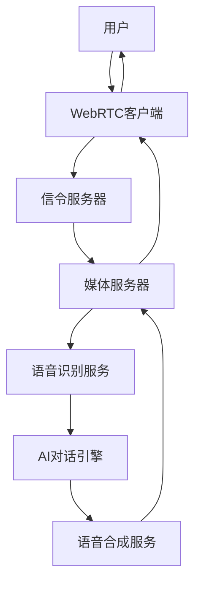

## 前言

随着ChatGPT、Claude等大语言模型的兴起，AI语音交互已成为下一代人机交互的重要方向。本文将从零开始，带你构建一个完整的AI语音通话系统，实现人与AI的自然语音对话。

## 什么是AI语音通话系统

AI语音通话系统是一个集成了多种先进技术的智能交互平台，主要包括：

* **实时语音通信**：基于WebRTC的低延迟音频传输
* **语音识别(ASR)**：将语音转换为文本
* **自然语言理解(NLU)**：理解用户意图和语义
* **对话管理**：维护对话上下文和状态
* **语音合成(TTS)**：将AI回复转换为自然语音

## 系统架构设计

### 整体架构



### 核心组件

1. **前端WebRTC客户端**
   - 音频采集和播放
   - 实时音频传输
   - 用户界面交互

2. **后端服务集群**
   - 信令服务器（WebSocket/Socket.io）
   - 媒体处理服务器
   - AI对话引擎
   - 语音处理服务

3. **AI服务层**
   - 语音识别（Whisper/Google Speech API）
   - 大语言模型（GPT-4/Claude）
   - 语音合成（Azure TTS/ElevenLabs）

## 技术栈选择

### 前端技术

```javascript
// 主要技术栈
const frontendStack = {
  framework: "React/Vue.js",
  webrtc: "Simple-peer/PeerJS",
  audio: "Web Audio API",
  ui: "Material-UI/Ant Design",
  state: "Redux/Vuex",
  realtime: "Socket.io-client"
};
```

### 后端技术

```python
# Python后端技术栈
backend_stack = {
    "framework": "FastAPI/Flask",
    "webrtc": "aiortc/mediasoup",
    "websocket": "Socket.io/WebSockets",
    "ai_models": "OpenAI API/Anthropic",
    "speech": "Whisper/Google Speech",
    "tts": "Azure Cognitive Services",
    "database": "Redis/PostgreSQL",
    "deployment": "Docker/Kubernetes"
}
```

## 核心功能实现

### 1. WebRTC音频通信

#### 前端音频采集

```javascript
class VoiceCallClient {
  constructor() {
    this.localStream = null;
    this.peerConnection = null;
    this.socket = io('ws://localhost:3000');
  }

  async startCall() {
    try {
      // 获取用户媒体流
      this.localStream = await navigator.mediaDevices.getUserMedia({
        audio: {
          echoCancellation: true,
          noiseSuppression: true,
          sampleRate: 16000
        },
        video: false
      });

      // 创建RTCPeerConnection
      this.peerConnection = new RTCPeerConnection({
        iceServers: [
          { urls: 'stun:stun.l.google.com:19302' }
        ]
      });

      // 添加本地流
      this.localStream.getTracks().forEach(track => {
        this.peerConnection.addTrack(track, this.localStream);
      });

      // 处理远程流
      this.peerConnection.ontrack = (event) => {
        const remoteAudio = document.getElementById('remoteAudio');
        remoteAudio.srcObject = event.streams[0];
      };

      // 处理ICE候选
      this.peerConnection.onicecandidate = (event) => {
        if (event.candidate) {
          this.socket.emit('ice-candidate', event.candidate);
        }
      };

    } catch (error) {
      console.error('启动通话失败:', error);
    }
  }

  async createOffer() {
    const offer = await this.peerConnection.createOffer();
    await this.peerConnection.setLocalDescription(offer);
    this.socket.emit('offer', offer);
  }
}
```

### 2. 语音识别集成

```python
import whisper
import asyncio
from typing import AsyncGenerator

class SpeechRecognitionService:
    def __init__(self):
        self.model = whisper.load_model("base")
        self.sample_rate = 16000
    
    async def transcribe_stream(self, audio_stream: AsyncGenerator) -> AsyncGenerator[str, None]:
        """实时语音识别"""
        buffer = []
        
        async for audio_chunk in audio_stream:
            buffer.append(audio_chunk)
            
            # 当缓冲区达到一定大小时进行识别
            if len(buffer) >= self.sample_rate * 2:  # 2秒音频
                audio_data = np.concatenate(buffer)
                
                # 使用Whisper进行识别
                result = await asyncio.to_thread(
                    self.model.transcribe, 
                    audio_data,
                    language="zh"
                )
                
                if result["text"].strip():
                    yield result["text"]
                
                buffer = []
```

### 3. AI对话引擎

```python
from openai import AsyncOpenAI
import asyncio
from typing import List, Dict

class AIConversationEngine:
    def __init__(self, api_key: str):
        self.client = AsyncOpenAI(api_key=api_key)
        self.conversation_history: List[Dict] = []
        self.system_prompt = """
        你是一个智能语音助手，专门通过语音与用户进行自然对话。
        请遵循以下原则：
        1. 回复要简洁明了，适合语音播报
        2. 语气要自然友好，像真人对话
        3. 避免过长的回复，保持对话流畅
        4. 可以主动提问来维持对话
        """
    
    async def get_response(self, user_input: str) -> str:
        """获取AI回复"""
        # 添加用户输入到对话历史
        self.conversation_history.append({
            "role": "user",
            "content": user_input
        })
        
        # 构建消息列表
        messages = [
            {"role": "system", "content": self.system_prompt}
        ] + self.conversation_history[-10:]  # 保留最近10轮对话
        
        try:
            response = await self.client.chat.completions.create(
                model="gpt-4",
                messages=messages,
                max_tokens=150,  # 限制回复长度
                temperature=0.7,
                stream=False
            )
            
            ai_response = response.choices[0].message.content
            
            # 添加AI回复到对话历史
            self.conversation_history.append({
                "role": "assistant", 
                "content": ai_response
            })
            
            return ai_response
            
        except Exception as e:
            print(f"AI对话错误: {e}")
            return "抱歉，我现在无法回复，请稍后再试。"
```

## 性能优化策略

### 延迟优化

```python
class LatencyOptimizer:
    def __init__(self):
        self.vad_model = self.load_vad_model()  # 语音活动检测
        self.chunk_size = 1024  # 音频块大小
        
    async def optimize_pipeline(self, audio_stream):
        """优化处理管道以减少延迟"""
        
        # 使用VAD检测语音端点
        speech_segments = []
        
        async for audio_chunk in audio_stream:
            if self.vad_model.is_speech(audio_chunk):
                speech_segments.append(audio_chunk)
            elif speech_segments:
                # 检测到语音结束，立即处理
                full_audio = np.concatenate(speech_segments)
                
                # 并行处理：语音识别 + AI推理预处理
                tasks = [
                    self.speech_recognition.transcribe(full_audio),
                    self.preprocess_for_ai(speech_segments)
                ]
                
                results = await asyncio.gather(*tasks)
                speech_segments = []  # 重置缓冲区
                
                yield results[0]  # 返回识别结果
```

## 部署与监控

### Docker部署

```dockerfile
FROM python:3.9-slim

# 安装系统依赖
RUN apt-get update && apt-get install -y \
    ffmpeg \
    portaudio19-dev \
    && rm -rf /var/lib/apt/lists/*

# 设置工作目录
WORKDIR /app

# 复制依赖文件
COPY requirements.txt .

# 安装Python依赖
RUN pip install --no-cache-dir -r requirements.txt

# 复制应用代码
COPY . .

# 暴露端口
EXPOSE 8000

# 启动命令
CMD ["uvicorn", "main:app", "--host", "0.0.0.0", "--port", "8000"]
```

## 常见问题与解决方案

### Q: 如何减少语音识别延迟？

A: 优化策略包括：

1. **使用流式识别**：不等待完整语音，边说边识别
2. **VAD优化**：准确检测语音开始和结束
3. **模型选择**：使用更快的识别模型（如Whisper tiny）
4. **并行处理**：识别和AI推理并行进行

### Q: 如何处理网络不稳定的情况？

A: 网络优化方案：

- 自适应码率调整
- 抖动缓冲区优化
- 重连机制实现
- 音频质量动态调整

### Q: 如何优化AI响应速度？

A: AI优化策略：

- 响应缓存机制
- 并行模型调用
- 上下文窗口限制
- 预测性预加载

## 总结

本文详细介绍了AI语音通话系统的完整开发流程，涵盖了：

* **系统架构设计**：从前端到后端的完整技术栈
* **核心功能实现**：WebRTC、语音识别、AI对话、语音合成
* **性能优化**：延迟优化、缓存策略、网络优化
* **部署方案**：Docker容器化、Kubernetes集群部署
* **监控运维**：日志记录、性能指标、故障处理

通过这套完整的解决方案，你可以构建一个功能强大、性能优越的AI语音通话系统。随着技术的不断发展，这类系统将在客服、教育、娱乐等领域发挥越来越重要的作用。

---

*如果你觉得这篇文章对你有帮助，欢迎分享给更多对AI语音技术感兴趣的朋友！* 