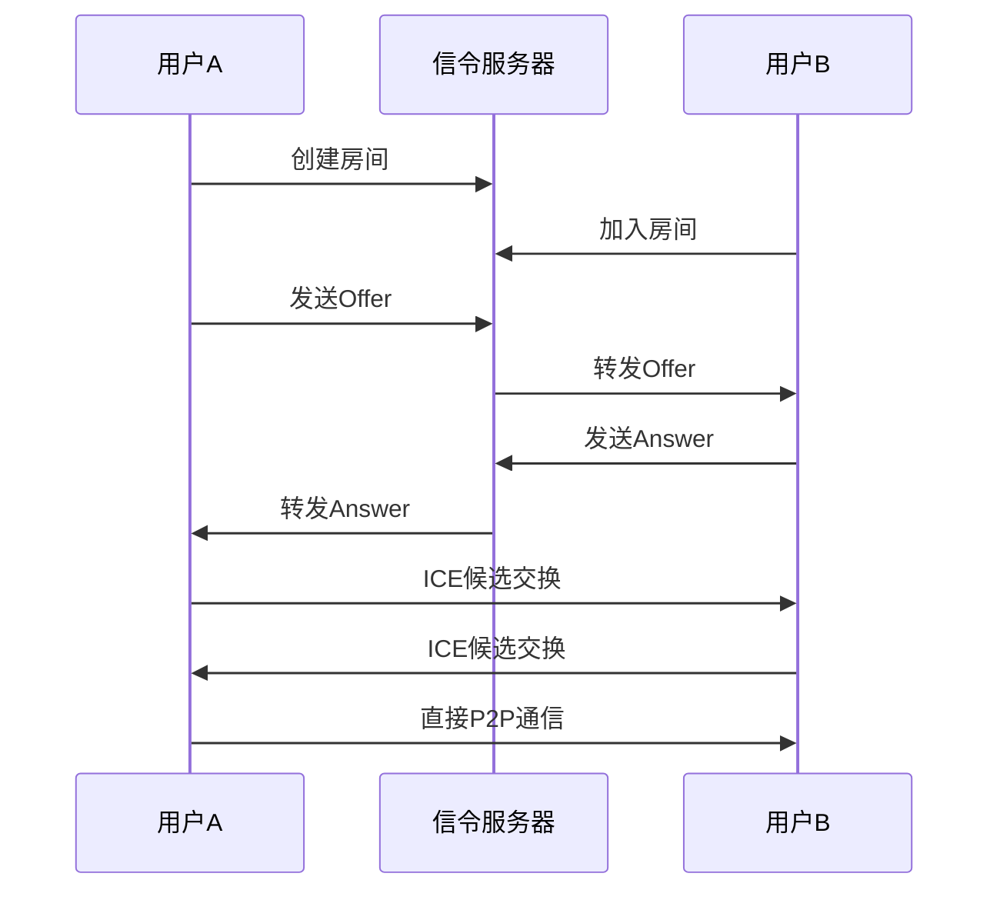

## 前言

WebRTC（Web Real-Time Communication）是一项革命性的技术，它使得浏览器之间可以直接进行实时音视频通信，无需安装任何插件。本文将带你从零开始构建一个完整的WebRTC语音通话应用。

## WebRTC基础概念

### 什么是WebRTC

WebRTC是一个开源项目，提供了浏览器和移动应用程序间实时通信的能力。它包含三个主要的API：

- **MediaStream API**：访问摄像头和麦克风
- **RTCPeerConnection API**：建立P2P连接
- **RTCDataChannel API**：传输任意数据

### WebRTC通信流程



## 技术架构设计

### 整体架构

```javascript
// 系统架构组件
const architecture = {
  frontend: {
    framework: "React/Vue.js",
    webrtc: "RTCPeerConnection",
    audio: "Web Audio API",
    ui: "Material-UI"
  },
  backend: {
    signaling: "Socket.io/WebSocket",
    server: "Node.js/Express",
    database: "Redis/MongoDB"
  },
  infrastructure: {
    stun: "Google STUN服务器",
    turn: "Coturn服务器",
    deployment: "Docker/AWS"
  }
};
```

### 核心组件

1. **信令服务器**：协调连接建立过程
2. **STUN服务器**：NAT类型检测
3. **TURN服务器**：NAT穿透中继
4. **媒体处理**：音频采集、编码、传输

## 前端WebRTC实现

### 1. 基础WebRTC类

```javascript
class WebRTCVoiceCall {
  constructor(signalingServerUrl) {
    this.localStream = null;
    this.remoteStream = null;
    this.peerConnection = null;
    this.socket = io(signalingServerUrl);
    this.roomId = null;
    
    // WebRTC配置
    this.configuration = {
      iceServers: [
        { urls: 'stun:stun.l.google.com:19302' },
        { urls: 'stun:stun1.l.google.com:19302' },
        {
          urls: 'turn:your-turn-server.com:3478',
          username: 'your-username',
          credential: 'your-password'
        }
      ],
      iceCandidatePoolSize: 10
    };
    
    this.setupSocketEvents();
  }
  
  setupSocketEvents() {
    this.socket.on('room-joined', (data) => {
      console.log('房间已加入:', data);
      this.roomId = data.roomId;
    });
    
    this.socket.on('user-joined', async (data) => {
      console.log('用户加入:', data);
      if (data.userId !== this.socket.id) {
        await this.createOffer();
      }
    });
    
    this.socket.on('offer', async (data) => {
      await this.handleOffer(data);
    });
    
    this.socket.on('answer', async (data) => {
      await this.handleAnswer(data);
    });
    
    this.socket.on('ice-candidate', async (data) => {
      await this.handleIceCandidate(data);
    });
    
    this.socket.on('user-left', (data) => {
      this.handleUserLeft(data);
    });
  }
  
  async initializeMedia() {
    try {
      // 获取用户媒体流
      this.localStream = await navigator.mediaDevices.getUserMedia({
        audio: {
          echoCancellation: true,
          noiseSuppression: true,
          autoGainControl: true,
          sampleRate: 48000,
          channelCount: 2
        },
        video: false
      });
      
      // 播放本地音频（通常静音）
      const localAudio = document.getElementById('localAudio');
      if (localAudio) {
        localAudio.srcObject = this.localStream;
        localAudio.muted = true; // 避免回音
      }
      
      console.log('媒体流初始化成功');
      return true;
      
    } catch (error) {
      console.error('获取媒体流失败:', error);
      throw error;
    }
  }
  
  async createPeerConnection() {
    this.peerConnection = new RTCPeerConnection(this.configuration);
    
    // 添加本地流
    if (this.localStream) {
      this.localStream.getTracks().forEach(track => {
        this.peerConnection.addTrack(track, this.localStream);
      });
    }
    
    // 处理远程流
    this.peerConnection.ontrack = (event) => {
      console.log('接收到远程流');
      this.remoteStream = event.streams[0];
      
      const remoteAudio = document.getElementById('remoteAudio');
      if (remoteAudio) {
        remoteAudio.srcObject = this.remoteStream;
      }
    };
    
    // 处理ICE候选
    this.peerConnection.onicecandidate = (event) => {
      if (event.candidate) {
        this.socket.emit('ice-candidate', {
          roomId: this.roomId,
          candidate: event.candidate
        });
      }
    };
    
    // 连接状态监听
    this.peerConnection.onconnectionstatechange = () => {
      console.log('连接状态:', this.peerConnection.connectionState);
    };
    
    this.peerConnection.oniceconnectionstatechange = () => {
      console.log('ICE连接状态:', this.peerConnection.iceConnectionState);
    };
  }
  
  async joinRoom(roomId) {
    await this.initializeMedia();
    await this.createPeerConnection();
    
    this.socket.emit('join-room', { roomId });
  }
  
  async createOffer() {
    try {
      const offer = await this.peerConnection.createOffer({
        offerToReceiveAudio: true,
        offerToReceiveVideo: false
      });
      
      await this.peerConnection.setLocalDescription(offer);
      
      this.socket.emit('offer', {
        roomId: this.roomId,
        offer: offer
      });
      
      console.log('Offer已创建并发送');
      
    } catch (error) {
      console.error('创建Offer失败:', error);
    }
  }
  
  async handleOffer(data) {
    try {
      await this.peerConnection.setRemoteDescription(data.offer);
      
      const answer = await this.peerConnection.createAnswer();
      await this.peerConnection.setLocalDescription(answer);
      
      this.socket.emit('answer', {
        roomId: this.roomId,
        answer: answer
      });
      
      console.log('Answer已创建并发送');
      
    } catch (error) {
      console.error('处理Offer失败:', error);
    }
  }
  
  async handleAnswer(data) {
    try {
      await this.peerConnection.setRemoteDescription(data.answer);
      console.log('Answer已设置');
      
    } catch (error) {
      console.error('处理Answer失败:', error);
    }
  }
  
  async handleIceCandidate(data) {
    try {
      await this.peerConnection.addIceCandidate(data.candidate);
      console.log('ICE候选已添加');
      
    } catch (error) {
      console.error('添加ICE候选失败:', error);
    }
  }
  
  handleUserLeft(data) {
    console.log('用户离开:', data);
    
    if (this.peerConnection) {
      this.peerConnection.close();
      this.peerConnection = null;
    }
    
    // 清理远程音频
    const remoteAudio = document.getElementById('remoteAudio');
    if (remoteAudio) {
      remoteAudio.srcObject = null;
    }
  }
  
  // 音频控制方法
  muteAudio() {
    if (this.localStream) {
      this.localStream.getAudioTracks().forEach(track => {
        track.enabled = false;
      });
    }
  }
  
  unmuteAudio() {
    if (this.localStream) {
      this.localStream.getAudioTracks().forEach(track => {
        track.enabled = true;
      });
    }
  }
  
  // 获取音频统计信息
  async getAudioStats() {
    if (this.peerConnection) {
      const stats = await this.peerConnection.getStats();
      const audioStats = {};
      
      stats.forEach(report => {
        if (report.type === 'inbound-rtp' && report.mediaType === 'audio') {
          audioStats.inbound = report;
        } else if (report.type === 'outbound-rtp' && report.mediaType === 'audio') {
          audioStats.outbound = report;
        }
      });
      
      return audioStats;
    }
    return null;
  }
  
  // 断开连接
  disconnect() {
    if (this.localStream) {
      this.localStream.getTracks().forEach(track => track.stop());
    }
    
    if (this.peerConnection) {
      this.peerConnection.close();
    }
    
    this.socket.emit('leave-room', { roomId: this.roomId });
    this.socket.disconnect();
  }
}
```

### 2. 音频处理增强

```javascript
class AudioProcessor {
  constructor() {
    this.audioContext = null;
    this.gainNode = null;
    this.analyserNode = null;
    this.noiseGate = null;
  }
  
  async initializeAudioProcessing(stream) {
    this.audioContext = new (window.AudioContext || window.webkitAudioContext)();
    
    // 创建音频源
    const source = this.audioContext.createMediaStreamSource(stream);
    
    // 创建增益节点（音量控制）
    this.gainNode = this.audioContext.createGain();
    
    // 创建分析器节点（音频可视化）
    this.analyserNode = this.audioContext.createAnalyser();
    this.analyserNode.fftSize = 256;
    
    // 创建噪声门
    this.noiseGate = await this.createNoiseGate();
    
    // 连接音频节点
    source.connect(this.gainNode);
    this.gainNode.connect(this.noiseGate);
    this.noiseGate.connect(this.analyserNode);
    
    // 创建输出流
    const destination = this.audioContext.createMediaStreamDestination();
    this.analyserNode.connect(destination);
    
    return destination.stream;
  }
  
  async createNoiseGate() {
    // 使用Web Audio API创建简单的噪声门
    const processor = this.audioContext.createScriptProcessor(4096, 1, 1);
    const threshold = -50; // dB
    
    processor.onaudioprocess = (event) => {
      const inputBuffer = event.inputBuffer;
      const outputBuffer = event.outputBuffer;
      
      for (let channel = 0; channel < inputBuffer.numberOfChannels; channel++) {
        const inputData = inputBuffer.getChannelData(channel);
        const outputData = outputBuffer.getChannelData(channel);
        
        // 计算音频级别
        let sum = 0;
        for (let i = 0; i < inputData.length; i++) {
          sum += inputData[i] * inputData[i];
        }
        const rms = Math.sqrt(sum / inputData.length);
        const dbLevel = 20 * Math.log10(rms);
        
        // 应用噪声门
        if (dbLevel > threshold) {
          for (let i = 0; i < inputData.length; i++) {
            outputData[i] = inputData[i];
          }
        } else {
          for (let i = 0; i < inputData.length; i++) {
            outputData[i] = 0;
          }
        }
      }
    };
    
    return processor;
  }
  
  setVolume(volume) {
    if (this.gainNode) {
      this.gainNode.gain.value = volume;
    }
  }
  
  getAudioLevel() {
    if (this.analyserNode) {
      const bufferLength = this.analyserNode.frequencyBinCount;
      const dataArray = new Uint8Array(bufferLength);
      this.analyserNode.getByteFrequencyData(dataArray);
      
      let sum = 0;
      for (let i = 0; i < bufferLength; i++) {
        sum += dataArray[i];
      }
      
      return sum / bufferLength / 255; // 归一化到0-1
    }
    return 0;
  }
}
```

## 后端信令服务器

### Node.js + Socket.io实现

```javascript
const express = require('express');
const http = require('http');
const socketIo = require('socket.io');
const cors = require('cors');
const Redis = require('redis');

const app = express();
const server = http.createServer(app);
const io = socketIo(server, {
  cors: {
    origin: "*",
    methods: ["GET", "POST"]
  }
});

// Redis客户端（可选，用于集群部署）
const redis = Redis.createClient();

// 中间件
app.use(cors());
app.use(express.json());

// 房间管理
class RoomManager {
  constructor() {
    this.rooms = new Map();
  }
  
  createRoom(roomId) {
    if (!this.rooms.has(roomId)) {
      this.rooms.set(roomId, {
        id: roomId,
        users: new Set(),
        createdAt: new Date()
      });
    }
    return this.rooms.get(roomId);
  }
  
  joinRoom(roomId, userId) {
    const room = this.createRoom(roomId);
    room.users.add(userId);
    return room;
  }
  
  leaveRoom(roomId, userId) {
    const room = this.rooms.get(roomId);
    if (room) {
      room.users.delete(userId);
      if (room.users.size === 0) {
        this.rooms.delete(roomId);
      }
    }
  }
  
  getRoomUsers(roomId) {
    const room = this.rooms.get(roomId);
    return room ? Array.from(room.users) : [];
  }
  
  getUserRooms(userId) {
    const userRooms = [];
    for (const [roomId, room] of this.rooms) {
      if (room.users.has(userId)) {
        userRooms.push(roomId);
      }
    }
    return userRooms;
  }
}

const roomManager = new RoomManager();

// Socket.io连接处理
io.on('connection', (socket) => {
  console.log(`用户连接: ${socket.id}`);
  
  // 加入房间
  socket.on('join-room', (data) => {
    const { roomId } = data;
    
    try {
      // 离开之前的房间
      const userRooms = roomManager.getUserRooms(socket.id);
      userRooms.forEach(oldRoomId => {
        socket.leave(oldRoomId);
        roomManager.leaveRoom(oldRoomId, socket.id);
        socket.to(oldRoomId).emit('user-left', { userId: socket.id });
      });
      
      // 加入新房间
      socket.join(roomId);
      const room = roomManager.joinRoom(roomId, socket.id);
      
      // 通知用户房间加入成功
      socket.emit('room-joined', {
        roomId,
        userId: socket.id,
        users: roomManager.getRoomUsers(roomId)
      });
      
      // 通知房间内其他用户
      socket.to(roomId).emit('user-joined', {
        userId: socket.id,
        users: roomManager.getRoomUsers(roomId)
      });
      
      console.log(`用户 ${socket.id} 加入房间 ${roomId}`);
      
    } catch (error) {
      console.error('加入房间失败:', error);
      socket.emit('error', { message: '加入房间失败' });
    }
  });
  
  // 处理Offer
  socket.on('offer', (data) => {
    const { roomId, offer } = data;
    
    console.log(`转发Offer到房间 ${roomId}`);
    socket.to(roomId).emit('offer', {
      userId: socket.id,
      offer
    });
  });
  
  // 处理Answer
  socket.on('answer', (data) => {
    const { roomId, answer } = data;
    
    console.log(`转发Answer到房间 ${roomId}`);
    socket.to(roomId).emit('answer', {
      userId: socket.id,
      answer
    });
  });
  
  // 处理ICE候选
  socket.on('ice-candidate', (data) => {
    const { roomId, candidate } = data;
    
    socket.to(roomId).emit('ice-candidate', {
      userId: socket.id,
      candidate
    });
  });
  
  // 离开房间
  socket.on('leave-room', (data) => {
    const { roomId } = data;
    
    socket.leave(roomId);
    roomManager.leaveRoom(roomId, socket.id);
    
    socket.to(roomId).emit('user-left', { userId: socket.id });
    
    console.log(`用户 ${socket.id} 离开房间 ${roomId}`);
  });
  
  // 断开连接
  socket.on('disconnect', () => {
    console.log(`用户断开连接: ${socket.id}`);
    
    // 清理用户的所有房间
    const userRooms = roomManager.getUserRooms(socket.id);
    userRooms.forEach(roomId => {
      roomManager.leaveRoom(roomId, socket.id);
      socket.to(roomId).emit('user-left', { userId: socket.id });
    });
  });
});

// REST API路由
app.get('/api/rooms', (req, res) => {
  const rooms = Array.from(roomManager.rooms.entries()).map(([id, room]) => ({
    id,
    userCount: room.users.size,
    createdAt: room.createdAt
  }));
  
  res.json(rooms);
});

app.get('/api/rooms/:roomId', (req, res) => {
  const { roomId } = req.params;
  const users = roomManager.getRoomUsers(roomId);
  
  res.json({
    roomId,
    users,
    userCount: users.length
  });
});

// 健康检查
app.get('/health', (req, res) => {
  res.json({
    status: 'ok',
    timestamp: new Date().toISOString(),
    uptime: process.uptime()
  });
});

const PORT = process.env.PORT || 3000;
server.listen(PORT, () => {
  console.log(`信令服务器运行在端口 ${PORT}`);
});

module.exports = { app, server, io };
```

## TURN服务器配置

### Coturn服务器安装

```bash
# Ubuntu/Debian安装
sudo apt-get update
sudo apt-get install coturn

# 配置文件 /etc/turnserver.conf
listening-port=3478
tls-listening-port=5349
listening-ip=0.0.0.0
external-ip=YOUR_PUBLIC_IP
relay-ip=YOUR_PRIVATE_IP

# 认证
lt-cred-mech
user=username:password

# 数据库（可选）
userdb=/var/lib/turn/turndb

# 安全设置
no-cli
no-loopback-peers
no-multicast-peers

# 日志
log-file=/var/log/turnserver.log
verbose

# 启动服务
sudo systemctl enable coturn
sudo systemctl start coturn
```

### Docker部署TURN服务器

```dockerfile
# Dockerfile for TURN server
FROM ubuntu:20.04

RUN apt-get update && apt-get install -y coturn

COPY turnserver.conf /etc/turnserver.conf

EXPOSE 3478 3478/udp 5349 5349/tcp

CMD ["turnserver", "-c", "/etc/turnserver.conf"]
```

```yaml
# docker-compose.yml
version: '3.8'
services:
  turn-server:
    build: .
    ports:
      - "3478:3478/udp"
      - "3478:3478/tcp"
      - "5349:5349/tcp"
    environment:
      - TURN_USERNAME=your-username
      - TURN_PASSWORD=your-password
    volumes:
      - ./logs:/var/log
```

## 性能优化与监控

### 1. 连接质量监控

```javascript
class ConnectionMonitor {
  constructor(peerConnection) {
    this.peerConnection = peerConnection;
    this.stats = {
      audio: {
        packetsLost: 0,
        packetsReceived: 0,
        bytesReceived: 0,
        jitter: 0,
        rtt: 0
      }
    };
    
    this.startMonitoring();
  }
  
  startMonitoring() {
    setInterval(async () => {
      await this.updateStats();
    }, 1000);
  }
  
  async updateStats() {
    if (!this.peerConnection) return;
    
    const stats = await this.peerConnection.getStats();
    
    stats.forEach(report => {
      if (report.type === 'inbound-rtp' && report.mediaType === 'audio') {
        this.stats.audio.packetsLost = report.packetsLost || 0;
        this.stats.audio.packetsReceived = report.packetsReceived || 0;
        this.stats.audio.bytesReceived = report.bytesReceived || 0;
        this.stats.audio.jitter = report.jitter || 0;
      }
      
      if (report.type === 'candidate-pair' && report.state === 'succeeded') {
        this.stats.audio.rtt = report.currentRoundTripTime || 0;
      }
    });
    
    // 触发统计更新事件
    this.onStatsUpdate(this.stats);
  }
  
  onStatsUpdate(stats) {
    // 可以在这里更新UI或发送监控数据
    console.log('连接统计:', stats);
    
    // 检查连接质量
    this.checkConnectionQuality(stats);
  }
  
  checkConnectionQuality(stats) {
    const { packetsLost, packetsReceived, rtt, jitter } = stats.audio;
    
    // 计算丢包率
    const lossRate = packetsLost / (packetsLost + packetsReceived);
    
    let quality = 'excellent';
    
    if (lossRate > 0.05 || rtt > 200 || jitter > 50) {
      quality = 'poor';
    } else if (lossRate > 0.02 || rtt > 100 || jitter > 30) {
      quality = 'fair';
    } else if (lossRate > 0.01 || rtt > 50 || jitter > 20) {
      quality = 'good';
    }
    
    // 触发质量变化事件
    this.onQualityChange(quality, stats);
  }
  
  onQualityChange(quality, stats) {
    console.log(`连接质量: ${quality}`, stats);
    
    // 根据质量调整音频参数
    if (quality === 'poor') {
      this.adjustAudioQuality('low');
    } else if (quality === 'excellent') {
      this.adjustAudioQuality('high');
    }
  }
  
  adjustAudioQuality(level) {
    // 动态调整音频编码参数
    const sender = this.peerConnection.getSenders().find(s => 
      s.track && s.track.kind === 'audio'
    );
    
    if (sender) {
      const params = sender.getParameters();
      
      if (level === 'low') {
        // 降低比特率
        params.encodings.forEach(encoding => {
          encoding.maxBitrate = 32000; // 32kbps
        });
      } else if (level === 'high') {
        // 提高比特率
        params.encodings.forEach(encoding => {
          encoding.maxBitrate = 128000; // 128kbps
        });
      }
      
      sender.setParameters(params);
    }
  }
}
```

### 2. 自适应音频处理

```javascript
class AdaptiveAudioProcessor {
  constructor() {
    this.currentProfile = 'balanced';
    this.profiles = {
      'low-latency': {
        bufferSize: 256,
        sampleRate: 16000,
        echoCancellation: true,
        noiseSuppression: false,
        autoGainControl: false
      },
      'balanced': {
        bufferSize: 1024,
        sampleRate: 48000,
        echoCancellation: true,
        noiseSuppression: true,
        autoGainControl: true
      },
      'high-quality': {
        bufferSize: 4096,
        sampleRate: 48000,
        echoCancellation: true,
        noiseSuppression: true,
        autoGainControl: true
      }
    };
  }
  
  async switchProfile(profileName) {
    if (!this.profiles[profileName]) {
      throw new Error(`未知的音频配置: ${profileName}`);
    }
    
    this.currentProfile = profileName;
    const profile = this.profiles[profileName];
    
    // 重新获取媒体流
    const stream = await navigator.mediaDevices.getUserMedia({
      audio: {
        sampleRate: profile.sampleRate,
        echoCancellation: profile.echoCancellation,
        noiseSuppression: profile.noiseSuppression,
        autoGainControl: profile.autoGainControl
      }
    });
    
    return stream;
  }
  
  getRecommendedProfile(networkCondition, deviceCapability) {
    if (networkCondition === 'poor') {
      return 'low-latency';
    } else if (deviceCapability === 'high' && networkCondition === 'excellent') {
      return 'high-quality';
    } else {
      return 'balanced';
    }
  }
}
```

## 部署与DevOps

### Docker化部署

```dockerfile
# 前端Dockerfile
FROM node:16-alpine

WORKDIR /app

COPY package*.json ./
RUN npm ci --only=production

COPY . .
RUN npm run build

FROM nginx:alpine
COPY --from=0 /app/build /usr/share/nginx/html
COPY nginx.conf /etc/nginx/nginx.conf

EXPOSE 80
CMD ["nginx", "-g", "daemon off;"]
```

```dockerfile
# 后端Dockerfile
FROM node:16-alpine

WORKDIR /app

COPY package*.json ./
RUN npm ci --only=production

COPY . .

EXPOSE 3000
CMD ["node", "server.js"]
```

### Kubernetes部署

```yaml
# k8s-deployment.yaml
apiVersion: apps/v1
kind: Deployment
metadata:
  name: webrtc-signaling
spec:
  replicas: 3
  selector:
    matchLabels:
      app: webrtc-signaling
  template:
    metadata:
      labels:
        app: webrtc-signaling
    spec:
      containers:
      - name: signaling-server
        image: your-registry/webrtc-signaling:latest
        ports:
        - containerPort: 3000
        env:
        - name: REDIS_URL
          value: "redis://redis-service:6379"
        resources:
          requests:
            memory: "256Mi"
            cpu: "250m"
          limits:
            memory: "512Mi"
            cpu: "500m"
---
apiVersion: v1
kind: Service
metadata:
  name: webrtc-signaling-service
spec:
  selector:
    app: webrtc-signaling
  ports:
  - protocol: TCP
    port: 80
    targetPort: 3000
  type: LoadBalancer
```

## 故障排除指南

### 常见问题与解决方案

#### Q: 无法建立P2P连接？

A: 检查以下项目：

1. **STUN/TURN服务器配置**
```javascript
// 确保TURN服务器配置正确
const configuration = {
  iceServers: [
    { urls: 'stun:stun.l.google.com:19302' },
    {
      urls: 'turn:your-turn-server.com:3478',
      username: 'your-username',
      credential: 'your-password'
    }
  ]
};
```

2. **防火墙设置**
```bash
# 开放必要端口
sudo ufw allow 3478/udp
sudo ufw allow 5349/tcp
sudo ufw allow 49152:65535/udp  # RTP端口范围
```

#### Q: 音频质量差或有回音？

A: 音频优化策略：

```javascript
// 启用音频处理
const audioConstraints = {
  echoCancellation: true,
  noiseSuppression: true,
  autoGainControl: true,
  sampleRate: 48000
};

// 避免回音
localAudio.muted = true;
```

#### Q: 连接经常断开？

A: 实现重连机制：

```javascript
class ReconnectionManager {
  constructor(webrtcCall) {
    this.webrtcCall = webrtcCall;
    this.maxRetries = 5;
    this.retryDelay = 1000;
  }
  
  async handleDisconnection() {
    let retries = 0;
    
    while (retries < this.maxRetries) {
      try {
        await this.delay(this.retryDelay * Math.pow(2, retries));
        await this.webrtcCall.reconnect();
        console.log('重连成功');
        break;
      } catch (error) {
        retries++;
        console.log(`重连失败，重试次数: ${retries}`);
      }
    }
  }
  
  delay(ms) {
    return new Promise(resolve => setTimeout(resolve, ms));
  }
}
```

## 总结

本文全面介绍了WebRTC实时语音通信的开发过程，包括：

* **WebRTC基础**：核心概念和通信流程
* **前端实现**：完整的WebRTC客户端代码
* **后端服务**：信令服务器和房间管理
* **音频处理**：高级音频处理和优化
* **部署运维**：Docker化和Kubernetes部署
* **监控调优**：性能监控和自适应优化

通过这套完整的解决方案，你可以构建出高质量、稳定可靠的WebRTC语音通话应用。随着5G和边缘计算的发展，WebRTC技术将在更多场景中发挥重要作用。

---

*如果你觉得这篇文章对你有帮助，欢迎分享给更多对WebRTC技术感兴趣的朋友！* 