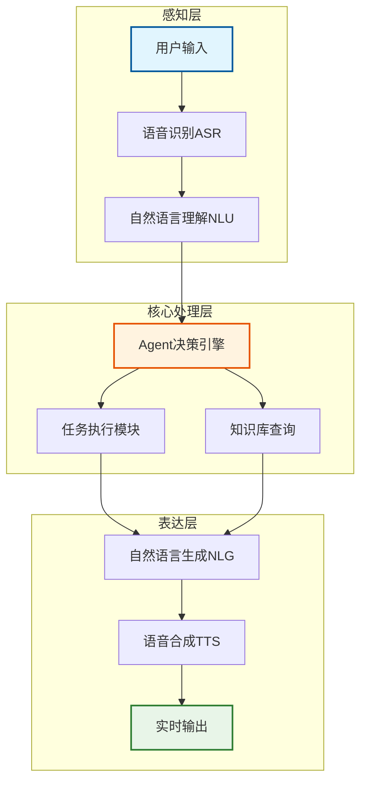

## 前言

随着人工智能技术的快速发展，实时Agent系统正在成为推动产业智能化升级的核心驱动力。从多模态感知到自主决策，从工作流协作到人机协同，Agent技术正在重新定义人机交互的未来。本文将深入探讨实时Agent系统的技术演进路径、应用场景及其对未来产业发展的深远影响。

## 一、实时Agent系统的技术架构与核心原理

### 1.1 多模态与自主决策技术突破

实时Agent系统的核心能力建立在多模态感知与自主决策的技术融合上。根据斯坦福大学的研究，多模态智能体通过整合视觉、听觉等传感器数据，实现了对物理和虚拟环境的交互式理解。

**技术亮点：**
- **GPT-4多模态融合**：通过插件系统调用外部工具时，需同步处理文本指令与图像数据，其多模态融合准确率较单模态提升40%以上
- **硬件加速优化**：GPU/TPU集群将推理延迟从秒级降至毫秒级
- **算法优化**：知识蒸馏技术使模型参数量减少70%的同时保持90%的原始性能

**实时Agent系统架构图：**

### 1.2 工作流与多智能体协作机制

当前技术流派主要分为两类：

#### Workflow流（工作流模式）
以BabyAGI为代表，采用固定流程协调Agent：
- **优势**：稳定性高，适合规则明确的任务
- **应用案例**：某钢铁企业应用此系统后，生产计划优化效率提升6倍，年增收超9000万元
- **成功率**：数据分析任务的完成率达92%

#### Conversation流（对话模式）
如MetaGPT通过拟人化对话实现灵活协作：
- **优势**：灵活协作，适合创意性任务
- **应用案例**：在游戏开发场景中，多Agent通过辩论机制生成创意的成功率比单Agent高35%

**技术挑战与解决方案：**
- **协作效率**：OpenAI的DeepResearch采用端到端强化学习，使WebArena基准测试成功率提升至35.8%
- **通信标准**：MCP协议通过标准化工具接口，降低了多Agent通信的兼容性成本

### 1.3 人机协同增强架构设计

人机协同的核心是构建透明可控的交互机制。蚂蚁数科提出的"监督者-执行者"模式中，Agent会实时展示决策树供人类修正。

**关键技术特点：**

1. **反馈闭环**：钉钉AI助理通过用户行为数据每小时更新模型参数
2. **边界意识**：当Agent遇到未知任务时，87%的案例能主动请求人工干预
3. **应用效果**：医疗诊断系统的误诊率降低28%，教育领域个性化学习系统的教学效率提升30%

## 二、行业应用场景与实践案例

### 2.1 医疗场景：智能问诊与流程优化

医疗行业正通过实时Agent系统实现诊疗流程的智能化重构。

**北京大学第三医院"智诊Agent"案例：**
- **技术架构**：采用"通用底座+垂直精调"混合架构
- **功能特性**：
  - 支持语音/文字多模态输入
  - 智能推荐就诊科室并直连医生页面
  - 检查报告自动解读功能
  - 药品拍照识别提供用药指导
- **应用效果**：实现诊前-诊中-诊后全流程覆盖

**实在智能"AI+RPA"融合方案：**
- **技术突破**：7.0版本支持CT影像、检验报告等多模态数据同步解析
- **性能指标**：
  - 罕见病确诊时间平均缩短40%
  - 支持HIS、PACS等20余类医疗软件的跨系统协同
  - 数据处理时延控制在50ms以内
  - 基层医疗机构误诊率下降65%

### 2.2 金融领域：风控审核与智能客服

金融行业的Agent应用呈现全场景渗透特征。

**应用成果：**
- **信贷领域**：采用MoA（Mixture-of-Agents）混合架构，尽调报告生成效率提升2-3倍
- **风控审核**：可疑交易审核效率提升300%
- **贷款审核**：某大型银行部署后审核流程从2天缩短至30分钟，人力成本降低70%

**技术特点：**
- **智能识别**：通过TARS大模型的类人推理能力，识别财务报表异常等非结构化风险信号
- **智能客服**：语音交互提升用户体验，智能质检准确率达95%，人工效率提升60%

### 2.3 制造业与其他垂直领域

**制造业应用：**
- **质检系统**：AI质检速度提升6倍
- **生产优化**：钢铁企业生产计划优化效率提升6倍，年增收超9000万元

**教育领域：**
- **个性化学习**：通过分析学生答题轨迹动态调整教案，教学效率提升30%
- **适应性优化**：教师适应周期缩短60%

## 三、技术挑战与商业化瓶颈

### 3.1 技术成熟度与实际应用的鸿沟

当前Agent技术面临"技术先进但场景错配"的悖论。

**主要挑战：**

#### 需求断层
- 测试自动化等成熟领域已存在高效解决方案
- 引入Agent的边际效益有限

#### 能力断层
- Claude 3.7在代码生成方面虽超越人类团队
- 但在跨领域迁移时性能下降50%以上

#### 成本断层
- 定制化系统成本高昂
- 中小企业部署成本仍高出预期收益30%

### 3.2 价值验证与ROI实现路径

**突破策略：**

#### 场景筛选矩阵
- 优先选择规则明确的领域（如制造业质检）
- 重点关注数据闭环场景（如智能投顾）
- 这些场景中Agent可使效率提升6倍

#### 渐进式部署
- 阿里钉钉采用"AI助理市场"模式
- 允许企业按模块采购
- 将验证周期从6个月缩短至2周

### 3.3 安全性与用户习惯冲突

**认知偏差分析：**

1. **功能预期偏差**：62%的用户期望Agent具备全自主决策能力，而实际系统仍需人工审核关键节点
2. **交互习惯偏差**：传统互联网的单次查询模式与Agent的多轮协商特性冲突，导致30%的用户在等待超过15秒后放弃任务
3. **安全感知偏差**：企业用户对数据泄露的担忧使40%的POC项目止步于概念验证阶段

**应对策略：**
- **透明化设计**：强制输出引用来源和置信度评分，医疗AI系统医生采纳率提升25%
- **人机协同训练**：采用MCP协议构建标准化工具接口，使非技术用户也能参与系统调优

## 四、未来趋势与产业影响

### 4.1 具身智能与通用AI演进方向

Agent技术正从L2（推理者）向L3（智能体）进化，标志着AI从"思考"走向"行动"的关键转变。

**技术演进路径：**

#### Workflow流架构
- **代表**：BabyAGI
- **特点**：通过固定流程协调Agent
- **适用场景**：任务明确的场景（如数据分析）

#### Conversation流架构
- **代表**：MetaGPT
- **特点**：采用拟人化对话模式
- **适用场景**：探索性任务（如游戏开发）

**发展趋势：**
- **具身智能**：Agent不仅能处理多模态数据，还能在物理世界中执行任务
- **多智能体协作**：医疗领域"影像分析+病理研判"双智能体协作可使诊断准确率再提升15%

### 4.2 劳动力市场重构与经济价值

Agent技术将重塑3.61万亿元规模的劳动力市场。

**经济价值体现：**

#### 效率提升
- 制造业AI质检速度提升6倍
- 教育个性化学习效率提高30%

#### 成本优化
- 金融智能投顾可实时分析万亿级市场数据
- 降低运营成本

**市场预测：**
- 麦肯锡预测：生成式AI每年可为全球经济新增2.6-4.4万亿美元价值
- 商业化挑战：开发成本高，部分场景需3-5年才能显现成本优势

### 4.3 技术伦理与社会治理挑战

Agent的规模化应用存在三重瓶颈：

#### 技术适配性
- 开放场景中表现不稳定
- 指令遵循能力存疑

#### 伦理风险
- 算法偏见问题
- 数据安全及模型可解释性不足

#### 生态成熟度
- 工具接口标准缺失
- 开发者生态需进一步整合

**治理策略：**
- 需要多方协作建立技术治理框架
- 平衡安全与效能的动态关系
- 随着欧盟《人工智能法案》等规范落地，安全与效能的动态平衡将成为未来3-5年的核心议题

## 五、技术发展路线图与投资机会

### 5.1 技术发展三阶段

Agent技术将经历以下三个关键阶段：

#### 第一阶段：工具增强（2024-2026）
- 重点：提升现有工具的智能化水平
- 应用：辅助决策、流程优化
- 特征：人机协同为主

#### 第二阶段：生态融合（2026-2028）
- 重点：多系统集成与协同
- 应用：跨平台智能化解决方案
- 特征：系统级智能涌现

#### 第三阶段：社会重构（2028-2030）
- 重点：重新定义工作方式
- 应用：全面智能化转型
- 特征：人机协同新范式

### 5.2 投资机会与市场预测

**市场规模预测：**
- 2030年Agent技术市场规模预计达1500亿美元
- Gartner预测：到2028年15%的工作决策将由Agent完成

**投资重点领域：**
1. **垂直场景应用**：医疗、金融、制造业等细分领域
2. **基础设施建设**：多模态处理、实时通信技术
3. **人机交互技术**：自然语言处理、语音技术
4. **安全与治理**：隐私保护、算法公平性

## 结论

实时Agent系统技术的发展不仅是技术突破，更是人机协同范式的革命。从多模态融合到自主决策，从工作流协作到社会治理，Agent技术正在重新定义人工智能与人类社会的交互方式。

**关键洞察：**
1. **技术成熟度**：当前更适用于"人在环路"的协作模式，而非完全自主决策
2. **商业化路径**：需要通过场景筛选和渐进式部署实现价值验证
3. **发展前景**：未来3-5年将是技术落地和商业化的关键窗口期

企业需要提前布局垂直场景，抓住2030年1500亿美元的市场机遇。同时，我们也需要在技术发展与社会治理之间找到平衡，确保Agent技术能够真正服务于人类社会的进步。

---

**参考来源：** OPPO 小布深度执行研究报告

*本文基于最新的行业研究报告和实际应用案例，旨在为读者提供全面的Agent技术发展现状和趋势分析。* 