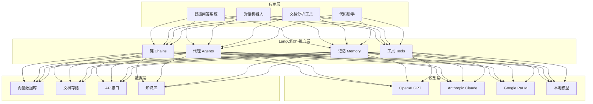
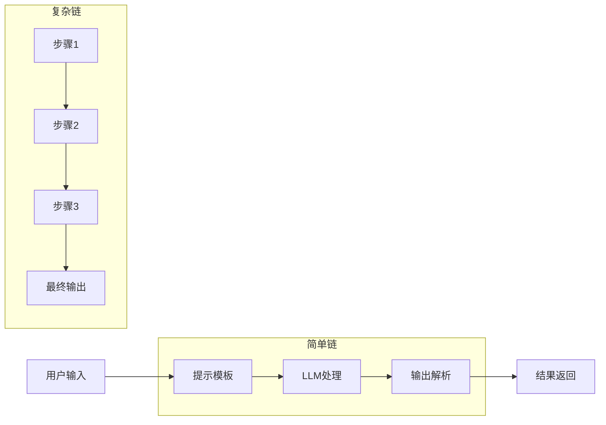
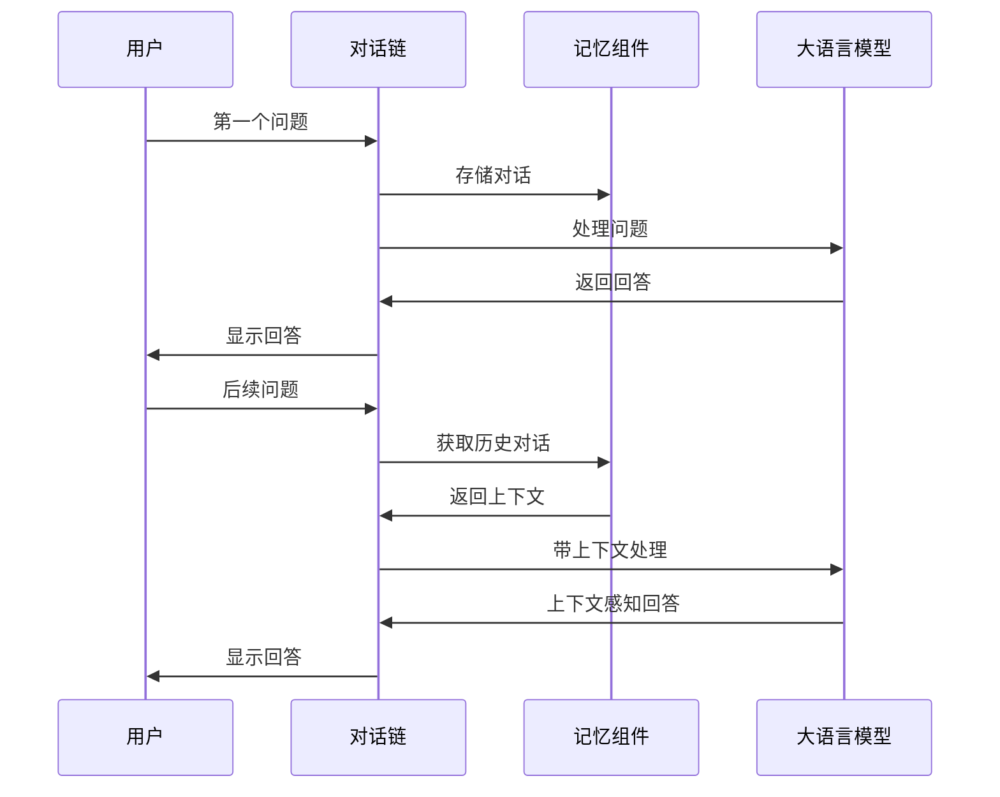
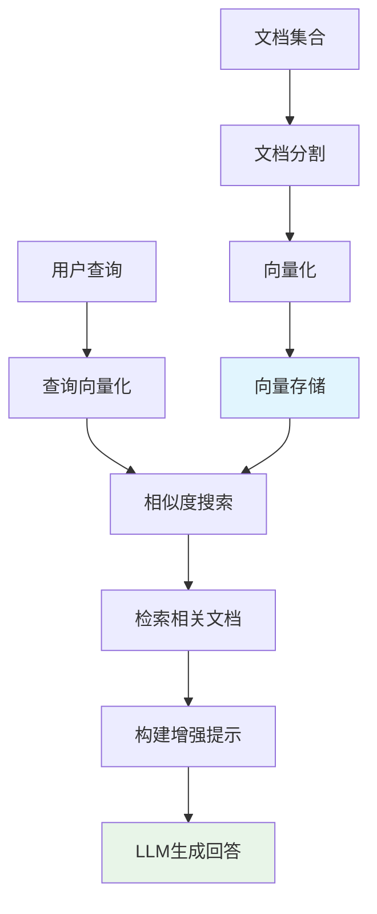
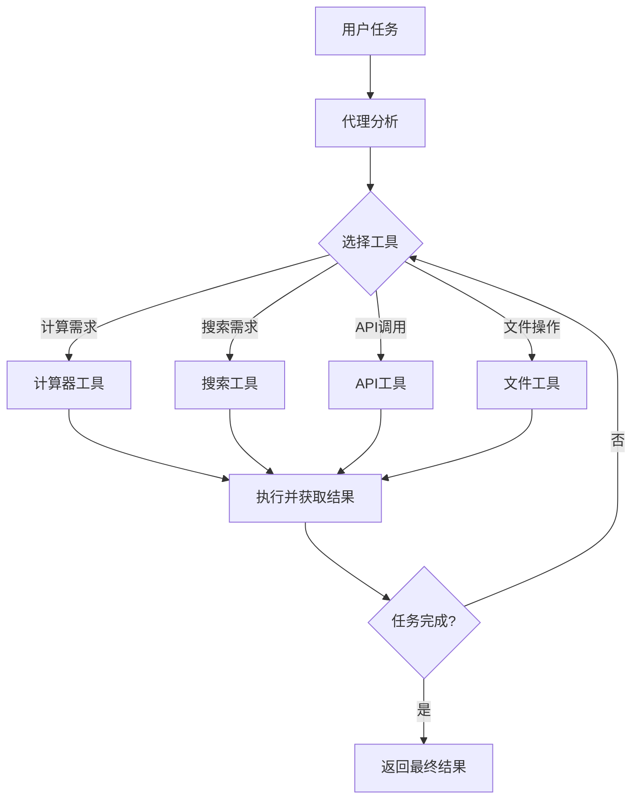
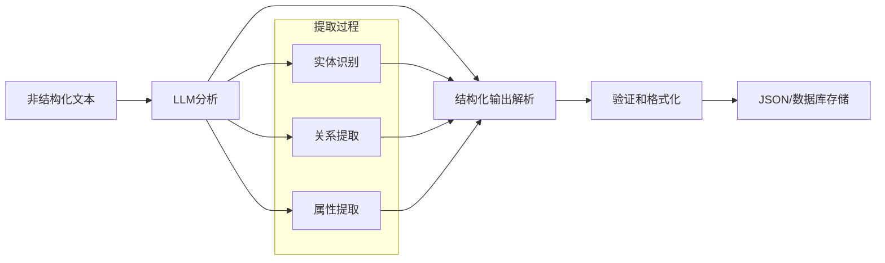
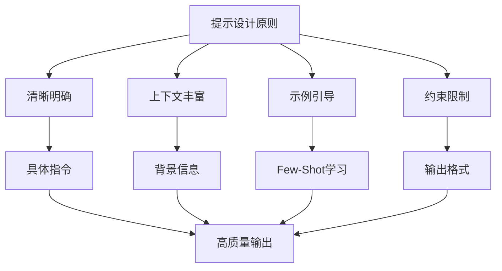
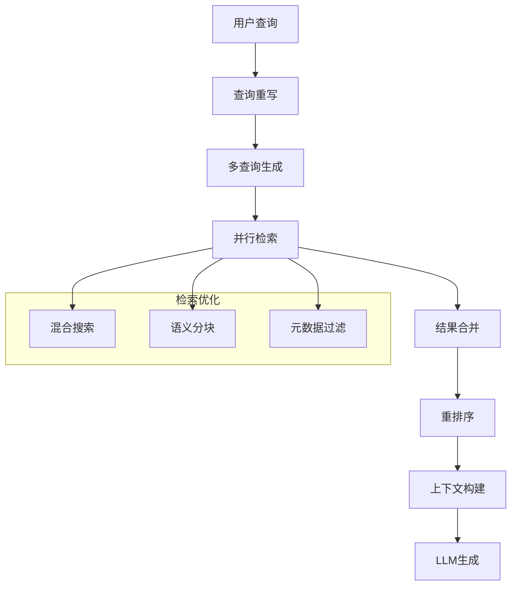
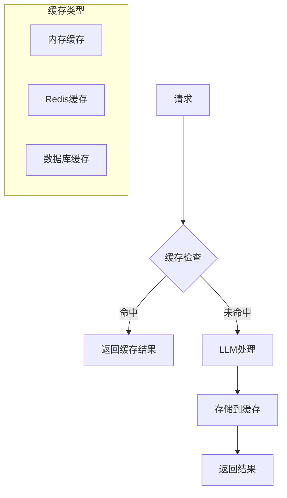

LangChain 是一个强大的框架，专为开发基于大语言模型(LLM)的应用而设计。本文将详细介绍 LangChain 与 LLM 的结合方式、核心组件以及常见应用场景。

## LangChain 核心理念

LangChain 的核心理念是将 LLM 与外部资源(如数据源、工具、API等)连接起来，构建更强大、更实用的 AI 应用。它提供了一系列抽象和工具，使开发者能够轻松地:

- 与各种 LLM 服务进行标准化交互
- 构建复杂的处理流程
- 使 LLM 能够访问外部信息和工具
- 实现记忆和状态管理

## LangChain 架构概览



## LangChain 核心组件

### 1. 模型集成 (Models)

LangChain 支持多种类型的模型，提供统一的接口：

```javascript
// 基础 LLM 使用
import { OpenAI } from "@langchain/openai";

const llm = new OpenAI({
  temperature: 0.7,
  model: "gpt-3.5-turbo"
});

const result = await llm.invoke("什么是人工智能？");
console.log(result);

// 聊天模型使用
import { ChatOpenAI } from "@langchain/openai";
import { HumanMessage, SystemMessage } from "@langchain/core/messages";

const chatModel = new ChatOpenAI();
const messages = [
  new SystemMessage("你是一位人工智能专家"),
  new HumanMessage("简单解释一下神经网络的工作原理")
];

const response = await chatModel.invoke(messages);
console.log(response);
```

### 2. 提示工程 (Prompts)

提供了管理和优化提示的工具：

```javascript
import { PromptTemplate } from "@langchain/core/prompts";

// 创建带有变量的提示模板
const promptTemplate = PromptTemplate.fromTemplate(
  "请为一家{industry}公司写一个{length}字的{document_type}"
);

const formattedPrompt = await promptTemplate.format({
  industry: "人工智能",
  length: "500",
  document_type: "公司简介"
});

const result = await llm.invoke(formattedPrompt);
```

### 3. 链 (Chains)

链是 LangChain 的核心概念，允许组合多个组件：



```javascript
import { LLMChain } from "langchain/chains";

// 简单的LLM链
const chain = new LLMChain({
  llm: new OpenAI({ temperature: 0.7 }),
  prompt: PromptTemplate.fromTemplate("解释{concept}，用简单的语言")
});

const result = await chain.invoke({ concept: "量子计算" });
console.log(result);

// 顺序链 - 处理多步骤任务
import { SequentialChain } from "langchain/chains";

const topicChain = new LLMChain({
  llm,
  prompt: PromptTemplate.fromTemplate("生成一个关于{subject}的研究主题"),
  outputKey: "topic"
});

const outlineChain = new LLMChain({
  llm,
  prompt: PromptTemplate.fromTemplate("为研究主题'{topic}'创建一个大纲"),
  outputKey: "outline"
});

const sequentialChain = new SequentialChain({
  chains: [topicChain, outlineChain],
  inputVariables: ["subject"],
  outputVariables: ["topic", "outline"]
});

const result = await sequentialChain.invoke({ subject: "气候变化" });
```

### 4. 记忆 (Memory)

实现对话历史和上下文管理：



```javascript
import { ConversationChain } from "langchain/chains";
import { BufferMemory } from "langchain/memory";

const memory = new BufferMemory();
const conversation = new ConversationChain({
  llm: new ChatOpenAI(),
  memory
});

// 第一轮对话
const response1 = await conversation.invoke({ input: "我叫张三" });

// 第二轮对话 - 模型会记住用户名
const response2 = await conversation.invoke({ input: "你还记得我是谁吗？" });
```

### 5. 检索增强生成 (RAG)

将 LLM 与外部知识库结合：



```javascript
import { TextLoader } from "langchain/document_loaders/fs/text";
import { RecursiveCharacterTextSplitter } from "langchain/text_splitter";
import { OpenAIEmbeddings } from "@langchain/openai";
import { HNSWLib } from "@langchain/community/vectorstores/hnswlib";
import { RetrievalQAChain } from "langchain/chains";

// 加载文档
const loader = new TextLoader("./documents/data.txt");
const docs = await loader.load();

// 分割文档
const textSplitter = new RecursiveCharacterTextSplitter({
  chunkSize: 1000,
  chunkOverlap: 200
});
const splitDocs = await textSplitter.splitDocuments(docs);

// 创建向量存储
const embeddings = new OpenAIEmbeddings();
const vectorStore = await HNSWLib.fromDocuments(splitDocs, embeddings);

// 创建问答链
const qa = new RetrievalQAChain({
  combineDocumentsChain: loadQAStuffChain(new OpenAI()),
  retriever: vectorStore.asRetriever()
});

// 提问
const answer = await qa.invoke({ query: "文档中提到了哪些关键概念？" });
```

### 6. 代理 (Agents)

赋予 LLM 使用工具和执行任务的能力：



```javascript
import { initializeAgentExecutorWithOptions } from "langchain/agents";
import { DynamicTool } from "@langchain/core/tools";
import { Calculator } from "langchain/tools/calculator";

// 定义工具
const tools = [
  new Calculator(),
  new DynamicTool({
    name: "天气查询",
    description: "获取指定城市的天气信息",
    func: async (city) => {
      // 这里可以调用实际的天气API
      return `${city}今天晴天，温度22-28度`;
    }
  })
];

// 创建代理
const executor = await initializeAgentExecutorWithOptions(
  tools,
  new ChatOpenAI({ temperature: 0 }),
  {
    agentType: "chat-conversational-react-description",
    verbose: true
  }
);

// 执行任务
const result = await executor.invoke({
  input: "北京今天天气怎么样？然后计算 (24+28)/2 是多少？"
});
```

## LangChain 应用场景

### 1. 智能问答系统

结合 RAG 技术构建能够回答特定领域问题的系统：

```javascript
// 构建文档问答系统
import { PDFLoader } from "langchain/document_loaders/fs/pdf";
import { OpenAIEmbeddings } from "@langchain/openai";
import { Chroma } from "@langchain/community/vectorstores/chroma";
import { RetrievalQAChain } from "langchain/chains";

async function createQASystem(docsPath, question) {
  // 加载PDF文件
  const loader = new PDFLoader(docsPath);
  const docs = await loader.load();
  
  // 创建向量存储
  const vectorStore = await Chroma.fromDocuments(
    docs, 
    new OpenAIEmbeddings()
  );
  
  // 创建问答链
  const qa = RetrievalQAChain.fromLLM(
    new ChatOpenAI({ modelName: "gpt-4" }),
    vectorStore.asRetriever()
  );
  
  // 获取答案
  return await qa.invoke({ query: question });
}
```

### 2. 多轮对话机器人

使用记忆组件构建能够维持上下文的聊天机器人：

```javascript
import { ChatOpenAI } from "@langchain/openai";
import { ConversationChain } from "langchain/chains";
import { BufferWindowMemory } from "langchain/memory";
import { ChatPromptTemplate, MessagesPlaceholder } from "@langchain/core/prompts";

async function createChatbot() {
  // 创建提示模板
  const chatPrompt = ChatPromptTemplate.fromMessages([
    ["system", "你是一个专业的客服助手，负责解答用户关于产品的问题。"],
    new MessagesPlaceholder("history"),
    ["human", "{input}"]
  ]);
  
  // 创建记忆组件
  const memory = new BufferWindowMemory({
    memoryKey: "history",
    k: 5,
    returnMessages: true
  });
  
  // 创建对话链
  return new ConversationChain({
    llm: new ChatOpenAI(),
    memory: memory,
    prompt: chatPrompt
  });
}
```

### 3. 结构化数据提取

从非结构化文本中提取结构化信息：



```javascript
import { OpenAI } from "@langchain/openai";
import { StructuredOutputParser } from "langchain/output_parsers";
import { PromptTemplate } from "@langchain/core/prompts";
import { z } from "zod";

async function extractStructuredData(text) {
  // 定义输出结构
  const parser = StructuredOutputParser.fromZodSchema(
    z.object({
      people: z.array(z.object({
        name: z.string().describe("人物姓名"),
        age: z.number().optional().describe("人物年龄"),
        occupation: z.string().optional().describe("职业")
      })),
      locations: z.array(z.string()).describe("文本中提到的地点"),
      summary: z.string().describe("文本的简要总结")
    })
  );
  
  // 创建提示模板
  const prompt = PromptTemplate.fromTemplate(
    `从以下文本中提取关键信息，并按照指定格式输出。
    
    文本: {text}
    
    {format_instructions}
    `
  );
  
  // 格式说明
  const formatInstructions = parser.getFormatInstructions();
  
  // 生成完整提示
  const input = await prompt.format({
    text: text,
    format_instructions: formatInstructions
  });
  
  // 获取LLM响应
  const model = new OpenAI({ temperature: 0 });
  const response = await model.invoke(input);
  
  // 解析结果
  return parser.parse(response);
}
```

### 4. 工作流自动化

使用代理和工具自动化复杂任务：

```javascript
import { ChatOpenAI } from "@langchain/openai";
import { createOpenAIToolsAgent, AgentExecutor } from "langchain/agents";
import { TavilySearchResults } from "@langchain/community/tools/tavily_search";
import { JsonOutputParser } from "@langchain/core/output_parsers";
import { pull } from "langchain/hub";

async function researchAssistant(topic) {
  // 创建工具
  const tools = [
    new TavilySearchResults({
      maxResults: 3,
      apiKey: process.env.TAVILY_API_KEY,
    }),
  ];
  
  // 获取代理提示
  const prompt = await pull("hwchase17/openai-tools-agent");
  
  // 创建代理
  const agent = createOpenAIToolsAgent({
    llm: new ChatOpenAI({ temperature: 0, model: "gpt-4" }),
    tools,
    prompt,
  });
  
  // 创建执行器
  const agentExecutor = new AgentExecutor({
    agent,
    tools,
    verbose: true,
  });
  
  // 执行任务
  return agentExecutor.invoke({
    input: `做一份关于"${topic}"的详细研究报告，包括最新发展、主要挑战和未来趋势。`,
  });
}
```

## 高级模式与最佳实践

### 1. 提示工程最佳实践



```javascript
// 使用少样本学习(Few-Shot Learning)
const fewShotTemplate = `您是一位情感分析专家。分析文本情感，并分类为"积极"、"中性"或"消极"。

例子:
文本: "今天天气真好，我心情非常愉快"
情感: 积极

文本: "这家餐厅的食物质量一般"
情感: 中性

文本: "服务太差了，我再也不会来这里"
情感: 消极

文本: "{input}"
情感:`;

const fewShotPrompt = PromptTemplate.fromTemplate(fewShotTemplate);
```

### 2. 自定义链

```javascript
import { BaseChain } from "langchain/chains";

class CustomTranslationChain extends BaseChain {
  constructor(fields) {
    super();
    this.llm = fields.llm;
  }

  get inputKeys() {
    return ["text", "language"];
  }

  get outputKeys() {
    return ["translation"];
  }

  async _call(values) {
    const { text, language } = values;
    const prompt = `将以下文本翻译成${language}:\n\n${text}`;
    const translation = await this.llm.invoke(prompt);
    return { translation };
  }
}
```

### 3. 批处理优化

```javascript
// 批处理嵌入以减少API调用
import { OpenAIEmbeddings } from "@langchain/openai";

const embeddings = new OpenAIEmbeddings();
const texts = ["文本1", "文本2", "文本3", "文本4", "文本5"];
const embedArray = await embeddings.embedDocuments(texts);
```

### 4. RAG高级技术



```javascript
// 使用多查询检索增强文档搜索精度
import { MultiQueryRetriever } from "langchain/retrievers/multi_query";

// 创建多查询检索器
const retriever = MultiQueryRetriever.fromLLM({
  llm: new ChatOpenAI(),
  retriever: vectorStore.asRetriever(),
  queryCount: 3, // 生成3个不同的查询
});

// 使用检索器
const documents = await retriever.getRelevantDocuments("什么是量子计算？");
```

## 性能优化与部署

### 1. 缓存策略



### 2. 流式输出

```javascript
import { ChatOpenAI } from "@langchain/openai";

const streamingLLM = new ChatOpenAI({
  streaming: true,
  callbacks: [
    {
      handleLLMNewToken(token) {
        process.stdout.write(token);
      },
    },
  ],
});

await streamingLLM.invoke("写一篇关于人工智能的文章");
```

### 3. 错误处理与重试

```javascript
import { ChatOpenAI } from "@langchain/openai";
import { LLMChain } from "langchain/chains";

const llmWithRetry = new ChatOpenAI({
  maxRetries: 3,
  timeout: 30000,
});

const chain = new LLMChain({
  llm: llmWithRetry,
  prompt: promptTemplate,
});

try {
  const result = await chain.invoke({ input: "用户输入" });
  return result;
} catch (error) {
  console.error("处理失败:", error);
  // 实现降级策略
  return "抱歉，服务暂时不可用，请稍后重试。";
}
```

## 总结

LangChain 提供了一个强大的框架，使开发者能够高效地将 LLM 集成到应用程序中，并扩展其功能。主要优势包括：

1. **抽象与标准化** - 统一接口简化了与不同 LLM 提供商的交互
2. **组件化设计** - 便于构建复杂的 AI 应用流程
3. **工具和集成** - 丰富的工具库和第三方集成
4. **灵活性** - 可以根据需求自定义和扩展组件

通过合理使用 LangChain 提供的组件和模式，开发者可以构建功能强大、上下文感知的 AI 应用，大幅提升开发效率和应用质量。

**关键要点：**
- 选择合适的模型和配置参数
- 设计有效的提示模板
- 合理使用记忆和上下文管理
- 利用RAG技术增强知识获取
- 通过代理和工具扩展LLM能力
- 注重性能优化和错误处理

随着LLM技术的不断发展，LangChain也在持续演进，为开发者提供更多强大的功能和工具，助力构建下一代智能应用。 