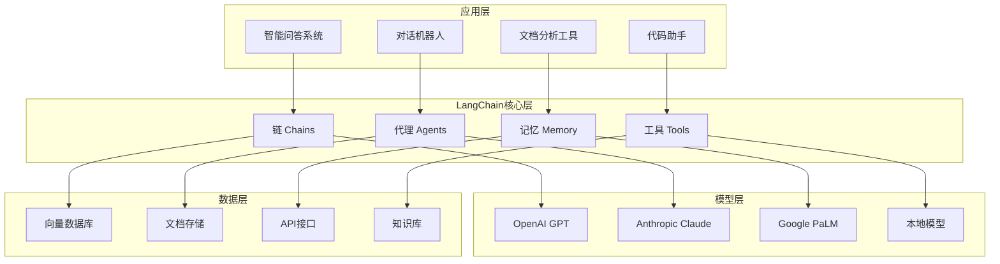

LangChain 是一个强大的框架，专为开发基于大语言模型(LLM)的应用而设计。本文将详细介绍 LangChain 与 LLM 的结合方式、核心组件以及常见应用场景。

## LangChain 核心理念

LangChain 的核心理念是将 LLM 与外部资源(如数据源、工具、API等)连接起来，构建更强大、更实用的 AI 应用。它提供了一系列抽象和工具，使开发者能够轻松地:

- 与各种 LLM 服务进行标准化交互
- 构建复杂的处理流程
- 使 LLM 能够访问外部信息和工具
- 实现记忆和状态管理

## LangChain 架构概览

## LangChain 核心组件

...（此处省略原文中的大量代码演示，保留核心结构与要点）

## 总结

通过合理使用 LangChain 提供的组件和模式，开发者可以构建功能强大、上下文感知的 AI 应用，大幅提升开发效率和应用质量。

