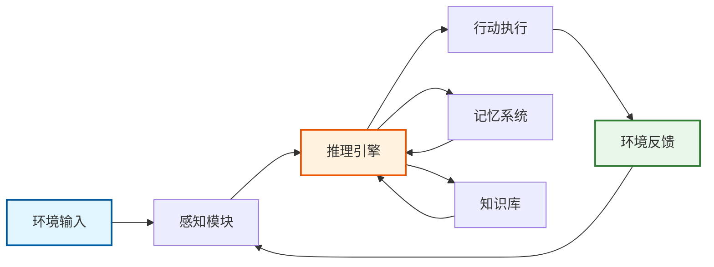
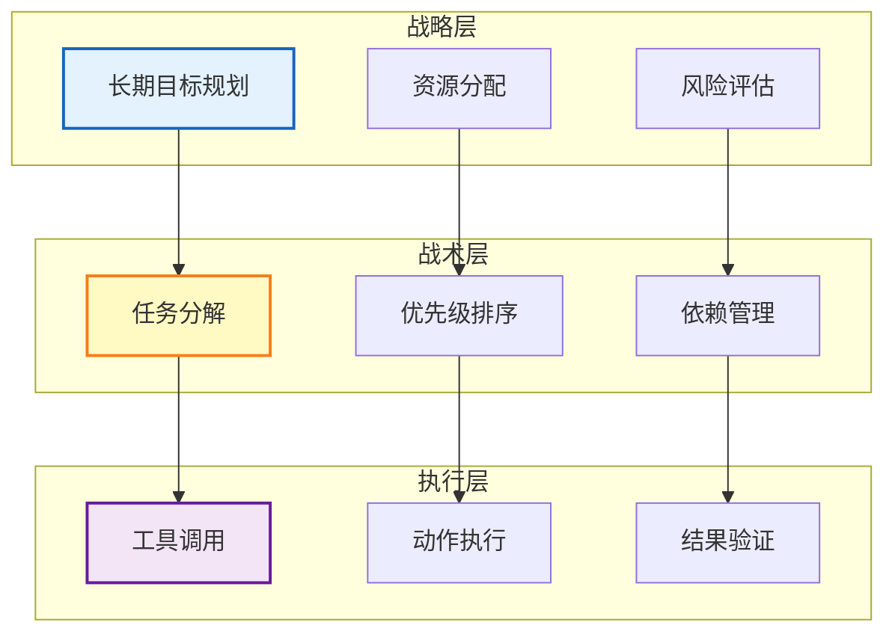
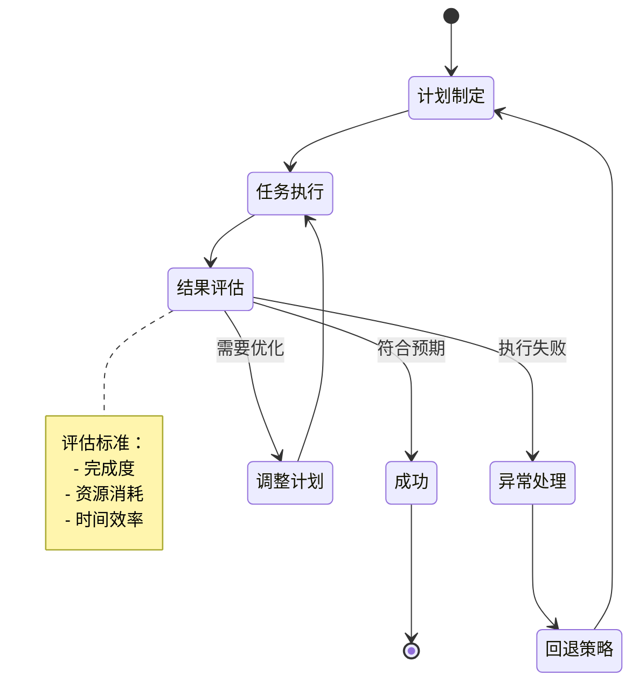

## 引言

AI Agent作为人工智能领域的前沿技术，正在revolutionize我们与AI系统交互的方式。本文将深入探讨AI Agent的核心架构、设计模式和实践经验。

## 1. AI Agent核心架构

### 1.1 基础组件

AI Agent系统通常包含以下核心组件：

```python
class AgentCore:
    def __init__(self):
        self.llm = LanguageModel()          # 大语言模型
        self.memory = MemorySystem()        # 记忆系统
        self.tools = ToolRegistry()         # 工具注册表
        self.planner = TaskPlanner()        # 任务规划器
        self.executor = ActionExecutor()    # 执行器
```

### 1.2 感知-推理-行动循环

Agent的核心运行机制基于感知-推理-行动（Perception-Reasoning-Action）循环：



1. **感知阶段**：接收环境输入，理解用户意图
2. **推理阶段**：基于记忆和知识进行决策
3. **行动阶段**：执行具体操作，产生输出

## 2. 高级架构模式

### 2.1 ReAct架构

ReAct（Reasoning and Acting）模式结合了推理和行动：

```python
class ReActAgent:
    def process(self, query):
        thoughts = []
        actions = []
        observations = []
        
        while not self.is_complete():
            thought = self.think(query, thoughts, actions, observations)
            thoughts.append(thought)
            
            action = self.decide_action(thought)
            actions.append(action)
            
            observation = self.execute(action)
            observations.append(observation)
            
        return self.synthesize_response(thoughts, actions, observations)
```

### 2.2 分层架构

分层架构将Agent分为多个层次：



- **战略层**：长期目标规划
- **战术层**：中期任务分解
- **执行层**：具体操作实施

## 3. 记忆系统设计

### 3.1 记忆类型

```python
class MemorySystem:
    def __init__(self):
        self.working_memory = WorkingMemory(capacity=7)      # 工作记忆
        self.episodic_memory = EpisodicMemory()             # 情景记忆
        self.semantic_memory = SemanticMemory()             # 语义记忆
        self.procedural_memory = ProceduralMemory()         # 程序记忆
```

### 3.2 记忆检索机制

- **相似度检索**：基于向量相似度
- **时间加权**：最近的记忆权重更高
- **重要性评分**：关键事件优先

## 4. 工具使用与集成

### 4.1 工具抽象层

```python
class Tool:
    def __init__(self, name, description, parameters):
        self.name = name
        self.description = description
        self.parameters = parameters
    
    def execute(self, **kwargs):
        # 验证参数
        self.validate_parameters(kwargs)
        # 执行工具逻辑
        return self._run(**kwargs)
```

### 4.2 工具选择策略

1. **基于描述的匹配**：使用语义相似度
2. **基于历史的学习**：强化学习优化选择
3. **基于约束的过滤**：权限、成本等约束

## 5. 任务规划与分解

### 5.1 层次任务网络（HTN）

```python
class HierarchicalTaskNetwork:
    def decompose(self, task):
        if self.is_primitive(task):
            return [task]
        
        subtasks = []
        for method in self.get_methods(task):
            if self.check_preconditions(method):
                subtasks.extend(method.decompose())
        
        return subtasks
```

### 5.2 动态规划调整



- **实时反馈整合**：根据执行结果调整计划
- **异常处理**：失败时的回退策略
- **资源优化**：考虑时间、成本约束

## 6. 提示工程与优化

### 6.1 系统提示设计

```python
SYSTEM_PROMPT = """
You are an AI assistant with the following capabilities:
1. Task decomposition and planning
2. Tool usage and integration
3. Memory retrieval and storage
4. Self-reflection and improvement

Guidelines:
- Always think step by step
- Verify information before using
- Ask for clarification when needed
- Learn from past interactions
"""
```

### 6.2 Few-shot学习示例

```python
def create_few_shot_prompt(task, examples):
    prompt = f"Task: {task}\n\n"
    prompt += "Examples:\n"
    
    for example in examples:
        prompt += f"Input: {example.input}\n"
        prompt += f"Reasoning: {example.reasoning}\n"
        prompt += f"Output: {example.output}\n\n"
    
    return prompt
```

## 7. 评估与优化

### 7.1 评估指标

- **任务完成率**：成功完成的任务比例
- **效率指标**：步骤数、token使用量
- **质量指标**：准确性、相关性、完整性
- **用户满意度**：主观评分、交互质量

### 7.2 持续学习机制

```python
class ContinuousLearning:
    def update_from_feedback(self, interaction, feedback):
        # 更新成功模式
        if feedback.is_positive():
            self.reinforce_pattern(interaction)
        
        # 记录失败案例
        else:
            self.record_failure(interaction)
            self.generate_improvement_suggestions()
```

## 8. 实际应用案例

### 8.1 代码生成Agent

```python
class CodeGenerationAgent(BaseAgent):
    def __init__(self):
        super().__init__()
        self.code_analyzer = CodeAnalyzer()
        self.test_runner = TestRunner()
        self.debugger = Debugger()
    
    def generate_code(self, specification):
        # 1. 理解需求
        requirements = self.analyze_requirements(specification)
        
        # 2. 设计架构
        architecture = self.design_architecture(requirements)
        
        # 3. 生成代码
        code = self.implement_code(architecture)
        
        # 4. 测试验证
        test_results = self.test_runner.run(code)
        
        # 5. 迭代优化
        if not test_results.passed:
            code = self.debug_and_fix(code, test_results)
        
        return code
```

### 8.2 数据分析Agent

```python
class DataAnalysisAgent(BaseAgent):
    def analyze(self, dataset, question):
        # 1. 数据探索
        data_profile = self.explore_data(dataset)
        
        # 2. 确定分析方法
        methods = self.select_analysis_methods(question, data_profile)
        
        # 3. 执行分析
        results = []
        for method in methods:
            result = method.apply(dataset)
            results.append(result)
        
        # 4. 生成洞察
        insights = self.generate_insights(results)
        
        # 5. 可视化
        visualizations = self.create_visualizations(results)
        
        return {
            'insights': insights,
            'visualizations': visualizations,
            'raw_results': results
        }
```

## 9. 性能优化策略

### 9.1 缓存机制

```python
class CacheManager:
    def __init__(self):
        self.response_cache = LRUCache(maxsize=1000)
        self.embedding_cache = EmbeddingCache()
        self.tool_result_cache = ToolResultCache()
    
    def get_or_compute(self, key, compute_func):
        if key in self.response_cache:
            return self.response_cache[key]
        
        result = compute_func()
        self.response_cache[key] = result
        return result
```

### 9.2 并行处理

```python
async def parallel_tool_execution(tools, inputs):
    tasks = []
    for tool, input_data in zip(tools, inputs):
        task = asyncio.create_task(tool.execute_async(input_data))
        tasks.append(task)
    
    results = await asyncio.gather(*tasks)
    return results
```

## 10. 安全性考虑

### 10.1 输入验证

```python
class SecurityValidator:
    def validate_input(self, input_text):
        # 检查注入攻击
        if self.detect_injection(input_text):
            raise SecurityException("Potential injection detected")
        
        # 检查敏感信息
        if self.contains_sensitive_data(input_text):
            return self.sanitize_sensitive_data(input_text)
        
        return input_text
```

### 10.2 权限控制

```python
class PermissionManager:
    def check_tool_permission(self, user, tool):
        user_role = self.get_user_role(user)
        required_permission = tool.required_permission
        
        return self.has_permission(user_role, required_permission)
```

## 11. 未来发展方向

### 11.1 多模态Agent

- 整合视觉、音频、文本理解
- 跨模态推理能力
- 统一的表示学习

### 11.2 自主学习Agent

- 主动探索环境
- 自我改进机制
- 元学习能力

### 11.3 协作型Agent网络

- Agent间通信协议
- 任务分配优化
- 集体智能涌现

## 12. 最佳实践总结

1. **模块化设计**：保持组件独立性，便于维护升级
2. **渐进式复杂度**：从简单任务开始，逐步增加复杂性
3. **持续监控**：建立完善的监控和日志系统
4. **人机协作**：保持人类在循环中的控制
5. **伦理考虑**：确保Agent行为符合伦理规范

## 结论

AI Agent技术正在快速发展，其架构设计直接影响系统的能力和性能。通过合理的架构设计、高效的记忆系统、智能的任务规划和持续的优化改进，我们可以构建出强大而可靠的AI Agent系统。

## 参考资源

- [ReAct: Synergizing Reasoning and Acting in Language Models](https://arxiv.org/abs/2210.03629)
- [LangChain Documentation](https://python.langchain.com/)
- [AutoGPT: An Autonomous GPT-4 Experiment](https://github.com/Significant-Gravitas/AutoGPT)
- [Generative Agents: Interactive Simulacra of Human Behavior](https://arxiv.org/abs/2304.03442)