## 引言

在人工智能和大语言模型(LLM)的应用中，知识的表示与组织方式直接影响系统的推理能力和智能水平。**LangChain Graph** 作为LangChain生态系统中的重要组件，提供了一套强大的工具，使开发者能够轻松地从文本中提取结构化知识，构建知识图谱，并基于图进行复杂推理。本文将深入探讨LangChain Graph的概念、工作原理、应用场景以及实践技巧，帮助您全面理解和应用这一强大工具。

## 知识图谱与LangChain Graph基础

### 什么是知识图谱？

知识图谱(Knowledge Graph)是一种结构化数据模型，用于表示实体(Entities)之间的关系(Relations)。它以图的形式组织信息，其中：
- **节点(Nodes)**：代表实体或概念
- **边(Edges)**：代表实体间的关系

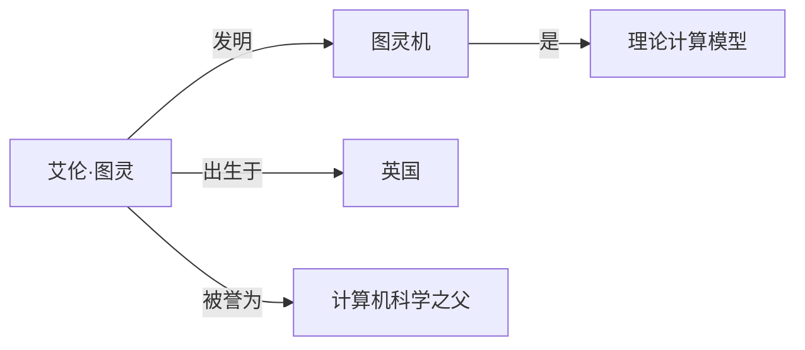

### LangChain Graph的定义与价值

LangChain Graph是LangChain框架中专注于知识图谱构建、存储和查询的模块集合。它将LLM的自然语言处理能力与图数据库的结构化表示结合，实现了：

1. 自动从文本中提取实体和关系
2. 构建和维护知识图谱
3. 基于图结构进行复杂查询和推理
4. 增强LLM应用的上下文理解和回答质量

## LangChain Graph架构

LangChain Graph的整体架构可以通过以下图示来理解：

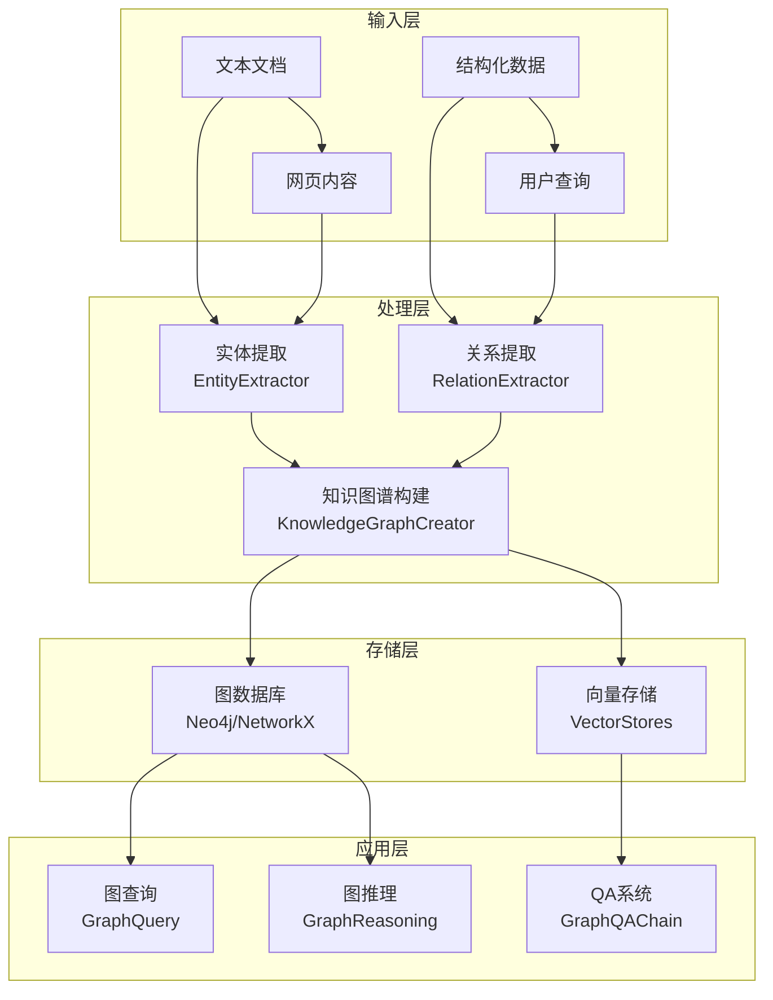

## 核心组件详解

### 1. 实体和关系提取器

这些组件负责从文本中识别实体和它们之间的关系：

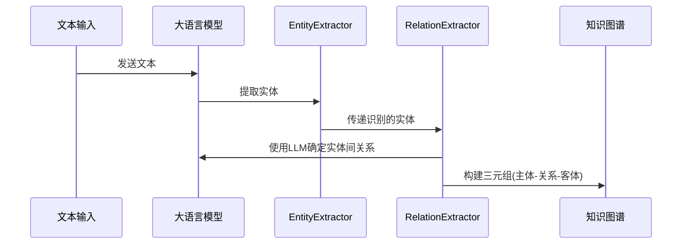

### 2. 知识图谱构建

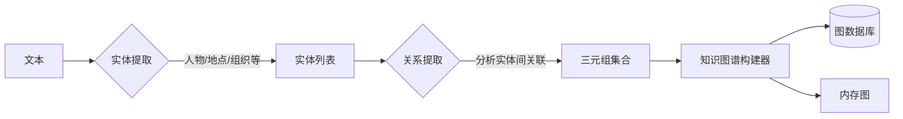

### 3. 图存储和查询

LangChain Graph支持多种图存储方式：

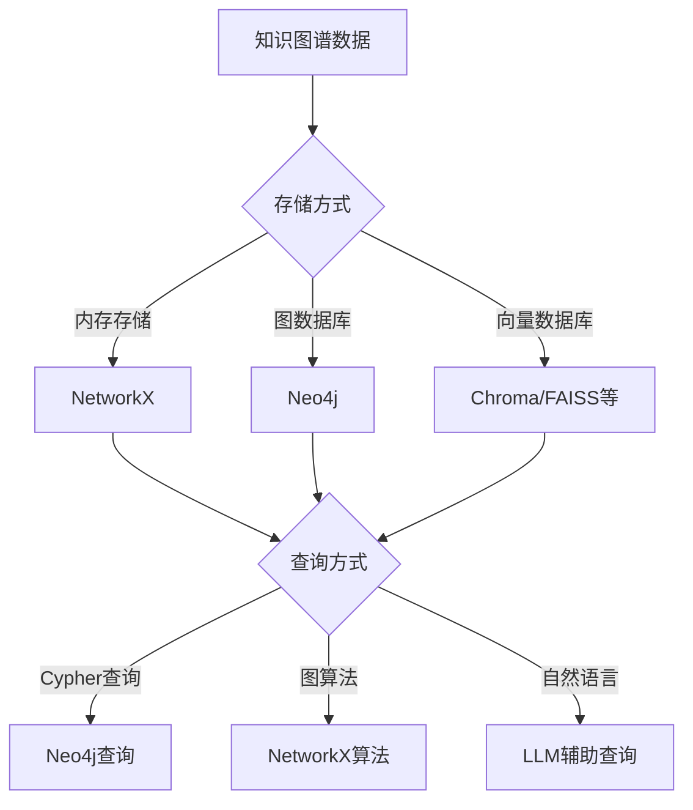

## 构建知识图谱的工作流程

以下是使用LangChain Graph构建知识图谱的完整流程：

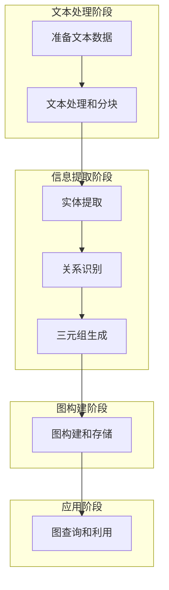

## 实际代码示例

让我们通过实际代码来理解LangChain Graph的使用方法。

### 1. 基础设置

```javascript
// 导入必要的包
import { ChatOpenAI } from "@langchain/openai";
import { EntityExtractor, RelationExtractor, KnowledgeGraph } from "langchain/graphs";
import { Neo4jGraph } from "langchain/graphs/neo4j_graph";
import { Document } from "langchain/document";

// 初始化LLM
const llm = new ChatOpenAI({
  temperature: 0,
  model: "gpt-4-turbo"
});
```

### 2. 从文本构建知识图谱

```javascript
// 准备文本
const text = `
艾伦·图灵于1912年出生于英国伦敦。他是计算机科学和人工智能的先驱。
图灵在剑桥大学国王学院和普林斯顿大学学习。他于1936年发表了关于图灵机的论文。
在第二次世界大战期间，图灵在英国密码破译中心布莱切利园工作，成功破解了德国的英格玛密码。
`;

// 创建文档
const docs = [
  new Document({ pageContent: text })
];

// 初始化Neo4j图数据库连接
const graph = await Neo4jGraph.initialize({
  url: "neo4j://localhost:7687",
  username: "neo4j",
  password: "password"
});

// 创建知识图谱构建器
const kg = new KnowledgeGraph({
  llm,
  entityExtractor: new EntityExtractor({ llm }),
  relationExtractor: new RelationExtractor({ llm })
});

// 从文本构建知识图谱
await kg.buildFromDocuments(docs, { graph });
```

### 3. 查询知识图谱

```javascript
// Cypher查询
const cypherQuery = `
MATCH (p:Person {name: '艾伦·图灵'})-[r]->(o)
RETURN p, r, o
`;

const result = await graph.query(cypherQuery);
console.log(result);

// 自然语言查询
import { GraphCypherQAChain } from "langchain/chains";

const chain = GraphCypherQAChain.fromLLM({
  llm,
  graph,
  verbose: true
});

const answer = await chain.invoke({
  query: "艾伦·图灵在哪里上的大学？"
});

console.log(answer.text);
```

## 应用场景图解

### 1. 智能问答系统

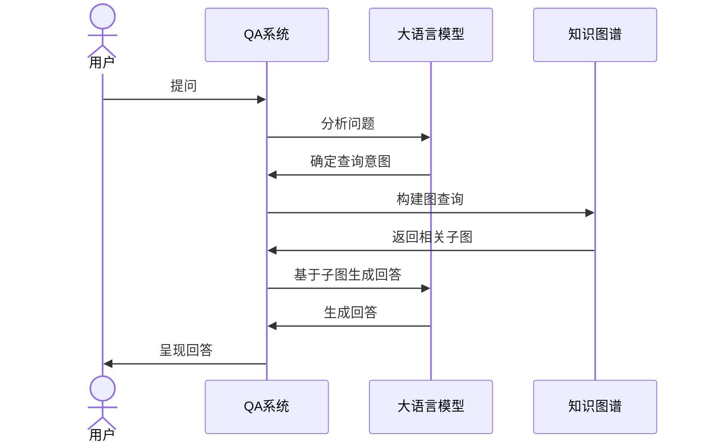

### 2. 知识发现与推理

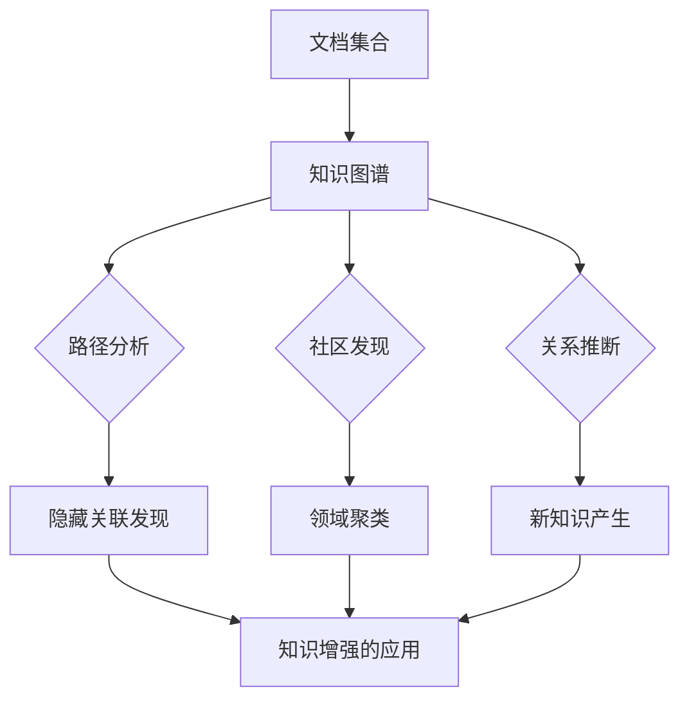

### 3. 内容推荐系统

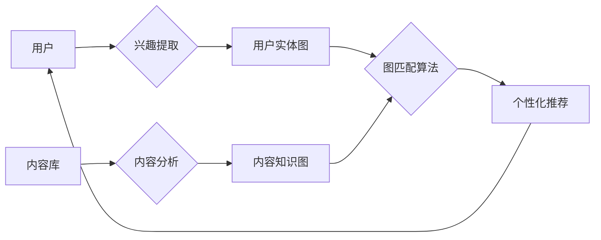

## 高级用法：复杂知识图谱

### 1. 多源数据集成

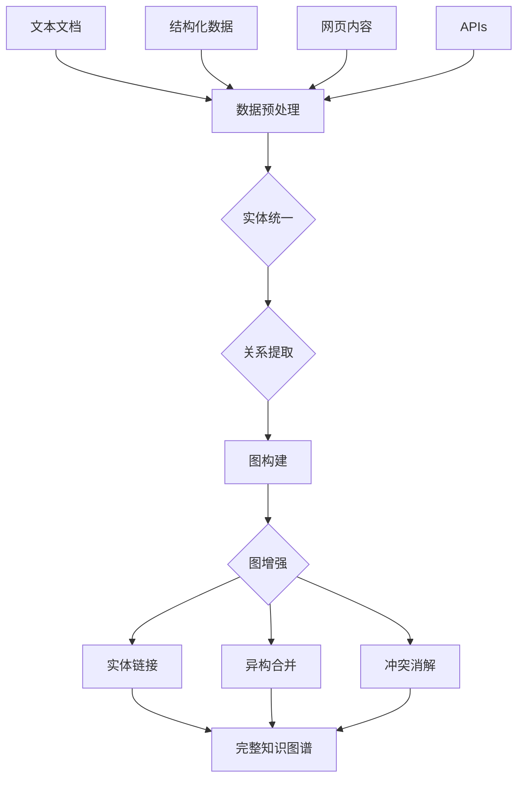

### 2. 图引导的推理增强

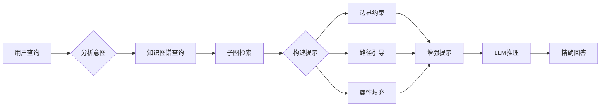

## 代码实现：复杂查询示例

```javascript
// 创建自定义实体和关系提取器
const entityExtractor = new EntityExtractor({ 
  llm,
  allowedEntityTypes: ["Person", "Organization", "Location", "Event", "Work", "Concept"],
  contextWindowSize: 3000
});

const relationExtractor = new RelationExtractor({
  llm,
  relationExtractionPrompt: `识别以下文本中实体之间的关系，并以(主体, 关系, 客体)的形式返回。注意关系应该是具体且有意义的动词短语。`,
  validateRelations: true,
  maxRelationsPerEntityPair: 3
});

// 实现增量式图构建
async function incrementalGraphBuild(documents, graph) {
  const kg = new KnowledgeGraph({
    llm,
    entityExtractor,
    relationExtractor
  });
  
  // 批处理文档
  const batchSize = 5;
  for (let i = 0; i < documents.length; i += batchSize) {
    const batch = documents.slice(i, i + batchSize);
    console.log(`处理批次 ${Math.floor(i/batchSize) + 1}/${Math.ceil(documents.length/batchSize)}`);
    
    await kg.buildFromDocuments(batch, { 
      graph,
      mergeEntities: true  // 合并同名实体
    });
  }
  
  return graph;
}

// 复杂查询示例
async function complexGraphQuery(graph, query) {
  const chain = GraphCypherQAChain.fromLLM({
    llm: new ChatOpenAI({ model: "gpt-4", temperature: 0 }),
    graph,
    returnDirect: false,  // 不直接返回Cypher查询结果
    cypherPrompt: `根据以下问题，生成适当的Cypher查询以从知识图谱中检索相关信息。考虑使用图算法和复杂模式匹配。`
  });
  
  return chain.invoke({ query });
}
```

## 最佳实践与优化技巧

### 1. 实体和关系定义策略

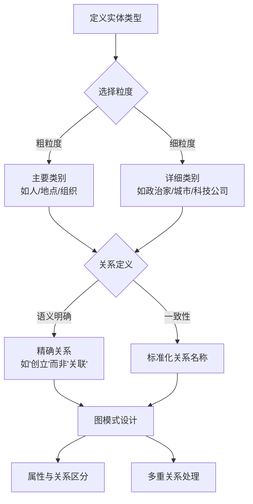

### 2. 性能优化技巧

对于大规模知识图谱，以下优化技巧至关重要：

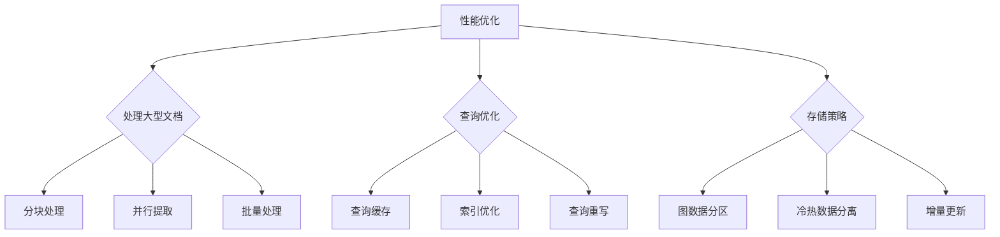

## 完整工作流：从文档到智能应用

下面是一个完整的工作流，展示了如何从文档构建知识图谱并应用到实际应用场景：

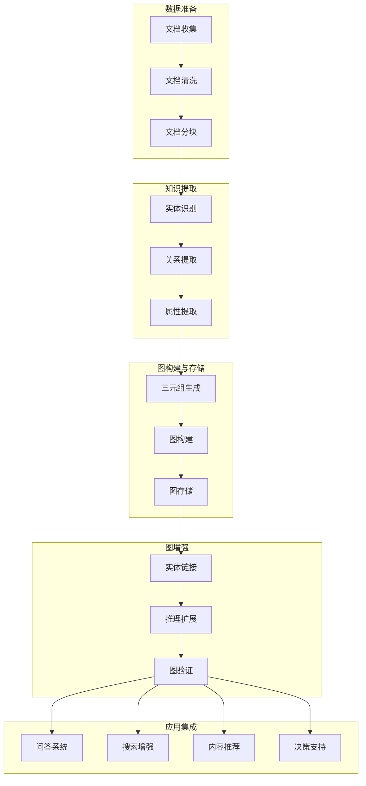

## 实际案例：研究领域知识图谱

以下是一个构建学术研究领域知识图谱的完整示例：

```javascript
// 示例：构建AI研究领域知识图谱
import { OpenAI } from "@langchain/openai";
import { RecursiveCharacterTextSplitter } from "langchain/text_splitter";
import { EntityExtractor, RelationExtractor, KnowledgeGraph } from "langchain/graphs";
import { Neo4jGraph } from "langchain/graphs/neo4j_graph";
import { GraphRAGRetriever } from "langchain/retrievers/graph_rag";
import { RetrievalQAChain } from "langchain/chains";
import { Document } from "langchain/document";

async function buildResearchGraph(papers, graph) {
  // 初始化LLM
  const llm = new ChatOpenAI({
    temperature: 0,
    model: "gpt-4"
  });
  
  // 自定义实体提取器
  const entityExtractor = new EntityExtractor({
    llm,
    allowedEntityTypes: [
      "Researcher", "Paper", "University", "Conference", 
      "ResearchField", "Method", "Algorithm", "Dataset"
    ]
  });
  
  // 自定义关系提取器
  const relationExtractor = new RelationExtractor({
    llm,
    validateRelations: true
  });
  
  // 初始化知识图谱构建器
  const kg = new KnowledgeGraph({
    llm,
    entityExtractor,
    relationExtractor
  });
  
  // 文本分割
  const textSplitter = new RecursiveCharacterTextSplitter({
    chunkSize: 2000,
    chunkOverlap: 200
  });
  
  // 处理每篇论文
  for (const paper of papers) {
    console.log(`处理论文: ${paper.title}`);
    
    // 创建文档
    const text = `标题: ${paper.title}\n作者: ${paper.authors.join(', ')}\n摘要: ${paper.abstract}\n关键字: ${paper.keywords.join(', ')}`;
    const docs = await textSplitter.createDocuments([text]);
    
    // 构建图
    await kg.buildFromDocuments(docs, {
      graph,
      mergeEntities: true
    });
  }
  
  return graph;
}

// 基于图的检索增强生成
async function graphBasedAnswering(graph, query) {
  const llm = new ChatOpenAI({ model: "gpt-4" });
  
  // 创建图检索器
  const retriever = new GraphRAGRetriever({
    graph,
    llm,
    searchDepth: 3,  // 图搜索深度
    maxHops: 2       // 最大跳数
  });
  
  // 创建问答链
  const chain = RetrievalQAChain.fromLLM(llm, retriever);
  
  // 获取答案
  const response = await chain.invoke({ query });
  return response;
}
```

## 总结

LangChain Graph为开发者提供了强大的工具集，使从非结构化文本构建知识图谱变得简单而高效。通过结合LLM的语义理解能力与图数据库的结构化表示，它开启了一系列新的应用可能性：

1. **语义增强的信息检索**：超越简单的关键词匹配
2. **复杂关系推理**：发现隐藏的知识连接
3. **上下文感知回答**：基于图结构的精准回答
4. **知识整合与管理**：连接多源异构数据

随着LLM技术和图数据库的不断发展，LangChain Graph将在智能知识系统中扮演越来越重要的角色，为构建下一代AI应用提供强大支持。

无论您是希望增强现有LLM应用的上下文理解能力，还是构建专门的知识管理系统，LangChain Graph都是一个值得深入学习和掌握的强大工具。

---

## 扩展阅读

- [LangChain官方文档：Graphs模块](https://js.langchain.com/docs/modules/chains/additional/graph_qa)
- [Neo4j与LangChain集成指南](https://neo4j.com/developer/cypher/langchain-neo4j/)
- [知识图谱构建最佳实践](https://github.com/langchain-ai/langchain/blob/master/docs/docs/use_cases/graph/quickstart.ipynb)
- [图神经网络与LLM结合案例](https://arxiv.org/abs/2308.06845)

