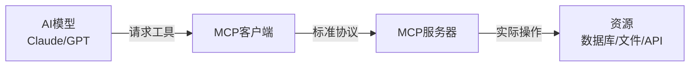

## 开场：AI助手的「能力危机」

**场景一：你问Claude**

> 你："帮我查一下公司数据库里上个月的销售数据"  
> Claude："抱歉，我无法直接访问数据库..."

**场景二：你问ChatGPT**

> 你："读取我桌面上的report.pdf并总结"  
> ChatGPT："我无法访问您的本地文件..."

**问题来了**：这些AI明明这么聪明，为什么连最基本的「读文件」「查数据库」都做不到？

**答案**：不是它们不够聪明，而是缺少「工具」。

就像一个天才厨师，如果厨房里没有刀、锅、灶，也做不出美食。

---

## 第一章：MCP协议是什么？

### 1.1 一句话解释

**MCP (Model Context Protocol)** = AI模型的「USB接口标准」

就像USB让所有设备都能连接电脑一样，MCP让所有工具都能连接AI。

### 1.2 没有MCP之前的世界

每个AI应用都要自己实现工具集成：

```python
# 开发者A的实现
class ClaudeWithDatabase:
    def query_db(self, sql):
        # 自己写数据库连接逻辑
        conn = psycopg2.connect(...)
        # 自己写SQL执行逻辑
        cursor.execute(sql)
        # 自己写结果格式化
        return format_results(...)

# 开发者B的实现（完全不同）
class GPTWithDatabase:
    def db_query(self, query):
        # 又要重新实现一遍
        engine = create_engine(...)
        # 完全不同的接口
        return engine.execute(query)
```

**问题**：
- ❌ 每个开发者都要重复造轮子
- ❌ 工具无法在不同AI之间复用
- ❌ 维护成本极高

### 1.3 有了MCP之后

```python
# 任何AI都可以使用同一个MCP服务器
from mcp import Client

# 连接到数据库MCP服务器
client = Client("postgresql://localhost:5432/mydb")

# Claude使用
claude_response = claude.chat(
    "查询上月销售数据",
    tools=[client]  # 直接传入MCP客户端
)

# GPT使用（完全相同的方式）
gpt_response = gpt.chat(
    "查询上月销售数据",
    tools=[client]  # 同一个工具！
)
```

**优势**：
- ✅ 一次开发，到处使用
- ✅ 工具可以在不同AI之间共享
- ✅ 标准化接口，易于维护

---

## 第二章：MCP的核心架构

### 2.1 三个角色



**角色说明**：

1. **AI模型（Host）**：发起请求的"大脑"
2. **MCP客户端（Client）**：AI和工具之间的"翻译官"
3. **MCP服务器（Server）**：实际执行操作的"工具箱"

### 2.2 通信流程

```python
# 完整的MCP通信示例
class MCPCommunicationFlow:
    def demonstrate(self):
        # Step 1: AI发现可用工具
        tools = mcp_client.list_tools()
        # 返回: [
        #   {"name": "query_database", "description": "查询PostgreSQL数据库"},
        #   {"name": "read_file", "description": "读取本地文件"},
        # ]
        
        # Step 2: AI选择并调用工具
        result = mcp_client.call_tool(
            name="query_database",
            arguments={
                "sql": "SELECT * FROM sales WHERE month = '2025-11'"
            }
        )
        
        # Step 3: MCP服务器执行并返回结果
        # result = {
        #   "content": [
        #     {"type": "text", "text": "找到123条记录"},
        #     {"type": "resource", "uri": "db://sales/2025-11"}
        #   ]
        # }
        
        # Step 4: AI处理结果并回复用户
        return ai_model.generate_response(result)
```

### 2.3 协议规范

MCP使用**JSON-RPC 2.0**作为通信协议：

```json
// 请求示例
{
  "jsonrpc": "2.0",
  "id": 1,
  "method": "tools/call",
  "params": {
    "name": "query_database",
    "arguments": {
      "sql": "SELECT COUNT(*) FROM users"
    }
  }
}

// 响应示例
{
  "jsonrpc": "2.0",
  "id": 1,
  "result": {
    "content": [
      {
        "type": "text",
        "text": "总用户数: 1,234,567"
      }
    ]
  }
}
```

---

## 第三章：实战——搭建你的第一个MCP服务器

### 3.1 最简单的例子：文件读取服务器

```python
# file_server.py
from mcp.server import Server
from mcp.types import Tool, TextContent
import os

# 创建MCP服务器
app = Server("file-reader")

# 定义工具
@app.list_tools()
async def list_tools():
    return [
        Tool(
            name="read_file",
            description="读取本地文件内容",
            inputSchema={
                "type": "object",
                "properties": {
                    "path": {
                        "type": "string",
                        "description": "文件路径"
                    }
                },
                "required": ["path"]
            }
        )
    ]

# 实现工具逻辑
@app.call_tool()
async def call_tool(name: str, arguments: dict):
    if name == "read_file":
        path = arguments["path"]
        
        # 安全检查
        if not os.path.exists(path):
            return [TextContent(
                type="text",
                text=f"错误：文件 {path} 不存在"
            )]
        
        # 读取文件
        with open(path, 'r', encoding='utf-8') as f:
            content = f.read()
        
        return [TextContent(
            type="text",
            text=f"文件内容：\n{content}"
        )]

# 启动服务器
if __name__ == "__main__":
    app.run()
```

**运行服务器**：

```bash
python file_server.py
# MCP服务器启动在 stdio://
```

### 3.2 在Claude Desktop中使用

编辑Claude Desktop配置文件：

```json
// ~/Library/Application Support/Claude/claude_desktop_config.json
{
  "mcpServers": {
    "file-reader": {
      "command": "python",
      "args": ["/path/to/file_server.py"]
    }
  }
}
```

**重启Claude Desktop，现在你可以**：

> 你："读取我桌面上的report.txt"  
> Claude："好的，让我读取文件... [调用read_file工具] ...文件内容是：..."

🎉 **成功！Claude现在可以读取本地文件了！**

### 3.3 进阶：数据库查询服务器

```python
# database_server.py
from mcp.server import Server
from mcp.types import Tool, TextContent, Resource
import psycopg2
import pandas as pd

app = Server("postgres-query")

# 数据库连接配置
DB_CONFIG = {
    "host": "localhost",
    "database": "myapp",
    "user": "postgres",
    "password": "secret"
}

@app.list_tools()
async def list_tools():
    return [
        Tool(
            name="query_database",
            description="执行SQL查询并返回结果",
            inputSchema={
                "type": "object",
                "properties": {
                    "sql": {
                        "type": "string",
                        "description": "SQL查询语句"
                    },
                    "format": {
                        "type": "string",
                        "enum": ["table", "json", "markdown"],
                        "description": "返回格式",
                        "default": "markdown"
                    }
                },
                "required": ["sql"]
            }
        ),
        Tool(
            name="list_tables",
            description="列出数据库中的所有表",
            inputSchema={"type": "object", "properties": {}}
        )
    ]

@app.call_tool()
async def call_tool(name: str, arguments: dict):
    conn = psycopg2.connect(**DB_CONFIG)
    
    try:
        if name == "list_tables":
            # 查询所有表
            df = pd.read_sql("""
                SELECT table_name 
                FROM information_schema.tables 
                WHERE table_schema = 'public'
            """, conn)
            
            tables = df['table_name'].tolist()
            return [TextContent(
                type="text",
                text=f"数据库表：\n" + "\n".join(f"- {t}" for t in tables)
            )]
        
        elif name == "query_database":
            sql = arguments["sql"]
            format_type = arguments.get("format", "markdown")
            
            # 执行查询
            df = pd.read_sql(sql, conn)
            
            # 格式化输出
            if format_type == "markdown":
                result = df.to_markdown(index=False)
            elif format_type == "json":
                result = df.to_json(orient="records", indent=2)
            else:
                result = str(df)
            
            return [TextContent(
                type="text",
                text=f"查询结果（{len(df)}行）：\n{result}"
            )]
    
    finally:
        conn.close()

if __name__ == "__main__":
    app.run()
```

**使用效果**：

> 你："我们数据库里有哪些表？"  
> Claude：[调用list_tables] "数据库中有以下表：users, orders, products..."
>
> 你："查询上个月订单总额"  
> Claude：[调用query_database] "上个月订单总额为 ¥1,234,567..."

---

## 第四章：MCP的「杀手级」应用场景

### 4.1 场景一：智能数据分析助手

```python
# 用户只需要说话，AI自动完成整个分析流程
用户: "分析一下我们Q4的销售趋势"

# AI的工作流程（全自动）：
1. [调用list_tables] 发现有sales表
2. [调用query_database] 查询Q4数据
3. [调用python_executor] 用pandas分析趋势
4. [调用chart_generator] 生成可视化图表
5. [返回分析报告] "Q4销售呈上升趋势，环比增长23%..."
```

**实现代码**：

```python
# analytics_server.py
@app.call_tool()
async def call_tool(name: str, arguments: dict):
    if name == "analyze_sales":
        # Step 1: 查询数据
        df = query_sales_data(arguments["period"])
        
        # Step 2: 自动分析
        insights = {
            "total": df['amount'].sum(),
            "growth": calculate_growth(df),
            "top_products": df.groupby('product')['amount'].sum().nlargest(5),
            "trend": detect_trend(df)
        }
        
        # Step 3: 生成图表
        chart_url = generate_chart(df)
        
        # Step 4: 返回结果
        return [
            TextContent(type="text", text=format_insights(insights)),
            Resource(type="image", uri=chart_url)
        ]
```

### 4.2 场景二：全能开发助手

```python
# 开发者的梦想：AI能直接操作代码库
用户: "帮我重构auth模块，添加OAuth支持"

# AI的操作：
1. [调用git_server] 创建新分支 feature/oauth
2. [调用file_server] 读取现有auth代码
3. [调用code_generator] 生成OAuth实现
4. [调用file_server] 写入新代码
5. [调用test_runner] 运行测试
6. [调用git_server] 提交并推送
7. [返回] "重构完成，所有测试通过，PR已创建"
```

**MCP服务器组合**：

```json
{
  "mcpServers": {
    "git": {
      "command": "mcp-git-server"
    },
    "filesystem": {
      "command": "mcp-file-server",
      "args": ["--root", "/Users/dev/myproject"]
    },
    "test-runner": {
      "command": "mcp-pytest-server"
    }
  }
}
```

### 4.3 场景三：企业知识库问答

```python
# 连接公司所有数据源
用户: "上季度客户投诉最多的问题是什么？"

# AI自动整合多个数据源：
1. [调用jira_server] 查询工单系统
2. [调用slack_server] 搜索客服频道
3. [调用database_server] 查询CRM数据
4. [调用confluence_server] 检索知识库
5. [综合分析] "最多的投诉是配送延迟（占37%），主要原因是..."
```

---

## 第五章：MCP生态系统

### 5.1 官方MCP服务器

Anthropic已经提供了一些开箱即用的服务器：

| 服务器 | 功能 | 使用场景 |
|--------|------|----------|
| `@modelcontextprotocol/server-filesystem` | 文件系统访问 | 读写本地文件 |
| `@modelcontextprotocol/server-github` | GitHub集成 | 管理仓库、PR、Issues |
| `@modelcontextprotocol/server-postgres` | PostgreSQL | 数据库查询 |
| `@modelcontextprotocol/server-brave-search` | 网络搜索 | 实时信息检索 |
| `@modelcontextprotocol/server-slack` | Slack集成 | 发送消息、查询历史 |

**安装使用**：

```bash
# 安装官方服务器
npm install -g @modelcontextprotocol/server-github

# 配置到Claude Desktop
{
  "mcpServers": {
    "github": {
      "command": "mcp-server-github",
      "env": {
        "GITHUB_TOKEN": "your_token_here"
      }
    }
  }
}
```

### 5.2 社区MCP服务器

开源社区已经创建了大量服务器：

```python
# 一些有趣的社区服务器
awesome_mcp_servers = [
    "mcp-server-notion",      # Notion笔记集成
    "mcp-server-gmail",       # Gmail邮件管理
    "mcp-server-calendar",    # Google Calendar
    "mcp-server-docker",      # Docker容器管理
    "mcp-server-kubernetes",  # K8s集群操作
    "mcp-server-aws",         # AWS云服务
    "mcp-server-stripe",      # 支付处理
    "mcp-server-openai",      # OpenAI API封装
]
```

### 5.3 创建自己的MCP服务器

**Python版本**：

```bash
pip install mcp
mcp create my-server
cd my-server
# 编辑 server.py
python server.py
```

**TypeScript版本**：

```bash
npm create @modelcontextprotocol/server my-server
cd my-server
# 编辑 src/index.ts
npm run build
npm start
```

---

## 第六章：MCP vs 其他方案

### 6.1 对比表

| 方案 | 优点 | 缺点 | 适用场景 |
|------|------|------|----------|
| **MCP** | 标准化、可复用、生态丰富 | 相对新，文档还在完善 | 需要多工具集成的AI应用 |
| **Function Calling** | 简单直接 | 每个AI都要单独实现 | 简单的单一工具调用 |
| **LangChain Tools** | 成熟的框架 | 绑定LangChain生态 | LangChain项目 |
| **自定义API** | 完全控制 | 开发成本高，难复用 | 特殊需求 |

### 6.2 什么时候用MCP？

✅ **适合使用MCP**：
- 需要集成多个工具（数据库+文件+API）
- 希望工具可以在不同AI之间复用
- 构建企业级AI应用
- 需要标准化的工具接口

❌ **不适合使用MCP**：
- 只需要一个简单的API调用
- 项目已经深度绑定其他框架
- 对性能有极致要求（MCP有一定开销）

---

## 第七章：最佳实践

### 7.1 安全性

```python
# ❌ 危险：直接执行用户SQL
@app.call_tool()
async def call_tool(name: str, arguments: dict):
    sql = arguments["sql"]
    return execute_sql(sql)  # SQL注入风险！

# ✅ 安全：参数化查询 + 权限控制
@app.call_tool()
async def call_tool(name: str, arguments: dict):
    # 1. 验证用户权限
    if not user.has_permission("query_database"):
        return [TextContent(type="text", text="权限不足")]
    
    # 2. 白名单检查
    allowed_tables = ["users", "orders", "products"]
    if not all(table in allowed_tables for table in extract_tables(sql)):
        return [TextContent(type="text", text="不允许查询该表")]
    
    # 3. 参数化查询
    sql = arguments["sql"]
    params = arguments.get("params", [])
    return execute_safe_sql(sql, params)
```

### 7.2 错误处理

```python
@app.call_tool()
async def call_tool(name: str, arguments: dict):
    try:
        # 执行操作
        result = perform_operation(arguments)
        return [TextContent(type="text", text=result)]
    
    except FileNotFoundError as e:
        # 友好的错误提示
        return [TextContent(
            type="text",
            text=f"❌ 文件不存在：{e.filename}\n建议：检查文件路径是否正确"
        )]
    
    except PermissionError:
        return [TextContent(
            type="text",
            text="❌ 权限不足\n建议：使用sudo或检查文件权限"
        )]
    
    except Exception as e:
        # 记录详细错误日志
        logger.error(f"MCP tool error: {e}", exc_info=True)
        # 返回用户友好的错误
        return [TextContent(
            type="text",
            text=f"❌ 操作失败：{str(e)}"
        )]
```

### 7.3 性能优化

```python
# 使用缓存减少重复查询
from functools import lru_cache

@lru_cache(maxsize=100)
def query_database(sql: str):
    # 相同的SQL查询会被缓存
    return execute_sql(sql)

# 异步处理提高并发
import asyncio

@app.call_tool()
async def call_tool(name: str, arguments: dict):
    # 并行执行多个操作
    results = await asyncio.gather(
        query_database(sql1),
        query_database(sql2),
        read_file(path)
    )
    return combine_results(results)
```

---

## 第八章：未来展望

### 8.1 MCP的发展方向

```python
# 2025年：基础工具集成
current_capabilities = [
    "文件系统访问",
    "数据库查询",
    "API调用",
    "Git操作"
]

# 2026年预测：更智能的工具
future_capabilities = [
    "自动工具组合（AI自己决定调用哪些工具）",
    "工具学习（根据使用反馈优化工具行为）",
    "跨服务器协作（多个MCP服务器协同工作）",
    "实时数据流（WebSocket支持）",
    "工具市场（一键安装社区工具）"
]
```

### 8.2 可能的应用场景

**场景一：全自动运维**

```python
用户: "网站响应变慢了"

AI自动执行：
1. [调用monitoring_server] 检查服务器指标
2. [调用log_server] 分析错误日志
3. [调用database_server] 检查慢查询
4. [调用docker_server] 重启有问题的容器
5. [调用slack_server] 通知团队

结果: "已自动修复，原因是数据库连接池耗尽"
```

**场景二：智能客服**

```python
客户: "我的订单怎么还没发货？"

AI自动处理：
1. [调用crm_server] 查询客户信息
2. [调用order_server] 查询订单状态
3. [调用logistics_server] 查询物流信息
4. [调用email_server] 发送更新邮件
5. [调用ticket_server] 创建跟进工单

回复: "您的订单已在配送中，预计明天送达"
```

---

## 结语：MCP的意义

**MCP不仅仅是一个协议，它代表了AI应用开发的范式转变**：

### 从「AI是工具」到「AI用工具」

**以前**：
```
人类 → 使用AI → 获得答案
```

**现在**：
```
人类 → 告诉AI目标 → AI使用工具 → 完成任务
```

### 开发者的新机会

```python
# 以前：开发AI应用很难
def build_ai_app():
    学习LLM API ✅
    + 实现工具集成 ❌ (难)
    + 处理错误和边界情况 ❌ (难)
    + 维护和更新 ❌ (难)
    = 放弃 😭

# 现在：使用MCP很简单
def build_ai_app_with_mcp():
    学习LLM API ✅
    + 安装MCP服务器 ✅ (简单)
    + 配置JSON文件 ✅ (简单)
    = 成功 🎉
```

### 最后的思考

**MCP的本质是「标准化」**。

就像USB标准让所有设备都能连接电脑，MCP让所有工具都能连接AI。

**这意味着**：
- 🔧 开发者可以专注于创造工具，而不是重复集成
- 🤖 AI可以使用越来越多的工具，变得越来越强大
- 👥 用户可以用自然语言完成复杂任务，无需学习技术细节

**MCP正在构建AI的「工具生态系统」**，就像App Store之于iPhone。

---

**快速开始**：

```bash
# 1. 安装MCP SDK
pip install mcp

# 2. 创建你的第一个服务器
mcp create my-first-server

# 3. 在Claude Desktop中配置
# 编辑 ~/Library/Application Support/Claude/claude_desktop_config.json

# 4. 开始使用！
```

**相关资源**：
- [MCP官方文档](https://modelcontextprotocol.io/)
- [MCP GitHub仓库](https://github.com/modelcontextprotocol)
- [MCP服务器列表](https://github.com/modelcontextprotocol/servers)
- [MCP Python SDK](https://github.com/modelcontextprotocol/python-sdk)

---

**你会用MCP做什么？**

评论区分享你的想法！👇

可能的方向：
- 🏢 企业内部知识库
- 🎮 游戏NPC智能化
- 📊 自动化数据分析
- 🏠 智能家居控制
- 💼 个人效率工具

**MCP的时代才刚刚开始。**
