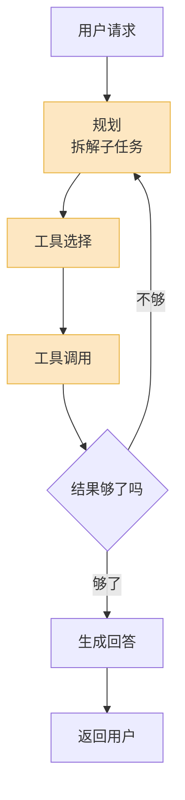
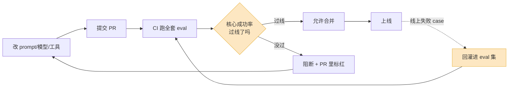

用一个下午就能搭出一个像样的 Agent demo。接个大模型、写几个工具、调通 ReAct 循环,跑十条 case,全过。截图发群里,大家鼓掌。

两周后,一个客户在工单里贴出对话记录:你的 Agent 把退款金额算成了原价的三倍,还信誓旦旦地说"已为您处理"。你翻监控面板——CPU 正常、接口 P99 40ms、错误率 0.02%,一片绿。

这就是 Agent 工程里最反直觉的地方:**搭出来是最简单的一步,知道它到底好不好,才是真正的工程**。传统软件你写完测试、跑通 CI,基本就放心了;Agent 不行——它每次的输出都不一样,它"出错"的方式根本不会触发任何异常。这篇讲讲上线之后那部分:看什么指标、怎么评、怎么防回归。

## 为什么你那套监控不管用

先说清楚传统监控为什么在这里失灵。

传统软件的故障是**二值**的:要么 200,要么 500;要么返回了,要么超时了。你的告警系统盯着这些信号,出事就响。Agent 的故障是**语义**的:HTTP 200,JSON 合法,字段齐全,延迟正常——内容是错的。Agent 自信地编了一个不存在的退货政策,调了正确的工具但传错了参数,绕了七步才完成一件三步能干完的事。这些在传统监控眼里全是"成功请求"。

更麻烦的是 Agent 是**非确定性**的。同样一句"帮我查下上个月的账单",今天它走两步给出答案,明天可能走五步还问你要确认。你没法用"输入 X 必然输出 Y"来断言。所以 Agent 的评估,本质上是在做**概率系统的质量管理**——你管的不是单次对错,是一个分布。

还有一层:Agent 是**多步**的。一次任务里,规划器把目标拆成子步骤,工具选择器挑了几个工具,检索器拉了上下文,模型可能还重试了两次,最后才有一个回答。出了问题,你得知道是哪一步坏的。只盯着最终输出,等于只看考试总分不看错题——你知道它考砸了,但不知道为什么。

橙色那三块——规划、选工具、调工具——是 Agent 区别于"一次 LLM 调用"的地方,也是大多数故障的发生地。你的可观测性必须能看进这三块,而不只是看进出。

## Agent 该盯哪几个指标

把指标分成两类:**业务结果**和**过程健康**。前者回答"它有没有把事办成",后者回答"它办事的姿势对不对"。

| 指标 | 它在说什么 | 不正常时意味着 |
|---|---|---|
| 任务成功率 | 用户的目标到底达成了没 | 这是北极星,其他指标都为它服务 |
| 步数 / 轮次 | 完成一个任务走了几步 | 步数飙升 = 规划在打转或工具在失败重试 |
| 工具调用错误率 | 工具调用里失败的比例 | 区分"参数错"和"工具本身挂了" |
| Token 消耗 | 单次任务烧掉多少 token | 直接对应成本,也是绕路的信号 |
| 端到端延迟 | 用户从发问到拿到结果等了多久 | 多步 Agent 的延迟是各步之和,会累 |
| 工具选择准确率 | 该用 A 工具时它是不是用了 A | 选错工具,后面全错 |

几个容易踩的点。

**任务成功率不能自己定义。** "成功"必须从用户视角定:用户想退款,Agent 走完全流程、退款到账才算成功;它礼貌地回了一大段话但没退成,是失败。很多团队把"流程跑完没报错"当成功,这是自欺。

**步数和 token 是一对孪生信号。** 它俩一起涨,通常是 Agent 陷进了"调工具—结果不满意—再调"的循环。我习惯给每个任务设一个步数上限(比如 15 步)做硬熔断,然后把"步数分布"画成直方图——你要看的不是平均值,是那条长尾。平均 4 步很健康,但如果有 5% 的任务走到 20 步,那 5% 就是你的成本黑洞和体验灾难。

**工具调用错误率要拆开看。** "模型给工具传了非法参数"和"工具后端 500 了"是两种完全不同的病:前者是模型的问题,要改 prompt 或工具描述;后者是依赖的问题,要改基础设施。混在一个数字里,你永远不知道该修哪。OpenTelemetry 的 GenAI 语义约定(2026 年仍是 experimental,但已经是事实标准)专门为 `execute_tool` span 和 `error.type` 留了字段,就是为了让你能这样拆。

## 离线评估:上线前的"单元测试"

离线评估,就是给 Agent 写单元测试。核心是一个 **eval 集**:一批输入,配上你认可的"理想行为"。每次改了 prompt、换了模型、调了工具描述,先拿这批 case 跑一遍,看分数有没有掉。

eval 集怎么来,决定了它有没有用。**别凭空想象 case,要从真实流量里捞。** 一个我反复验证的做法:每周翻线上 trace,把失败的、用户追问的、绕路的对话挑出来,清洗成 eval case。你的 eval 集应该是你**踩过的坑的合集**,而不是产品经理拍脑袋写的"理想用户故事"。理想故事永远通过,真实的坑才暴露问题。

Agent 的离线评估比纯 LLM 难,难在要评**轨迹(trajectory)**,不只是评最终答案。Google 的 ADK 把这件事说得很直白:一个 golden case 要同时记两样东西——**理想的工具调用序列**和**理想的最终回答**。于是你能分别打两类分:

- **轨迹分**:它选的工具对不对、顺序合不合理、有没有多余的步骤。轨迹可以严格比对(必须和 golden 完全一致),也可以宽松比对(关键工具调到就行)。
- **结果分**:最终回答对不对、全不全。

为什么要分开?因为一个 Agent 可能"答对了但过程很糟"——瞎试了八个工具碰巧蒙对。这种 case 结果分满分,轨迹分很低。你要是只看结果分,就会把一个脆弱的、纯靠运气的 Agent 当成好 Agent 放上线。

一条实用纪律:**如果你的 eval 集通过率是 100%,那不是你的 Agent 完美,是你的 eval 太简单了。** 健康的 eval 集应该一直留着几条过不了的 case,逼着你持续改进。通过率到顶的那天,就是该往里加硬 case 的那天。

## 在线观测:用 trace 还原现场

离线评估管"上线前",在线观测管"上线后"。核心工具是 **trace**——把一次完整任务里的每一步都记下来:每次 LLM 调用的输入输出和 token,每次工具调用的参数和返回,每一步的耗时。出了问题,你能像看录像回放一样把现场还原出来。

观测的粒度分三层,这个分层很关键:

- **Span 级**:单个步骤。定位"哪一步坏了"——是第三次工具调用传错了参数。
- **Trace 级**:一次完整任务。判断"整件事办成了没"。
- **Session 级**:跨多轮对话的一整个会话。评估"这个用户这一次来,体验到底如何"。

值得提醒的一点:早期那批 observability 工具(Langfuse、LangSmith、Braintrust、W&B Weave)最初都是为"监控 LLM 调用"设计的,后来才扩展去支持 Agent——而它们处理 Agent 的方式,常常是把 Agent 当成"一串 LLM 调用",而不是当成"一个有目标、有结果的会话"。这个出身决定了你用它们时要多留个心眼:**别让工具默认的视角把你带偏到只看单次调用,你真正要回答的是 trace 级和 session 级的问题。**

2026 年这个领域的工具已经分化得比较清楚,选型可以这么看:

| 工具 | 适合谁 | 特点 |
|---|---|---|
| Langfuse | 想自托管、要开源、在意数据主权 | 开源标杆,无按席位收费;2026 年 1 月被 ClickHouse 收购 |
| LangSmith | 技术栈是 LangChain / LangGraph | 和自家框架咬合最紧,接入几乎零开销 |
| Braintrust | 重视 eval 工程、要把 eval 卡进 CI | 免费额度大方,CI 门禁工作流最成熟 |
| Arize Phoenix | 想要开源 + 偏 ML 团队习惯 | 基于 OpenTelemetry,可观测性血统正 |
| AgentOps | 多框架混用、重在调试多 Agent | 多框架 Agent 调试能力强 |

不用纠结选哪个"最好"。务实的选法:**先确认它原生支持 OpenTelemetry GenAI 语义约定**,这样你不会被锁死,以后换工具数据能带走。然后看它的出身和你的技术栈合不合。能自托管、数据敏感就 Langfuse;深度用 LangChain 就 LangSmith;eval 是核心工作流就 Braintrust。

## 谁来打分:人审还是 LLM-as-judge

trace 有了,你还得给每条 trace 打分,才知道质量是涨是跌。打分有三种人:规则、人、和另一个大模型。

**能用规则就用规则。** 凡是确定性的检查——延迟有没有超标、JSON schema 合不合法、token 有没有爆预算、有没有调到那个必须调的工具——全用代码硬判。规则评估快、不要钱、结果稳定,能用规则的地方绝不要上模型。这是省钱省心的第一原则。

**剩下的"质量"问题,人审最准但最贵。** 回答的语气专不专业、有没有答非所问、逻辑通不通——这些目前只有人能可靠地判断。人审是你所有评估的**真相来源(ground truth)**,但你不可能让人审每天几十万条对话。所以人审的正确用法是**抽样**:每天抽一两百条,尤其抽那些自动评估打了低分或者落在边界上的。

**规模化只能靠 LLM-as-judge**——用一个大模型当裁判,按 rubric 给另一个 Agent 的输出打分。但这东西用不好就是自我安慰,几条铁律:

1. **先校准,再信任。** 上线一个 judge 前,拿它跑那批人审过的 golden case,看它和人的判断一致率。业界经验是要做到 **75%–90% 一致**才能用。没校准过的 judge,它给的分只是"看起来很科学的噪声"。
2. **rubric 要具体到能打钩。** 别问 judge"这个回答好不好",要给明确标准:"是否引用了知识库里的真实政策?是否直接回答了用户的问题?有没有编造金额?"评判标准越像一张检查清单,judge 越稳。
3. **judge 喂的输入要对。** 评轨迹就把完整 trace 给它,评回答质量就只给它问题和回答。喂错了上下文,分数就废了。
4. **警惕 judge 被骗。** 2026 年初已经有研究(arXiv 上《Gaming the Judge》)指出:Agent 可以生成一段"看起来很有道理但其实不忠实"的推理,把 LLM judge 哄过去。所以高风险场景下,judge 的结论仍然要被人审抽查兜底。

我的分工建议很简单:**规则做体检(确定性指标),LLM-as-judge 做日常巡检(规模化、覆盖全量),人审做权威诊断(抽样、校准 judge、定真相)。** 三层各管各的,谁也别越位。

## 回归:别让今天的修复变成明天的故障

Agent 最阴险的回归是这样发生的:用户报了个 bug,你改了 prompt 把它修好了,上线。三周后另一类对话开始出问题——你那次改 prompt,顺手把另一种场景搞坏了。Prompt 是全局生效的,改一个字,影响面没人说得清。

防回归的办法,是把 eval 集变成 Agent 的**回归测试套件,并且卡进 CI**。

具体做法:每次提交改动(改 prompt、换模型、调工具),CI 自动跑全套 eval 集,把分数和主干基线逐条对比。Braintrust 的 GitHub Action、Promptfoo 这类工具已经把这条路铺好了——它会在 PR 里直接贴一张表,哪个 case 的哪个评分项涨了(🟢)、哪个跌了(🔴),一目了然。

关键是**门禁(quality gate)**:设一条线,核心 case 的成功率掉破阈值,这个 PR 就不许合。这一步把"上线后被用户发现回归"前移成了"提 PR 时就被 CI 拦下"。从一次线上事故,变成一次代码评审里的红叉——成本差着好几个数量级。

注意图里那条虚线:**线上抓到的新失败,要回灌进 eval 集。** 这是整个闭环里最容易被偷懒省掉、但最值钱的一步。每修一个线上 bug,顺手把它变成一条 eval case——这样同一个坑,你这辈子只会踩一次。eval 集不是写一次就完的资产,它是跟着你的线上事故一起长大的。

## 最后:评估投入排个序

如果你正在做 Agent,评估和监控这块的投入,我建议这个顺序:

1. **先上 trace。** 一个看不见内部的 Agent,你连它怎么坏的都不知道,谈何优化。这是地基,而且接入成本很低。
2. **再攒 eval 集。** 从线上 trace 里捞真实失败 case,哪怕只有 30 条也比没有强。它会马上开始帮你。
3. **然后卡进 CI。** 把 eval 集变成回归门禁,从此改 prompt 不再是闭眼下注。
4. **最后才上 LLM-as-judge,而且必须先用人审校准。** 校准跳不得。

很多团队的顺序是反的——demo 一通就急着上线,出了事再回头补监控。但 Agent 这东西,**你对它的可观测性有多深,你能把它做多好就有多高的上限**。先让自己看得见,再谈让它变得更好。
