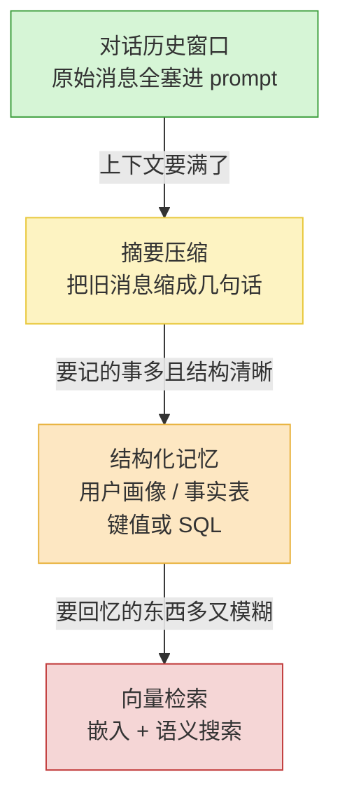

你想给 Agent 加"记忆",打开教程,第一步就是:装个向量数据库,选个嵌入模型,写分块逻辑。

我见过太多团队这么干,然后卡在"为什么它检索出来的东西牛头不对马嘴"上,卡好几周。

这里有个反常识的事实:2026 年真正在干活的 Agent——Claude Code、Cursor、Devin——它们理解你的代码库,靠的是 `grep`、读文件树、`find`,**不是向量库**。一个能调试整个工程的 Agent 都不需要语义检索,你那个客服机器人凭什么需要?

记忆不是一个"功能",是一条**演进路径**。绝大多数 Agent 走到第二级、第三级就够用了一辈子。向量库是这条路的终点,不是起点——而且很多人这辈子都到不了终点,也不需要到。

## 这条路长什么样



绿色那级,90% 的 Agent 起步就够用。每往下一级,复杂度都明显涨一档。**升级的触发条件很具体,不是"感觉该升了"就升。** 下面一级一级讲。

## 第一级:对话历史窗口,够用就别折腾

最朴素的记忆:把这轮对话的所有消息,原封不动塞进 prompt。用户说一句、Agent 答一句,全在上下文里。

听起来太简单了,简单到不像"记忆系统"。但你得算一笔账:2026 年主流模型的上下文窗口普遍 20 万 token 起步,长的到 100 万。一轮普通的客服对话、一次代码调试会话、一场旅行规划,撑死了几千到几万 token。**整段对话原样塞进去,窗口连一半都用不满。**

这一级的好处不只是简单:

- **零信息损失**。模型看到的是逐字原文,不是被你提炼过、可能丢了关键细节的二手货。
- **零检索错误**。没有检索这一步,就没有"该召回的没召回""召回一堆噪音"这类问题。
- **零额外基础设施**。不用嵌入服务,不用向量库,不用同步任务。

什么时候该往下走?**只有一个信号:上下文真的要满了。** 不是"对话有点长了",是你把 token 数打出来,发现已经吃掉窗口的 60%~70%,再聊下去要溢出。在那之前,任何"我们是不是该上个记忆框架"的讨论都是过早优化。

很多人跳过这一级,是因为它"不够高级"、写进简历不好看。但工程上,能用最笨的办法解决的问题,就是该用最笨的办法。

## 第二级:摘要压缩,上下文要满了再做

对话真聊长了——多轮技术支持、一整天的结对编程、几十轮的需求澄清——窗口开始告急。这时候才轮到第二级:**把旧消息压缩掉。**

最常见的做法是滑动窗口加摘要:最近的 N 轮原样保留,更早的对话交给模型缩成一段"目前为止发生了什么"。窗口往前滚,旧的进摘要,新的留原文。

这里有个 2026 年被反复验证的细节,值得单独说:**压缩有损,而且损在哪你控制不了。** 有些框架(比如 Hermes 这类)在上下文用到 50% 时做一次有损摘要——问题是模型决定"什么重要"时,经常把你眼里的关键信息(用户那个具体的订单号、那条硬性约束)当成噪音丢掉。

所以业界现在的共识是分两手:

| 信息类型 | 怎么处理 | 为什么 |
|---|---|---|
| 对话的来龙去脉、语气、讨论过的方案 | 摘要压缩,可以有损 | 缩成几句话不影响后续对话 |
| 精确值:订单号、预算数字、硬性约束、用户明确说过的偏好 | **不准压**,单独存原值 | 压缩一旦把它改了或丢了,后面全错 |

换句话说,摘要管"对话的连续性",精确事实得另外找地方原样存着。这个"另外找地方",就自然引出了第三级。

什么时候该往下走?当你发现自己在摘要里反复想保住一些**结构清晰、需要精确、还要跨会话用**的东西——用户叫什么、他的套餐是哪个、上次工单结论是什么——这些塞在一段自由文本摘要里既不可靠又难查,该上结构化记忆了。

## 第三级:结构化记忆,键值和数据库就够

这一级常被整个跳过,直接奔向量库——这是我觉得最可惜的一跳。因为对大多数产品来说,**结构化记忆就是终点站,而且它一点都不性感,但极其好用。**

结构化记忆就是:把要长期记住的东西,存成**有 schema 的数据**。用户画像、事实表、偏好设置、关键实体——一张表、一个键值存储、一份 JSON 文档就搞定:

```
user:8842 → {
  姓名: "李工",
  套餐: "企业版 Pro",
  时区: "Asia/Shanghai",
  历史工单: [T-1021(已解决), T-1099(升级中)],
  偏好: "回复用中文,不要寒暄"
}
```

为什么这一级覆盖面这么广,值得掰开说:

**第一,大多数"记忆"本质是结构化的。** "这个用户是付费用户吗""他上次买的什么""他的语言偏好"——这些是字段查询,不是语义相似度问题。用 `SELECT` 就能精确命中的东西,套个嵌入模型去算余弦相似度,是用错工具,还更慢更不准。

**第二,它能精确更新和删除。** 用户从 Pro 降级到基础版,你 `UPDATE` 一行就行。向量库里这事是噩梦——你得找到那条陈旧的向量、删掉、重新嵌入、重新写入,中间还有一致性窗口。2026 年记忆框架(像 Mem0)反复强调"提取优于摘要",核心原因就是:**提取出来的是离散、可单独更新的事实单元**,而不是一坨没法精确改的文本。

**第三,它可解释、可审计。** 出了问题,你能直接 `SELECT` 出来看 Agent 到底记住了什么。向量召回错了,你常常连"为什么召回这条"都说不清。

实现上不用任何花活:已经在用 Postgres 的,加张表;Serverless 的,DynamoDB 或 Redis 一个 key;甚至本地 SQLite 都行——很多生产级 Agent 的短期记忆和会话历史就是一个 SQLite 文件。**别被"记忆系统"这个词唬住,它可以就是一张数据库表。**

什么时候该往下走?当你要记的东西**既多又模糊**:成百上千条没有固定 schema 的笔记、文档片段、过往对话,而且未来的查询是"用户大概问过类似这样的事吗"——你事先不知道该建什么字段,也没法用精确匹配。到这一步,才真的轮到向量检索。

## 第四级:向量检索,以及它真实的代价

先说清楚什么时候**确实**需要向量库,免得显得我一棍子打死:Agent 要在一个**大、杂、无结构**的知识池里做**模糊召回**——比如几万篇文档的企业知识库问答,或者 Agent 积累了上万条跨会话记忆、需要"按语义找相关的"。这种场景结构化查询确实无能为力,向量检索是对的工具。

但请你诚实评估:你的 Agent 真是这种场景,还是你**以为**它是?

如果确实要上,得清楚向量库不是"装个 Qdrant 就完事",它带来一整套**新的、持续的工程负担**:

- **分块(chunking)。** 文档怎么切?切太碎丢上下文,切太大召回不精准。2026 年了,分块依然是 RAG 的头号失败点。它不是配一次就好,是要持续调、持续测的活。
- **嵌入模型。** 选哪个模型、什么维度、换模型就得**全量重新嵌入**所有历史数据。嵌入服务还是一笔持续的推理成本。
- **检索质量。** 召回的真是最相关的吗?2026 年的成熟做法已经不是纯向量相似度了——得融合 BM25 关键词、实体匹配做混合检索,因为纯语义搜索在精确查询(找某个具体编号、专有名词)上经常翻车。这意味着你要搭、要调的不只一套检索。
- **陈旧数据。** 这是最阴的坑。源文档更新了,向量没跟着更新,Agent 就拿着过时信息一本正经地胡说。搜索系统里的"最终一致性"是种特殊的折磨——结果里混着几秒前就该失效的旧文档,你还很难发现。

还有个 2026 年的现实判断:**就算你真要做语义检索,大概率也不用单独的向量数据库。** 5 万维向量以下——这覆盖了 95% 的团队——Postgres 加 `pgvector` 在成本和性能上都够,还省掉了一整套额外基础设施和数据同步。把省下的精力花在更好的分块和检索逻辑上,比单独养一个向量库划算得多。真正需要专用向量数据库的,是数据量到了千万级以上、且向量检索是核心链路的产品。那是少数。

## 一张表,对号入座

| 你的情况 | 该用哪级 | 别做什么 |
|---|---|---|
| 单轮或几轮对话,窗口远没满 | 第一级:原始历史全塞进去 | 别上任何"记忆框架" |
| 对话很长,窗口告急 | 第二级:滑动窗口 + 摘要 | 别把精确值也压进摘要 |
| 要跨会话记用户是谁、买了啥、什么偏好 | 第三级:结构化记忆(表/KV) | 别用向量库存这种字段数据 |
| 要在大量无结构内容里做模糊召回 | 第四级:向量检索 | 别忘了先试 pgvector,别急着上专用库 |

这四级是**累加**的,不是替换。一个成熟 Agent 通常同时有:当前对话的原始窗口、更早对话的摘要、一张结构化的用户事实表——这三样几乎人人都该有。第四级是可选项,挂在最上面,只在确实需要模糊召回时才接。

## 最后:记忆是长出来的,不是设计出来的

回到开头。"给 Agent 加记忆"不该是一道架构题,而是一道**观察题**:

1. **先用最笨的——原始对话窗口。** 跑起来,看真实对话能聊多长。大概率你会发现根本聊不满窗口,那就到此为止。
2. **窗口真要满了,再加摘要。** 同时把精确事实(订单号、约束、偏好)单独拎出来存。
3. **要跨会话记结构清晰的事实,上一张数据库表。** 这一级能覆盖绝大多数产品,而且它无聊、可靠、好调试。
4. **只有当要回忆的东西又多又模糊时,才上向量检索。** 而且先试 `pgvector`,真到了千万级再谈专用向量库。

向量库不是 Agent 记忆的"标配",是路径终点的一个**可选项**。一上来就上向量库,你买到的不是记忆能力,是分块调参、嵌入成本、检索质量和陈旧数据这四样持续的麻烦。

让记忆跟着真实需求一级一级长出来。大多数 Agent,长到第三级就该收手了。
