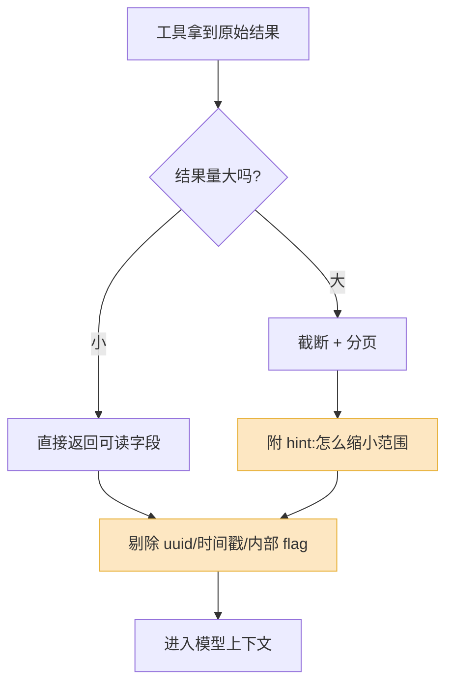

我见过一个团队为了让 Agent "更聪明",把模型从中杯换成大杯,账单翻了三倍,效果几乎没动。后来定位下来,问题出在一个叫 `query` 的工具上:它的描述只有一句"查询数据库",返回的是一坨 4000 行的 JSON,里面塞满了 `created_at_unix`、`tenant_uuid`、`row_version` 这种字段。模型不是不聪明,是它每次调用完都得在一堆噪声里捞针,然后经常捞错。

把这个工具拆成两个、描述写清楚、返回值砍掉八成,中杯模型的表现就超过了原来大杯的版本。

这不是个例。**Agent 能力的天花板,很多时候是工具设计,不是模型。** 模型是你换不动的那部分——它由 Anthropic、OpenAI 训练,你只能选型;工具是你完全能控制的那部分。把精力花在能控制的地方,回报率高得多。

Anthropic 在 2026 年那篇《Writing effective tools for AI agents》里有一句话我很认同:工具是一种新的软件形态,它是**确定性系统和非确定性 Agent 之间的契约**。你不能再按"给另一个程序员写 API"的思路写工具——调用方变了,设计原则就得跟着变。

## 工具描述:你在跟模型"招标"

模型面对一组工具,做的事情和招标差不多:读每个工具的描述,判断"这个活该派给谁"。描述写得含糊,它就选错;描述之间边界不清,它就来回横跳。

最常见的坏味道是**用实现细节代替使用场景**。

```
# 反例
{
  "name": "db_query",
  "description": "对主库执行 SQL 查询"
}

# 正例
{
  "name": "search_orders",
  "description": "按用户 ID、时间范围或订单状态查询订单。
                  用于回答'用户买过什么''某笔订单到哪了'这类问题。
                  不要用它查商品库存——那是 search_inventory 的活。"
}
```

差别在哪?反例描述的是"工具内部怎么干活"(执行 SQL),模型并不关心这个;它关心的是"什么时候该用我"。正例直接给出**触发场景**,还顺手划清了和邻居工具的边界。

这里有个容易被忽略的点:**当你有多个相似工具时,描述里必须明确"我不是谁"。** Anthropic 的建议是用命名空间区分,比如 `asana_search` 和 `jira_search`,或者更细的 `asana_projects_search`、`asana_users_search`。前缀本身就是一种边界声明。光靠名字还不够时,就在描述里直接写"查 X 用我,查 Y 请用那个工具"。

另一个实战技巧:**在描述里塞一两个使用示例**。模型在互联网文本里见过的函数,旁边大多带着调用例子,这种格式它最熟。一个 `search_orders(user_id="u_123", status="shipped")` 的示例,比三行抽象说明管用。2026 年 Anthropic 的 Claude API 干脆把这个能力产品化了,叫 Tool Use Examples——可见示例不是锦上添花,是正经手段。

## 参数:让模型"填得对",而不是"填得全"

参数设计的核心矛盾是:你想要灵活,模型想要明确。这两者经常打架,而你应该站在模型这边。

**第一,别用裸字符串当枚举。** 一个 `status` 参数,如果你在描述里写"传订单状态",模型可能传 `"已发货"`、`"shipped"`、`"SHIPPED"`、`"发货中"`——四种写法,你的代码能认几种?直接用枚举把可选值锁死:

```python
# 反例:status 是 str,模型自由发挥
def search_orders(user_id: str, status: str): ...

# 正例:枚举,模型只能在合法值里选
from enum import Enum
class OrderStatus(str, Enum):
    PENDING = "pending"
    SHIPPED = "shipped"
    DELIVERED = "delivered"
    CANCELLED = "cancelled"

def search_orders(user_id: str, status: OrderStatus | None = None): ...
```

**第二,能有默认值就别让模型填。** 每多一个必填参数,就多一个模型出错的机会。分页的 `page_size`、排序的 `order_by`,给个合理默认值,模型大多数时候根本不用碰它。

**第三,警惕"看起来很像"的参数。** 一个工具同时收 `start_date` 和 `end_date`,模型偶尔会填反。如果业务允许,合并成一个 `time_range` 枚举(`last_7_days`、`last_30_days`、`this_month`)往往更稳——你把"理解日期区间"这件事从模型手里拿回来了。当然,需要精确区间时该用两个还得用两个,这是取舍,不是教条。

一个判断标准:**如果一个参数,你自己都要想三秒才知道该填什么,模型只会比你更糊涂。**

## 返回值:给模型能用的信息,不是给它一份数据库导出

这是我见过踩坑最多的地方,值得单独讲。

工具的返回值会**原封不动进入模型的上下文窗口**。这意味着两件事:一是它占 token,占的还是最贵的那部分;二是模型要从里面提取信息做下一步决策。所以返回值的设计目标只有一个——**高信噪比**。

反例长这样:

```json
{
  "data": [{
    "order_id": "ord_8f3a2b1c-9d4e-4f5a-8b6c-1d2e3f4a5b6c",
    "tenant_uuid": "tn_a1b2c3d4",
    "created_at_unix": 1747300800,
    "updated_at_unix": 1747387200,
    "row_version": 7,
    "status_code": 2,
    "_internal_flags": { "is_migrated": true, "shard": 3 }
  }]
}
```

模型看到这个,得自己去想:`status_code: 2` 是什么意思?`created_at_unix` 怎么换算成人话?`tenant_uuid` 要不要在下一步带上?这些都是噪声,而且每一条都是潜在的出错点。

Anthropic 的原则说得很直白:**返回人类可读的字段,别返回底层技术标识符。** `name`、`status`、`created_at`(写成可读时间)这种字段能直接指导模型的下一步动作;`uuid`、`mime_type`、`row_version` 不能,它们只是占地方。

正例:

```json
{
  "orders": [{
    "id": "ord_8f3a2b1c",
    "status": "shipped",
    "created_at": "2026-05-15 14:00",
    "total": "¥299.00",
    "items_summary": "无线耳机 x1"
  }],
  "total_count": 47,
  "showing": "1-10",
  "hint": "还有 37 条,加 status 或更窄的时间范围可缩小结果"
}
```

注意最后那个 `hint` 字段。**返回值不只是数据,也是给模型的下一步提示。** 当结果太多时,与其返回 47 条把上下文撑爆,不如返回 10 条加一句"还有 37 条,这样筛"。Anthropic 把这类机制叫分页、范围过滤、截断,核心思想一致:别让模型被数据淹没,主动引导它做更窄、更省 token 的查询。

下面这张图是返回值设计的取舍:



橙色那两块——**剔除噪声字段**和**附带引导提示**——是最容易省略、又最影响效果的环节。

## 错误怎么回:错误信息是给模型的"操作手册"

工具调用失败是常态,不是异常。模型填错参数、查的资源不存在、触发了限流——这些每天都在发生。真正决定 Agent 韧性的,是**出错之后它能不能自己爬起来**。而它能不能爬起来,取决于你的错误信息写成什么样。

反例:

```python
raise ValueError("Invalid input")          # 模型:啥 input?哪儿错了?
return {"error": "ERR_4012"}                 # 模型:4012 是什么我怎么知道
raise Exception(traceback...)                # 模型:吞掉半屏 token,然后还是不知道咋办
```

这三种回法的共同问题是:**模型读完不知道下一步该干什么。** 它要么放弃,要么用同样的错参数原样重试,卡进死循环。

好的错误信息要满足一个标准——**模型读完就知道怎么改**:

```python
# 正例:说清错在哪 + 给出可执行的下一步
return {
  "error": "参数 status 的值 '发货中' 不合法",
  "valid_values": ["pending", "shipped", "delivered", "cancelled"],
  "hint": "你可能想用 'shipped'"
}

return {
  "error": "未找到 user_id 'u_999' 对应的用户",
  "hint": "确认 ID 是否正确,或先用 search_users 按用户名查到 ID"
}
```

Anthropic 的说法是:你可以**对错误信息做提示工程**,把它写成清晰、可执行的改进建议,而不是不透明的错误码或堆栈。一条好的错误信息会顺手告诉模型"下一步该调哪个工具"——上面那个 `search_users` 的提示就是。这等于把错误信息也当成了引导模型的一个入口。

还有个常被忽略的点:**错误也要省 token。** 别把整个 Python traceback 塞回去,那几百个 token 对模型几乎没有信息价值。给一句人话就够了。

## 工具粒度:太细太粗都不行

最后一个,也是最难的——工具切多大。

**切太细的坑。** 把 `get_user`、`get_user_orders`、`get_order_detail` 拆成三个独立工具,听起来很"单一职责"。但 Agent 要回答"用户最近这单到哪了",得连着调三次:第一次拿 user,第二次拿 order 列表,第三次拿 detail。三次往返,三段返回值堆进上下文,任何一步选错都得重来。**工具太细,模型就被迫去干编排的活,而编排正是它最容易出错的地方。**

**切太粗的坑。** 反过来做一个万能的 `manage_order`,靠一个 `action` 参数切换"查询/创建/退款/改地址"。模型每次都要先想清楚 `action` 填什么、对应又该带哪些参数,描述也长得没法读。而且一个工具权限太大,审计和兜底都难做——你没法只给某个 Agent "查询"权限而不给"退款"权限。

我的经验法则是:**按"用户意图"切,不按"数据库表"切,也不按"一个超级动作"切。**

| 切法 | 例子 | 问题 |
|---|---|---|
| 按表切(太细) | `get_user` / `get_orders` / `get_items` | 模型被迫多次编排,易错 |
| 按超级动作切(太粗) | `manage_order(action=...)` | 参数耦合、描述爆炸、权限难控 |
| **按意图切(推荐)** | `get_order_status(order_id)` 一次返回订单+物流+商品摘要 | 一次调用解决一个完整问题 |

判断方法很简单:**想象一个真实的用户问题,数一数 Agent 要调几次工具才能答上。** 如果一个常见问题要调四五次,你的工具大概率切太细了;如果一个工具的描述你得写满一屏才说得清,那它八成切太粗了。

Anthropic 反复强调的"evaluation-driven development"在这里特别管用:先拿真实任务跑一批评测,看 Agent 卡在哪、绕了多少弯路,再回头调工具的粒度。工具设计不是一次写对的,是测出来、改出来的。

## 几条收尾的话

把上面的拆开看是五个话题,合起来其实是一个视角的转变:**你不是在给程序写接口,你是在给一个会读字、会犯错、上下文有限的"实习生"写操作手册。**

落到日常,优先级我会这么排:

1. **先治返回值。** 砍掉 uuid、时间戳、内部 flag,只留可读字段。这一步零成本,收益立竿见影。
2. **再治错误信息。** 把每条错误都改成"说清错在哪 + 下一步怎么办"。Agent 的韧性主要靠这个。
3. **然后理顺粒度。** 按意图切,用真实任务量一量调用次数。
4. **最后打磨描述和参数。** 加示例、上枚举、给默认值。

别一上来就盯着换模型。先把你能 100% 控制的那部分——工具——做扎实了,再去谈模型选型。很多时候,中杯配一组好工具,比大杯配一组烂工具跑得稳得多,还便宜。

---

**参考资料**

- [Writing effective tools for AI agents — Anthropic Engineering](https://www.anthropic.com/engineering/writing-tools-for-agents)
- [Introducing advanced tool use on the Claude Developer Platform — Anthropic](https://www.anthropic.com/engineering/advanced-tool-use)
- [Effective context engineering for AI agents — Anthropic](https://www.anthropic.com/engineering/effective-context-engineering-for-ai-agents)
- [Writing Effective Tools for Agents: Complete MCP Development Guide](https://modelcontextprotocol.info/docs/tutorials/writing-effective-tools/)
