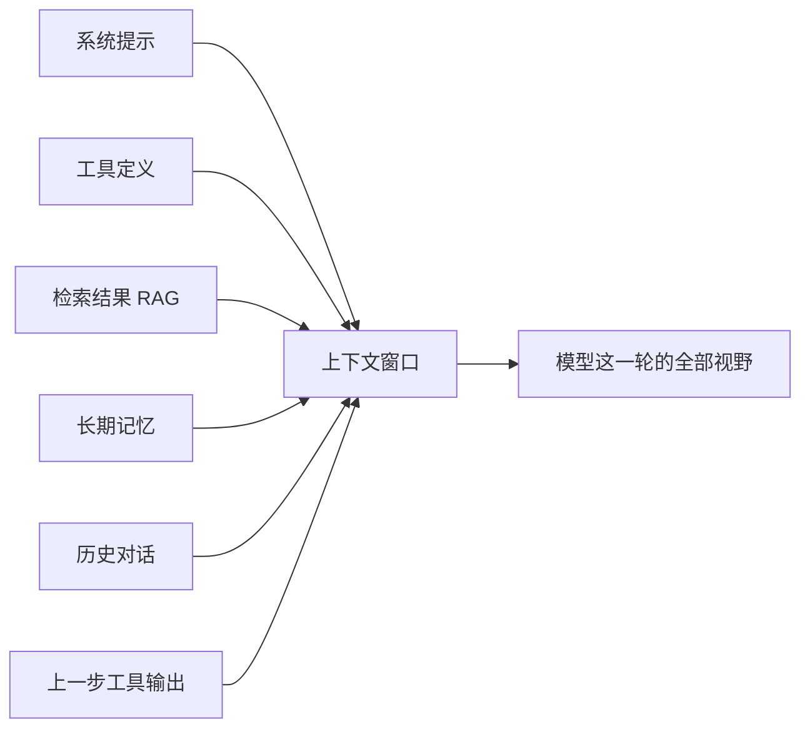
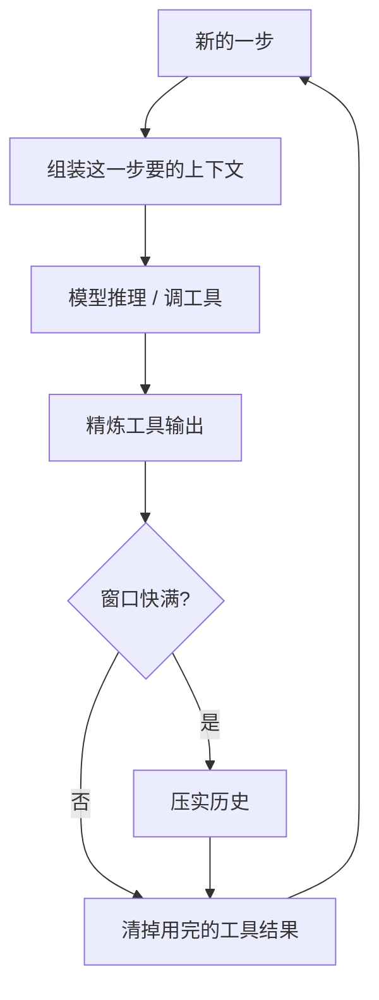

去年这个时候,团队里讨论得最多的还是"这句 system prompt 该怎么措辞"。有人为了一个 Agent 不肯老老实实调用工具,把 prompt 改了三十多版,加感叹号、加大写、加"这非常重要"——最后发现真正起作用的,是把那个工具的描述从一坨 200 行的 JSON Schema 砍到 40 行。

prompt 没救活它,**砍上下文**救活了它。

这件事在 2026 年已经不是个例。Chroma 在 2025 年做过一组实验,测了 18 个当时最强的模型,结论很扎心:**每一个**模型,输入一长,准确率都会掉。有的模型能在 95% 稳住一阵,然后一旦输入越过某个长度,直接跳水到 60%。模型不是线性变笨的,是到了某个点"塌方"。

所以 2026 年大家嘴里挂着的词,从 prompt engineering 变成了 **context engineering**(上下文工程)。这不是换个时髦说法。它是承认了一件事:**模型每一次推理,看到的是整个上下文窗口,而不只是你那段精心打磨的 prompt。** 窗口里还有工具定义、历史对话、检索回来的文档、记忆、上一步工具吐出来的一大坨结果——这些东西你不管,它们就替你"管"了模型。

## prompt engineering 没死,它只是被降格了

先把关系说清楚,免得误会。

context engineering 不是来取代 prompt engineering 的。Anthropic 在那篇《Effective context engineering for AI agents》里说得很直接:**prompt engineering 是 context engineering 的一个子集。** 写好一段指令,依然重要;只是它现在只是你要操心的众多东西里的一个。

两者问的问题不一样:

- prompt engineering 问的是:**"这句话我该怎么措辞?"**
- context engineering 问的是:**"模型这一刻,到底需要看到哪些信息?"**

一次性的任务——翻译一段话、改写一封邮件——prompt engineering 基本够用。但只要你做的是 **Agent**,是那种要跑很多轮、要调工具、要记住前面发生过什么的系统,问题立刻就变了。你面对的不再是"一段 prompt",而是一个**随着每一步在不断变化的上下文状态**。这个状态怎么攒、怎么裁、怎么压,就是 context engineering。

一句话总结这个领域的核心原则,还是 Anthropic 那句:**找到能让模型大概率做对事的、最小的那组高信号 token。** 注意是"最小",不是"最全"。

## 上下文窗口里到底装了什么

很多人对"上下文"的想象还停留在"我发过去的那段文字"。实际上,模型每次推理时看到的窗口,是下面这些东西**拼起来**的:

逐块说一下,以及每一块的"取舍"在哪:

**系统提示。** 它定义角色和规则。陷阱是越写越长——每加一个 corner case 就补一条。但 system prompt 里每个 token 都参与每一次前向计算,而且会一直占着窗口。原则:写"行为边界",别写"百科全书"。

**工具定义。** 这是最被低估的一块。每个工具的名字、描述、参数 Schema 都在占窗口。给 Agent 挂 30 个工具,光工具定义就可能吃掉几千 token,而且工具一多,模型选错工具的概率显著上升——这个反模式后面单独讲。

**检索结果(RAG)。** 从向量库捞回来的文档片段。问题是相似度高 ≠ 相关。捞回来 10 段,可能 7 段是"看起来像但其实没用"的语义噪音。

**长期记忆。** 用户偏好、过往结论、项目背景。它的取舍是:哪些该常驻在窗口里,哪些该存在外部、要用时再取。

**历史对话。** 多轮 Agent 里增长最快的一块。跑 50 步,前 49 步的对话和工具输出全堆在这。不管它,窗口迟早爆。

**上一步工具输出。** 一次数据库查询可能返回几百行 JSON。原封不动塞回窗口,就是在用垃圾喂下一轮推理。

关键认知:**这六块在抢同一个窗口的预算。** 多给检索结果留位置,就得从历史里挤。context engineering 干的就是这件事——动态地决定每一块放多少、放什么。

## 最贵的反模式:把什么都塞进去

如果只能记住一个反模式,记这个:**"塞满"心态。**

它的逻辑听起来无懈可击:"反正窗口有 100 万 token,信息多总比少好,塞进去让模型自己挑。" 模型确实会"自己挑"——挑错。

这个失败模式在 2026 年已经有了一串专门的名字,值得记一下:

| 反模式 | 它长什么样 | 后果 |
|---|---|---|
| 上下文污染(poisoning) | 一个早期的错误结论或幻觉留在了上下文里 | 模型反复引用这个错误,越走越偏 |
| 上下文分心(distraction) | 无关细节太多 | 模型抓住一个琐碎信息,漏掉关键事实 |
| 上下文混淆(confusion) | 挂了一堆用不上的工具 | 模型调用不该调的工具 |
| 上下文冲突(clash) | 不同来源的信息互相矛盾 | 模型在矛盾里反复横跳 |

这几个有个统一的别名,叫 **context rot(上下文腐烂)**:窗口被对话历史、工具输出、检索片段慢慢填满,注意力被稀释,Agent 开始"忘记"自己早先做过的决定。有一组被引用很多的数据是:2025 年企业 AI 项目的失败里,接近 **65%** 可以归因到多步推理过程中的上下文漂移或记忆丢失。不是模型不够聪明,是它的工作台被堆乱了。

还有一个对应的"还原论"陷阱:把模型当数据库用。它不是数据库,它是个**推理引擎**。它不需要永久"存着"所有数据,它只需要在做某个决定的那一刻,手边有那一刻需要的数据。这个区别,直接决定了你该把信息常驻窗口,还是放外部、即时取回。

## 还有一个反模式:位置放错了

"塞满"是关于**塞多少**,这一个是关于**塞在哪**。

"Lost in the middle" 这个研究结论现在基本是常识了:同样一段关键信息,放在长上下文的**开头或结尾**,模型用得好;放在**中间**,经常就跟没给一样。模型的注意力对窗口不是均匀的——两头清醒,中间犯困。

这件事的工程含义很直接:**别把最重要的指令埋在第 8000 行历史对话和第 200 行工具结果中间。** 任务目标、当前最关键的约束,要么顶在前面,要么贴在最后一条消息里。RAG 拼接的时候也一样,最相关的那一段,别让它落在中间。

## 那到底该怎么经营这个窗口

反模式讲完了,讲点能动手的。2026 年这套实践已经收敛得比较清楚了。

**第一,即时取回,而不是预先全塞。** 别在 Agent 启动时就把所有可能用到的文档、所有工具、所有记忆一股脑灌进去。把上下文当成**按需组装**的东西:这一步要查数据库,就这一步把数据库工具和相关 schema 放进来;下一步用不上了,就清出去。Anthropic 的 Cookbook 里把这个叫 "tool clearing"——工具结果用完就从窗口里清掉,只留一句"我查过了,结果是 X"。

**第二,压缩历史,而不是无脑截断。** 多轮 Agent 的历史一定会涨。粗暴地"砍掉最早 N 条"会丢掉关键决定。2026 年比较成熟的做法是 **compaction(压实)**:在窗口快满时,让模型把前面一大段对话总结成一段紧凑的摘要,保留决定和结论,丢掉过程噪音。这里有个真实的坑——NousResearch 的 hermes-agent 就报过一个 bug:compaction 把"记忆"降级成了"背景参考",结果 Agent 重启后记忆全丢了。所以压实不是随便摘要,**摘要里什么必须保真、什么可以丢,本身就是要设计的。**

**第三,把记忆挪到窗口外面。** 长期记忆不该一直占着上下文。2026 年 Agents Week 上 Cloudflare 推的 Agent Memory 就是这个思路:把信息从上下文里抽出来,存在外部,需要时只把**相关的那一点**取回窗口。说白了——让 Agent 能想起重要的,也能忘掉不重要的。"忘掉"在这里是个褒义词。

**第四,工具按需挂,别全挂上。** 工具不是越多越好。一个挂了 30 个工具的 Agent,大概率不如一个挂了 6 个、但每个都精准的 Agent。手段有两种:动态工具选择(这一步只暴露这一步可能用到的工具),或者工具掩码(全挂着,但按状态屏蔽掉当前不该用的)。工具的描述也要砍——开头那个例子就是,200 行 Schema 砍到 40 行,Agent 反而会用了。

**第五,治理塞回去的工具输出。** 工具吐出来的东西,在塞回窗口前先过一道手:几百行 JSON 只留 Agent 真正要的那几个字段;一个长报错日志,提取关键那几行。**别让原始 dump 直接进窗口。**

把这套串起来,一个健康的 Agent 单步循环大概是这样:

注意这个循环里,**"加"和"减"是成对出现的**。每一步都在往窗口里放新东西,也在往外清旧东西。只加不减的 Agent,跑不远。

## 优先级别搞反

如果你正在做 Agent,而它表现不稳定,优化的顺序建议是这样:

1. **先查上下文里有没有垃圾。** 把某一次出错时模型实际看到的完整窗口打印出来,从头读一遍。十有八九你会看到一堆不该在那儿的东西——重复的工具结果、早就过期的检索片段、一个早期的错误结论还赖着没走。这一步不花钱,收益最大。
2. **再处理增长问题。** 给历史上压实,给工具结果上精炼,给记忆挪到外部。让窗口的占用**稳得住**,而不是单调上涨。
3. **最后才回去抠 prompt。** 措辞、示例、few-shot——这些依然有用,但放在上下文已经干净之后再做,效果才看得出来。

很多团队的顺序正好反过来:Agent 一出问题,先冲去改 prompt,改不动就换更大的模型、换更长的窗口。但**更长的窗口只是给你更多塞垃圾的空间**——Chroma 那组实验早说了,输入越长,模型越容易塌方。窗口大小不是你的能力边界,你**经营**这个窗口的能力才是。

2026 年,做 Agent 的人本质上是个数据工程师——不是去训练你控制不了的模型权重,而是去经营你完全能控制的那条上下文管道。prompt 还要写,但那是最后一公里。前面那条把"什么信息、什么时候、以什么形式进窗口"理顺的活儿,才是真正决定 Agent 行不行的地方。

---

参考与延伸阅读:

- [Effective context engineering for AI agents — Anthropic](https://www.anthropic.com/engineering/effective-context-engineering-for-ai-agents)
- [Context engineering: memory, compaction, and tool clearing — Claude Cookbook](https://platform.claude.com/cookbook/tool-use-context-engineering-context-engineering-tools)
- [Context Engineering vs Prompt Engineering for AI Agents — Firecrawl](https://www.firecrawl.dev/blog/context-engineering)
- [Agents that remember: introducing Agent Memory — Cloudflare](https://blog.cloudflare.com/introducing-agent-memory/)
- [What Is Context Rot in AI Agents and How Do You Prevent It? — MindStudio](https://www.mindstudio.ai/blog/what-is-context-rot-ai-agents)
- [8 Context Engineering Risks with Mitigation Strategies — Applied AI Tools](https://appliedai.tools/context-engineering/8-context-engineering-risks-with-mitigation-strategies-explained/)
