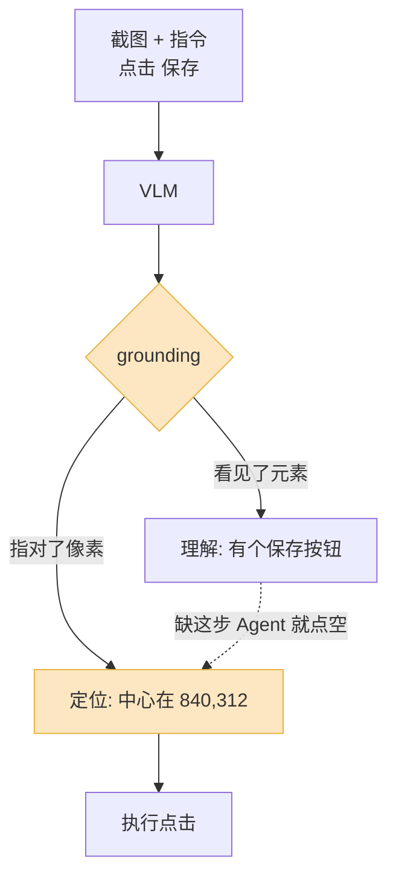
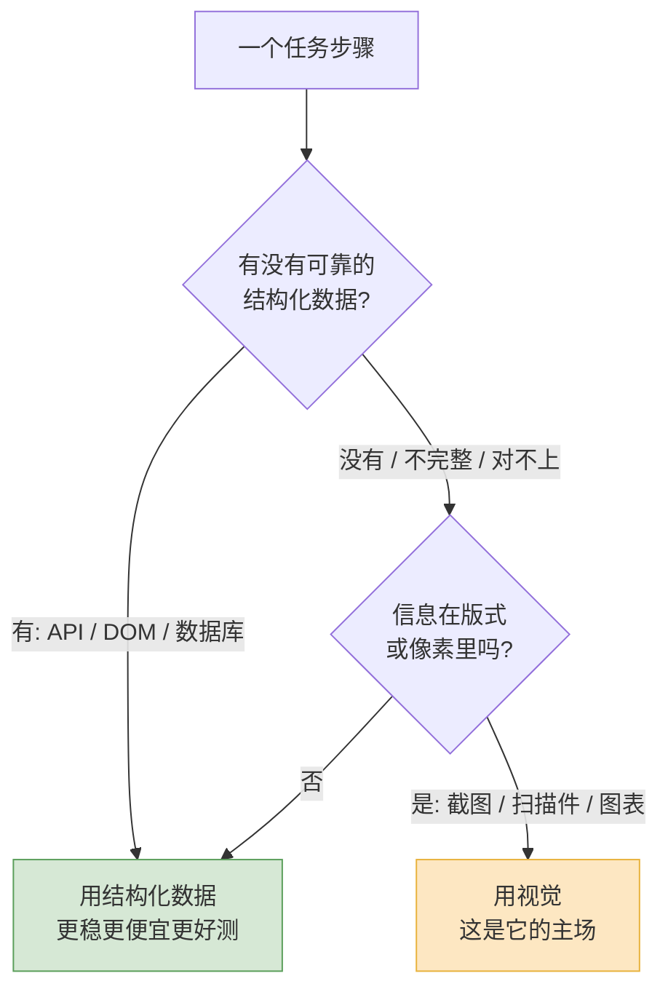

让一个 2026 年最强的视觉 Agent 去操作一个专业软件——比如 Photoshop 或者一个企业 ERP——它定位界面元素的准确率,大概在 **40%** 左右。

这个数字来自 ScreenSpot-Pro 这个专门测「高分辨率专业软件」的基准。换句话说:你让它点一个按钮,它有一半多的概率点歪。消费级 App 的大图标、空间宽敞的界面,模型能做到八九成;一旦换成密密麻麻的工具栏、4K 屏上一个 20 像素的小图标,准确率断崖式往下掉。

这件事值得先摆在前面说,因为「多模态 LLM 能看图了」这句话,很容易让人以为 Agent 的眼睛已经够用了。它确实能看,但「看见」和「看准」是两回事。这篇就讲清楚:视觉能力到底让 Agent 多了什么本事,这只眼睛在哪些地方靠谱、哪些地方会骗你,以及一个工程上最该想清楚的问题——什么时候该让 Agent 看,什么时候别看。

## 多了一只眼睛,Agent 能做什么新事

在 VLM 成熟之前,Agent 想跟外部世界打交道,只有一条路:把世界翻译成文本或结构化数据再喂进去。网页要先抽成 DOM,文档要先 OCR 成纯文本,图表要先有人把数据导成 CSV。这条路有个根本问题——**翻译这一步本身就会丢信息,而且不是每样东西都翻译得了**。

视觉能力补的就是这块。具体讲,它解锁了四类以前做不了、或者做得很别扭的事。

**第一类是看着屏幕操作 UI。** 这是讨论最多的方向,也就是 computer use / GUI agent。Agent 截一张屏,VLM 看图,然后输出「点击坐标 (840, 312)」这样的动作。它的价值在于**绕开了接口**:很多老软件没有 API,很多 SaaS 的 API 覆盖不全,桌面应用更是基本无接口可言。只要它有界面,视觉 Agent 理论上就能操作——它走的是和人一样的入口。

**第二类是读「长得不像文本」的文档。** 发票、合同、财报、扫描件、PDF 里的复杂表格——这些东西的信息一半在文字里,一半在**版式**里。哪个数字对应哪个表头、合同里哪段是被框出来的特别条款、一张表里的合并单元格,纯 OCR 抽完文字,这些空间关系就丢了。VLM 直接看版面,LlamaParse 这类工具就是这个思路:不是先 OCR 再理解,而是让模型边看版式边理解,遇到嵌在文档里的图表和表格还能自己纠错。

**第三类是看图表。** 一张柱状图、一条趋势线,数据点没有标注的时候,纯文本模型完全无能为力。VLM 能直接读出「第三季度比第二季度涨了大概 15%」。更进一步的做法像 ChartAgent,把图表分析拆成一串可观察的步骤,配上元素检测、实例分割、OCR 这些工具,让 Agent 动态调用——本质是承认「光靠看不够准,得配把尺子」。

**第四类是视觉质检和定位。** 产线上挑次品、检查 UI 渲染有没有错位、看监控画面里有没有异常——这类任务的输入天生就是图像,根本没有「结构化数据」这个中间态。以前要专门训一个 CV 模型,现在一个通用 VLM 加几句 prompt 就能起步。

把这四类摆在一起看,会发现视觉能力的真正意义不是「多一个输入通道」,而是**让 Agent 能处理那些压根没有结构化表示的世界**。世界上大部分信息本来就不是 JSON。

## 视觉 grounding:Agent 能「看见」,但能「指准」吗

这是整件事里最容易被低估的难点。

「描述一张图」和「指出图里某个东西在哪个像素」,对模型来说是两种难度完全不同的任务。前者是理解,后者是 **grounding(视觉定位)**——把一句自然语言指令,落到图像上一个精确的坐标。Agent 要操作 UI,靠的就是后者:它得说出「那个『提交』按钮的中心在 (840, 312)」,而不是「我看到一个提交按钮」。

现在主流模型——SeeClick、CogAgent、UI-TARS 这一系——的做法,是把坐标当成**文本 token** 直接生成出来:模型「说」出 `840` 和 `312` 这两个数。这个范式能用,但有个天然的别扭:坐标本质是连续的几何量,你硬让一个语言模型用「吐 token」的方式去逼近它,误差就藏在每一位数字里。

2025 到 2026 年的研究基本在围着这个痛点打。R-VLM 的思路是「先粗看再细看」:先框出一个大概区域,把那块放大,再在放大图上精确定位,准确率比当时的 SOTA 高了 13%。还有工作干脆质疑「生成式出坐标」这条路本身,转去试扩散类的视觉语言模型,靠并行生成和迭代修正来提精度。

但你要的不是论文里的相对提升,是一个能用的绝对数字。结论前面说了:消费级、大图标的界面,grounding 已经够用;**专业软件、高分屏、密集小元素,目前还远没到能放手的程度**。一个直接的工程推论是——元素越小越危险。所有基准都呈现同一条规律:目标框越小,准确率越低。所以做视觉 Agent,选界面、控分辨率,本身就是在控成功率。

## 截图理解的三个坑

就算模型本身的 grounding 能力到位,工程落地时还有三个坑,踩中任何一个都会让 Agent 莫名其妙地点错。

**坑一:分辨率和缩放。** VLM 不是按你的原图分辨率看图的。每家都有自己的处理方式——有的把图切成固定大小的 patch,有的限制最长边(比如某些模型 `high` 模式下最长边压到 2048 像素)。这意味着:你截了一张 3840×2160 的 4K 图,模型内部很可能先把它缩小了再看。缩小之后,小图标糊成一团,模型再聪明也指不准。**模型返回的坐标是基于「它看到的那张缩小图」的,你必须按缩放比例换算回真实屏幕坐标**——这一步算错,点击就系统性偏移。

**坑二:坐标系不统一。** 真实屏幕坐标、模型内部归一化坐标(0~1)、截图本身的像素坐标、再加上高 DPI 屏幕的逻辑像素和物理像素之差——一条链路上同时存在好几套坐标系。Agent 点歪,十有八九不是模型「看错了」,而是某一处坐标换算串了系。这种 bug 特别阴险,因为它常常是「偏一点点」,看着像模型不准,实际是工程问题。

**坑三:密集 UI 和动态界面。** 工具栏挤、下拉菜单叠、元素之间只差几个像素——这种界面 grounding 本来就难。再叠加动态:截图的瞬间和点击的瞬间之间,界面可能已经变了(弹窗、加载、动画)。Agent 拿着一张「过期的截图」去点一个已经移位的按钮,就会点空。截图和动作之间的这点时间差,在慢界面上足够出事。

这三个坑合起来给一个朴素的建议:**能拿到结构化信息时,优先用结构化信息。** 网页有 DOM,就优先用 DOM 定位元素,视觉只在 DOM 拿不到、或者 DOM 对不上视觉(比如 canvas 渲染的界面)时兜底。把视觉当成「最后一条路」,而不是「默认那条路」。

## 视觉 token:一笔容易被忽略的账

视觉能力不是免费的,而且这笔账的波动大得超出直觉。

同一张 JPEG,在不同厂商的 API 里,消耗的 token 数能从 87 一路飙到 6000 多——还没等模型吐出一个字。原因就是上面说的:每家把图转 token 的方式不一样。一张 1000×1000 的图,在 Claude 这边大概 1300 多 token,在 Gemini 那边可能只要 200 多。一张高分辨率图轻松吃掉 2000+ token。

| 场景 | 视觉 token 的代价 | 工程提示 |
|---|---|---|
| 单张消费级 UI 截图 | 几百到一千 token | 基本可接受 |
| 单张高分屏 / 专业软件截图 | 2000+ token | 考虑裁剪到相关区域 |
| 截图理解的多步任务 | 每步一张图,逐步累加 | token 随步数线性涨,是大头 |
| 把整段视频抽帧喂进去 | 帧数 × 单帧成本 | 几乎一定要先降采样 |

真正的成本陷阱不在「单张图贵不贵」,而在 **Agent 是多步的**。一个 GUI Agent 完成一个任务可能要截二三十张图,每张都是上千 token,这些图还会随着对话历史一遍遍重新参与计算。一个十几步的视觉任务,token 消耗很容易是同样一个纯文本任务的十倍以上。视觉 token 普遍比文本 token 贵 2~10 倍,两个因素一叠加,账单就上去了。

省钱的手段也清楚:别每步都喂全屏,裁剪到相关区域再喂;历史里的旧截图该丢就丢,不必让二十步前的图还躺在上下文里;不追求实时的任务走批量接口,普遍还能再省一半。但最根本的那条,还是下一节要说的——先想清楚这一步到底要不要看。

## 什么时候该用视觉,什么时候别用

把前面所有的取舍收成一条决策线。我的判断很直接:**视觉是兜底手段,不是默认手段。**

判断要不要用视觉,先问一个问题——这个任务有没有靠谱的结构化表示?

**该用视觉的情况**:目标软件没有 API;信息的关键部分在版式里(发票、复杂表格、合同);输入天生是图像(质检、监控、图表判读);或者 DOM 拿到的东西和用户实际看到的对不上(canvas 渲染、被 CSS 改过的界面)。这些场景里,视觉不是「锦上添花」,是唯一可行的路。

**别用视觉、老老实实用结构化数据的情况**:有现成 API,就调 API——它返回的是确定的数据结构,不会「点歪」;网页交互优先走 DOM,选择器定位比像素定位稳得多;需要精确数值的场景(对账、计算、金额),让模型「读图」读出一个数字,远不如直接从数据源取——VLM 读图表是为了「看懂趋势」,不是为了「抄准数字」。

一条经验法则:**视觉负责理解「这是什么」,结构化数据负责拿到「精确的值」。** 让 VLM 看一眼报表知道「这是季度营收、整体在涨」,这是它的强项;但具体涨了 14.3% 还是 14.7%,去数据库里查。把这两件事分开,Agent 才会既灵活又可靠。

最后提醒一个反直觉的点:给 Agent 加视觉,常常不是让它变强,而是让它**变得更难调试**。纯文本 / 结构化的链路,出错了你能一步步看 trace;视觉链路出错,你得回去看那张截图、想模型当时「看到」了什么、再排查是不是坐标换算的问题。所以别因为「VLM 能看图」就到处加视觉。**先确认这一步真的没有结构化的路可走,再让 Agent 睁开眼睛。** 这只眼睛很有用,但它该是有意识地用,不是默认开着。
