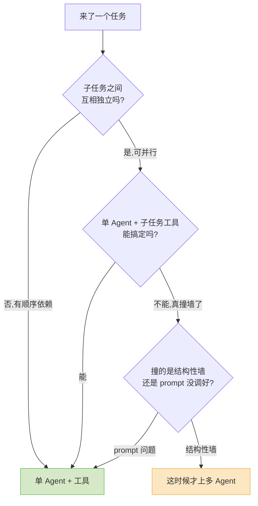

团队花三个月,搭了一套五个角色的多 Agent 编排:Planner、Researcher、Coder、Reviewer、Reporter,各司其职,消息总线串起来,架构图画得很漂亮。

上线后效果不理想——慢,贵,而且一出错就没人知道是哪一环错的。

后来有人把其中一个单 Agent 的 system prompt 重写了一遍,加了几个工具,效果追平了那套五角色编排。token 成本只有它的零头。

这种事我见过不止一次。2026 年,"上多 Agent"几乎成了一种默认的进步姿态——好像单 Agent 是入门,多 Agent 才是工程师该交的作业。我想把话说直白:**大多数时候你并不需要多 Agent。** 单 Agent 加上几个好用的工具,能解决的事比你以为的多得多。多 Agent 是一种有明确代价的架构选择,不是一次免费的升级。

## 先说清楚:什么是"多 Agent"

这个词被用得太松了,先收紧一下。

下面这些**不是**多 Agent,它们只是单 Agent 在干活:

- 一个 Agent 在循环里调用多个工具(查数据库、读文件、发请求);
- 一个 Agent 把一段固定的处理流程拆成几步顺序执行;
- 一个 Agent 调用一个"子任务工具"——把某个隔离的小任务丢给一次独立的 LLM 调用,拿回一段摘要。最后这个尤其重要,后面会专门讲。

真正的多 Agent,指的是**多个各自带独立上下文、独立决策循环的 Agent,彼此之间要协调**。它们要交接任务、传递状态、有时还要互相评审或辩论。LangGraph 的状态图、CrewAI 的"角色 crew"、AutoGen(现在叫 AG2)的多轮对话编排,做的都是这件事。

区别的关键在于:**有没有"协调"这个动作。** 单 Agent 调工具,工具是被动的、无状态的,调完就完;多 Agent 之间,每一个都是活的、有上下文的,它们要互相对齐。协调,就是多 Agent 全部代价的来源。

## 多 Agent 真正适用的三种场景

不是说多 Agent 没用。它有几个单 Agent 确实啃不动的场景,而且这几个场景的特征很清楚。

**一,子任务能真正并行,而且彼此独立。** 这是多 Agent 最硬的理由。Anthropic 公开过他们的多 Agent 研究系统:一个 lead agent 把一个宽泛的研究问题拆成若干互不相干的子查询,同时派出多个 subagent 各查各的,最后汇总。这里的"并行"是真并行——五个子查询之间没有依赖,谁先谁后无所谓,挂掉一个不影响其余四个。读密集型的、可扇出的活,是多 Agent 的主场。

**二,需要角色或上下文隔离。** 有时候你确实想要一个"它不知道前因后果"的视角。比如让一个 reviewer agent 评审 coder agent 写的代码——你希望 reviewer 是带着干净的上下文来挑刺的,而不是被 coder 那一长串"我为什么这么写"的自我辩护带跑。隔离上下文,有时本身就是你要的东西。

**三,单一上下文窗口装不下。** 一个任务牵涉的文档、代码、中间结果加起来,塞进一个上下文窗口会严重稀释——模型开始忘事、抓不住重点。把它切成几块、每块交给一个带独立上下文的 Agent,是合理的。注意这条的前提:是**真的**装不下,而不是你懒得做上下文裁剪。

这三条有个共同点:它们描述的都是**任务结构**,不是任务难度。任务难,不是上多 Agent 的理由;任务在结构上**可以被切成互相独立的块**,才是。

## 多 Agent 的真实代价

这部分是这篇文章的重点,因为它最常被忽略。多 Agent 的代价不是"复杂一点"这么轻描淡写,它是五笔具体的、会咬人的账。

| 代价 | 具体表现 |
|---|---|
| 协调开销 | Agent 之间交接、对齐、等待。任务越偏顺序依赖,这笔开销越是纯亏 |
| 调试困难 | 错误没有栈追踪。reasoning drift 静默传播,出了问题不知道是哪一环 |
| 延迟叠加 | 每一次交接都是一次额外的 LLM 往返,延迟串行累加 |
| token 成本爆炸 | 每个 Agent 都要带自己的上下文。Anthropic 自己说,他们那套系统的 token 消耗大约是单次对话的 15 倍 |
| 错误传播 | 顺序链路上的错误会**累积**而不是抵消。前一个 Agent 的小偏差,会被后一个放大 |

逐条说几句。

**协调开销,在顺序任务上是纯亏。** 这一点有数据支撑:在顺序推理类的任务上,单 Agent 经常**跑赢**同模型的多 Agent——因为协调的开销盖过了所谓"分工"的收益。多 Agent 的并行收益只在子任务真独立时才存在;一旦子任务之间有依赖,你拆出来的每个 Agent 都得等上一个,并行不存在,只剩协调的纯开销。

**调试困难,是会拖垮迭代速度的那种困难。** 单 Agent 出错,你至少能顺着它的工具调用链一路看下去。多 Agent 出错,你面对的是几个独立上下文之间的交接缝隙——错误常常就藏在"A 把任务交给 B"的那个摘要里:A 漏说了一个约束,B 完全不知情,产出看着合理实则偏了。UC Berkeley 在 2025 年整理过一份多 Agent 失败模式分类(MAST),列了 14 种失败模式,其中很大一类就是"角色与任务的边界含糊"——Agent 不守自己的角色。这些错没有报警、没有红字,只是结果悄悄歪了。

**错误传播,是个数学问题。** 把 Agent 顺序串起来,每一环的可靠性会相乘。单环 95% 看着不错,五环串下来就是 0.95 的五次方,大约 77%。环越多,衰减越狠。多 Agent 在做的,常常就是给自己加环。

**token 成本不是线性增长,是翻倍翻倍地涨。** 每个 Agent 都得带一份自己的上下文、自己的 system prompt。Anthropic 把那 15 倍的成本说得很坦白——他们认为对那个特定任务类别值,所以特意这么设计。关键词是"特定任务类别":他们清楚自己在为什么付钱。你上多 Agent 之前,也得能说清这句话。

## 一个判断标准:先单 Agent,撞墙了再拆

把上面的东西收成一个能记住的动作。

**默认从单 Agent 加子任务工具开始。** 这里要重点讲"子任务工具"这个模式,因为它能解决你以为只能靠多 Agent 解决的一大半问题。

所谓子任务工具,是这样的:你的主 Agent 始终持有完整上下文,掌全局。当它遇到一个**隔离的、能独立完成的**小任务,它不去"协调另一个 Agent",而是把这个小任务当成一次工具调用——派一个临时的、用完即弃的 LLM 调用,在一个全新的干净上下文里跑,做完只回传一段摘要字符串。

Claude Code 的 Task 工具、Anthropic 的研究系统、Cognition 的 Managed Devin,用的都是这个 orchestrator-subagent 模式。它的妙处在于:你拿到了"上下文隔离"和"任务并行"这两个好处,却**没有付"协调"那笔账**——因为 subagent 是被动的、用完即弃的,它不和别人对齐,它只是个能开新上下文的工具。这不是多 Agent。它是一个会用工具的单 Agent。

Cognition 在 2025 年中那篇《Don't Build Multi-Agents》立场更激进:只用单线程,上下文实在装不下时,加一个专门做压缩的 LLM,而不是拆成多个并行 Agent。你不一定要走到这么极端,但那个方向是对的——**能不引入协调,就不引入。**

什么时候才真该拆成多 Agent?标准就一条:**你用单 Agent 加子任务工具,确确实实撞墙了**——而且撞的是结构性的墙,不是"我 prompt 没调好"那种墙。下面这张图就是这个决策过程:

注意这张图里,**通往单 Agent 的路有四条,通往多 Agent 的只有一条**,而且要连过两道关。这个比例是故意的——它就该是少数派选择。

判断"是不是 prompt 问题"有个糙但好用的检验:把你打算拆出去的那个 Agent 的职责,**写成主 Agent 的一段 prompt 加一个工具**,认真试一轮。如果效果追平了,那你撞的根本不是结构墙,是 prompt 墙。开头那个五角色编排被单 Agent 追平的故事,就是没做这一步检验。

## 怎么选框架,以及一句话提醒

如果你判断下来确实需要多 Agent,2026 年的选择大致是这样:

| 框架 | 适合 | 取舍 |
|---|---|---|
| LangGraph | 要细粒度控制、要可观测性的复杂编排 | 状态图强制你显式管理状态,啰嗦,但每个节点都能挂监控 |
| CrewAI | 角色分工式的协作,想快速起步 | 几十行就能跑一个 crew,心智模型直观,但出问题时不好埋点排查 |
| AutoGen / AG2 | 对话驱动的多 Agent,Agent 之间要协商辩论 | 企业背书、Azure 集成好,适合多轮对话编排 |

但请记住:**选框架是这件事里最不重要的一步。** 三个框架在 2026 年都够生产可用了,真正决定成败的从来不是框架,是你前面那个判断——这任务到底该不该拆。框架只是把"拆"这个决定执行出来;如果决定本身错了,LangGraph 也救不了你,只会让你把一个错误的架构搭得很工整。

回到开头。多 Agent 不是更高级的单 Agent,它是一种用协调开销换并行能力和上下文隔离的交易。这笔交易在子任务真独立、上下文真装不下的时候,划算;在其他绝大多数时候,你付了协调、调试、延迟、token、错误传播五笔账,换回来的东西,单 Agent 加几个工具本来就给得起。

先用单 Agent。撞墙了,先确认那是结构性的墙。然后才拆。
