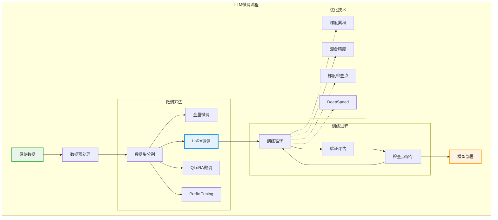
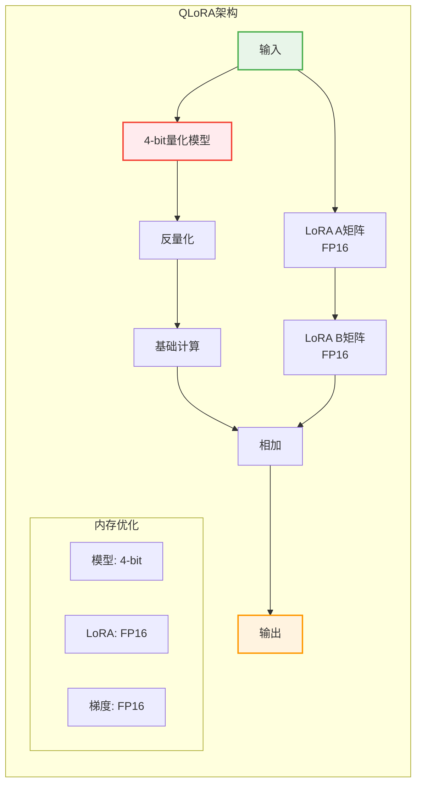

## 引言

大语言模型（LLM）的微调是将通用模型适配到特定任务的关键技术。本文全面介绍LLM微调的方法、技巧和最佳实践，包括全量微调、参数高效微调（PEFT）、强化学习微调等技术。

## 1. 微调基础架构



### 1.1 微调框架设计

```python
from dataclasses import dataclass
from typing import Optional, Dict, List, Union
import torch
from transformers import AutoModelForCausalLM, AutoTokenizer

@dataclass
class FineTuningConfig:
    model_name: str = "meta-llama/Llama-2-7b-hf"
    dataset_path: str = "./data/train.jsonl"
    output_dir: str = "./checkpoints"
    
    # 训练参数
    learning_rate: float = 2e-5
    batch_size: int = 4
    gradient_accumulation_steps: int = 4
    num_epochs: int = 3
    warmup_ratio: float = 0.1
    weight_decay: float = 0.01
    
    # 优化参数
    max_seq_length: int = 2048
    gradient_checkpointing: bool = True
    mixed_precision: str = "fp16"  # fp16, bf16, or None
    
    # LoRA参数
    use_lora: bool = True
    lora_rank: int = 16
    lora_alpha: int = 32
    lora_dropout: float = 0.1
    
    # 量化参数
    use_quantization: bool = False
    quantization_bits: int = 4

class LLMFineTuner:
    def __init__(self, config: FineTuningConfig):
        self.config = config
        self.model = None
        self.tokenizer = None
        self.optimizer = None
        self.scheduler = None
        
    def setup_model(self):
        """设置模型和分词器"""
        # 加载分词器
        self.tokenizer = AutoTokenizer.from_pretrained(
            self.config.model_name,
            trust_remote_code=True
        )
        self.tokenizer.pad_token = self.tokenizer.eos_token
        
        # 加载模型
        if self.config.use_quantization:
            self.model = self.load_quantized_model()
        else:
            self.model = AutoModelForCausalLM.from_pretrained(
                self.config.model_name,
                torch_dtype=torch.float16 if self.config.mixed_precision == "fp16" else torch.float32,
                device_map="auto",
                trust_remote_code=True
            )
        
        # 应用LoRA
        if self.config.use_lora:
            self.apply_lora()
        
        # 启用梯度检查点
        if self.config.gradient_checkpointing:
            self.model.gradient_checkpointing_enable()
    
    def apply_lora(self):
        """应用LoRA适配器"""
        from peft import LoraConfig, get_peft_model, TaskType
        
        lora_config = LoraConfig(
            task_type=TaskType.CAUSAL_LM,
            r=self.config.lora_rank,
            lora_alpha=self.config.lora_alpha,
            lora_dropout=self.config.lora_dropout,
            target_modules=["q_proj", "v_proj", "k_proj", "o_proj",
                          "gate_proj", "up_proj", "down_proj"],
            bias="none"
        )
        
        self.model = get_peft_model(self.model, lora_config)
        self.model.print_trainable_parameters()
```

### 1.2 数据处理pipeline

```python
import json
from torch.utils.data import Dataset, DataLoader
from typing import List, Dict

class InstructionDataset(Dataset):
    def __init__(self, data_path: str, tokenizer, max_length: int = 2048):
        self.tokenizer = tokenizer
        self.max_length = max_length
        self.data = self.load_data(data_path)
        
    def load_data(self, path: str) -> List[Dict]:
        """加载指令数据"""
        data = []
        with open(path, 'r', encoding='utf-8') as f:
            for line in f:
                item = json.loads(line)
                data.append(item)
        return data
    
    def __len__(self):
        return len(self.data)
    
    def __getitem__(self, idx):
        item = self.data[idx]
        
        # 构建提示
        prompt = self.build_prompt(item)
        
        # 分词
        encoded = self.tokenizer(
            prompt,
            truncation=True,
            max_length=self.max_length,
            padding="max_length",
            return_tensors="pt"
        )
        
        # 创建标签（用于计算损失）
        labels = encoded["input_ids"].clone()
        
        # 将padding部分的标签设为-100（忽略）
        labels[labels == self.tokenizer.pad_token_id] = -100
        
        return {
            "input_ids": encoded["input_ids"].squeeze(),
            "attention_mask": encoded["attention_mask"].squeeze(),
            "labels": labels.squeeze()
        }
    
    def build_prompt(self, item: Dict) -> str:
        """构建指令提示"""
        system_prompt = item.get("system", "You are a helpful assistant.")
        instruction = item.get("instruction", "")
        input_text = item.get("input", "")
        output = item.get("output", "")
        
        if input_text:
            prompt = f"""<|system|>{system_prompt}</s>
<|user|>{instruction}
Input: {input_text}</s>
<|assistant|>{output}</s>"""
        else:
            prompt = f"""<|system|>{system_prompt}</s>
<|user|>{instruction}</s>
<|assistant|>{output}</s>"""
        
        return prompt

class DataCollator:
    def __init__(self, tokenizer):
        self.tokenizer = tokenizer
    
    def __call__(self, batch):
        """批处理数据"""
        input_ids = torch.stack([item["input_ids"] for item in batch])
        attention_mask = torch.stack([item["attention_mask"] for item in batch])
        labels = torch.stack([item["labels"] for item in batch])
        
        return {
            "input_ids": input_ids,
            "attention_mask": attention_mask,
            "labels": labels
        }
```

## 2. 参数高效微调（PEFT）

### 2.1 LoRA实现

```python
import torch.nn as nn
import torch.nn.functional as F
import math

class LoRALayer(nn.Module):
    def __init__(self, in_features: int, out_features: int, 
                 rank: int = 16, alpha: int = 32, dropout: float = 0.1):
        super().__init__()
        self.rank = rank
        self.alpha = alpha
        self.scaling = alpha / rank
        
        # LoRA参数
        self.lora_A = nn.Parameter(torch.zeros(rank, in_features))
        self.lora_B = nn.Parameter(torch.zeros(out_features, rank))
        self.lora_dropout = nn.Dropout(dropout)
        
        # 初始化
        nn.init.kaiming_uniform_(self.lora_A, a=math.sqrt(5))
        nn.init.zeros_(self.lora_B)
        
    def forward(self, x: torch.Tensor, base_output: torch.Tensor) -> torch.Tensor:
        """LoRA前向传播"""
        if self.training:
            x = self.lora_dropout(x)
        
        # BA矩阵乘法
        lora_output = x @ self.lora_A.T @ self.lora_B.T
        
        # 缩放并添加到基础输出
        return base_output + lora_output * self.scaling

class LoRALinear(nn.Module):
    def __init__(self, base_layer: nn.Linear, rank: int = 16, 
                 alpha: int = 32, dropout: float = 0.1):
        super().__init__()
        self.base_layer = base_layer
        self.lora = LoRALayer(
            base_layer.in_features,
            base_layer.out_features,
            rank, alpha, dropout
        )
        
        # 冻结基础层
        for param in self.base_layer.parameters():
            param.requires_grad = False
    
    def forward(self, x: torch.Tensor) -> torch.Tensor:
        base_output = self.base_layer(x)
        return self.lora(x, base_output)
    
    def merge_weights(self):
        """合并LoRA权重到基础层"""
        with torch.no_grad():
            self.base_layer.weight.data += (
                self.lora.lora_B @ self.lora.lora_A
            ) * self.lora.scaling
```

### 2.2 QLoRA实现



```python
import bitsandbytes as bnb
from transformers import BitsAndBytesConfig

class QLoRAFineTuner:
    def __init__(self, model_name: str):
        self.model_name = model_name
        self.bnb_config = None
        self.model = None
        
    def setup_quantization(self):
        """设置4位量化配置"""
        self.bnb_config = BitsAndBytesConfig(
            load_in_4bit=True,
            bnb_4bit_use_double_quant=True,
            bnb_4bit_quant_type="nf4",
            bnb_4bit_compute_dtype=torch.bfloat16
        )
    
    def load_quantized_model(self):
        """加载量化模型"""
        from transformers import AutoModelForCausalLM
        
        model = AutoModelForCausalLM.from_pretrained(
            self.model_name,
            quantization_config=self.bnb_config,
            device_map="auto",
            trust_remote_code=True
        )
        
        # 准备模型用于k-bit训练
        model = prepare_model_for_kbit_training(model)
        
        return model
    
    def apply_qlora(self, model):
        """应用QLoRA"""
        from peft import LoraConfig, get_peft_model
        
        # 找到所有Linear层
        target_modules = self.find_linear_layers(model)
        
        config = LoraConfig(
            r=16,
            lora_alpha=32,
            target_modules=target_modules,
            lora_dropout=0.05,
            bias="none",
            task_type="CAUSAL_LM"
        )
        
        model = get_peft_model(model, config)
        
        return model
    
    def find_linear_layers(self, model):
        """找到所有可以应用LoRA的线性层"""
        linear_cls = bnb.nn.Linear4bit
        lora_module_names = set()
        
        for name, module in model.named_modules():
            if isinstance(module, linear_cls):
                names = name.split('.')
                lora_module_names.add(names[-1])
        
        # 排除一些层
        if 'lm_head' in lora_module_names:
            lora_module_names.remove('lm_head')
        
        return list(lora_module_names)

def prepare_model_for_kbit_training(model):
    """准备模型进行k-bit训练"""
    model.gradient_checkpointing_enable()
    
    # 将部分层转为fp32以提高稳定性
    for param in model.parameters():
        param.requires_grad = False
        if param.ndim == 1:
            param.data = param.data.to(torch.float32)
    
    # 启用输入层的梯度
    model.enable_input_require_grads()
    
    return model
```

## 3. 训练优化技术

### 3.1 分布式训练

```python
import torch.distributed as dist
from torch.nn.parallel import DistributedDataParallel as DDP
from torch.distributed.fsdp import FullyShardedDataParallel as FSDP
from torch.distributed.fsdp.fully_sharded_data_parallel import (
    CPUOffload,
    BackwardPrefetch,
)

class DistributedTrainer:
    def __init__(self, model, config):
        self.model = model
        self.config = config
        self.world_size = torch.cuda.device_count()
        
    def setup_ddp(self, rank: int):
        """设置DDP训练"""
        # 初始化进程组
        dist.init_process_group(
            backend='nccl',
            init_method='env://',
            world_size=self.world_size,
            rank=rank
        )
        
        # 设置设备
        torch.cuda.set_device(rank)
        
        # 包装模型
        self.model = self.model.to(rank)
        self.model = DDP(
            self.model,
            device_ids=[rank],
            output_device=rank,
            find_unused_parameters=False
        )
    
    def setup_fsdp(self):
        """设置FSDP训练（完全分片数据并行）"""
        from torch.distributed.fsdp.wrap import (
            size_based_auto_wrap_policy,
            transformer_auto_wrap_policy,
        )
        
        # 自动包装策略
        auto_wrap_policy = functools.partial(
            transformer_auto_wrap_policy,
            transformer_layer_cls={
                transformers.models.llama.modeling_llama.LlamaDecoderLayer
            }
        )
        
        # FSDP配置
        self.model = FSDP(
            self.model,
            auto_wrap_policy=auto_wrap_policy,
            backward_prefetch=BackwardPrefetch.BACKWARD_PRE,
            cpu_offload=CPUOffload(offload_params=True),
            mixed_precision=self.get_mixed_precision_policy(),
            sharding_strategy=ShardingStrategy.FULL_SHARD,
            device_id=torch.cuda.current_device(),
            limit_all_gathers=True
        )
    
    def get_mixed_precision_policy(self):
        """获取混合精度策略"""
        from torch.distributed.fsdp import MixedPrecision
        
        return MixedPrecision(
            param_dtype=torch.bfloat16,
            reduce_dtype=torch.bfloat16,
            buffer_dtype=torch.bfloat16,
        )
```

### 3.2 梯度优化

```python
class GradientOptimizer:
    def __init__(self, model, config):
        self.model = model
        self.config = config
        
    def setup_optimizer(self):
        """设置优化器"""
        # 参数分组
        param_groups = self.get_parameter_groups()
        
        # AdamW优化器
        optimizer = torch.optim.AdamW(
            param_groups,
            lr=self.config.learning_rate,
            betas=(0.9, 0.95),
            eps=1e-8,
            weight_decay=self.config.weight_decay
        )
        
        return optimizer
    
    def get_parameter_groups(self):
        """获取参数组（不同学习率）"""
        # 不需要weight decay的参数
        no_decay = ["bias", "LayerNorm.weight", "layer_norm.weight"]
        
        # LoRA参数使用更高的学习率
        lora_params = []
        base_params_decay = []
        base_params_no_decay = []
        
        for name, param in self.model.named_parameters():
            if not param.requires_grad:
                continue
            
            if "lora_" in name:
                lora_params.append(param)
            elif any(nd in name for nd in no_decay):
                base_params_no_decay.append(param)
            else:
                base_params_decay.append(param)
        
        param_groups = [
            {
                "params": base_params_decay,
                "weight_decay": self.config.weight_decay,
                "lr": self.config.learning_rate
            },
            {
                "params": base_params_no_decay,
                "weight_decay": 0.0,
                "lr": self.config.learning_rate
            },
            {
                "params": lora_params,
                "weight_decay": 0.0,
                "lr": self.config.learning_rate * 2  # LoRA参数使用2倍学习率
            }
        ]
        
        return param_groups
    
    def gradient_clipping(self, optimizer):
        """梯度裁剪"""
        torch.nn.utils.clip_grad_norm_(
            self.model.parameters(),
            max_norm=1.0
        )
    
    def gradient_accumulation_step(self, loss, step, optimizer):
        """梯度累积"""
        loss = loss / self.config.gradient_accumulation_steps
        loss.backward()
        
        if (step + 1) % self.config.gradient_accumulation_steps == 0:
            self.gradient_clipping(optimizer)
            optimizer.step()
            optimizer.zero_grad()
```

## 4. 强化学习微调（RLHF/DPO）

### 4.1 RLHF实现

```python
from transformers import AutoModelForCausalLM
import torch.nn.functional as F

class RLHFTrainer:
    def __init__(self, policy_model, reward_model, reference_model):
        self.policy_model = policy_model
        self.reward_model = reward_model
        self.reference_model = reference_model
        
        # 冻结参考模型和奖励模型
        for param in self.reference_model.parameters():
            param.requires_grad = False
        for param in self.reward_model.parameters():
            param.requires_grad = False
    
    def compute_rewards(self, prompts, responses):
        """计算奖励"""
        # 获取奖励模型评分
        rewards = self.reward_model(prompts, responses)
        
        # KL惩罚
        kl_penalty = self.compute_kl_penalty(prompts, responses)
        
        # 最终奖励
        final_rewards = rewards - self.config.kl_coeff * kl_penalty
        
        return final_rewards
    
    def compute_kl_penalty(self, prompts, responses):
        """计算KL散度惩罚"""
        with torch.no_grad():
            # 获取参考模型的对数概率
            ref_logprobs = self.get_logprobs(
                self.reference_model, prompts, responses
            )
        
        # 获取策略模型的对数概率
        policy_logprobs = self.get_logprobs(
            self.policy_model, prompts, responses
        )
        
        # KL散度
        kl = policy_logprobs - ref_logprobs
        
        return kl.mean()
    
    def ppo_step(self, prompts, responses, rewards, old_logprobs):
        """PPO训练步骤"""
        # 获取当前策略的对数概率
        logprobs = self.get_logprobs(self.policy_model, prompts, responses)
        
        # 计算比率
        ratio = torch.exp(logprobs - old_logprobs)
        
        # 优势函数（这里简化为奖励）
        advantages = rewards
        
        # PPO损失
        surr1 = ratio * advantages
        surr2 = torch.clamp(
            ratio, 1 - self.config.clip_range, 1 + self.config.clip_range
        ) * advantages
        
        policy_loss = -torch.min(surr1, surr2).mean()
        
        # 值函数损失（如果有值头）
        value_loss = 0
        if hasattr(self.policy_model, 'value_head'):
            values = self.policy_model.value_head(prompts, responses)
            value_loss = F.mse_loss(values, rewards)
        
        # 熵奖励
        entropy = self.compute_entropy(logprobs)
        
        # 总损失
        loss = (
            policy_loss +
            self.config.vf_coef * value_loss -
            self.config.entropy_coef * entropy
        )
        
        return loss
```

### 4.2 DPO（Direct Preference Optimization）

```python
class DPOTrainer:
    def __init__(self, model, reference_model, beta: float = 0.1):
        self.model = model
        self.reference_model = reference_model
        self.beta = beta
        
        # 冻结参考模型
        for param in self.reference_model.parameters():
            param.requires_grad = False
    
    def compute_dpo_loss(self, prompts, chosen, rejected):
        """计算DPO损失"""
        # 获取策略模型的对数概率
        pi_logprobs_chosen = self.get_logprobs(self.model, prompts, chosen)
        pi_logprobs_rejected = self.get_logprobs(self.model, prompts, rejected)
        
        # 获取参考模型的对数概率
        with torch.no_grad():
            ref_logprobs_chosen = self.get_logprobs(
                self.reference_model, prompts, chosen
            )
            ref_logprobs_rejected = self.get_logprobs(
                self.reference_model, prompts, rejected
            )
        
        # 计算对数比率
        pi_logratios = pi_logprobs_chosen - pi_logprobs_rejected
        ref_logratios = ref_logprobs_chosen - ref_logprobs_rejected
        
        # DPO损失
        losses = -F.logsigmoid(self.beta * (pi_logratios - ref_logratios))
        
        # 添加正则化
        chosen_rewards = self.beta * (
            pi_logprobs_chosen - ref_logprobs_chosen
        ).detach()
        rejected_rewards = self.beta * (
            pi_logprobs_rejected - ref_logprobs_rejected
        ).detach()
        
        return losses.mean(), chosen_rewards, rejected_rewards
    
    def get_logprobs(self, model, prompts, responses):
        """获取响应的对数概率"""
        inputs = self.tokenizer(
            [p + r for p, r in zip(prompts, responses)],
            return_tensors="pt",
            padding=True,
            truncation=True
        )
        
        with torch.no_grad() if model == self.reference_model else nullcontext():
            outputs = model(**inputs, labels=inputs["input_ids"])
            
        # 提取响应部分的对数概率
        logits = outputs.logits
        labels = inputs["input_ids"]
        
        # 计算对数概率
        logprobs = F.log_softmax(logits, dim=-1)
        
        # 获取标签对应的对数概率
        selected_logprobs = torch.gather(
            logprobs, 2, labels.unsqueeze(-1)
        ).squeeze(-1)
        
        # 只计算响应部分
        prompt_lens = [len(self.tokenizer(p)["input_ids"]) for p in prompts]
        response_logprobs = []
        
        for i, prompt_len in enumerate(prompt_lens):
            response_logprobs.append(
                selected_logprobs[i, prompt_len:].sum()
            )
        
        return torch.stack(response_logprobs)
```

## 5. 指令微调

### 5.1 指令数据构建

```python
class InstructionDataBuilder:
    def __init__(self):
        self.templates = self.load_templates()
        
    def create_instruction_data(self, raw_data: List[Dict]) -> List[Dict]:
        """创建指令数据"""
        instruction_data = []
        
        for item in raw_data:
            # 生成多样化的指令
            instructions = self.generate_instructions(item)
            
            for instruction in instructions:
                formatted = self.format_instruction(instruction, item)
                instruction_data.append(formatted)
        
        return instruction_data
    
    def generate_instructions(self, item: Dict) -> List[str]:
        """生成多样化指令"""
        task_type = item.get("task_type", "general")
        
        instructions = []
        
        if task_type == "qa":
            instructions.extend([
                f"Answer the following question: {item['question']}",
                f"Please provide an answer to: {item['question']}",
                f"What is the answer to this question: {item['question']}",
            ])
        elif task_type == "summarization":
            instructions.extend([
                "Summarize the following text:",
                "Please provide a brief summary of:",
                "Create a concise summary for:",
            ])
        elif task_type == "translation":
            instructions.extend([
                f"Translate the following from {item['source_lang']} to {item['target_lang']}:",
                f"Please translate this text to {item['target_lang']}:",
            ])
        
        return instructions
    
    def format_instruction(self, instruction: str, item: Dict) -> Dict:
        """格式化指令"""
        return {
            "instruction": instruction,
            "input": item.get("input", ""),
            "output": item.get("output", ""),
            "system": self.get_system_prompt(item.get("task_type", "general"))
        }
    
    def get_system_prompt(self, task_type: str) -> str:
        """获取系统提示"""
        system_prompts = {
            "qa": "You are a helpful question-answering assistant.",
            "summarization": "You are an expert at creating concise summaries.",
            "translation": "You are a professional translator.",
            "general": "You are a helpful AI assistant.",
        }
        
        return system_prompts.get(task_type, system_prompts["general"])
```

### 5.2 Chain-of-Thought微调

```python
class CoTFineTuning:
    def __init__(self, model, tokenizer):
        self.model = model
        self.tokenizer = tokenizer
        
    def create_cot_data(self, problems: List[Dict]) -> List[Dict]:
        """创建思维链数据"""
        cot_data = []
        
        for problem in problems:
            # 生成思维链
            cot_solution = self.generate_cot_solution(problem)
            
            # 格式化为训练数据
            cot_item = {
                "instruction": problem["question"],
                "output": cot_solution,
                "system": "Let's think step by step."
            }
            
            cot_data.append(cot_item)
        
        return cot_data
    
    def generate_cot_solution(self, problem: Dict) -> str:
        """生成思维链解决方案"""
        steps = problem.get("solution_steps", [])
        
        cot_text = "Let me solve this step by step.\n\n"
        
        for i, step in enumerate(steps, 1):
            cot_text += f"Step {i}: {step['description']}\n"
            if "calculation" in step:
                cot_text += f"Calculation: {step['calculation']}\n"
            if "reasoning" in step:
                cot_text += f"Reasoning: {step['reasoning']}\n"
            cot_text += "\n"
        
        cot_text += f"Therefore, the answer is: {problem['answer']}"
        
        return cot_text
    
    def train_with_cot(self, train_data: List[Dict]):
        """使用思维链数据训练"""
        # 创建数据集
        dataset = CoTDataset(train_data, self.tokenizer)
        dataloader = DataLoader(dataset, batch_size=4, shuffle=True)
        
        # 训练循环
        optimizer = torch.optim.AdamW(self.model.parameters(), lr=1e-5)
        
        for epoch in range(3):
            for batch in dataloader:
                # 前向传播
                outputs = self.model(**batch)
                loss = outputs.loss
                
                # 反向传播
                loss.backward()
                optimizer.step()
                optimizer.zero_grad()
```

## 6. 数据增强技术

### 6.1 自动数据增强

```python
class DataAugmentation:
    def __init__(self, base_model):
        self.base_model = base_model
        
    def paraphrase_augmentation(self, text: str, num_variants: int = 3):
        """释义增强"""
        paraphrases = []
        
        prompts = [
            "Rewrite the following in different words:",
            "Express the same idea differently:",
            "Paraphrase the following text:",
        ]
        
        for i in range(num_variants):
            prompt = f"{prompts[i % len(prompts)]} {text}"
            paraphrase = self.base_model.generate(prompt)
            paraphrases.append(paraphrase)
        
        return paraphrases
    
    def back_translation(self, text: str, intermediate_lang: str = "zh"):
        """回译增强"""
        # 翻译到中间语言
        translated = self.translate(text, "en", intermediate_lang)
        
        # 翻译回原语言
        back_translated = self.translate(translated, intermediate_lang, "en")
        
        return back_translated
    
    def instruction_augmentation(self, instruction: str, output: str):
        """指令增强"""
        augmented = []
        
        # 改变指令风格
        styles = ["formal", "casual", "detailed", "concise"]
        
        for style in styles:
            new_instruction = self.restyle_instruction(instruction, style)
            augmented.append({
                "instruction": new_instruction,
                "output": output
            })
        
        # 添加约束
        constraints = [
            "Answer in one sentence.",
            "Provide a detailed explanation.",
            "Use simple language.",
            "Include examples.",
        ]
        
        for constraint in constraints:
            augmented.append({
                "instruction": f"{instruction} {constraint}",
                "output": self.modify_output(output, constraint)
            })
        
        return augmented
```

### 6.2 合成数据生成

```python
class SyntheticDataGenerator:
    def __init__(self, generator_model):
        self.generator = generator_model
        
    def generate_qa_pairs(self, context: str, num_pairs: int = 5):
        """生成问答对"""
        qa_pairs = []
        
        # 生成问题
        questions = self.generate_questions(context, num_pairs)
        
        for question in questions:
            # 生成答案
            answer = self.generate_answer(context, question)
            
            qa_pairs.append({
                "question": question,
                "answer": answer,
                "context": context
            })
        
        return qa_pairs
    
    def generate_instructions(self, capability: str, num_instructions: int = 10):
        """生成指令数据"""
        prompt = f"""Generate {num_instructions} diverse instructions that test the following capability: {capability}
        
        Format each instruction as:
        Instruction: [instruction text]
        Expected Output: [expected output]
        """
        
        response = self.generator.generate(prompt)
        
        # 解析响应
        instructions = self.parse_instructions(response)
        
        return instructions
    
    def self_instruct(self, seed_tasks: List[str], num_iterations: int = 3):
        """Self-Instruct方法"""
        all_instructions = seed_tasks.copy()
        
        for iteration in range(num_iterations):
            # 采样现有指令
            sampled = random.sample(all_instructions, min(5, len(all_instructions)))
            
            # 生成新指令
            new_instructions = self.generate_similar_instructions(sampled)
            
            # 过滤低质量指令
            filtered = self.filter_instructions(new_instructions)
            
            # 添加到集合
            all_instructions.extend(filtered)
        
        return all_instructions
```

## 7. 评估与验证

### 7.1 自动评估

```python
from sklearn.metrics import accuracy_score, f1_score
import numpy as np

class ModelEvaluator:
    def __init__(self, model, tokenizer):
        self.model = model
        self.tokenizer = tokenizer
        
    def evaluate_generation_quality(self, test_data: List[Dict]):
        """评估生成质量"""
        metrics = {
            "bleu": [],
            "rouge": [],
            "perplexity": [],
            "diversity": [],
            "coherence": []
        }
        
        for item in test_data:
            # 生成响应
            generated = self.generate_response(item["instruction"])
            reference = item["output"]
            
            # 计算BLEU分数
            bleu = self.calculate_bleu(generated, reference)
            metrics["bleu"].append(bleu)
            
            # 计算ROUGE分数
            rouge = self.calculate_rouge(generated, reference)
            metrics["rouge"].append(rouge)
            
            # 计算困惑度
            perplexity = self.calculate_perplexity(generated)
            metrics["perplexity"].append(perplexity)
            
            # 计算多样性
            diversity = self.calculate_diversity([generated])
            metrics["diversity"].append(diversity)
            
            # 计算连贯性
            coherence = self.calculate_coherence(generated)
            metrics["coherence"].append(coherence)
        
        # 汇总指标
        summary = {
            metric: np.mean(values)
            for metric, values in metrics.items()
        }
        
        return summary
    
    def calculate_perplexity(self, text: str) -> float:
        """计算困惑度"""
        inputs = self.tokenizer(text, return_tensors="pt")
        
        with torch.no_grad():
            outputs = self.model(**inputs, labels=inputs["input_ids"])
            loss = outputs.loss
            perplexity = torch.exp(loss)
        
        return perplexity.item()
    
    def human_eval_simulation(self, generated: str, reference: str):
        """模拟人类评估"""
        # 使用另一个模型作为评判者
        judge_prompt = f"""
        Please rate the quality of the generated response compared to the reference.
        
        Generated: {generated}
        Reference: {reference}
        
        Rate on a scale of 1-5 for:
        1. Relevance
        2. Fluency
        3. Informativeness
        4. Correctness
        """
        
        # 获取评分（这里应该使用评判模型）
        scores = self.get_judge_scores(judge_prompt)
        
        return scores
```

### 7.2 A/B测试

```python
class ABTesting:
    def __init__(self, model_a, model_b):
        self.model_a = model_a
        self.model_b = model_b
        self.results = {"model_a": [], "model_b": [], "ties": []}
        
    def run_comparison(self, test_prompts: List[str]):
        """运行A/B测试"""
        for prompt in test_prompts:
            # 生成响应
            response_a = self.model_a.generate(prompt)
            response_b = self.model_b.generate(prompt)
            
            # 评估响应
            winner = self.evaluate_responses(prompt, response_a, response_b)
            
            # 记录结果
            if winner == "a":
                self.results["model_a"].append(prompt)
            elif winner == "b":
                self.results["model_b"].append(prompt)
            else:
                self.results["ties"].append(prompt)
        
        # 统计分析
        stats = self.calculate_statistics()
        
        return stats
    
    def calculate_statistics(self):
        """计算统计结果"""
        total = sum(len(v) for v in self.results.values())
        
        stats = {
            "model_a_win_rate": len(self.results["model_a"]) / total,
            "model_b_win_rate": len(self.results["model_b"]) / total,
            "tie_rate": len(self.results["ties"]) / total,
            "confidence": self.calculate_confidence_interval()
        }
        
        return stats
```

## 8. 生产部署

### 8.1 模型优化与部署

```python
class ModelDeployment:
    def __init__(self, model_path: str):
        self.model_path = model_path
        
    def optimize_for_inference(self):
        """推理优化"""
        # 加载模型
        model = torch.load(self.model_path)
        
        # 合并LoRA权重
        if hasattr(model, 'merge_and_unload'):
            model = model.merge_and_unload()
        
        # 转换为半精度
        model = model.half()
        
        # TorchScript转换
        scripted_model = torch.jit.script(model)
        
        # 优化
        optimized = torch.jit.optimize_for_inference(scripted_model)
        
        return optimized
    
    def export_to_onnx(self, model, dummy_input):
        """导出ONNX格式"""
        torch.onnx.export(
            model,
            dummy_input,
            "model.onnx",
            export_params=True,
            opset_version=14,
            do_constant_folding=True,
            input_names=['input_ids', 'attention_mask'],
            output_names=['logits'],
            dynamic_axes={
                'input_ids': {0: 'batch_size', 1: 'sequence'},
                'attention_mask': {0: 'batch_size', 1: 'sequence'},
                'logits': {0: 'batch_size', 1: 'sequence'}
            }
        )
    
    def create_serving_endpoint(self):
        """创建服务端点"""
        from fastapi import FastAPI
        import uvicorn
        
        app = FastAPI()
        
        # 加载模型
        model = self.load_optimized_model()
        
        @app.post("/generate")
        async def generate(prompt: str, max_length: int = 100):
            # 生成响应
            response = model.generate(prompt, max_length=max_length)
            return {"response": response}
        
        return app
```

## 9. 监控与维护

### 9.1 模型监控

```python
class ModelMonitoring:
    def __init__(self):
        self.metrics_buffer = []
        
    def monitor_inference(self, model, inputs, outputs):
        """监控推理"""
        metrics = {
            "timestamp": time.time(),
            "input_length": len(inputs["input_ids"][0]),
            "output_length": len(outputs[0]),
            "latency": None,
            "perplexity": None
        }
        
        # 计算延迟
        start_time = time.time()
        _ = model(inputs)
        metrics["latency"] = time.time() - start_time
        
        # 计算困惑度
        with torch.no_grad():
            loss = model(**inputs, labels=inputs["input_ids"]).loss
            metrics["perplexity"] = torch.exp(loss).item()
        
        self.metrics_buffer.append(metrics)
        
        # 检测异常
        self.detect_anomalies(metrics)
    
    def detect_drift(self, current_distribution, reference_distribution):
        """检测分布漂移"""
        from scipy.stats import ks_2samp
        
        # KS检验
        statistic, p_value = ks_2samp(
            current_distribution,
            reference_distribution
        )
        
        # 检测显著漂移
        if p_value < 0.05:
            self.alert_drift_detected(statistic, p_value)
        
        return p_value
```

## 10. 最佳实践

1. **数据质量优先**：高质量的数据比大量低质量数据更有价值
2. **渐进式微调**：从简单任务开始，逐步增加复杂度
3. **参数高效**：优先使用LoRA/QLoRA等PEFT方法
4. **持续评估**：建立完善的评估体系
5. **版本管理**：跟踪数据、模型和配置的版本
6. **安全对齐**：确保模型输出安全、无害

## 结论

LLM微调是一个系统工程，需要在数据、算法、工程等多个方面进行优化。通过合理的技术选择和细致的实施，可以将通用大模型成功适配到特定领域和任务。

## 参考资源

- [LoRA: Low-Rank Adaptation](https://arxiv.org/abs/2106.09685)
- [QLoRA: Efficient Finetuning of Quantized LLMs](https://arxiv.org/abs/2305.14314)
- [DPO: Direct Preference Optimization](https://arxiv.org/abs/2305.18290)
- [Constitutional AI: Harmlessness from AI Feedback](https://arxiv.org/abs/2212.08073)