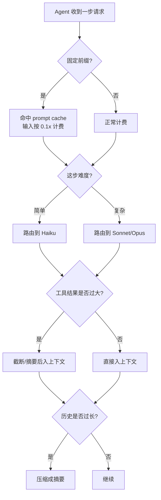

先说一个数字:同样问"帮我查一下这个 bug",发给聊天机器人和发给 Agent,token 消耗能差 **50 倍**。

聊天机器人就一来一回:你发一段、它回一段,结束。Agent 不一样——它跑的是一个循环:看任务、调工具、读文件、改代码、再检查。**循环里的每一步,都要把到目前为止积累的全部上下文,重新发给模型一次。**

这就是 Agent 账单的根源。2026 年有人审计了 30 个在生产环境跑 Agent 的工程团队,一个 20 人的团队,单月 API 账单能冲到 11 万美元;用 Claude Code 或 Cursor 这类编码 Agent 的开发者,人均每月 400 到 1500 美元,失控的案例几天就烧掉 4000 美元以上。

更要命的是,这笔钱不是匀速烧的。Demo 跑得好好的,一上量就爆——大部分企业的 Agent 项目,在大规模铺开后的头 90 天里,实际花销会超出试点预算 4 到 11 倍。所以做 Agent,成本不是上线之后再优化的事,是设计时就得算进去的一笔账。

这篇把这笔账拆开:钱花在哪、怎么找到大头、有哪些真能省的手段、怎么设预算和熔断、怎么监控。

## 钱到底花在哪

先建立一个最反直觉的认知:**Agent 跑一个任务的成本,主要不是输出,是输入。**

模型 API 按 token 收费,输入和输出分开计价。聊天场景里,大家盯着输出看。但 Agent 不一样,它的成本大头在**输入侧的重复计费**。

为什么?因为对话历史会"滚雪球"。Agent 每调一次工具,就要把整段对话历史连同工具返回的结果,一起再发一次。一段已经积累到 10 万 token 的上下文,在后续**每一次**调用里,都按 10 万输入 token 收费——不是只收新增的那部分。一个跑到第 20 步的编码 Agent,光是文件读取塞进来的内容,单步输入就能超过 5 万 token,按 Sonnet 4.6 的价(每百万输入 token 3 美元)算,**每一步 0.15 美元**,二十步就是 3 美元,而这还只是一个任务。

把烧钱的来源列清楚,主要是这四个:

| 成本来源 | 为什么烧钱 |
|---|---|
| 多轮累积 | 历史每轮都重发,N 步任务的输入约为单步的 N 倍量级 |
| 长上下文 | 大 system prompt、塞满的 RAG 检索结果,每次调用都全额计费 |
| 工具结果 | 一次文件读取、一次数据库查询返回几千 token,且永久留在上下文里 |
| 多 Agent | 主 Agent 派生子 Agent,每个子 Agent 自己又是一个完整的 token 循环 |

这四项里,**多轮累积和工具结果是最隐蔽的**——它们不在你写的 prompt 里,是 Agent 自己在运行时长出来的。你 review 代码时看不到,只有看账单才发现。

## 先定位大头,再动手

不要凭感觉优化。第一步永远是**按维度把成本拆开看**,否则你很可能花两天去抠一个只占 5% 的环节。

至少要能按这几个维度归因(attribution):

- **按 Agent / 任务类型**:哪类任务最贵?是"代码重构"还是"简单问答"?
- **按步骤**:成本是均匀分布,还是集中在某几步(比如某个返回巨量结果的工具)?
- **按输入/输出**:再确认一次,是输入贵还是输出贵——多数 Agent 是输入。
- **按用户 / 会话**:是不是 5% 的重度用户烧掉了 80% 的钱?

这里有个观测层的坑要提前知道:Agent 的一次"请求",在 trace 里会炸开成 8 到 15 个 span——API 调用、token 流式输出、embedding 查询、向量库检索、prompt 拼装、guardrail 检查、结果解析……普通 API 接口才 2 到 3 个。如果你的监控是按"请求数"做采样的,Agent 会瞬间把你的可观测性预算也撑爆。所以 Agent 的成本监控,**得按 token 和按美元来记,不能只按请求数**。

拆完之后你大概率会看到一个二八分布:某一两类任务、某一两个工具,吃掉了大半账单。先打这些点。

## 真能省钱的几个手段

定位完大头,下面是 2026 年实测有效的手段,按"性价比"从高到低排。

### prompt caching:第一个要上,几乎免费

这是投入产出比最高的一项,优先级最高。

原理很简单:Agent 的上下文里有一大块是**固定不变的前缀**——system prompt、工具定义、few-shot 示例。每一步调用都把这块重新做一遍前向计算(prefill),纯属浪费。prompt caching 就是把这段固定前缀缓存住,后续调用直接命中缓存。

2026 年的价格,缓存命中的输入 token 只按基础价的 **0.1 倍**收费,也就是 9 折优惠——Anthropic 是这个价,GPT-5.4 现在也对齐到了 90% 的缓存折扣。对一个多轮 Agent,固定前缀往往占输入的一大半,命中率拉高之后,输入成本砍掉 50% 到 90% 是常态。

要拿到这个收益,有个纪律:**别让缓存失效**。缓存命中的前提是前缀逐字节一致。所以要把"不变的东西"放前面、"会变的东西"放后面——system prompt 和工具定义放最前,动态的对话历史和检索结果放后面。一旦你在 system prompt 里塞了个当前时间戳,整个缓存就废了。

### 上下文压缩:对付"滚雪球"的正面手段

prompt caching 省的是固定前缀;滚雪球的对话历史得靠压缩。

最直接的做法是**定期把历史压成摘要**。Agent 跑了 30 步,前 20 步的细节其实没必要逐字带着——把它们总结成一段"已完成:确认了 bug 在 X 模块,排除了 Y 假设",用摘要替换原始对话。Anthropic 在 2026 年 2 月放出的 Compaction API(beta)就是把这件事自动化:让模型自动总结、压缩对话历史,实现近乎"无限"的对话长度,不用手动裁剪或重开会话。

工具结果也要管。一次文件读取返回 5000 token,但 Agent 真正需要的可能只是其中一个函数。可以做的:工具返回时就**截断或摘要**,只保留相关片段;旧的工具结果在后续轮次里**替换成一句占位符**("[此处曾读取 config.py,已处理]")。

### 按难度选模型:别用大炮打蚊子

不是每一步都需要最强的模型。

2026 年 Claude 三档价差很大:Haiku 4.5 是每百万 token 1/5 美元(输入/输出),Sonnet 4.6 是 3/15,Opus 4.7 是 5/25。**Haiku 比 Sonnet 便宜 5 倍,比 Opus 便宜 25 倍。**

一个 Agent 流程里,真正需要顶配模型做复杂推理的步骤可能只占两三成。剩下的——意图分类、格式整理、判断"任务完成了没"、简单的工具参数填充——交给 Haiku 完全够用。做法就是按步骤的难度做路由(routing):简单步骤走小模型,复杂推理才升到 Sonnet 或 Opus。一个 500 输入 / 100 输出 的 Haiku 分类调用,成本大约 0.001 美元,几乎可以忽略。

### 限制步数和递归:给失控的循环装个闸

前面说企业 Agent 超预算 4 到 11 倍,原因之一就是**没有上限的工具调用递归**。

Agent 卡在一个错误里出不来,会一遍遍重试同一个工具;主 Agent 派生子 Agent,子 Agent 再派生……如果没有硬上限,一个本该 10 步的任务能跑成 200 步。必须设硬限制:

- **单任务最大步数**(比如 25 步,到了就强制收尾或交还给人)
- **多 Agent 的递归深度上限**(比如最多 2 层)
- **同一项的重试次数上限**——一个实战配置是:同一项每天最多重试 3 次,两次重试之间至少隔 2 小时,不可重试的错误直接跳过,别困在死循环里

### 缓存工具结果 + batch:能省就省

两个补充手段。

**缓存工具结果**:很多工具调用是确定性的、可重复的——查同一个文档、跑同一个查询。给工具调用层加一个缓存,相同输入直接返回上次结果,连模型调用都省了。语义缓存(semantic cache)更进一步,语义相近的请求也能命中。

**batch(批处理)**:如果你的任务不需要实时返回——离线评测、批量数据标注、夜间跑的报告——走 Batch API,输入输出都打五折。把 prompt caching 的 9 折和 batch 的 5 折叠加,极端情况能把成本压到原来的 5%。代价是异步,最长可能等 24 小时,所以只适合离线场景。

下面这张图是这些手段的处理顺序:

## 给 Agent 设预算和熔断

省钱手段是"开源节流"里的节流。但 Agent 还需要一道**硬性的财务闸门**——再怎么优化,也得有个东西在它失控时直接把它停掉。

这就是成本熔断(cost circuit breaker):预设一个开销上限,Agent 触到上限就强制中断,而不是任由它把账单跑飞。

预算定多少?别拍脑袋。**先量,再定。** 取一个有代表性的两周样本,统计每个完整任务消耗 token 的 p50 和 p95,然后把上限设在 **p95 的 1.5 倍**。这个值能覆盖正常的波动,又能在真正异常时及时触发。

熔断要分层设,至少三层:

| 层级 | 触发条件 | 动作 |
|---|---|---|
| 单任务 | 单个任务 token 超 1.5× p95 | 中断该任务,记录,交还给人 |
| 单用户/会话 | 用户当日累计超额度 | 拒绝新请求或降级到小模型 |
| 全局 | 全组织当日总花销超阈值 | 告警 + 限流,保住核心业务 |

关键点:熔断的动作必须是**确定性的、自动执行的**。运行时的预算治理需要两样东西——明确的限额,加上确定的补救动作。光设个数字、靠人看告警手动去关,等你看到消息,钱已经烧完了。

## 监控该怎么做

最后是监控。没有监控,前面所有的优化都是一次性的——这个月省下来,下个月一个新功能上线又涨回去,你还不知道。

Agent 的成本监控,要盯这几个指标:

- **每任务成本(cost per task)**:最核心的北极星指标。优化做对了,这个数应该往下走。
- **缓存命中率**:prompt caching 的命中率。如果某次发布后它突然掉下来,八成是有人改了 system prompt 把缓存搞失效了。
- **每任务平均步数**:悄悄往上爬,通常意味着 Agent 开始绕路或卡循环。
- **token 成本归因**:持续按 Agent、按用户、按任务类型拆,二八分布的那个"二"要一直盯着。
- **熔断触发次数**:偶尔触发是正常的安全网;频繁触发说明预算设低了,或者真有 Agent 在失控。

把这些接进你现有的可观测性系统,设好告警。一个务实的目标:认真做完一轮成本优化的团队,通常能在 30 天内把 Agent 成本降低 55% 到 75%。

## 一份上线前的清单

把上面的东西收成一张可勾选的表,Agent 上线前过一遍:

- [ ] 成本能按 Agent、用户、任务类型、步骤拆开归因
- [ ] 固定前缀(system prompt、工具定义)放在最前,且已开 prompt caching
- [ ] system prompt 里没有时间戳之类会破坏缓存的动态内容
- [ ] 对话历史有压缩/摘要机制,不会无限滚雪球
- [ ] 工具返回结果会截断或摘要,旧结果会被占位符替换
- [ ] 简单步骤路由到小模型,只有复杂推理才上顶配
- [ ] 设了单任务最大步数、多 Agent 递归深度、重试次数上限
- [ ] 确定性的工具调用结果有缓存
- [ ] 离线、非实时的任务走了 Batch API
- [ ] 三层熔断(单任务/单用户/全局)都已配置,且动作是自动执行的
- [ ] 预算阈值是基于 p95 实测数据定的,不是拍脑袋
- [ ] 每任务成本、缓存命中率、平均步数都在监控里,有告警

最后说一句优先级。如果时间有限,先做三件事:**开 prompt caching、设步数上限、配单任务熔断**。这三样投入小、见效快,而且能挡住最致命的那种"一夜之间烧掉几千美元"的事故。上下文压缩、模型路由这些是细水长流的优化,可以上线之后慢慢调。

Agent 的账单不会自己变小。但只要你知道钱花在哪、装好了闸门,它至少不会变成一个你不敢看的数字。

---

参考资料:

- [AI Agents Burn 50x More Tokens Than Chats — LeanOps](https://leanopstech.com/blog/agentic-ai-cost-runaway-token-budget-2026/)
- [AI Agent Token Cost Optimization: Complete Guide for 2026 — Fastio](https://fast.io/resources/ai-agent-token-cost-optimization/)
- [AI Agent Context Window Cost: The Compounding Math — DEV Community](https://dev.to/waxell/ai-agent-context-window-cost-the-compounding-math-your-architecture-is-hiding-2227)
- [Token optimization 2026: Saving up to 80% LLM costs — Obvious Works](https://www.obviousworks.ch/en/token-optimization-saves-up-to-80-percent-llm-costs/)
- [The Cost Circuit Breaker: Financial Controls for Production AI Agents — Fountain City](https://fountaincity.tech/resources/blog/ai-agent-cost-circuit-breaker/)
- [Runtime Budget Guardrails for Agentic AI — Oracle](https://blogs.oracle.com/ai-and-datascience/runtime-budget-guardrails-agentic-ai)
- [Agentic Token Explosion: Attribute, Budget, and Control LLM Costs — TrueFoundry](https://www.truefoundry.com/blog/llm-cost-attribution-agentic-cicd)
- [AI Agents Are Breaking Your Observability Budget — OneUptime](https://oneuptime.com/blog/post/2026-03-07-ai-agents-breaking-observability-budget/view)
- [Claude API Pricing — Anthropic Docs](https://platform.claude.com/docs/en/about-claude/pricing)
- [OpenAI Batch API 2026: 50% Off Every Model — TokenMix](https://tokenmix.ai/blog/openai-batch-api-pricing)
