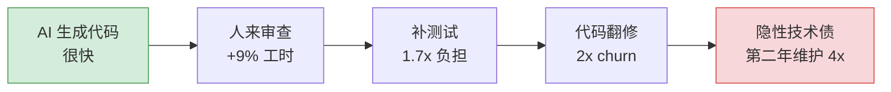
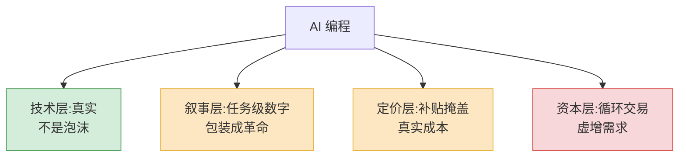

2025 年 7 月,METR 做了一个实验。16 个资深开源开发者,每人在自己熟得不能再熟的项目里干活,平均经验 5 年。246 个真实任务,随机分两组:一组允许用 AI(主要是 Cursor Pro 配 Claude 3.5/3.7),一组不许用。

实验前,这些人预测 AI 能让自己快 24%。干完之后,他们体感觉得 AI 让自己快了 20%。

实测结果:**用 AI 的那组,慢了 19%。**

这不是一个标题党段子。它是目前为止设计最干净的一个随机对照实验,而它的结论,跟你每天在朋友圈、在发布会、在融资 PPT 上看到的"10x 工程师""生产力革命",是相反的。

所以这篇文章想认真聊一件事:AI 编程到底是不是泡沫。我的答案会比较啰嗦——它在某些环节是真东西,在另一些环节是被吹大的气球,而把这两件事混在一起卖,才是真正的泡沫所在。

## 营销数字和实测数字,差在哪

先把两组数字摆出来。

营销侧的数字很漂亮:2026 年 84% 的开发者在用 AI 工具,AI 写了 41% 的新增商业代码,人均每周省下 3.6 小时。受控实验里,对那种"写一个函数""生成一批单测""铺一段样板代码"的细碎任务,提速 30%–55% 是常见的。

这些数字没造假。问题在于它们都是**任务级**的数字——把镜头怼到"写代码"这一个动作上,AI 确实快。

但你把镜头拉远到**组织级**,画面就变了。2025 年的 DORA 报告(Google 做的那份,样本是几千个真实团队)给出的结论很扎心:AI 让个人产出明显上涨——任务完成数 +21%,合并的 PR 数 +98%——但团队的交付速度,基本是平的。同一份报告里,AI 采用度和软件交付**稳定性**是负相关的。

更具体的两个数字:每个开发者引入的 bug 数,涨了 54%(过去的数据集里这个数字只涨 9%);每个 PR 引发生产事故的概率,涨了 242.7%——也就是说,每合一次代码,捅出线上事故的概率翻了三倍多。

| 看哪个层面 | 数字 | 谁在引用 |
|---|---|---|
| 任务级:写一个函数 | 提速 30%–55% | 厂商、发布会 |
| 个人级:周产出 | PR +98%,任务 +21% | 厂商、个人体感 |
| 组织级:交付速度 | 基本持平 | DORA 2025 |
| 组织级:稳定性 | bug +54%,事故/PR +242% | DORA 2025 |
| 资深 + 成熟项目 | 慢 19% | METR RCT |

同一件事,你站在不同的距离看,能得出完全相反的结论。营销永远站在最近的那个位置拍照。

## "AI 写完,人来收拾"的隐性成本

营销数字漏掉的,是 AI 把工作从"写"挪到了"收拾"。这部分成本没消失,只是换了个名字,而且通常没人记账。

METR 那个实验里,AI 给的建议只有 39% 被开发者接受。剩下 61% 要么直接扔,要么改。对那些维护多年、有严格代码规范的成熟项目,AI 生成的代码常常"看着对、品味不对"——命名不一致、复用了不该复用的东西、绕过了项目既定的抽象。资深工程师得花时间一行行审、一行行改。这 19% 的慢,就是慢在这里。

这件事可以拆成一条很清楚的链:

绿色那块是你看得见的收益,红色那块是你账上不记的成本。代码翻修率(code churn,指代码写完后不久就被改写或删掉的比例)从 2021 年的 3.3% 基线,涨到了 2024–2025 年的 5.7%–7.1%。Stack Overflow 2026 年初一篇文章把话说得很直白:**AI 能让开发者 10x,但 10x 的是技术债。**

还有一个更隐蔽的成本:信任。Stack Overflow 的开发者调查里,2025 年说自己信任 AI 输出的开发者只有 29%,比 2024 年掉了 11 个百分点。用得越多,越不敢信——因为大家都被那种"看着对其实不对"的代码坑过。一家 API 安全公司报告,在财富 50 强企业里,每月的安全问题发现数从 2024 年 12 月的 1000 个涨到 2025 年 6 月的 1 万个以上,半年 10 倍。

所以"AI 写完人来收拾"这句话本身没错,错在大家算账时只算了"AI 写"那一段省下的时间,没算"人来收拾"那一段花出去的时间。把两段都记上,很多团队的净收益就接近零,甚至为负。

## 它在哪儿是真的有用

如果只看上面这些,你会以为我要喊"泡沫"了。不。AI 编程有几个环节是**实打实**有用的,我自己每天在用,不是客套。

它真正强的地方,有一个共同特征:**任务边界清楚、验证成本低、犯错代价小。**

- **样板和胶水代码。** 写一个 CRUD 接口、配一个 CI 流水线、把 JSON 转成另一种结构——这类活没有"品味"可言,对就是对,AI 生成完你一眼能看出对不对。
- **陌生领域的第一脚。** 你要用一个没碰过的库,以前要翻半小时文档,现在让 AI 给个能跑的起步代码,你在它基础上改。它把"从零到能跑"这段最难受的冷启动给抹平了。
- **一次性脚本。** 数据迁移、批量改名、跑个分析——写完用一次就扔的代码,质量要求本来就低,AI 在这里几乎没有副作用。
- **测试和文档。** 给已有代码补单测、写注释。这类活枯燥、人容易偷懒,AI 不偷懒。
- **当个会说话的搜索引擎。** "这段报错什么意思""这个正则怎么写"——它替代的是你切到浏览器那几下,省的是上下文切换。

注意,这几样的收益是真的,但它们加起来,是"省了 3.6 小时/周"那个量级的收益,**不是"重新定义软件工程"那个量级的**。是好用的电动工具,不是免费的劳动力。

## 它在哪儿被夸大了

被夸大的部分,也有共同特征:**任务边界模糊、验证成本高、犯错代价大。**

第一个被夸大的,是**复杂系统里的改动**。在一个十万行、跑了五年、到处是隐性约定的代码库里加一个功能,难的从来不是"写代码",是"想清楚改哪、会牵连到什么、符不符合这个项目的脾气"。AI 没有这个项目的上下文记忆,它给你的是一个"局部看起来合理"的方案。METR 那 19% 的慢,慢的就是这个场景。

第二个被夸大的,是**"vibe coding"能进生产**。让 AI 全自动写、你只看结果不看过程,做个周末玩具没问题。但 Karpathy 自己在 2026 年初都把口径改了,提出"Agentic Engineering"来接替 vibe coding,核心多了一个词:**结构化的人类监督**。连造这个词的人都在往回收。

第三个被夸大的,是**省下的时间能直接变成交付速度**。这就是 DORA 报告里那个"个人产出涨、组织速度平"的悖论。原因不难懂:软件交付的瓶颈,本来就很少在"打字"这一步。需求扯不清、评审排不上、QA 跟不上、集成一团乱——AI 把打字这一步加速了,但水管最细的地方没变,整根水管的流量就没变。AI 不会修复一个团队,它只会**放大**这个团队本来的样子。流程好的团队用 AI 如虎添翼,流程烂的团队用 AI 翻车更快。

## 对初级工程师和团队结构的冲击

这部分我想说得重一点,因为它是真问题,而且没什么人愿意正面讲。

AI 最擅长的那些活——改 bug、写测试、铺样板——**恰好就是过去初级工程师练手的活**。这不是巧合,是结构性的撞车。后果已经在数据里:2026 年初级开发岗位的招聘明显收紧,计算机专业毕业生失业率涨到 6%–7%,22–25 岁这个年龄段的开发者岗位,自 ChatGPT 发布以来少了约 20%。

这里有一个会反噬的逻辑链。一个工程师能审查 AI 代码、能判断"这段看着对其实不对",靠的是他当年**亲手写过、亲手踩过坑**积累的判断力。如果初级阶段的练手活全被 AI 接管了,新人没有了犯错和积累的场子,五年后,我们从哪里长出能审查 AI 的资深工程师?

我的判断是:初级岗不会消失,但它的定义被改写了。过去招初级,要的是"能写出代码";现在招初级,要的是"能判断 AI 写的代码对不对",这其实是过去对中级的要求。这等于把入行门槛抬高了一级,而那一级原本是靠在岗位上慢慢爬的。对个人,这意味着你得自己想办法补上"判断力"这一课——多读别人的代码、多关掉 AI 自己写一遍、刻意练习那些 AI 帮你跳过的环节。对团队,这意味着你不能再把初级当廉价产能,得把他们当"未来的资深"来带,而带人的成本,AI 一分钱都帮不上。

## 那么,泡沫论站不站得住

回到标题。我的结论分两层。

**技术和产品这一层,不是泡沫。** AI 编程是真东西,它确实改变了一部分工作方式,这种改变不会回退。说它"永远不行""只是噱头"的人,和说它"明年取代所有程序员"的人,犯的是同一个错——都在拿一个极端当全部。

**但"叙事"和"估值"这一层,泡沫味很浓。** 这里的泡沫有三块:

一是**叙事泡沫**。把任务级的提速数字,包装成组织级的革命,中间那道"个人产出涨、交付速度平"的鸿沟被系统性地隐藏了。

二是**定价泡沫**。GitHub Copilot 在 2026 年 6 月转向按 token 计费,一个动作就暴露了底裤:此前订阅制下,微软每个用户每月亏 20 美元。现在还便宜,是因为有人在替你补贴。补贴停了,价格会回到它真实的成本曲线上。

三是**资本泡沫**。这一轮 AI 基建里大量的"循环交易"——A 投资 B,B 拿钱回头买 A 的产品,在账面上凭空造出需求和营收——这是宏观层面的事,但它会传导下来:补贴退潮的时候,工具会涨价,产品会缩水,期望会落地。

所以"AI 编程是不是泡沫"这个问题本身问错了。正确的问法是:**AI 编程这件事里,哪一部分是真东西,哪一部分是泡沫。** 工具是真的,叙事是泡沫。等补贴退、估值回调、那批靠"AI 全自动"故事融资的公司洗一遍牌之后,留下来的,会是一个**好用但不神奇**的工具——大概就是今天的 IDE、版本控制、CI 在工程师工具箱里的位置。

给还在这行里的人三句实在话。第一,别信任何脱离了上下文的提速百分比,先问"这是哪一层的数字"。第二,把 AI 当电动工具用,在它强的环节(样板、胶水、冷启动、测试)放开用,在它弱的环节(复杂系统、架构判断、品味)自己上手。第三,如果你是初级,或者你在带初级,把"判断力"当成接下来几年最该投资的东西——因为当代码变得廉价,**判断什么代码值得要,会变成最贵的能力。**

泡沫会破,工具会留。把这两件事分清楚的人,不会在这一轮里慌,也不会在下一轮里被收割。
