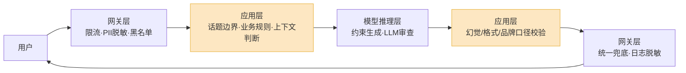
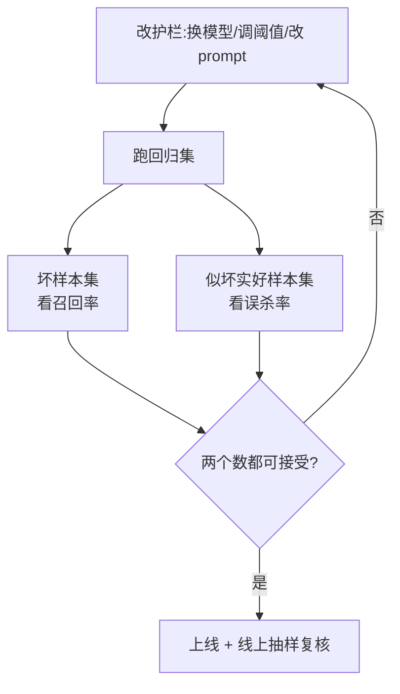

先说一个数字:Guardrails AI 在 2025 年初做过一次基准测试,结论里有句话很刺眼——**单个护栏哪怕准确率有 90%,串五个,误杀率就到 40%**。

这句话基本能概括做护栏的全部难处。你不是在"加保护",你是在一条已经够慢、够贵、够不确定的链路上,再叠一层会拖慢、会误判、还得自己维护的东西。问题不是"要不要护栏"——上线的 LLM 应用一定要有——问题是**护栏管什么、做多厚、放哪一层**。这三件事做错,护栏要么形同虚设,要么把好用户也一起赶跑了。

这篇不讲注入攻击的具体手法(那是另一篇的事),讲更宽的一件事:把用户的输入、模型的输出当成两道关口,这两道关口该怎么修。

## 护栏到底在拦什么

很多团队上来就装个 moderation API,以为护栏就是"过滤脏话"。不是。护栏分两侧,两侧拦的东西完全不一样。

**输入侧**,拦的是用户递进来的东西:

- **敏感信息**。用户在对话里贴了身份证号、银行卡、内部工号、客户手机号。你不想把这些原样喂给第三方模型 API,更不想它们出现在日志里。
- **越界请求**。一个做企业财报问答的 Bot,用户问"帮我写一首失恋的诗"。这不危险,但它**不是这个产品该干的事**——回答了,就是在替竞品做免费体验。
- **明显的恶意输入**。攻击意图、自动化刷量、超长 prompt 灌爆上下文。

**输出侧**,拦的是模型吐出来的东西,这一侧更难,因为输出是模型生成的、不可预测的:

- **有害内容**。暴力、仇恨、自残、违法信息。这是最经典的一类,也是 moderation API 唯一管得好的一类。
- **幻觉**。模型一本正经地编了一个不存在的退款政策、一个错误的药品剂量。在 RAG 场景里,这意味着输出和检索到的资料对不上。
- **格式错误**。你要的是一段能直接 `JSON.parse` 的结构化数据,模型给你前面加了句"好的,这是您要的结果:"。下游程序当场崩。
- **品牌口径**。模型说了"我们的竞品确实更便宜",或者用了一个法务明令禁止的承诺词("保证收益""绝对安全")。没毒,但能上财经新闻。

注意最后两类——**格式**和**品牌口径**——很多人根本不把它当护栏。但它们恰恰是上线后最高频出事的地方。有害内容一年可能出一次,格式错误一天能出一百次。

## 四种做法,从便宜到贵

护栏不是一种技术,是一个工具箱。按"成本/能力"从低到高,有四档。

**第一档:规则与正则。** 关键词黑名单、正则匹配身份证/手机号、长度限制、JSON schema 校验。便宜到几乎不要钱,延迟个位数毫秒,而且**结果可解释**——你能准确说出"它是因为命中了第几条规则被拦的"。缺点也明显:绕得过,且管不了语义。规则适合拦"形状固定"的东西:PII、超长输入、明确的禁用词。

**第二档:专门的分类模型。** 这是 2026 年的主力。Meta 的 Llama Guard 是一个专门微调出来的输入输出安全模型,自带六大类不安全分类,还能自定义类目;OpenAI 的 `omni-moderation-latest` 免费、能同时分类文本和图像。它们的关键优势是**快**——一个专用 guard 模型跑一次大约 29 毫秒,而拿一个大模型当审查员要 5 到 11 秒。但要清楚它们的边界:OpenAI moderation 只做内容分类,**不查注入、不查幻觉、不做 PII 脱敏**。它是基线,不是全部。

**第三档:用 LLM 审查 LLM。** 让另一个模型(或同一个模型换个 prompt)去判断"这条输出有没有问题"。最灵活,能处理"品牌口径""答非所问"这种规则和分类器都搞不定的模糊判断。代价是它**慢且贵**——等于每个请求多一次完整的 LLM 调用,延迟翻倍,成本也翻倍。LLM 审查适合留给"少量、高风险、规则写不出来"的判断。

**第四档:约束生成(constrained decoding)。** 这个和前三档不是一类——前三档是"事后检查",约束生成是"从源头让它不可能错"。它在模型每一步采样时,直接把不符合 JSON schema 的 token 概率压成零,所以输出**必然**结构合法。Outlines、XGrammar 这些库,还有各家 API 的 structured output 都是这个原理。但记住它的边界:**它保证结构对,不保证内容对**。schema 合法的 JSON,字段值照样可以是幻觉。约束生成解决格式护栏,不解决事实护栏。

把这四档对一遍:

| 做法 | 典型延迟 | 能解释 | 管得了什么 | 管不了什么 |
|---|---|---|---|---|
| 规则/正则 | <10 ms | 强 | PII、长度、禁用词、JSON 格式 | 任何需要理解语义的判断 |
| 分类模型 | ~30–90 ms | 中 | 有害内容、注入信号、话题越界 | 幻觉、品牌口径这种细活 |
| LLM 审查 | 0.5–10 s | 弱 | 品牌口径、答非所问、复杂合规 | 它自己也会误判,且贵 |
| 约束生成 | 几乎为零 | 强 | 输出结构(JSON/枚举/格式) | 内容对不对、是不是幻觉 |

没有哪一档能单独搞定所有事。真实的护栏系统是**分层组合**:规则挡掉一眼假的,分类模型处理大头,LLM 审查兜少量疑难,约束生成锁死格式。

## 护栏放在哪一层

做法选完了,还有个位置问题——同一个检查,放网关、放应用、放模型推理层,效果差很多。

我的分配原则是这样:

**网关层放"无状态、与业务无关"的检查。** PII 脱敏、限流、IP 黑名单、超长输入截断。这些东西不需要懂业务,放在最外层,挡掉的请求根本不会消耗下游算力。日志脱敏也必须在这层做死——一旦敏感信息进了应用日志,再清就是事故。

**应用层放"要懂业务"的检查。** 话题边界(财报 Bot 该不该回答写诗)、业务规则(这个用户的权限能不能问这个数据)、需要对话上下文才能判断的东西。这一层是护栏的主战场,因为只有它同时知道"用户是谁""产品边界在哪""检索到了什么资料"。

**模型推理层放约束生成。** structured output 必须贴着推理走,事后再校验格式纯属浪费——既然能从源头保证,就别留给下游收拾。

橙色那两块——**输出进应用层之后、回给用户之前**的校验——是最容易被漏掉、又最关键的。幻觉检查、品牌口径、答非所问,只能在这里做,因为只有这里能拿到完整的"模型说了什么 + 它本该基于什么"。

一个反复出现的错误是**把所有护栏都堆在网关**。图省事,接一个统一的安全中间件。结果就是网关根本不知道业务边界,要么放过一切要么乱拦一气,而最该管的幻觉和口径,它压根没有上下文去管。

## 护栏的成本:延迟和误杀

回到开头那个 40%。护栏不是免费的,它的账单写在两个地方。

**一笔是延迟。** 输入侧的护栏串在用户请求的关键路径上,它慢,用户就等。分类模型几十毫秒还能接受,但你要是图省事拿大模型当审查员,5 到 11 秒——用户早走了。输出侧更麻烦:如果你的应用是流式输出(打字机效果),而输出护栏要等**整段生成完**才能检查,那流式就白做了,用户得对着一个转圈等到最后。这是流式应用做输出护栏时最容易踩的坑。

**另一笔是误杀。** 这笔账更隐蔽。护栏拦错了,代价不是 0,是一个被冤枉的真实用户——他什么也没干错,被弹了一句"抱歉,我无法回答这个问题"。医疗问答 Bot 因为出现"症状"两个字就拒答,编程助手把所有正则表达式请求都当成攻击拦掉,这种事天天发生。

这两笔账还得放在一起算。有个说法很到位:**一张冒犯性输出的截图传到社交媒体上,造成的损失,可能比一整年误杀管理的成本都高。** 风险是不对称的——所以高风险场景(面向公众、涉及未成年人、金融医疗)护栏宁可严一点;但低风险的内部工具,你把护栏调得跟法务一样谨慎,纯属自残。**护栏的松紧,是个业务决策,不是技术默认值。**

## 怎么测护栏本身

护栏是代码,代码就会有 bug,而护栏的 bug 你平时根本看不见——它默默放过该拦的,或者默默拦掉不该拦的,没有报错、没有崩溃。所以护栏必须被单独测试,而且要测两个方向。

很多团队只测一个方向:准备一批"坏样本",看护栏能拦住多少。这只测了一半。护栏有两类错误,得两类都测:

- **漏报(false negative)**:坏的没拦住。用一批已知的有害/越界/幻觉样本测,看**召回率**。
- **误杀(false positive)**:好的被拦了。这个更容易被忽略,但杀伤力更大。你得专门准备一批**长得像坏、其实没问题**的样本——讨论自残话题的心理健康咨询、带"炸弹"二字的化学课提问、正常的退款投诉——看护栏会不会错拦。

把这两批样本固定下来,做成一个回归集。每次调护栏的阈值、换分类模型、改 prompt,都跑一遍。盯两个数:**召回率**(漏了多少坏的)和**误杀率**(冤了多少好的)。这两个数永远在拉扯——调严了召回上去、误杀也上去。你要找的不是某个完美点,是一条**和业务风险匹配的取舍线**。

上线之后还没完。线上要对**被护栏拦掉的真实请求**做抽样人工复核——这是发现误杀的唯一现实途径,因为被冤枉的用户通常不会投诉,他直接走了,你从指标上只看到一个安静下降的留存。

## 过度护栏:管得越多,反而越糟

最后这条,是我最想说的。

护栏给人一种虚假的安全感:多加一层,总没坏处吧?有坏处。回到那个数学事实——五个 90% 准确率的护栏串起来,40% 的请求会被误杀。你以为加的是保险,实际加的是故障率。

过度护栏的几个典型反效果:

- **产品变得没用。** 该回答的不回答。一个谨慎到拒绝讨论任何症状的医疗 Bot,对用户来说和不存在没区别。用户要的是帮助,不是一个不停说"抱歉我无法"的复读机。
- **延迟堆到不可用。** 每层护栏都加几十上百毫秒,叠四五层,本来 1 秒能出的结果变成 3 秒。安全是安全了,没人用了。
- **维护成本失控。** 每个护栏都是要喂数据、要调阈值、要跟着业务变的活物。堆五个,就是五份持续的维护负债。
- **掩盖真问题。** 团队拿"我们有七层护栏"当心理安慰,反而不去做真正该做的事——把 system prompt 写清楚、给模型接上权威知识库、把产品边界设计明白。**护栏是补丁,不是地基。** 一个本身就容易跑偏的应用,糊再多护栏也救不回来。

学术界已经在认真对待"过度拒绝"这件事了——2025、2026 年有不少论文专门研究怎么在不牺牲安全的前提下,降低模型对正常请求的误拒。这从侧面说明:**过度护栏不是小毛病,它是和"护栏不够"同等量级的失败模式。**

正确的心态是:护栏要**少而准**。每加一层之前,先问三个问题——这个风险真的会发生吗?发生了真的严重吗?现有的层挡不住吗?三个都是"是",才加。

## 一份上线清单

把上面的东西收成一张可以直接对照的清单:

**输入侧**
- [ ] PII(身份证/手机号/卡号)在进模型前已脱敏,且日志里也脱敏了
- [ ] 有输入长度上限,挡掉超长 prompt
- [ ] 话题边界明确——产品该回答什么、不该回答什么,有规则
- [ ] 限流和黑名单放在网关层

**输出侧**
- [ ] 有害内容过滤(分类模型,如 Llama Guard / moderation API)
- [ ] 结构化输出用约束生成从源头保证格式,不靠事后修
- [ ] RAG 场景有幻觉/事实一致性检查(输出对得上检索资料)
- [ ] 品牌口径和法务禁用词有校验(高风险时用 LLM 审查)

**工程**
- [ ] 每个护栏分了层:无状态的进网关,懂业务的进应用,格式的进推理层
- [ ] 流式输出的护栏不会逼用户等整段生成完
- [ ] 有护栏回归测试集,**召回和误杀两个方向都测**
- [ ] 线上对被拦请求做抽样人工复核
- [ ] 算过总延迟账:所有护栏叠加后,响应时间还能接受
- [ ] 每一层护栏都问过"这个风险真的值得这层成本吗"

最后一句:护栏的目标不是"零事故",是"在可接受的延迟和误杀成本下,把高风险事件压到足够低"。把它当成一个**有取舍的工程问题**来做,而不是一个"装得越多越安心"的合规动作——这是做好护栏和做砸护栏的分界线。

---

参考:[NVIDIA NeMo Guardrails](https://github.com/NVIDIA-NeMo/Guardrails) · [Guardrails AI Hub](https://pypi.org/project/guardrails-ai/) · [OpenAI Guardrails](https://guardrails.openai.com/) · [Guardrails Index 基准(2025)](https://generalanalysis.com/guides/best-ai-guardrails) · [LLM 护栏延迟实测](https://modelmetry.com/blog/latency-of-llm-guardrails)
