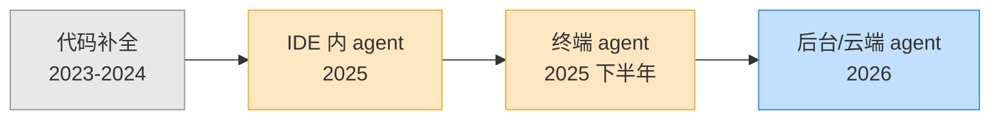
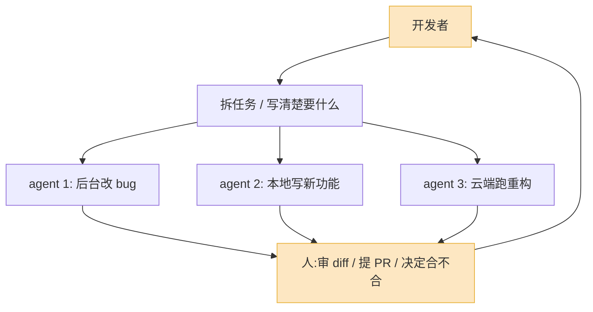

上周三下午,我同时开着四个东西:Cursor 里一个 agent 在改重构,终端里 Claude Code 在跑测试,GitHub 上一个 Copilot 后台 agent 在处理我早上随手丢过去的 issue,还有一个 Cursor 云端 automation 在等 CI 结果。我本人那段时间在干嘛?在看 Linear 上的工单,决定下一个派给谁。

我没写一行代码。但那个下午合并了五个 PR。

这不是什么"未来已来"的感慨。这是 2026 年 5 月一个普通工程师的普通下午。半年前——也就是 2025 年底——我的工作方式还不是这样。那时候 AI 编程工具的主流形态是"一个很聪明的补全",你在编辑器里写代码,它帮你接下一段。现在,补全这件事我几乎已经感觉不到它的存在了,因为我的注意力整个挪到了别处。

这半年到底发生了什么,值得拆开看看。

## 三级跳:补全 → 终端 agent → 后台 agent

如果要给 AI 编程工具这半年画一条线,它是这样三级跳的:

第一级是**补全**:Copilot 那套,光标后面灰字提示,你按 Tab 接受。这个形态决定了一件事——AI 是你的副驾驶,方向盘还在你手里,你得一直盯着路。

第二级是 **IDE 内的 agent**:Cursor 的 Composer、Windsurf 的 Cascade。它不再是接一段,而是"你说要干什么,它跨多个文件改完给你看"。方向盘开始松动了,但你还在车里。

第三级是 **终端 agent**:Claude Code 是把这个形态做出影响力的那个。它干脆不要 IDE 这个壳了,就是个命令行程序,你跟它说话,它自己读文件、改代码、跑测试、看报错、再改。这一步的意义比看上去大——它把 AI 编程从"编辑器里的一个功能"变成了"一个独立的进程"。一旦是独立进程,你就能开很多个,就能让它在后台跑。

第四级,也就是现在,是**后台 / 云端 agent**:活儿不在你机器上跑了。Cursor 的 cloud agents、GitHub 的 coding agent、Cognition 的 Devin,它们在云端的容器里干活,干完给你提个 PR。你甚至可以在手机上派活。

每跳一级,人和代码之间就多隔一层。半年前我的手指还在键盘上,现在我的手指主要在做一件事:点"approve"或者"reject"。

## 当前四强,各自站在哪

把这半年最主流的四个工具摆在一起,它们其实已经不在同一个赛道上竞争了——这是很多人没意识到的。

| 工具 | 当前形态 | 真实定位 | 适合谁 |
|---|---|---|---|
| Cursor(3.4 / Composer 2.5) | AI 原生 IDE + 云端 agent | "派活中枢":本地写 + 云端并行 | 想一个人指挥一支 agent 小队的人 |
| Claude Code(2.x) | 终端 agent + Agent View | "干重活的那个":复杂改动、长任务 | 信任命令行、要做深度改动的人 |
| Windsurf(Wave 13) | AI IDE,归 Cognition | "通往 Devin 的入口" | 喜欢 Cascade 体验、赌 Cognition 的人 |
| GitHub Copilot | 补全 + Agent Mode + 云端 coding agent | "贴着 GitHub 的那个" | 重度 GitHub workflow、企业团队 |

**Cursor** 这半年走得最稳。3.3、3.4 连着发,Composer 2.5 五月中刚出。它现在的核心卖点已经不是"补全多准",而是 `/multitask`——你可以同时开一堆异步子 agent 并行干活,加上云端 automation 能直接从 Linear、Jira、GitHub 读工单、起 PR、回写状态。Cursor 想做的是你的**指挥台**:本地一份 agent,云端一支舰队,你坐中间派活。它甚至能帮你把云端 agent 需要的开发环境(克隆仓库、装依赖、配凭据)自动搭好——因为没有环境,agent 舰队就跑不起来。

**Claude Code** 走的是另一条路。它不抢"IDE"这个身份,就守着终端。这半年它加了 Agent View——一个能同时盯多个后台会话的界面,加了 `/goal`——你给它一个目标,它自己写代码、跑测试、debug、再跑,直到达成。我个人的体感:Claude Code 是这四个里最适合干"脏活重活"的。一个要动二十个文件、还得反复跑测试验证的重构,我现在默认丢给它。它的 fast mode 现在默认跑 Opus 4.7。

**Windsurf** 是这半年最唏嘘的一个。2025 年底它被 Cognition(做 Devin 的那家)以约 2.5 亿美元收购,这中间还夹着 Google 的技术授权和 OpenAI 当初的竞购,过程一地鸡毛。产品本身没死,Wave 13 还带来了多 agent 会话和 Git worktree 支持,2026 年 2 月它在 LogRocket 的 AI 开发工具榜上还排第一。但今年 3 月它把原来便宜、可预测的 15 美元信用额度套餐换成了 20 美元加严格日 / 周配额,直接惹毛了一批老用户。更要命的是定位上的不确定:Cognition 明说了想把 Windsurf 的 IDE 能力并进 Devin。所以现在用 Windsurf,你得想清楚——你是在用一个 IDE,还是在用一个早晚会变成 Devin 入口的东西。

**GitHub Copilot** 是那个"看起来落后、其实没掉队"的。补全起家的它,这半年把 Agent Mode 和云端 coding agent 都补齐了:coding agent 现在能自己选模型、开 PR 前先用 code review 自审一遍、还在流程里跑代码扫描和密钥泄露检查。它最大的护城河从来不是模型,是它长在 GitHub 身体里——issue、PR、Actions、code review 一条龙。五月它还放出了从 JetBrains IDE 把任务交给本地 Copilot CLI agent 的预览。Copilot 不耀眼,但对一个深度绑在 GitHub 上的企业团队,它是阻力最小的选择。

我的判断是:**别再问"哪个最好"了**。这个问题在 2025 年还成立,现在不成立。Cursor 是指挥台,Claude Code 是重型施工队,Copilot 是贴着 GitHub 的传送带,Windsurf 是一张赌 Cognition 未来的票。它们解决的是不同的问题。我自己是 Cursor + Claude Code 一起用,前者派活、后者啃硬骨头,一点都不冲突。

## "终端 agent"为什么会赢

值得单独说一句:为什么 2025 下半年杀出来的是终端 agent 这个形态,而不是更花哨的 IDE?

因为终端 agent 砍掉了"图形界面"这个包袱,换来了三样东西:**可组合、可并行、可上云**。

一个命令行程序,你能用 shell 脚本把它串起来,能在 CI 里调它,能开十个进程同时跑。一个 IDE 你做不到这些——IDE 天生是给"一个人坐在前面"设计的。当 AI 编程从"辅助一个人"变成"同时干很多活",IDE 这个外壳反而成了约束。

注意这张图里,人只出现在两个地方:**开头拆活,结尾审活**。中间那段"写代码"已经不在人的关键路径上了。这就是这半年最实质的变化——它不是工具变好用了,是工作流的形状变了。

Cursor 也很清楚这一点,所以它一边守着 IDE 这个用户习惯,一边拼命往云端 agent 和 `/multitask` 上加码。它在用 IDE 的外壳,装终端 agent 的内核。

## 你的工作从"写"变成了"审"和"派"

这是我最想说的一段,也是这半年我自己感受最深的。

半年前,我的核心技能是写代码。现在不是了。现在我每天花最多时间的三件事是:

**第一,把活拆清楚。** Agent 干得好不好,八成取决于你派活派得清不清楚。一个含糊的"帮我优化下这个模块",和一个"把这个模块的数据库查询从 N+1 改成批量加载,保持现有接口不变,加上对应测试"——出来的东西天差地别。这半年我越来越觉得,**写清楚需求本身就是一种正在升值的技能**。Claude Code 的 `/goal` 之所以好用,前提是你得能说清楚那个 goal。

**第二,审 diff。** 这是最累、也最危险的一件事。Agent 一天能给你交十几个 PR,业界数据是引入 agent 后 PR 数量涨了 40% 到 60%。问题来了:你审得过来吗?审不过来就会有人开始"假装审过了"——扫一眼,点 approve。这是 2026 年最真实的风险,不是 AI 写出 bug,是**人审不动了,于是不审了**。

我给自己定了条规矩:**agent 写的代码,审查标准要比人写的更高,不是更低**。因为人写错了通常错得"有道理"、好猜;agent 错起来经常错得很离谱、很自信,藏在一堆看着没问题的代码中间。

**第三,决定什么不交给 agent。** 这点反直觉但很重要。核心架构、安全边界、那些"错了代价很大"的地方,我现在反而更倾向自己写,或者自己写完让 agent 来挑错。会派活的人不是把所有活都派出去的人,是知道**哪些该派、哪些该自己攥着**的人。

工具厂商其实也在顺着这个变化走。GitHub Copilot 的 coding agent 现在开 PR 前会先自审一遍、跑安全扫描——本质上是它知道"人审不过来了",所以先帮你过一遍。Cursor 给你看 agent 的 context 用量,也是同一个逻辑:当你不亲自写,你至少得知道它在想什么。

所以如果你问我,这半年一个开发者最该练的是什么,我的答案是三个词:**拆活、审 diff、判断边界**。写代码的肌肉不会废掉——你得能写,才看得懂 agent 写的——但它不再是那块最值钱的肌肉了。

## 接下来半年,我赌什么

简单说几个判断,赌错了年底再来认。

**后台 agent 会变成默认,但"全自动"还早。** 派活给云端 agent、它提 PR 给你审,这套流程会变成常规操作。但"把整个需求扔进去、不管了"——Devin 那个最初的承诺——我认为这半年还到不了。卡点不在模型聪不聪明,在**验证**:你怎么确认它真做对了?在这个问题被解决之前,人必须留在审查这一环。

**工具会继续分化,不会收敛。** 不会出现一个"赢家通吃"的 AI IDE。终端 agent、IDE、云端 agent 是三种不同的形态,服务三种不同的场景,它们会长期共存。你最终大概率是手上同时握着两三个,按场景切。

**审查会变成瓶颈,然后变成新工具的战场。** 当 agent 产出快到人审不过来,下一波工具竞争的焦点不会是"写得更快",而是"帮你审得更快、更可信"。谁能让人重新跟得上 agent 的产出速度,谁就赢下 2026 下半年。

半年前我担心的是 AI 会不会写不好代码。现在我不担心这个了——它写得够好。我现在担心的是另一件事:当写代码这件事变得这么便宜,我们会不会因为审不过来,而让一堆没真正看懂的代码,合进了主干。

工具的演化已经跑到前面去了。该追上的,是我们自己审视代码的方式。
