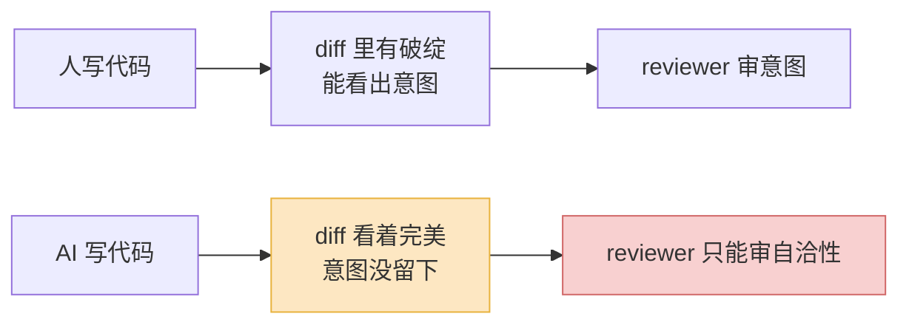
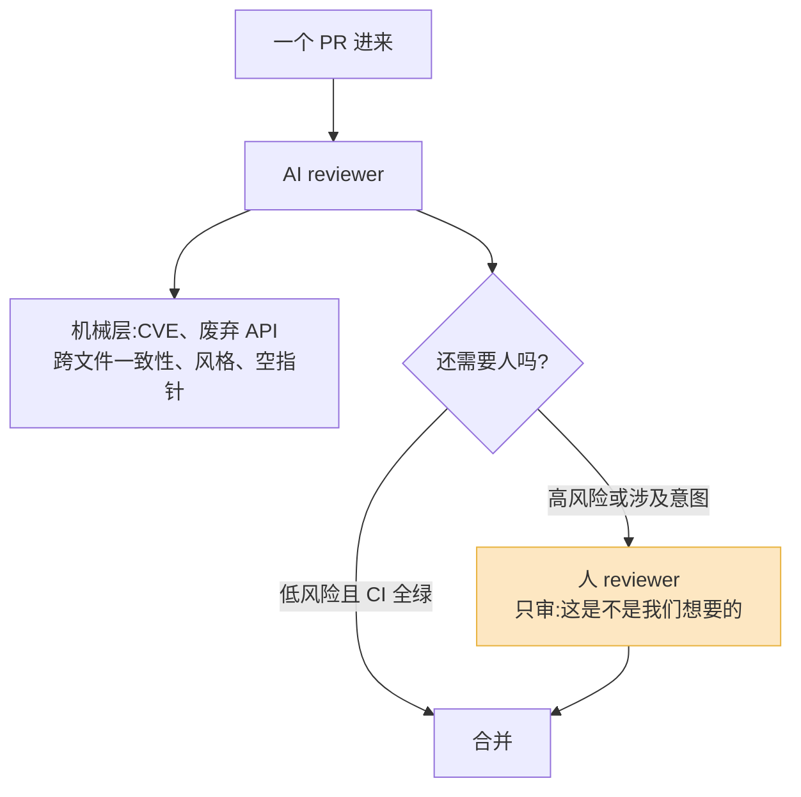

一个用 AI 写代码的开发者,现在一天能开五六个 PR。

而审你 PR 的那个人,一天还是只能审五六个。

这两个数字凑在一起,就是 2026 年大多数工程团队真正的麻烦。Faros AI 的数据里,高 AI 使用率的团队完成的任务多了 21%、合并的 PR 多了将近一倍,但 PR 的 review 时长涨了 91%——而且那些 PR 还更大。Opsera 一份覆盖 25 万开发者的报告说得更直白:在没有治理的情况下,AI 生成的 PR 在 review 队列里等的时间是普通 PR 的 4.6 倍,哪怕从写完到提 PR 的时间砍掉了一半多。

写代码这件事,被 AI 解决了一大半。审代码这件事,一点没变。瓶颈就这么从「写」挪到了「审」,而且大多数团队还没意识到。

## 为什么 AI 写的代码,审起来反而更难

直觉上,AI 代码该更好审才对——它风格统一、不会忘加分号、命名规规矩矩。但真审过 AI 大批量产出的代码的人都知道,事情反过来了。AI 代码难审,难在三个地方。

**第一,它看着太合理了。** 人写错代码,常常会留下「破绽」——变量名词不达意、缩进乱、注释和代码对不上,这些视觉信号会让 reviewer 警觉。AI 不会。AI 写的错误代码,长得和正确代码一模一样:命名得体、结构清晰、注释贴心。CodeRabbit 的研究说 AI 写的代码暴露的问题比人写的多 1.7 倍,而这些问题里相当一部分是逻辑错误——业界一个被反复引用的说法是,AI 代码的纯逻辑错误率比人高约 75%。一个长得人模人样的函数,你的大脑会默认它没问题,于是真正的 bug 藏在「看着合理」的外壳里溜过去了。

**第二,量。** 一个 reviewer 以前一天面对的是三五个 PR、每个两三百行。现在是十几个 PR,而且单个更大。注意力是有总量的——审第一个 PR 时你逐行读,审到第八个时你已经在「扫」。Review 质量不是匀速下降的,是过了某个阈值之后断崖式塌掉的。量本身就是一种攻击。

**第三,意图断了。** 人写代码,脑子里有一条没写下来的推理链:为什么用这个数据结构、为什么这里要加锁、为什么宁可慢一点也不并发。Reviewer 审的其实是这条链。AI 生成代码时,这条链在 prompt 和模型权重里,没留在 diff 里。你看到的是结论,看不到「为什么」。于是 review 退化成「这段代码自己自洽吗」,而不是「这段代码做的是不是我们真正想要的事」——后者才是 review 的价值所在。

把这三点合起来:更隐蔽的错误、更大的量、更稀薄的意图。这不是「AI 代码质量差」的问题,是 review 这个动作的前提被抽掉了。

## 人审扛不住量,第一反应往往是错的

发现 reviewer 堵住了,团队的第一反应通常是这几个,而它们大多没用,甚至有害。

**「招更多 reviewer」** ——慢、贵,而且高级工程师本来就稀缺。更要命的是,AI 产代码的速度还在涨(有统计说人均产出 2025 到 2026 一年涨了约 60%),你招人的速度永远追不上模型迭代的速度。这是一场你结构性赢不了的军备竞赛。

**「review 快一点」** ——把每个 PR 的 review 时间压缩,等于直接降低 review 质量。前面说过,AI 代码的错误本来就更隐蔽,你越快扫,漏得越多。这是用「看起来通畅」换「实际上失控」。

**「先合了再说,出问题再修」** ——在 AI 时代尤其危险。以前一个有问题的模式进了主干,影响范围有限。现在 AI 会以那段代码为样本,在下一次生成时把同样的错误复制到十个地方。坏模式的传播速度,跟生成速度一样快。

真正有用的方向只有一个:**别让所有代码都用同一种强度去审。** Review 是稀缺资源,稀缺资源必须分配,不能平摊。

把进来的变更分层。一个能落地的分法是这样:

| 变更类型 | 例子 | 审法 |
|---|---|---|
| 低风险机械改动 | 改文案、加日志、补测试、依赖小版本升级 | AI 审 + CI 把关,人抽查 |
| 中风险常规功能 | 已有模块里加一个接口、改一个表单 | AI 先过一遍,人审「意图」那一层 |
| 高风险核心改动 | 鉴权、计费、并发、数据迁移、对外 API | 人逐行审,且必须是熟悉该模块的人 |

关键不是这张表本身,是承认一件事:**不是所有代码都值得人来审。** 让你最贵的工程师去逐行看一个改 UI 文案的 PR,是对稀缺资源的浪费,也是在透支他审计费系统时该有的注意力。把人的注意力,留给真正需要人类判断的地方。

## AI 审 AI 的代码,到底靠不靠谱

既然量是 AI 带来的,那让 AI 来审,逻辑上很顺。现在 AI code review 工具已经是个成熟品类,几十个产品,有真实的 ROI 数据。但「靠不靠谱」要分两面说。

**靠谱的那一面:** AI reviewer 在「机械层」上是真的好用,而且能做到人做不到的事。它能记住整个依赖树里哪些包有已知 CVE、哪些 license 不合规、哪些 API 已经废弃;能在跨文件的几十个改动里发现「这个函数签名变了但那边三个调用没改」。有评测说,能看全代码库的工具,比只看单个 diff 的工具多抓出 40%~60% 的跨文件问题。这类活,人本来就做不好——人记不住那么多东西。

**不靠谱的那一面,要说透。** AI 审 AI,有一个结构性的盲区:**它们共享同一套训练分布。** 2026 年初有研究指出,「生成 Agent + 审查 Agent」的流水线里,第一个 Agent 的错误经常被第二个 Agent 直接放行——因为它们出自同一个分布,缺乏「对抗性的差异」,自审最后退化成把原来的错误又确认了一遍。还有一篇 2026 年 2 月的论文更狠:就算是异构的多 Agent 团队,整体表现也稳定地打不过其中最强的那个单一成员,失败机制是「为了达成共识而牺牲专业判断」。

翻译成大白话:**AI 会和你一起犯同一个错,而且犯得很自信。** 你写 prompt 时漏掉的那个约束,生成的 Agent 不知道,审查的 Agent 同样不知道——它没法审出一个它自己也意识不到的需求。这正是 review 最该抓的那种错:不是「代码写错了」,是「代码做的不是我们要的事」。

另一个具体限制:AI reviewer 一旦喂的代码太多就垮。一个上千行的 diff 会撑爆上下文窗口,模型开始丢失连贯性,看不到改动之间的关联。它在小而聚焦的 PR 上表现最好——这反过来也说明,PR 该小,本来就该小。

所以我的判断是:**AI 审机械层,人审意图层,两者不是替代关系,是分工。** 把 AI 当成那个不知疲倦、记性超好、但永远不会质疑需求本身的初级 reviewer。它清场,人做判断。指望 AI 把人这一层也包了,是把它最不擅长的事派给了它。

## 测试和类型系统,从「保险」变成「地基」

以前我们说测试和类型系统是「锦上添花的工程素养」。在 AI 时代,它们的角色被彻底放大了——它们成了你**唯一能规模化、不靠人盯的那道防线**。

道理很简单。人 review 不可规模化,AI review 有共享盲区,但一个类型检查、一个测试用例,是确定性的:它对一行代码和对一百万行代码,执行的是同一套标准,不会因为今天是第八个 PR 就走神。AI 能把生产代码的速度提十倍,但它没法提高你 review 的速度——能跟上这个速度的,只有自动化的、确定性的校验。

具体几条,都是能马上做的:

- **类型系统要严。** 能上严格模式就上严格模式。AI 很爱写「看着对、类型上其实有洞」的代码,一个严格的类型检查器会在 review 之前就把一类错误挡掉,而且零成本、零情绪。
- **测试覆盖的是意图,不是行数。** 别用覆盖率数字考核——AI 生成高覆盖率但什么都没验证的测试,毫不费力。要写的是「断言业务规则」的测试:这笔订单在这个条件下必须被拒。这种测试,AI 之后改坏了逻辑,它会立刻红。
- **测试本身也得审,而且要人审。** AI 写功能、又顺手把测试写了,这是个陷阱:它可能写一个「永远会过」的测试来配合一段错的实现。审 AI 代码时,测试那部分要单独、用人的眼睛看。
- **把校验往左移。** 类型检查、静态扫描、安全规则、测试,全塞进 CI 的硬门禁。能在代码进 review 队列之前就拦下的问题,就别留给那个已经在审第八个 PR 的人。

一句话:**人和 AI 都会累、会走神、会有盲区,确定性的检查不会。** 在代码量爆炸的时代,把质量赌在「有人会仔细看」上,是不可持续的;把它建在自动化门禁上,才扛得住量。

## 团队流程,得跟着改

工具和分工都到位了,最后是流程。不改流程,前面都白搭。几条具体的:

**PR 必须小,而且单一意图。** 这条从「最佳实践」升级成了「硬约束」。reviewer 的带宽是整个系统的瓶颈,而瓶颈必须被主动管理。一个改了八件事的千行 PR,人审不动,AI 也审不动(上下文撑爆)。规矩要立死:一个 PR 只干一件事。AI 让你写得快,但不该让你把八件事打包成一个 diff 甩给别人。

**PR 描述要写「为什么」,这是在补回断掉的意图链。** 2026 年一个合格的 PR 描述应该回答四件事:这个改动想干什么、为什么这么干(一两句);怎么证明它能跑(测试 + 手动验证步骤);风险多大、哪些部分是 AI 生成的;以及——明确点出 1~2 个「请人重点看这里」的地方。最后这点最关键:让提 PR 的人(他脑子里有意图)主动告诉 reviewer 该把注意力放哪。diff 该读起来像一份「意图说明书」,而不是一堆代码行的堆砌。

**「谁提的 PR,谁对它负责」要写进规矩。** 用 AI 生成的代码,不等于责任也外包给了 AI。「这是 AI 写的」永远不能成为甩锅的理由。你按了那个生成键,你提了这个 PR,这段代码就是你的。这条不立清楚,所有人都会松懈,因为没人觉得自己该为一段「不是我写的」代码负责。

**测 review 这个环节本身。** 既然瓶颈在这,就得给它装仪表盘:PR 在队列里平均等多久、单个 PR 多大、合并后多久出回滚或 hotfix。这些数字会告诉你 review 是不是正在悄悄塌掉——大多数团队是数字已经很难看了才后知后觉。

## 写在最后

AI 没有消灭 review,它把 review 推到了聚光灯下。

以前 review 是写代码顺带的一环,藏在流程里不显眼。现在写代码便宜到几乎免费,「这段代码到底对不对、是不是我们要的」这个判断,就成了整个交付流程里最贵、最不可替代的一步。

所以别再盯着「怎么让 AI 写得更多」了——那个问题基本解决了。真正该花力气的是另一边:**把 review 重新设计一遍。** 让确定性的检查去扛量,让 AI 去扛机械层,把人最稀缺的判断力,集中投到「这段代码是不是在做我们真正想做的事」上。

AI 写的代码谁来审?机械层交给 AI,量交给自动化门禁,意图——只能是人。而且得是清醒的、注意力没被第八个 PR 耗光的人。把流程改成能保住这份清醒的样子,这件事,没有任何模型能替你做。

---

参考资料:

- [Code Review Is the Real Bottleneck of 2026 — And Most Teams Don't See It](https://dev.to/code-board/code-review-is-the-real-bottleneck-of-2026-and-most-teams-dont-see-it-5eed)
- [The AI Code Review Bottleneck Is Already Here. Most Teams Haven't Noticed.](https://levelup.gitconnected.com/the-ai-code-review-bottleneck-is-already-here-most-teams-havent-noticed-1b75e96e6781)
- [Code Review in the Age of AI — Addy Osmani](https://addyo.substack.com/p/code-review-in-the-age-of-ai)
- [The Specification as Quality Gate: Three Hypotheses on AI-Assisted Code Review (arXiv)](https://arxiv.org/pdf/2603.25773)
- [How Accurate Is AI Code Review in 2026? — CodeAnt](https://www.codeant.ai/blogs/ai-code-review-accuracy)
- [Scaling Code Reviews: Adapting to a Surge in AI-Generated Code — Salesforce Engineering](https://engineering.salesforce.com/scaling-code-reviews-adapting-to-a-surge-in-ai-generated-code/)
- [5 AI Code Review Pattern Predictions in 2026 — Qodo](https://www.qodo.ai/blog/5-ai-code-review-pattern-predictions-in-2026/)
