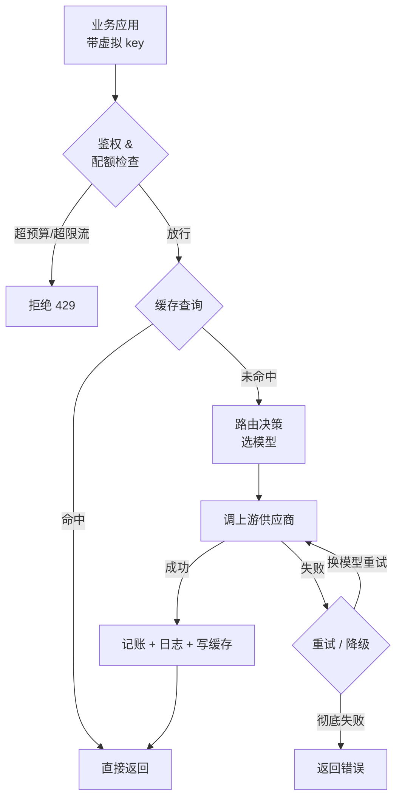

先说一个反常识的事:**大多数团队的"第一个 LLM 网关"不是装出来的,是不知不觉写出来的。**

最初你的代码里只有一句 `openai.chat.completions.create()`。后来 OpenAI 半夜抽风,你在外面包了个 `try/except`,失败就调 Anthropic。再后来财务问"这个月十几万的 token 花在哪了",你又加了一段记账逻辑。再后来某个客户的流量把你的限额打爆,你又写了个令牌桶。

这些 `if/else` 散在三个仓库、五个文件里,没人敢动。这就是网关——一个**没有名字、没有人维护、谁碰谁倒霉**的网关。

所以问题从来不是"要不要 LLM 网关",而是"这层东西,是攒成一坨烂代码,还是收拢成一个能被维护的组件"。这篇就讲清楚:它到底该管什么、自建还是用现成、路由策略怎么定,以及它本身会带来什么麻烦。

## 网关到底替你扛了什么

把它想成 LLM 调用的反向代理:你的应用只跟网关说话,网关再去跟一堆模型供应商打交道。它该扛七件事,但**这七件事的优先级差得很远**。

| 能力 | 解决什么 | 优先级 |
|---|---|---|
| 统一 API | 一套 OpenAI 格式的接口调所有模型,换模型不改业务代码 | 必须 |
| 故障转移 | 某家供应商挂了 / 限流了,自动切到备用 | 必须 |
| 密钥管理 | 上游真 key 收在网关,业务侧只发"虚拟 key" | 必须 |
| 限流配额 | 按 key、按团队、按租户限 QPS 和预算 | 高 |
| 成本核算 | 每次调用算钱,按业务线 / 用户出账单 | 高 |
| 可观测 | 全量请求日志、延迟分位、错误率、token 用量 | 高 |
| 缓存 | 命中过的请求直接返回,省钱省延迟 | 看场景 |

前三个是"接了第二个模型就立刻需要"的。中间三个是"上了生产、有了多个调用方"之后绕不开的。最后一个——缓存——别一上来就上,后面单独说。

**统一 API** 是地基。2026 年的事实标准是 OpenAI 的 `/v1/chat/completions` 格式:几乎所有网关都对外讲这套协议,对内再翻译成 Anthropic、Gemini、Bedrock、火山引擎、通义各自的方言。好处很直接——你的业务代码里不该出现任何一家供应商的 SDK,只有一个 base_url 指向网关。换模型这件事,从"改代码、过测试、发版"变成"网关上改一行配置"。

**故障转移**是第二个动机,也是最容易被低估的。单家供应商的可用性,你别指望它有四个九。OpenAI、Anthropic 在 2026 年都还会有区域性的限流和抖动。网关该做的是:一次请求失败(超时、5xx、429),先重试 N 次,还不行就**降级到另一个模型组**。注意是"模型组"不是"模型"——GPT-5 这一组里可以同时挂 OpenAI 直连、Azure OpenAI 两个部署,先在组内负载均衡,整组都不行了再跨组降级到 Claude。

**密钥管理**是个安全问题。你不会希望真正的 OpenAI key 散落在二十个微服务的环境变量里——那意味着二十个泄漏点,而且轮换一次 key 要发二十次版。网关的做法是:真 key 只存网关一处,业务侧拿到的是网关签发的**虚拟 key**,每个虚拟 key 自带预算上限、限流和过期时间。哪个团队的 key 泄漏了,网关上吊销一个,不影响别人。

## 一次请求在网关里走过的路

把这几件事串起来,一次调用大致是这样:

这条链路里值得强调一点:**鉴权和配额检查必须在最前面**。如果你把它放在调用上游之后,那超预算的请求会先把钱花掉再被拒绝,限流形同虚设。先验票,再放行,再花钱。

另一点:记账、日志、写缓存都该在拿到响应**之后异步做**,不要让它们卡在用户的关键路径上。网关给业务请求加的延迟,越接近零越好。

## 自建还是用现成的

这是大多数团队真正纠结的地方。先把选项摆清楚——下面这些都是真实在用的东西:

- **LiteLLM**:开源,Python 写的代理,目前最主流的自建选择。统一 100+ 模型、虚拟 key、预算、降级、成本追踪、带管理界面,功能很全。
- **OpenRouter**:托管服务,一个 key 接几百个模型,接入最快。本质是个聚合层 + 计费层,适合快速起步和做模型选型实验。
- **Portkey**:托管为主,主打可观测——全量日志、链路追踪、护栏、预算,偏生产化运营。
- **Cloudflare AI Gateway / Vercel AI Gateway**:如果你的应用本来就跑在这两家的平台上,网关能力近乎"顺手就有",分析、缓存、限流都集成好了。
- **Bifrost**:开源,用 Go 写的,主打性能——号称 5000 RPS 下额外开销只有约 11 微秒。如果你嫌 Python 网关那 10–50ms 的开销肉疼,这是个方向。

我的判断,按团队阶段分:

**早期、还在做模型选型**——直接用 OpenRouter。你现在最需要的是"今天换 Claude、明天试 Gemini"的灵活度,不值得为此先搭一套基础设施。

**上了生产、有合规要求**——自建 LiteLLM 或 Bifrost。原因不是省钱(托管服务的抽成其实不高),而是**数据**:你所有的 prompt 和回复都流经这一层,这是公司最敏感的资产之一。把它放进自己的 VPC,审计、合规、数据驻留这些事才好交代。金融、医疗这类场景基本没得选,必须自建。

**不想养基础设施团队、但要生产级运营**——Portkey 这类托管网关是合理的中间档,你拿可观测和护栏,代价是数据出门和按量付费。

一个常被忽略的点:自建不等于零成本。2026 年 3 月,LiteLLM 的 1.82.7、1.82.8 两个版本出过一次供应链投毒,受影响版本被下架、1.83.0 才修干净。**你的网关是全公司 LLM 流量的咽喉**,自建意味着这个咽喉的补丁、监控、值班都归你。别把"自建"想成一次性的活。

## 路由策略:网关最有意思、也最容易过度设计的部分

有了网关,"一个请求该用哪个模型"就成了可以动态决定的事。常见三种路由维度:

**按成本路由。**这是最实在的省钱手段。2026 年初的行情大致是:旗舰模型每百万 token 三五十美元,中端十来美元,轻量级一两美元,小模型一两毛。而你的请求里,可能七成是"把这段话改通顺""判断这条评论是不是投诉"这种小活儿——这些活儿用小模型的质量和旗舰模型没有可感差距。把简单请求分流到便宜模型,平均成本能掉一大截,体感却不变。

**按能力路由。**反过来:涉及多步推理、长上下文、写代码的请求,送旗舰模型。难点在于"怎么判断一个请求难不难"——

- 最笨但最稳:**业务侧自己标**。你比网关更清楚这个调用是"客服闲聊"还是"合同审查",在请求里带个 `tier: complex` 字段,网关照着分流。我推荐先用这个。
- 进阶:**语义路由**,网关用一个小模型 / embedding 实时判断请求归哪一类再分流。它的代价是**每个请求多 50–100ms**,而且多了一个判断错了就全错的环节。语义路由真正划算,通常是你能清晰划出 3–10 类查询的时候;类别糊成一团时,它带来的麻烦比收益多。

**按延迟路由。**实时语音、输入补全这种场景,延迟是硬指标,网关该把请求送给当前 TTFT 最低的部署,并把慢的部署临时摘掉。

我的态度很明确:**先上"按成本"的粗路由,而且让业务侧自己打标签。** 别一开始就上语义路由。我见过太多团队,路由逻辑本身比它要路由的业务还复杂,最后没人搞得清一个请求为什么走了那条线——省下的那点钱,全赔进排查时间里了。路由策略的复杂度,要配得上你真实的流量规模。

## 缓存:看着诱人,但有刺

缓存值得单独拿出来说,因为它是这七项里**最容易出事**的一个。

精确缓存没什么争议:prompt 一字不差命中过,直接返回,省钱省延迟。问题在**语义缓存**——用 embedding 找"意思相近"的历史请求然后复用答案。它确实能提命中率,但两个坑很深:

一是**相似不等于相同**。"北京今天天气"和"上海今天天气" embedding 距离很近,答案却必须不同。语义缓存的相似度阈值卡松了,就会把张三的答案返给李四。

二是**新鲜度**。涉及实时信息、用户个性化、带时间语义的请求,根本不该走缓存。

所以缓存别全局开。务实的做法:先只对**明确无状态、答案稳定**的请求开精确缓存——比如固定的内容分类、把文档切块打标签这类批处理。语义缓存留到你有数据证明"这一类请求确实高度重复"时再说,而且阈值要往严了卡。

## 它本身的代价:多一跳,和一个新的单点

网关不是白拿的。两个代价必须摆上台面。

**多一跳延迟。**所有流量绕一道。如果网关跟你的应用同机房、同 VPC,这一跳也就个位数毫秒,相对 LLM 动辄数百毫秒到数秒的响应,可以忽略。但要是网关部署在另一个区域,或者用了托管服务而它的入口离你很远,这一跳可能加上几十毫秒甚至更多。**实时语音这种掐着毫秒过日子的场景,尤其要量一量这一跳到底多长。** 顺带一提,Python 写的网关进程本身会贡献 10–50ms 的处理开销,Go 写的(如 Bifrost)能压到微秒级——流量大、延迟敏感时,这个差别是真金白银。

**新的单点故障。**这是更要命的。你做网关的初衷之一是"某个供应商挂了不至于全挂",可一旦所有流量都过网关,**网关自己挂了,就是全挂**——而且挂得比任何单一供应商出事都彻底。这不是不用网关的理由,是必须把网关本身做成高可用的理由:多副本、跨可用区、配置和状态外置,健康检查要快。说白了,你把可用性的赌注从"分散在各家供应商"换成了"押在自己的网关上"——那就得真把它当核心基础设施来运维,而不是当一个内部小工具。

## 收个尾:务实的上法

如果你正要把那坨散落的 `if/else` 收拢成一个正经网关,顺序建议这样:

1. **先做统一 API + 故障转移 + 虚拟 key。** 这三件立刻见效,而且不需要你想清楚任何路由策略。
2. **再补限流、配额、可观测。** 等你有了多个调用方、财务开始问钱花哪了,这些自然就该上了。
3. **路由从最粗的"按成本"开始,标签让业务侧自己打。** 跑一阵,拿真实数据说话,再决定要不要上语义路由。
4. **缓存最后,而且先只开精确缓存。** 语义缓存等到有数据支撑再碰。
5. **从第一天起就把网关当核心基础设施**——多副本、跨可用区、有人值班、补丁跟紧。它是你全公司 LLM 流量的咽喉。

LLM 网关不神秘。它就是你迟早会写的那层代码——区别只在于,你是任由它烂在五个文件里,还是趁早把它收成一个有名字、有人管、能演进的东西。接第二个模型的那天,就是动手的那天。

---

*参考:[Best AI Gateway Tools in 2026](https://dev.to/lightningdev123/best-ai-gateway-tools-in-2026-for-scalable-llm-applications-4dg)、[Best LLM Routers in 2026](https://www.edenai.co/post/best-llm-routers)、[LiteLLM 文档](https://docs.litellm.ai/docs/)、[Bifrost(maximhq)](https://github.com/maximhq/bifrost)、[What Is an AI Model Router](https://www.mindstudio.ai/blog/what-is-ai-model-router-optimize-cost-llm-providers)。*
