## 为什么WebSocket对AI Agent至关重要

AI Agent系统的核心特征是**持续对话**和**流式响应**。传统HTTP的请求-响应模式天然不适合这种场景：

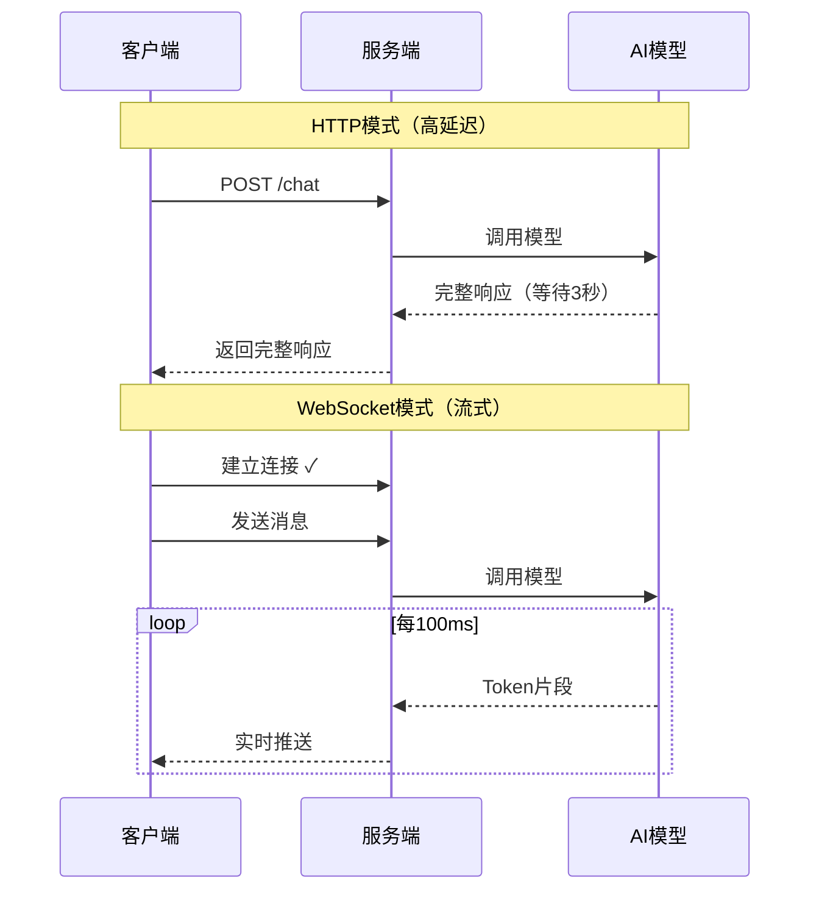

> **关键差异**: WebSocket让用户在AI"思考"的同时就能看到响应，感知延迟降低80%以上。

---

## 性能瓶颈全景图

在生产环境中，WebSocket性能问题通常出现在四个层面：

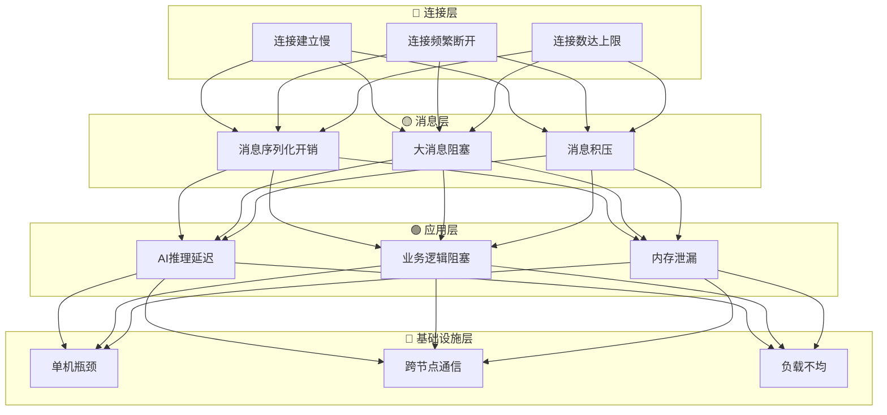

---

## 连接管理：稳定性的基石

### 连接生命周期

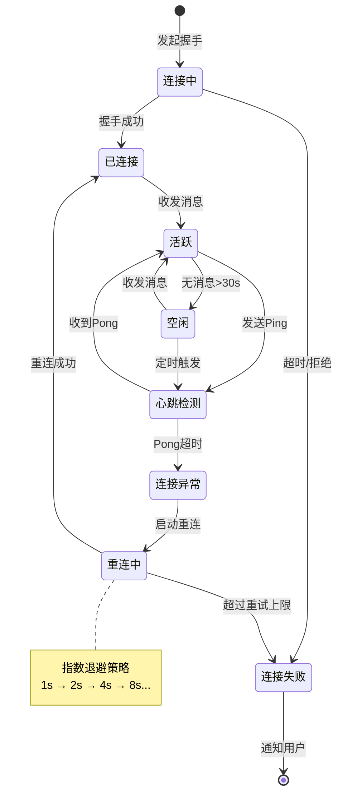

### 心跳策略对比

| 策略 | 间隔 | 优点 | 缺点 | 适用场景 |
|------|------|------|------|----------|
| **固定心跳** | 30s | 简单可靠 | 资源浪费 | 连接数少 |
| **自适应心跳** | 30s-5min | 节省资源 | 实现复杂 | 移动端 |
| **按需心跳** | 仅空闲时 | 最省资源 | 检测延迟 | 高频消息 |
| **应用层心跳** | 业务决定 | 灵活可控 | 需要配合 | 定制场景 |

### 重连的艺术

指数退避（Exponential Backoff）是重连的标准策略，但细节决定成败：

```mermaid
gantt
    title 重连退避时间线
    dateFormat s
    axisFormat %S秒
    
    section 重试1
    等待1秒     :a1, 0, 1
    尝试连接    :crit, a2, after a1, 0.5
    
    section 重试2
    等待2秒     :b1, after a2, 2
    尝试连接    :crit, b2, after b1, 0.5
    
    section 重试3
    等待4秒     :c1, after b2, 4
    尝试连接    :crit, c2, after c1, 0.5
    
    section 重试4
    等待8秒     :d1, after c2, 8
    尝试连接    :done, d2, after d1, 0.5
```

> **关键优化**: 添加随机抖动（Jitter），避免大量客户端同时重连导致"惊群效应"。

---

## 消息协议优化

### JSON vs 二进制协议

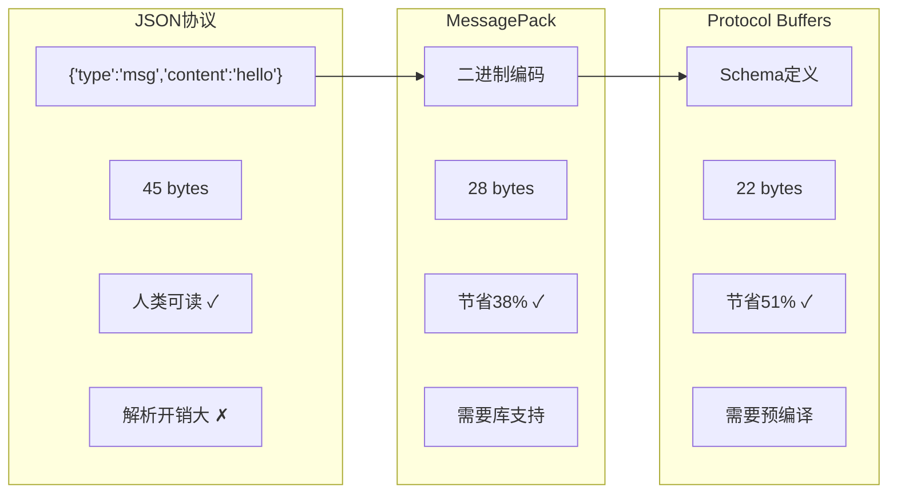

### 消息类型设计

一个设计良好的AI Agent消息协议：

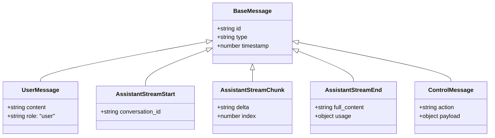

### 消息优先级队列

不同类型的消息应该有不同的优先级：

| 优先级 | 消息类型 | 处理策略 |
|--------|----------|----------|
| 🔴 **Critical** | 心跳、打断信号 | 立即处理，跳过队列 |
| 🟠 **High** | 用户输入 | 优先处理 |
| 🟡 **Normal** | AI响应流 | 正常队列 |
| 🟢 **Low** | 状态同步、日志 | 可批量/延迟 |

---

## 流式响应的挑战与优化

### Token流水线

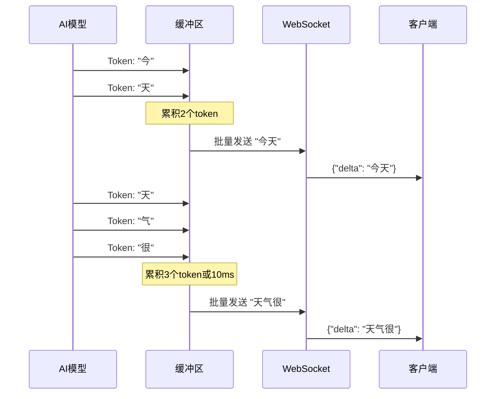

> **批量策略**: 按字符数（如3-5个）或时间（如10-20ms）批量发送，平衡延迟与吞吐。

### 背压处理

当客户端消费速度跟不上服务端生成速度时：

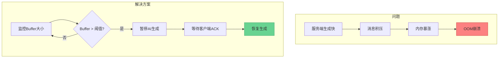

---

## 分布式WebSocket架构

### 单机瓶颈

一台服务器能支持的WebSocket连接数是有限的：

| 瓶颈因素 | 典型限制 | 优化后 |
|----------|----------|--------|
| 文件描述符 | 1024 | 100万+ |
| 内存（每连接） | 10KB | 2KB |
| CPU（心跳） | 1万连接/核 | 10万/核 |
| 带宽 | 取决于消息量 | 压缩 |

### 横向扩展架构

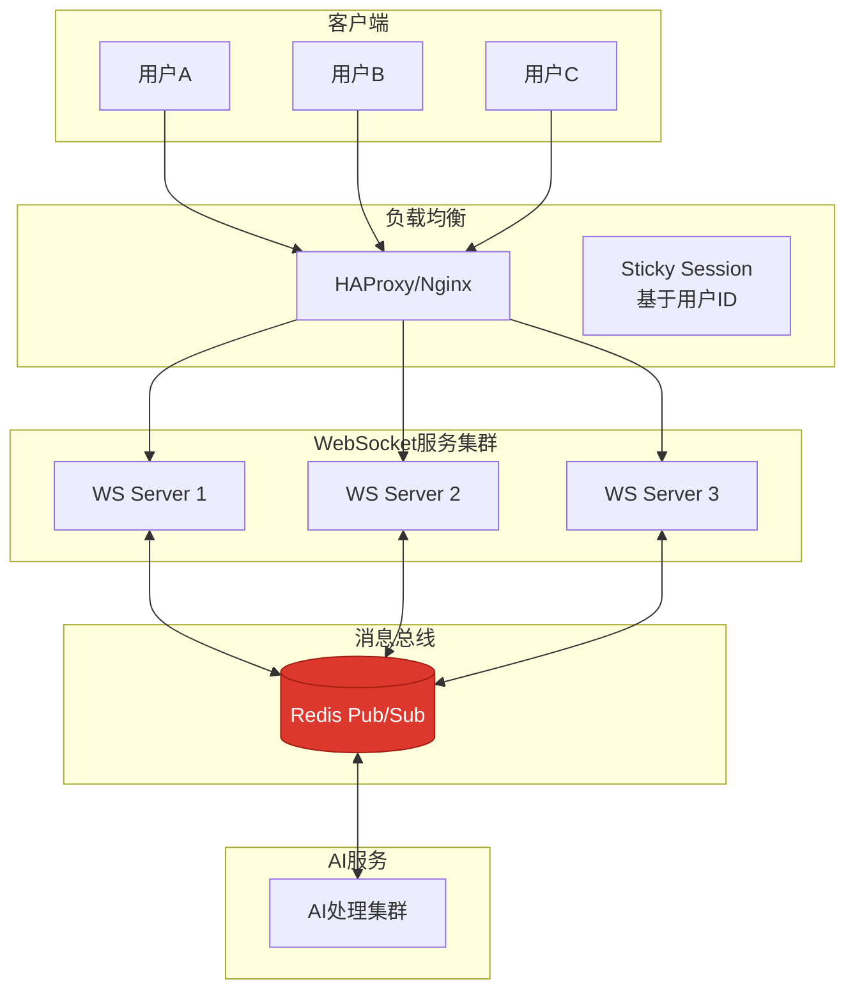

### 消息广播流程

当AI响应需要推送给用户，但用户连接在另一个节点时：

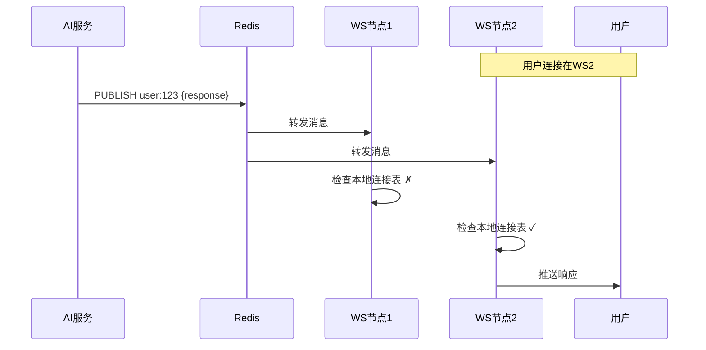

---

## 监控与可观测性

### 关键指标看板

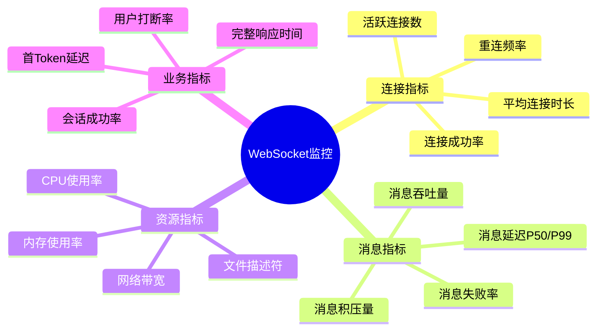

### 告警阈值建议

| 指标 | 警告阈值 | 严重阈值 | 处理方式 |
|------|----------|----------|----------|
| 连接数 | 80%容量 | 95%容量 | 扩容 |
| P99延迟 | 500ms | 1000ms | 检查AI服务 |
| 内存使用 | 70% | 85% | 检查泄漏 |
| 错误率 | 1% | 5% | 立即排查 |

---

## 最佳实践总结

### 优化清单

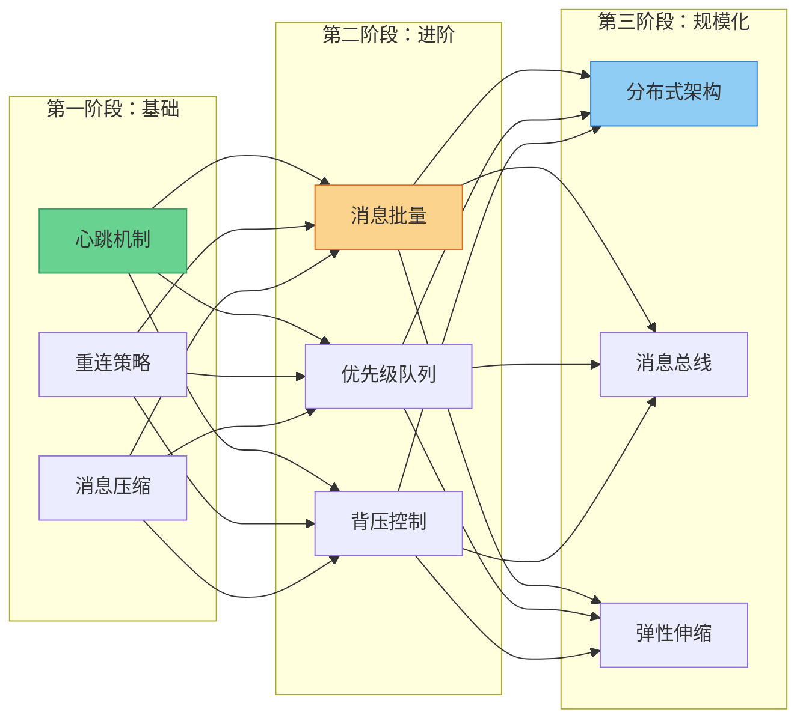

### 性能优化ROI排序

| 优化项 | 实现难度 | 性能提升 | 优先级 |
|--------|----------|----------|--------|
| 消息压缩 | ⭐ | 30-50% | 高 |
| 心跳优化 | ⭐ | 10-20% | 高 |
| 消息批量 | ⭐⭐ | 20-40% | 高 |
| 二进制协议 | ⭐⭐ | 40-60% | 中 |
| 背压控制 | ⭐⭐⭐ | 防止崩溃 | 中 |
| 分布式架构 | ⭐⭐⭐⭐ | 线性扩展 | 按需 |

---

## 总结

WebSocket是AI Agent实时交互的核心基础设施。优化的关键在于：

1. **连接层**: 健壮的心跳和重连机制
2. **消息层**: 高效的序列化和批量策略
3. **应用层**: 合理的背压和优先级控制
4. **架构层**: 可扩展的分布式设计

性能优化是一个持续的过程，从简单的压缩开始，逐步引入更复杂的优化，同时保持系统的可观测性。

---

## 延伸阅读

- [WebSocket RFC 6455](https://datatracker.ietf.org/doc/html/rfc6455)
- [Socket.IO 扩展指南](https://socket.io/docs/v4/scaling/)
- [Redis Pub/Sub 最佳实践](https://redis.io/topics/pubsub)
