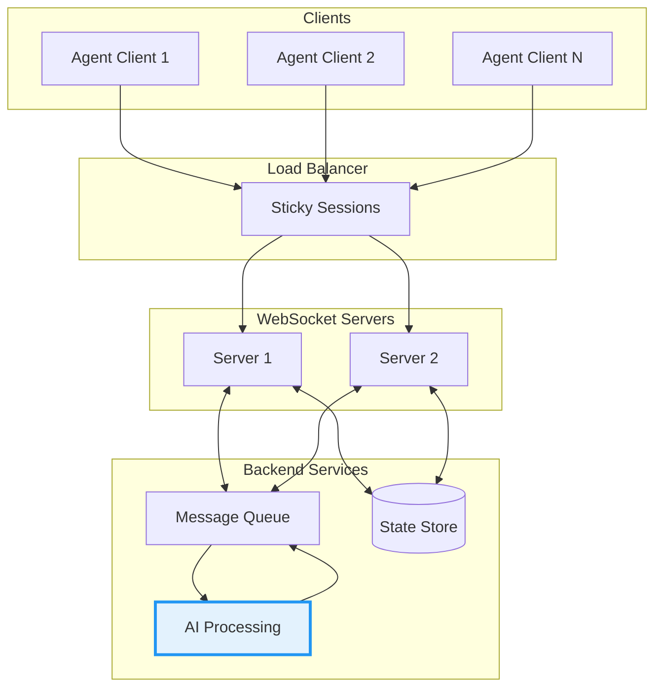

## Introduction

WebSocket connections are the backbone of real-time AI agent systems. Unlike HTTP's request-response model, WebSocket enables bidirectional, persistent connections that are essential for streaming AI responses, maintaining conversation state, and reducing latency.

This guide covers practical optimization techniques for production AI agent deployments.

## WebSocket Architecture for AI Agents



## Connection Management

### Heartbeat Implementation

```javascript
class OptimizedWebSocket {
  constructor(url) {
    this.url = url;
    this.ws = null;
    this.heartbeatInterval = 30000; // 30 seconds
    this.heartbeatTimer = null;
    this.reconnectAttempts = 0;
    this.maxReconnectAttempts = 5;
  }

  connect() {
    this.ws = new WebSocket(this.url);
    
    this.ws.onopen = () => {
      this.reconnectAttempts = 0;
      this.startHeartbeat();
    };

    this.ws.onclose = (event) => {
      this.stopHeartbeat();
      if (!event.wasClean) {
        this.reconnect();
      }
    };

    this.ws.onmessage = (event) => {
      const message = JSON.parse(event.data);
      if (message.type === 'pong') {
        this.handlePong();
      } else {
        this.handleMessage(message);
      }
    };
  }

  startHeartbeat() {
    this.heartbeatTimer = setInterval(() => {
      if (this.ws.readyState === WebSocket.OPEN) {
        this.ws.send(JSON.stringify({ type: 'ping', timestamp: Date.now() }));
      }
    }, this.heartbeatInterval);
  }

  stopHeartbeat() {
    if (this.heartbeatTimer) {
      clearInterval(this.heartbeatTimer);
      this.heartbeatTimer = null;
    }
  }

  reconnect() {
    if (this.reconnectAttempts >= this.maxReconnectAttempts) {
      console.error('Max reconnection attempts reached');
      return;
    }

    const delay = Math.min(1000 * Math.pow(2, this.reconnectAttempts), 30000);
    this.reconnectAttempts++;
    
    setTimeout(() => this.connect(), delay);
  }
}
```

### Connection Pooling (Server-Side)

```python
import asyncio
from typing import Dict, Set
from dataclasses import dataclass, field
from datetime import datetime

@dataclass
class Connection:
    websocket: object
    session_id: str
    created_at: datetime = field(default_factory=datetime.now)
    last_activity: datetime = field(default_factory=datetime.now)
    
class ConnectionPool:
    def __init__(self, max_connections: int = 10000):
        self.max_connections = max_connections
        self.connections: Dict[str, Connection] = {}
        self.sessions: Dict[str, Set[str]] = {}  # session_id -> connection_ids
        
    async def add_connection(self, conn_id: str, websocket, session_id: str):
        if len(self.connections) >= self.max_connections:
            await self.evict_oldest_connection()
            
        conn = Connection(websocket=websocket, session_id=session_id)
        self.connections[conn_id] = conn
        
        if session_id not in self.sessions:
            self.sessions[session_id] = set()
        self.sessions[session_id].add(conn_id)
        
    async def remove_connection(self, conn_id: str):
        if conn_id in self.connections:
            conn = self.connections.pop(conn_id)
            if conn.session_id in self.sessions:
                self.sessions[conn.session_id].discard(conn_id)
                
    async def evict_oldest_connection(self):
        if not self.connections:
            return
            
        oldest_id = min(
            self.connections.keys(),
            key=lambda k: self.connections[k].last_activity
        )
        
        conn = self.connections[oldest_id]
        await conn.websocket.close(1000, "Connection evicted")
        await self.remove_connection(oldest_id)
```

## Message Optimization

### Message Batching

```python
import asyncio
from collections import defaultdict

class MessageBatcher:
    def __init__(self, batch_size: int = 10, flush_interval: float = 0.05):
        self.batch_size = batch_size
        self.flush_interval = flush_interval
        self.batches: Dict[str, list] = defaultdict(list)
        self.locks: Dict[str, asyncio.Lock] = defaultdict(asyncio.Lock)
        
    async def add_message(self, connection_id: str, message: dict):
        async with self.locks[connection_id]:
            self.batches[connection_id].append(message)
            
            if len(self.batches[connection_id]) >= self.batch_size:
                await self.flush(connection_id)
                
    async def flush(self, connection_id: str):
        async with self.locks[connection_id]:
            if not self.batches[connection_id]:
                return
                
            messages = self.batches[connection_id]
            self.batches[connection_id] = []
            
            # Send batched messages
            await self.send_batch(connection_id, messages)
            
    async def start_flush_timer(self):
        while True:
            await asyncio.sleep(self.flush_interval)
            for conn_id in list(self.batches.keys()):
                if self.batches[conn_id]:
                    await self.flush(conn_id)
```

### Binary Protocol with MessagePack

```python
import msgpack
import struct

class BinaryProtocol:
    """Efficient binary message encoding for AI agent communication."""
    
    MESSAGE_TYPES = {
        'text': 0x01,
        'audio': 0x02,
        'control': 0x03,
        'stream_start': 0x10,
        'stream_chunk': 0x11,
        'stream_end': 0x12,
    }
    
    @classmethod
    def encode(cls, msg_type: str, payload: dict) -> bytes:
        """Encode message to binary format."""
        type_byte = cls.MESSAGE_TYPES.get(msg_type, 0x00)
        packed_payload = msgpack.packb(payload)
        
        # Header: type (1 byte) + length (4 bytes)
        header = struct.pack('>BI', type_byte, len(packed_payload))
        
        return header + packed_payload
    
    @classmethod
    def decode(cls, data: bytes) -> tuple:
        """Decode binary message."""
        type_byte, length = struct.unpack('>BI', data[:5])
        payload = msgpack.unpackb(data[5:5+length])
        
        # Reverse lookup message type
        msg_type = next(
            (k for k, v in cls.MESSAGE_TYPES.items() if v == type_byte),
            'unknown'
        )
        
        return msg_type, payload
```

## Streaming AI Responses

### Token-by-Token Streaming

```python
import json
from typing import AsyncGenerator

class AIStreamHandler:
    def __init__(self, websocket, llm_client):
        self.websocket = websocket
        self.llm_client = llm_client
        
    async def stream_response(self, messages: list):
        """Stream LLM response token by token."""
        
        # Send stream start
        await self.websocket.send(json.dumps({
            'type': 'stream_start',
            'timestamp': time.time()
        }))
        
        full_response = []
        
        async for chunk in self.llm_client.chat.completions.create(
            model="gpt-4-turbo",
            messages=messages,
            stream=True
        ):
            if chunk.choices[0].delta.content:
                token = chunk.choices[0].delta.content
                full_response.append(token)
                
                await self.websocket.send(json.dumps({
                    'type': 'stream_chunk',
                    'content': token,
                    'timestamp': time.time()
                }))
        
        # Send stream end with full content
        await self.websocket.send(json.dumps({
            'type': 'stream_end',
            'full_content': ''.join(full_response),
            'timestamp': time.time()
        }))
```

## Performance Metrics

### Key Metrics to Track

| Metric | Target | Description |
|--------|--------|-------------|
| Connection Latency | < 100ms | Time to establish WebSocket connection |
| Message RTT | < 50ms | Round-trip time for ping/pong |
| First Token Time | < 200ms | Time to first AI response token |
| Throughput | > 10k msg/s | Messages per second per server |
| Error Rate | < 0.1% | Connection/message failures |

### Monitoring Implementation

```python
import time
from prometheus_client import Counter, Histogram, Gauge

# Metrics
ws_connections = Gauge('ws_active_connections', 'Active WebSocket connections')
ws_messages = Counter('ws_messages_total', 'Total messages', ['direction', 'type'])
ws_latency = Histogram('ws_message_latency_seconds', 'Message processing latency')

class MetricsMiddleware:
    def __init__(self, handler):
        self.handler = handler
        
    async def on_connect(self, websocket):
        ws_connections.inc()
        await self.handler.on_connect(websocket)
        
    async def on_disconnect(self, websocket):
        ws_connections.dec()
        await self.handler.on_disconnect(websocket)
        
    async def on_message(self, websocket, message):
        start_time = time.time()
        ws_messages.labels(direction='inbound', type=message.get('type')).inc()
        
        result = await self.handler.on_message(websocket, message)
        
        ws_latency.observe(time.time() - start_time)
        return result
```

## Scaling Strategies

### Horizontal Scaling with Redis

```python
import redis.asyncio as redis
import json

class DistributedWebSocket:
    def __init__(self, redis_url: str):
        self.redis = redis.from_url(redis_url)
        self.local_connections = {}
        
    async def broadcast(self, channel: str, message: dict):
        """Broadcast message across all server instances."""
        await self.redis.publish(channel, json.dumps(message))
        
    async def subscribe(self, channel: str):
        """Subscribe to messages from other servers."""
        pubsub = self.redis.pubsub()
        await pubsub.subscribe(channel)
        
        async for message in pubsub.listen():
            if message['type'] == 'message':
                data = json.loads(message['data'])
                await self.handle_broadcast(data)
                
    async def handle_broadcast(self, data: dict):
        """Deliver broadcast message to local connections."""
        target_session = data.get('session_id')
        
        for conn_id, conn in self.local_connections.items():
            if conn.session_id == target_session:
                await conn.websocket.send(json.dumps(data['payload']))
```

## Best Practices Summary

1. **Connection Management**
   - Implement heartbeat with exponential backoff reconnection
   - Use connection pooling with proper eviction policies
   - Enable compression for large payloads

2. **Message Optimization**  
   - Batch small messages to reduce overhead
   - Use binary protocols (MessagePack) for efficiency
   - Implement backpressure to prevent buffer overflow

3. **AI Integration**
   - Stream responses token-by-token for perceived speed
   - Handle interruptions gracefully
   - Cache common responses when appropriate

4. **Scaling**
   - Use Redis Pub/Sub for cross-server communication
   - Implement sticky sessions at load balancer
   - Monitor and alert on key metrics

## Conclusion

WebSocket optimization is critical for building responsive AI agent systems. By implementing proper connection management, message optimization, and scaling strategies, you can build systems that handle thousands of concurrent AI conversations with sub-100ms latency.

The techniques covered here form the foundation of production-ready AI agent infrastructure. Start with the basics—heartbeats and reconnection logic—then progressively add optimizations based on your specific performance requirements.
