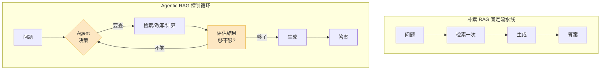

给你的知识库问一个问题:"我们去年 Q3 的退款政策,跟今年比有什么变化?"

朴素 RAG 会怎么做?它把这一整句话拿去向量库里查一次,取回 5 个最相似的片段,塞进 prompt,让大模型生成。结果大概率是:它检索到了"今年的退款政策",但没检索到"去年 Q3 的",因为这句话作为一个整体,语义上离"今年的政策文档"更近。于是模型用今年的政策,回答了一个关于"变化"的问题——而且它不会告诉你它只看到了一半。

这就是朴素 RAG 的根本毛病。它把检索当成一个**一次性的、无脑的前置步骤**:查一次,查到什么算什么,然后生成。它不会判断"我查到的东西够不够",不会发现"这个问题其实要查两次",更不会在检索失败时重来。它失败的时候不会报错,会编。

2026 年,生产环境里真正能扛住复杂问题的,已经不是这条流水线了。这篇讲清楚它怎么一步步长成 Agentic RAG,以及——这是重点——多出来的延迟和成本,什么时候值,什么时候是浪费。

## 朴素 RAG 到底卡在哪

先把它失败的几类问题说具体,不然后面所有"改进"都是空的。

**多跳问题。**"写《三体》的作者还写过哪些小说?"——这要先查"《三体》的作者是谁"(刘慈欣),再用这个答案去查"刘慈欣的其他作品"。一次检索拿不到第二跳需要的关键词,因为第二跳的查询词("刘慈欣")根本不在原始问题里。

**模糊 / 措辞错位。**用户问"那个会自动重试的配置项叫什么",知识库里写的是"`retry_policy` 重试策略"。用户的口语和文档的术语对不上,向量相似度也救不回来。

**问题里藏着多个子问题。**"对比一下 A 方案和 B 方案的成本和上线周期"——这是四个检索意图揉在一句话里,一次检索只会取回一堆"半相关"的片段,哪个都不深。

**需要计算或外部数据。**"我们这个季度的获客成本环比涨了多少"——答案不在任何一个文档片段里,它需要先取两个数,再算个除法。文本检索给不了。

这些问题的共同点是:**正确答案不是"检索一次就能拿到的那 5 个片段"**。要么得检索多次,要么得换个查法,要么检索根本不是最后一步。朴素 RAG 的架构里没有"再来一次"这个动作,所以它只能在第一次的结果上硬生成。

## 演进的主线:从「流水线」到「控制循环」

把朴素 RAG 和 Agentic RAG 摆在一起看,差别不是"加了几个模块",是**控制权交给了谁**。

朴素 RAG 是一条**固定流水线**:检索 → 生成,顺序写死,模型只负责最后那步生成,没有决策权。

Agentic RAG 是一个**控制循环**:大模型坐在中间当指挥,它拿到问题后自己决定下一步干什么——要不要检索、检索什么、查到的东西够不够、要不要换个查询词再来一次、还是已经可以回答了。检索从"前置步骤"变成了模型手里的一个**工具**,跟计算器、SQL 查询、API 调用平级。

橙色的两块——**决策**和**评估**——是朴素 RAG 里完全没有的。整个演进,本质上就是把这两个能力一点点加进来。下面拆成四个阶段讲。

## 第一步:查询改写,别拿用户的原话去检索

最便宜、收益最直接的一步,是不再把用户的原始问题直接丢给向量库。

用户的话是口语、是模糊的、是给人听的;文档是书面语、是术语。中间这道坎,用一个改写步骤填上。常见的几种做法:

- **同义改写(Rewrite-Retrieve-Read)**:先让一个小模型把"那个会自动重试的配置项"改写成检索友好的"重试策略 retry 配置 自动重试机制",再去查。RQ-RAG 这类方法甚至专门训了一个小模型来干这件事。
- **查询分解**:把"对比 A 和 B 的成本和上线周期"拆成四个独立子查询,各查各的,最后合并。
- **HyDE(假设性文档)**:先让模型"瞎编"一段它觉得答案应该长什么样的文字,再用这段编出来的文字去检索。听起来反直觉,但编出来的文字在语义空间里离真实文档更近——因为它和文档一样是书面语。

注意:到这一步,系统还**不是 Agent**。改写是固定加进流水线的一环,模型还是没有"要不要再查一次"的决策权。但它是个分水岭——从这里开始,检索的输入不再等于用户的输入了。

## 第二步:多轮检索,让多跳问题能跑通

查询改写解决"查得准",多轮检索解决"查得够"。

对多跳问题,做法是让流程**循环**起来:检索一轮 → 看看拿到的信息能不能支撑回答 → 不能就根据已知信息生成下一个查询 → 再检索。"《三体》作者还写过什么"就变成:第一轮查到"刘慈欣",第二轮用"刘慈欣"作为新查询词,查到《球状闪电》《流浪地球》。

这里的关键设计是**谁来决定停**。两种思路:

- **固定轮数**:简单粗暴,查 3 轮就停。问题是简单问题被迫查 3 轮(浪费),复杂问题 3 轮可能还不够。
- **模型自己判断**:每轮检索后让模型回答一个问题——"现在的信息够回答用户了吗?" 够了就停,不够就继续。这就开始有 Agent 的味道了:停止条件是动态的。

到这一步,系统已经能处理多跳问题。但它还有个隐患:它**默认每个问题都要检索**。"你好""帮我把这段话翻译成英文"这种根本不需要查知识库的请求,它也老老实实查一遍——白花钱、白加延迟。

## 第三步:Adaptive RAG,让 Agent 决定「要不要查、查几次」

这一步把决策权真正交出去:**检索不再是默认动作,而是 Agent 评估后才触发的选择。**

Adaptive RAG 的典型做法是训一个轻量级**路由器**(router),它先给问题分个级:

| 问题类型 | 例子 | 路由策略 |
|---|---|---|
| 不需要检索 | "把这段翻译成英文"、闲聊 | 直接让模型回答,0 次检索 |
| 简单事实 | "我们的退款时限是几天" | 单次检索 + 生成 |
| 复杂 / 多跳 | "去年 Q3 和今年的政策差异" | 进入多轮检索循环 |

它的价值在于**按需付费**:简单问题走快车道,省下来的延迟和成本,留给真正难的问题。SELF-RAG 是同一思路的另一种实现——它不靠外挂路由器,而是训练模型在生成过程中吐出特殊的"反思 token",由模型自己在每一步决定"这里该不该插入一次检索"。

把检索当工具,意味着它旁边还能摆别的工具。"这季度获客成本环比涨多少"这种问题,Agent 会先调"检索工具"取两个季度的原始数字,再调"计算工具"做除法。检索从此只是 Agent 工具箱里的一格,不是全部。2026 年 2 月的 A-RAG 框架走得更彻底:把关键词检索、语义检索、按片段检索**当成三个不同的工具**直接暴露给 Agent,让它自己挑用哪个,QA 准确率比一刀切的扁平检索高了 5%–13%。

## 第四步:自我纠错,Self-RAG 与 Corrective RAG

前面三步解决"查得准、查得够、该不该查"。最后一步解决一个更难的问题:**查回来的东西是错的、是噪音,怎么办。**

朴素 RAG 在这里是裸奔的——检索到什么就用什么,哪怕取回的 5 个片段全是不相关的,它也照样塞进 prompt 生成。自我纠错就是在"检索完"和"生成"之间,硬插一个质检环节。

两条主流路线:

- **Corrective RAG(CRAG)**:检索之后,用一个轻量评估器给每个片段打分——相关、不相关、还是模棱两可。如果片段质量够高,正常生成;如果一堆是噪音,就**触发纠正动作**,典型的是把查询词改写后重新检索,甚至 fallback 到联网搜索;模棱两可的就两边的信息都用上。评估器是**外挂**的,不依赖主模型。
- **Self-RAG**:把评估能力**训进模型本身**。模型生成时会同步产出"反思 token",自己评判"我刚引用的这段资料,真的支撑我这句话吗"。如果不支撑,它会自己回退、重检索。

两者的区别值得记住:CRAG 是"外挂一个质检员",改造成本低、能套在现有系统外面;Self-RAG 是"让模型自带质检能力",效果更深入但需要专门训练模型。生产里 CRAG 更常见,因为不用动模型。

不管哪条路,目的是同一个:让系统在**给出答案之前**,先对自己手里的证据有个判断。一个会说"我没查到足够信息"的 RAG,比一个永远自信乱编的 RAG,有用得多。

## 代价:这一切都不是免费的

把上面四步全堆上,你得到的不是"更好的 RAG",是"更慢更贵更难维护的 RAG"。这个账必须算清楚。

**延迟。** 朴素 RAG 是一次检索 + 一次生成。Agentic RAG 每多一轮"决策 → 检索 → 评估",就多一组大模型调用和向量查询。一个跑三轮的 Agentic 流程,延迟翻几倍很正常。有实测数据:在 FIQA 这类金融问答任务上,Agentic 方案的平均延迟是增强型 RAG 的约 **1.5 倍**;做同样一件事,一条 Agentic 流水线可能比朴素 RAG 多花 **5 秒**。

**成本。** 每一轮决策和评估都是真金白银的 token。一个朴素 RAG 查询大约 $0.001,功能相当的 Agentic 流程能到它的 **10 倍**。生产环境里实际的单次查询成本,从简单查找的 $0.02 到复杂多源推理的 $0.31 不等。

**复杂度。** 这是最容易被低估的一项。固定流水线的 bug 好查——就那么几步。一个会循环、会自己改查询、会自己决定停的 Agent,出错的时候你得问:是路由判错了?改写改歪了?评估器误判了?还是循环该停没停?调试和监控的难度,跟朴素 RAG 不是一个量级。还有个隐蔽的坑:有研究发现,RAG 的精度调参没调好,会悄悄把检索准确率拉低 40%,而这个误差在 Agentic 的多轮循环里会被一路放大。

| 维度 | 朴素 RAG | Agentic RAG |
|---|---|---|
| 检索次数 | 固定 1 次 | 0 到多次,动态 |
| 单次查询成本 | ~$0.001 | 可达 10 倍 |
| 延迟 | 一次检索 + 生成 | 增强型的约 1.5 倍起 |
| 多跳 / 模糊问题 | 经常失败且不自知 | 能处理 |
| 调试难度 | 低 | 高 |
| 适用场景 | 文档查找、抽取、简单问答 | 复杂推理、多源、多跳 |

## 那到底什么时候该上 Agentic RAG

我的判断很直接:**Agentic RAG 不是朴素 RAG 的升级版,是另一个东西,按场景选,不是按"先进程度"选。**

如果你的产品主要是文档查找、信息抽取、单轮问答——客服查个政策、员工查个手册——**朴素 RAG 就是最优解**。它简单、便宜、好调试,给它叠 Agent 是纯浪费,用户还得多等几秒。2026 年企业里的生产基线,其实是混合检索(向量 + 关键词)这种"增强型朴素 RAG",而不是 Agentic。

什么时候该上 Agentic:当你的问题里**经常出现多跳、模糊、多子问题、需要计算**这几类——比如做研究型助手、做需要跨多个数据源交叉验证的分析、做法律 / 医疗这种"答错代价很高、宁可多查几轮也要确认证据"的场景。这时候多出来的延迟和成本,买的是"答对"和"知道自己没查够",值。

更现实的做法是别一刀切。先用 Adaptive RAG 的路由思路:**简单问题走朴素快车道,只有被判定为复杂的那部分,才进 Agentic 的循环。** 让贵的能力只花在真正需要它的问题上——这跟做语音 Agent 时"先打通流式管道、再去抠贵的环节"是同一个工程哲学:别为不存在的复杂度付钱。

朴素 RAG 最大的问题从来不是"不够先进",是它**失败的时候很安静**。Agentic RAG 真正值钱的地方,也不是那些花哨的多轮循环,而是它终于学会了在证据不足时说一句:"这个我没查够。"
