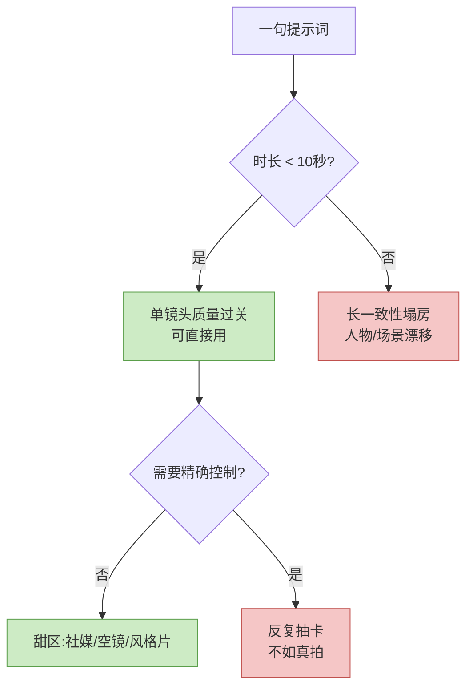

去年这时候,你给 AI 一句"猫在厨房打翻牛奶",它给你一段四秒、猫的爪子有六根、牛奶往上流的诡异片段。

今年同一句话,Veo 3.1 能给你一段八秒的画面:猫跳上台面,牛奶盒倒下,液体顺着桌沿往下淌,落地有声——连"啪嗒"那一下都对上了。

进步是真的。但如果你由此以为"AI 已经能拍片了",那是被发布会的精选片段骗了。2026 年 5 月的真实情况是:**AI 视频在 10 秒以内的单镜头里已经接近以假乱真,但只要你想讲一个完整的故事,它立刻露馅。** 这篇把这条分界线划清楚。

## 四家主流,各打各的算盘

先把牌摊开。2026 年第一梯队基本是这四家加一个 Runway,但他们的定位差得很远。

| 工具 | 最新版本 | 时长 / 分辨率 | 强项 | 你该知道的坑 |
|---|---|---|---|---|
| OpenAI Sora 2 | Sora 2 | 10–25 秒 / 1080p | 物理真实感、多镜头跟随、原生音画同步 | Sora 独立 App 已于 2026 年 4 月下线,API 计划 9 月停服 |
| 快手可灵 Kling | 可灵 3.0 | 长片段 / 原生 4K | 人物自然动作、复杂多主体交互、中文生态 | 估值已冲到 200 亿美元,产品在快速商业化收紧免费额度 |
| 字节 Seedance | Seedance 2.0 | 4–15 秒 / 1080p | 多模态输入(图/音/视频混合)、多语言对口型 | 上线 100+ 国家但**不含美国** |
| Google Veo | Veo 3.1 | 8 秒为主 / 1080p | 原生音频、镜头运动、和 Google 工具链打通 | 基础款时长短,长片要靠拼接 |
| Runway | Gen-4 / Gen-4.5 | 最长可达分钟级 / 4K | 角色一致性、Aleph 视频内编辑、可接 API 混管线 | 偏专业工具,上手门槛比前几家高 |

几个观察值得说。

**Sora 的故事很拧巴。** Sora 2 的技术口碑不差——物理一致性、多镜头世界状态保持都做得用心。但 OpenAI 把消费级 Sora App 砍了,API 也排上了停服日程。一个技术上领先的产品,商业上却在往回收。这说明一件事:纯粹"文生视频"作为一个独立 App,很难单独养活自己。

**真正在闷声赚钱的是中国公司。** 可灵全球用户冲到 6000 万,快手已经在张罗把它拆出来单独 IPO,Pre-IPO 估值约 200 亿美元。在第三方盲测里,可灵在"自然人物动作"和"提示词遵循"这两项上经常排第一,尤其是多人互动的复杂场景。字节的 Seedance 2.0 走的是另一条路——多模态联合架构,音频和画面在同一次生成里一起算出来,所以对口型和环境音效更准。

**Veo 是"水桶型选手"。** 它未必每一项都最强,但画质稳、运镜稳、还能直接塞进 Google Vids、Flow 这些工具里。对一个本来就用 Google 全家桶的团队,Veo 的"顺手"本身就是竞争力。

## 现在真能做好什么

把发布会的滤镜摘掉,2026 年 AI 视频**确实**已经做扎实的能力有这么几块。

**10 秒以内的单镜头,质量过关。** 一个固定或简单运镜的镜头——人物特写、产品旋转展示、风景空镜——只要不超过十几秒,现在的输出在画质、光影、材质上已经能用在正式内容里。这不是"凑合能看",是真能上片。

**运镜变成了可控参数。** 推、拉、摇、移、跟焦,这些以前要靠运气抽卡的东西,现在能在提示词里点名,而且基本听话。可灵 2.6 的运动控制甚至能把一段参考视频的运动轨迹"迁移"到新画面上。

**风格化内容是甜区。** 动漫、定格、超现实、广告质感——这些本来就不要求"物理绝对正确"的风格,AI 做得比写实更稳。因为写实的破绽肉眼一抓一个准,而风格化本身就给了模型容错空间。

**原生音频不再是后期。** Veo 3.1、Sora 2、Seedance 2.0 都能在生成画面的同时生成对白、音效、环境声。Seedance 是音画联合架构,声音和画面同一次算出来,对口型准度明显更好。这一步省掉的后期工作量,比想象中大。

## 还做不好的那几样,是真做不好

这是这篇文章最想说清楚的部分。下面几个不是"再等几个月就好",是当前路线下的硬骨头。

**长时一致性。** 这是最大的坎。绝大多数工具撑到 30–60 秒之后,画面就开始"漂"——人物的脸慢慢变样,衣服的扣子数量对不上,背景里的家具悄悄挪位。这叫身份漂移(identity drift)和误差累积。观众其实两三秒就能察觉到不对劲,信任感一下就没了。所以你看到的所有"AI 生成的两分钟短片",几乎都是十几个短片段剪出来的,不是一气呵成。

**复杂物理。** 刚性物体的碰撞、抛物线,模型已经学得不错。但液体、布料、烟雾、多个物体互相作用,还是会出"看着合理、物理上错"的画面:水流会有一瞬间往上爬,布料穿过身体,头发像有自己的意志。Sora 2 的篮球反弹是个标志性进步,可那是因为篮球轨迹相对简单。

**精确控制。** 你能描述一个大概,但没法精确指挥。"让她在第三秒抬左手,手停在下巴下方两厘米"——这种导演级的精度,提示词给不了。结果就是反复抽卡:生成、不对、改词、再生成。当你需要的画面足够具体时,抽卡二十次的时间成本,经常已经超过真拍一条。

**人物一致性。** 同一个角色出现在不同镜头里还长一个样,依然不稳。Runway Gen-4 靠单张参考图做角色一致性是目前最像样的方案,Sora 2 的"客串"功能能把你本人放进场景。但只要切镜头、换光线、换景别,人物多少会变。对需要主角连续出场的叙事内容,这是致命伤。

## 哪些场景已经能真金白银落地

说了这么多限制,不是劝你别用。恰恰相反——**只要你的需求落在"短、单镜头、容错高"这个区间里,AI 视频今天就能省钱省时间。** 已经在规模化落地的有这么几类。

**广告和电商的零碎镜头。** 产品空镜、氛围片段、转场素材,这些本来就是几秒钟的单镜头,AI 做正合适。一条电商详情页视频里,真人出镜的部分照拍,中间的产品展示、场景氛围用 AI 补,成本结构立刻变了。

**分镜和概念验证。** 这个被低估了。导演、广告创意想跟客户讲清楚一个镜头长什么样,以前画分镜板,现在直接生成一段动态参考。它不用是最终成片,只要"意思到了",决策效率就上来了。哪怕最后还是真拍,前期沟通的来回少了一大半。

**社媒短内容。** 抖音、小红书、Reels 上那种十几秒的卡点、转场、视觉奇观,本来就不追求长叙事和物理严谨,容错空间大,正好是 AI 的甜区。可灵、Seedance 在国内创作者里铺得快,就是这个原因。

**多语言本地化。** Seedance 2.0 这类带多语言对口型的模型,让一段素材换个语言重新"配音"且对得上嘴,这在出海内容里是实打实的刚需。

## 离"替代真实拍摄"还差什么

最后回到那个所有人都在问的问题:它什么时候能替代片场?

我的判断是:**短期内不会,而且"替代"这个框架本身就提错了。**

差的不是画质——画质已经够了。差的是这三样:

一是**连续叙事的稳定性**。电影是几十个镜头里同一批人、同一个世界,连贯地讲一个半小时。AI 现在连两分钟的连贯都保不住。这不是分辨率问题,是模型对"世界状态"的记忆问题,得有架构层面的突破。

二是**精确的可控性**。片场里导演说"再来一条,这次慢半拍",演员能立刻调整。AI 的"再来一条"是重新抽卡,你没法精确指挥它改哪里、改多少。创作是控制的艺术,失控的工具再强也只是素材生成器。

三是**责任与确定性**。一个剧组交付的是确定的、可追溯、可修改的成片。AI 给你的是一次概率采样的结果,改一个细节可能整个画面都变了。商业制作要的是"我要的就是这个,而且下次还能复现",这一点 AI 目前给不了。

所以更准确的说法是:AI 视频不会"替代"拍摄,它会**先吃掉拍摄里最标准化、最零碎的那部分**——空镜、产品镜、氛围片段、分镜预演。这部分本来就不太需要"创作",AI 接手天经地义。而真正考验连续叙事、精确表演、复杂调度的部分,还稳稳地留在人手里。

如果你是创作者,2026 年正确的姿势不是观望,也不是 all in,而是:**把它当成一个非常强的"短镜头素材机"和"分镜工具",而不是一个"导演"。** 用它擅长的,绕开它做不到的。这一年它能帮你省的钱和时间,已经足够多了。

---

参考来源:[Sora 2 — OpenAI](https://openai.com/index/sora-2/)、[Veo — Google DeepMind](https://deepmind.google/models/veo/)、[Veo 3.1 Lite — Google Blog](https://blog.google/innovation-and-ai/technology/ai/veo-3-1-lite/)、[Runway Gen-4 — Runway Research](https://runwayml.com/research/introducing-runway-gen-4)、[Seedance 2.0 — ByteDance Seed](https://seed.bytedance.com/en/seedance2_0)、[Kling AI 官网](https://klingai.com/app/)、[The State of AI Video Generation in 2026 — is4.ai](https://is4.ai/blog/our-blog-1/ai-video-generation-2026-what-works-what-doesnt-340)。
