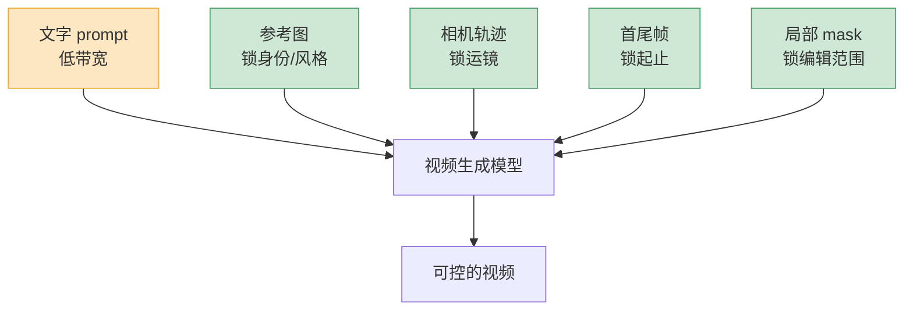
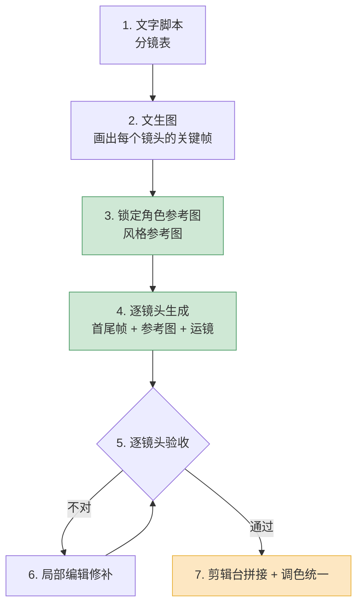

给你看一个真实的对比。

两个团队,同样要做一支 30 秒的产品宣传片。A 团队拿最强的文生视频模型,写了一段漂亮的 prompt,十分钟出片,画质惊艳——然后发现主角的衣服在第二个镜头变了颜色,客户不要。B 团队画质明显糙一截,但每个镜头的相机怎么推、主角长什么样、最后一帧停在哪,全都对得上。客户选了 B。

这件事说明一个被低估的事实:**AI 视频生成早就过了"画得好不好看"的阶段,现在卡在"画得跟不跟你想的一样"。** 2026 年发布的模型——Veo 3.1、Runway Gen-4.5、Kling O1、Pika 2.5——画质都够用了,真正的竞争发生在控制层。这篇不横评工具,只讲一件事:怎么让 AI 视频听话。

## 为什么"可控"比"画质"更卡落地

画质是个连续变量,差一点也能用;可控性是个二元变量,要么对要么废。

商业视频的本质是"带着约束的创作"。客户给你一张产品图,主角的脸不能变,品牌色是固定的 RGB 值,这个镜头要从左往右摇,下个镜头要接得上。这些都不是"建议",是硬约束。一个画质 95 分但主角换了张脸的镜头,商业价值是 0,不是 95。

文生视频的根本问题在这:**prompt 是个低带宽的接口。** 你想说的是"相机以每秒 15 度的速度向右平摇,主角始终在画面左三分之一",你能写的是"镜头缓缓摇过,主角在一侧"。中间丢掉的信息,模型用它训练数据里的先验给你补——补出来的东西好不好看是一回事,是不是你要的,完全是另一回事。

所以可控视频生成这两年的所有进展,本质上是在干同一件事:**给模型加上 prompt 之外的、带宽更高的控制信号。** 参考图、相机轨迹、首尾帧、mask,都是这个东西。

橙色那条是大多数人唯一在用的接口,绿色那几条才是 2026 年真正在拉开差距的地方。下面逐个拆。

## 运镜:从形容词到轨迹

运镜是最早被"控制化"的环节,因为它的需求最刚硬。

早期文生视频控制运镜靠形容词——"dolly in""pan left""crane shot"。这套东西的问题是,模型对这些词的理解是统计意义上的:它见过一万个标着 "pan left" 的片段,给你生成一个"平均的左摇"。速度多快、摇多少度、什么时候开始,你说了不算。

2026 年成熟的做法分两个层次。

第一层是**离散的相机指令**,Runway 的 Director Mode 是代表:你不是写形容词,而是在面板上选"水平移动 +30、垂直 0、变焦 -10",给的是数值。这比形容词强,但还是预设档位的拼装。

第二层是**连续的相机轨迹控制**,这是研究界正在往产品里推的方向。学术上像 I2VControl-Camera 这类工作,把相机位姿表达成一条可调的三维轨迹,还能单独调"运动强度"——同一条轨迹,你可以要它走得猛一点或者收一点。ATI 这类工作更进一步,把相机运动、物体平移、局部形变统一成一套"轨迹指令",用户在图上画几条线,模型照着线动。

这里有个工程上的判断值得说:**别期待一个模型既会高质量生成、又会精确听轨迹。** 目前实践里更靠谱的是分层——先用大模型出基础画面和运动,相机轨迹作为一路独立的控制信号注入,而不是指望它从 prompt 里"悟"出来。运镜控制做得好的产品,基本都把"画什么"和"相机怎么动"解耦成了两路输入。

## 一致性:三个不同的问题,别混为一谈

"一致性"是个被说烂的词,但它其实是三个独立的问题,解法完全不同。混在一起谈,是新手最大的认知误区。

| 一致性类型 | 要解决什么 | 主要手段 | 难度 |
|---|---|---|---|
| 时序一致性 | 同一个镜头内不闪烁、不漂移 | 模型本身的时序建模 | 模型出厂自带 |
| 角色/物体一致性 | 同一个角色跨镜头长得一样 | 参考图 / reference | 中,有成熟方案 |
| 跨镜头风格一致性 | 多个镜头光线、色调统一 | 参考图 + 工作流约束 | 难,要靠流程 |

**时序一致性**是镜头内部的事:一段 5 秒的视频,主角的手不能忽然多一根指头,背景的招牌字不能一帧一个样。这个问题主要靠模型自身的时序建模能力,2026 年主流模型在 5–10 秒的片段内基本解决了。它不是你能控制的,是模型出厂带的。

**角色一致性**是跨镜头的事,这才是你要操心的。同一个人物,镜头一在咖啡馆、镜头二在街上,得是同一张脸、同一身衣服。2026 年的标准答案是**参考图(reference image)**:Veo 3.1 的 "Ingredients to Video" 让你一次传最多四张参考图,分别锁主体、风格、构图;Runway Gen-4.5、Pika 2.5 都把参考图做成了一等接口。这里要建立的关键认知是——**图生视频(image-to-video)在可控性上几乎总是优于文生视频。** 一张参考图从第一帧就把身份、风格、构图全锁死了,模型只需要负责"动起来"。能用图起手,就别用纯文字起手。

**跨镜头风格一致性**最难,因为它没有单一的技术开关。十个镜头,每个都单独生成,哪怕都用了同一张角色参考图,光线方向、色温、颗粒感还是会飘。这个问题在 2026 年没有被模型解决,**它是个工作流问题**,后面专门讲。

## 首尾帧:把"生成"变成"补全"

如果只能推荐一个提升可控性的技巧,我会选首尾帧。

标准图生视频只锁第一帧,后面让模型自由发挥——你不知道它会停在哪。**首尾帧控制(first-last-frame)**把这件事反过来:你给定开始的图 A 和结束的图 B,模型的任务从"自由生成"降级成"在 A 和 B 之间补出中间帧"。Runway 叫 Keyframe,Kling 叫起止帧,Kling O1 把双关键帧做成了核心能力,Luma 叫 Keyframes,叫法不同,是同一个东西。

为什么这招好用?因为它把一个开放问题变成了闭合问题。**开放问题"生成一段视频"有无数个解,模型挑哪个你管不着;闭合问题"从 A 走到 B"的解空间被两头夹死了,模型只能在中间这段动脑筋。** 解空间小,可控性自然高。

对叙事尤其关键——一个镜头要"结束在某个特定画面"上,好接下一个镜头,首尾帧是唯一可靠的办法。LTX 2.3 这类工作甚至支持首、中、尾三个锚点,中间再插一帧,等于把一个长镜头的运动轨迹钉了三个点。

代价是你得先有 B 这张图。所以现实工作流常常是:先用文生图模型把每个关键画面的"起"和"止"都画出来,再用首尾帧让视频模型去连。**画面设计和运动生成被拆成了两步**——这恰恰是它可控的原因。

## 局部编辑:不要重生成整段

视频做到 90% 时,客户说"主角的杯子换成蓝色,别的不动"。

最糟的做法是改 prompt 重新生成整段——你会得到一段哪儿都不一样的新视频,杯子是蓝了,但运镜变了、表情变了,客户更不满意。**局部编辑(local editing)** 要解决的就是这个:只改你圈出来的地方,其余每一帧像素级不动。

技术上这是视频 inpainting 的活儿,2026 年的研究重点是怎么兼顾"局部干净"和"全局不漂"。视频 inpainting 有个老毛病:逐帧补会闪烁(局部不平滑),整段一起补又容易让被编辑区域慢慢偏离原意(全局漂移)。EditCtrl 这类工作的思路是只在被 mask 的 token 上做计算,算力开销跟编辑区域大小成正比——你只改一个杯子,就别为整个画面付费。OmniPainter 这类则用"自回归分数管局部平滑、层级分数管全局连贯"的混合引导来平衡这对矛盾。

落地建议很直接:**把局部编辑当成跟生成同等重要的能力去选工具。** 一个只会从头生成、不能精确局部改的视频模型,在真实商业流程里是残废的——因为客户的修改意见永远是"这里改一下",不是"全部重来"。

## prompt 能控到哪,控不到哪

说点得罪人的。prompt 在视频生成里,是个被高估的控制手段。

它能控的:**画面里有什么**(主体、场景、大致风格、氛围)。这部分 prompt 是合格的,而且不可替代——你总得用语言说清楚要画什么。

它控不动的:**任何需要精度的东西**。精确的相机速度、物体在第几秒到达画面哪个位置、两个角色的相对站位、光线的具体方向——这些用文字描述,模型只能给你一个"差不多"。原因前面说过,自然语言对几何和时序的描述带宽太低,你写得再细,信息也在"文字→模型理解"这一步被压扁了。

所以一条实践原则:**prompt 负责"内容",专门的控制信号负责"精度"。** 想控运镜就上轨迹/相机面板,想控身份就上参考图,想控起止就上首尾帧,想控局部就上 mask。指望把这些全塞进一段 prompt 里"写清楚",是在跟模型的接口带宽较劲,较不赢的。

判断一个视频产品成不成熟,看一个指标就够:**它除了 prompt 框,还给了你几个真正的控制接口。** 只有一个 prompt 框的,是玩具;有参考图、有相机控制、有首尾帧、有 mask 编辑的,才是生产工具。

## 把碎片拼成叙事:可控性的终极考题

前面所有控制手段,都是为了一个镜头。但一支片子是几十个镜头。**单镜头可控,不等于整片可控**——这是 2026 年 AI 视频离"真能用"最后、也最硬的一道坎。

现在没有任何模型能一次生成一支风格统一的三分钟片子。能稳定输出的上限是 5–10 秒的单镜头。所以做长片只有一条路:**生成一堆短片段,再拼起来。** 而拼接的连贯性,完全是个工作流问题,不是模型问题。

一套 2026 年实战可行的流程是这样:

几个关键点。第一,**关键帧先行**——先用文生图把每个镜头的画面定下来,这是整片风格统一的锚。第二,**参考图全程复用**——角色参考图和风格参考图,从第一个镜头用到最后一个,这是跨镜头一致性唯一能抓住的绳子。第三,**最后一定有一道调色**:哪怕前面控制得再好,十个片段的色调还是会有细微差异,在剪辑台上统一拉一遍 LUT,是目前抹平"拼接感"最有效的手段——这一步反而不靠 AI。

我的判断是:**2026 年做 AI 长视频,真正的核心能力不是"会写 prompt",是"会做工作流"。** 模型只是流水线上的一个工位。谁能把分镜、关键帧、参考图、首尾帧、局部编辑、调色这套流程串顺,谁就能稳定产出能交付的片子。盯着"哪个模型画质最强"的人,做不出连贯的三分钟。

## 最后:可控性才是这场竞赛的下半场

把这篇的判断收一下。

画质的竞赛基本结束了,2026 年主流模型都够用。下半场的全部看点在控制:谁的参考图锁身份锁得更死,谁的相机轨迹更跟手,谁的局部编辑能像素级不动,谁能让十个片段拼起来不露馅。

对要落地的人,优先级很清楚:

1. **能用图生视频,就别用文生视频**——参考图是性价比最高的可控性。
2. **叙事镜头一律上首尾帧**——把开放生成变成闭合补全。
3. **选工具看控制接口的数量,不只看画质 demo**——能局部编辑的才是生产工具。
4. **把功夫下在工作流上**——长片的连贯性是流程问题,不是模型问题。

一句话:别再问"哪个模型画得最好看",该问的是"哪套流程让我最说了算"。
