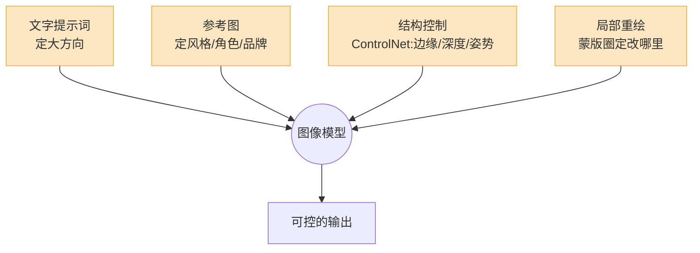

两年前,你让 AI 生成一张「咖啡馆门口的招牌,写着 OPEN」,大概率会得到一块写着「OPNE」或者「OEPN」的牌子——文字是糊的,字母是乱的,整张图一眼假。

现在你再试一次。GPT Image 1.5、Nano Banana Pro 这一批模型,能把整段菜单文字清清楚楚画在招牌上,中英文混排都行,连字距都对。

这件事说明了一个变化:**2026 年的图像生成,已经过了「拼画质」的阶段。** 照片级真实感这道坎,几乎所有头部模型都迈过去了。差异不再在「画得像不像」,而是上移到了——能不能听懂复杂指令、能不能把字写对、能不能精确控制构图、版权干不干净。

这篇不吹也不黑,就把 2026 年这批工具的能力边界,实打实地拆给你看。

## 主流工具:四个梯队,各有各的活

2026 年的图像生成已经不是「一家独大」,而是按场景分工。我把现在真正能打的工具排成四组。

| 工具 | 定位 | 最擅长 | 短板 |
|---|---|---|---|
| GPT Image 1.5(OpenAI) | 指令理解之王 | 复杂多对象指令、文字渲染 | 风格偏「数字感」,审美不够野 |
| Nano Banana Pro(Gemini 3 Pro Image) | 知识型生成 | 文字、信息图、多语言、4K | 偏「正确」,有时缺惊喜 |
| Midjourney V7 / Niji 7 | 审美天花板 | 氛围、光影、风格化 | 指令偏「自由发挥」,可控性弱 |
| FLUX.2(Black Forest Labs) | 开发者与可控性 | 参考图、局部重绘、品牌色精确 | 开箱审美一般,要调 |
| 即梦 Seedream 5 / 通义万相 | 国产主力 | 中文场景、电商图、性价比 | 海外生态、英文长文本略弱 |

几个判断:

**GPT Image 1.5** 是 DALL-E 3 的继任者。它最大的本事是「听话」——你给一段绕口的指令,比如「左边一只戴红围巾的橘猫看向右边,右边窗台上有三盆多肉,从左到右依次是高、矮、高」,它能基本照做。这种**精确执行复杂指令**的能力,目前没有对手。

**Nano Banana Pro** 是 Google 基于 Gemini 3 Pro 做的,特点是「带脑子画图」——它能调用 Gemini 的推理和真实世界知识。你让它画一张「解释光合作用的信息图」,它真能把流程画对,文字标注也对。支持上传最多 14 张参考图同时喂一整套品牌规范,这一点对企业用户很关键。

**Midjourney V7** 仍然是审美的天花板。同样的提示词,Midjourney 出的图就是更「有味道」——光影、质感、构图的高级感,别家追了两年还没完全追上。但代价是它**爱自由发挥**,你想要精确控制时它常常给你「惊喜」。V7 的 Draft Mode 快了约 10 倍、GPU 成本砍掉一半,适合先大量试方向再精修。

**FLUX.2** 走的是另一条路:可控、可编程、开放权重。它能用十六进制色值精确指定品牌色不跑偏,能直接控制人物姿势,跨最多 10 张参考图保持角色和风格一致。FLUX.2 有 max / pro / flex / klein 多个档位,klein 是小尺寸开源版,能塞进消费级显卡跑。它是开发者和工作流集成的首选。

**国产工具**这两年进步很大。字节的即梦(背后是 Seedream 系列)在 LMArena、Artificial Analysis 这类盲测榜上已经能跟 FLUX 同台。Seedream 5 Lite 还做了「深度思考 + 联网搜索」的统一多模态生成。国产工具的真实优势是**中文场景**——中文海报、电商主图、本土化审美,加上 API 价格更友好。

## 现在真能做好的事

先说能用的。2026 年,下面这些活,AI 图像生成已经能稳定干好,值得直接放进生产流程。

**第一,配图和素材。** 博客头图、PPT 插画、社媒配图、占位素材——这类「画质够用、不需要极致精确」的需求,AI 已经完全够用,而且快得离谱。一张图从想法到出图不超过一分钟,成本几分钱。API 价格这一年多跌了 25 到 40 倍,2024 年初 DALL-E 3 一张图要八分到一毛二,现在 FLUX Schnell 一张只要三厘钱。

**第二,设计草稿和概念探索。** 这是我最看好的场景。设计师不再用 AI 出终稿,而是用它**快速铺方向**。一个 logo 概念,以前画十版要一天,现在一小时能看一百版。Midjourney 的 Draft Mode 就是为这个设计的——廉价地试,选出赢家再精修。AI 在这里的角色是「灵感加速器」,不是「替代设计师」。

**第三,风格化改造。** 把一张普通照片转成水彩、油画、赛博朋克、吉卜力风,这件事现在又快又稳。Niji 7(2026 年 1 月发布)在二次元风格上的细节连贯性——眼睛、反光、背景小元素——又上了一个台阶。

**第四,局部改图。** 这是 2026 年最被低估的能力。给一张现成的图,框出一块区域,告诉它「把这件衬衫改成蓝色」「把背景的车去掉」「这里加一棵树」——它能只改那一块,其余原样保留。这种**编辑式生成**比「从零生成」实用得多,因为它把 AI 嵌进了已有的素材里,而不是要求你推倒重来。

## 还做不好的事:别在这些地方踩坑

能力的另一面是边界。下面这几件事,2026 年的 AI 还做不好,你硬要它干,就是给自己挖坑。

**精确文字,尤其是 logo 和品牌字体。** 注意,我说的不是「能不能写字」——短标语、甚至整段段落,Nano Banana Pro 这类模型已经写得很准了。问题在**精确**:你公司 logo 那个特定字体、那个字母间距、那个注册商标小圆圈的位置,AI 复刻不了。它能画一个「看起来像 logo 的东西」,但不是你的 logo。品牌资产,老老实实用矢量软件。

**像素级的精确控制。** 「这个按钮往左移 12 像素」「这条线必须正好 2pt 粗」——扩散模型是从概率分布里采样的,它没有「像素坐标」这个概念。你能引导大方向,但要不了像素级精度。UI 终稿、技术图纸、需要严丝合缝的版式,AI 给你出草稿可以,出终稿不行。

**跨多张图的角色一致性。** 这是漫画、绘本、品牌 IP 最头疼的。你定好一个角色,想让它在二十张图里长得一模一样——目前做不到「完全一样」。参考图、Omni Reference、姿势控制能把「漂移」压到很小,但扩散模型的本质决定了:小扰动就可能把输出推到另一个「身份」上。**换个画幅比例,角色还可能变脸。** 2026 年的现实是:能做到「高度相似」,做不到「完全同一人」。

**复杂的手部和肢体交互。** 单只手现在基本没问题了。但复杂手势、多只手互相交叠、手里捏着小物件、再加上透视压缩——还是会冒出第六根手指或者扭曲的关节。人多的拥挤场景尤其容易翻车。

一句话总结边界:**AI 擅长「生成一个合理的东西」,不擅长「生成那个精确指定的东西」。**

## 可控性:把「碰运气」变成「下指令」

既然纯文字提示词控制不住,2026 年成熟的玩法是叠加多种可控性手段。把它们想成给模型套的「缰绳」。

**参考图(Reference / Style Reference)。** 最常用的一招。喂一张图进去,告诉模型「按这个风格来」「保持这个角色」「用这套配色」。FLUX.2 能跨 10 张参考图保持一致,Nano Banana Pro 能吃 14 张——足够塞进 logo、配色板、角色三视图、产品照一整套品牌规范。

**结构控制(ControlNet 这一类)。** 这是精确控制构图的核心手段。它不靠文字,而是直接给模型一张「结构骨架」:用 Canny 边缘图锁轮廓,用深度图锁空间关系,用姿势图(OpenPose)锁人物动作。模型在这个骨架上「填肉」。想让生成的人物摆出某个特定姿势?给它一张姿势骨架图,比写一百个字的提示词都管用。

**局部重绘(Inpainting)。** 前面提过的编辑式生成,背后就是它。流程是:原图 + 一张蒙版(白色=要改、黑色=保留)+ 描述新内容的提示词。这里有个关键参数叫 **denoise(去噪强度)**:设 0.4–0.5 是「微调」,比如只改衬衫颜色;设 0.75–0.85 是「整个换掉」,比如把蒙版区域的物件彻底替换。新手最容易在这个值上栽跟头——想微调却设太高,结果整块区域面目全非。

**实战建议:别只靠一种。** 真正可控的工作流是叠加的——文字定大方向,参考图定风格,ControlNet 锁构图,最后用局部重绘抠细节。在 ComfyUI 里把这套流程搭成可复用的节点图,你就从「碰运气抽卡」变成了「下达精确指令」。这中间的差距,就是业余和专业的差距。

## 落地场景:哪些值得做,哪些先别碰

把上面的能力边界翻译成「该不该用」,我的判断是这样。

**值得现在就上的:**

- **电商详情页与营销素材**——产品换背景、换场景、批量生成不同风格的主图。即梦、通义万相在中文电商场景上已经很成熟。
- **内容创作配图**——博客、公众号、自媒体的头图和插图。画质够用,成本几乎可以忽略。
- **设计前期的概念探索**——海报、logo、包装的方向铺陈。出草稿,不出终稿。
- **影视游戏的概念设定图**——场景气氛图、角色概念图。这类「不要求精确、要求有想象力」的活,AI 是真帮手。

**先别碰的:**

- **需要精确版式的终稿**——画册排版、UI 交付稿、含精确品牌资产的物料。AI 出草稿,人来定终稿。
- **强一致性的连续内容**——长篇漫画、绘本、需要同一角色反复出现的 IP 内容。现在勉强能做,但要花大量人工修,算下来不一定省。
- **任何需要事实精确的图**——医学示意图、工程图、地图。AI 画得「像那么回事」,但细节经不起推敲,误导风险高。

一个反复有效的判断标准:**这张图允不允许有「合理的偏差」?** 允许,AI 能帮你;不允许,差一点都不行,那就别指望 AI 出终稿。

## 版权与水印:绕不开的合规题

最后这一节,做商用的人必须看。

**版权归属仍然模糊。** 多数司法辖区的基本态度没变:**纯 AI 生成、没有充分人类创作介入的图,很难获得版权保护。** 这意味着你公司用 AI 生成的营销图,理论上别人也能拿去用,你未必告得了。想拿到版权,得有实质性的人类创作贡献——这也是「AI 出草稿、人来精修定稿」这个工作流在法律上更稳妥的原因之一。另外,训练数据的版权诉讼这两年一直没断,选模型时,优先考虑明确声明训练数据来源干净、或提供商用赔付条款的产品。

**水印和溯源现在是默认配置。** 2026 年,所有主流模型的输出都会被打标:

- **C2PA Content Credentials**——2025 年定为 ISO 标准(ISO/IEC 22144),一段签了名的元数据,记录这张图由哪个模型生成、经过哪些编辑。它现在是互联网事实上的「溯源语言」。
- **SynthID**——Google 的隐形水印,直接嵌进像素里,人眼看不见。关键是它**抗造**:截图、裁剪、压缩、重新上传到 Instagram,水印还在。

这里有个现实的坑你得知道:**社交平台会剥掉 C2PA 元数据。** 2026 年,Instagram、X、LinkedIn、TikTok、Facebook 在上传处理时基本都会清掉 C2PA manifest。所以光靠 C2PA 不够——元数据型水印一进社交平台就没了,只有 SynthID 这种嵌进像素的隐形水印能扛住。Google 同时上 C2PA 和 SynthID,目前是业界标杆做法。

对你的实际意义:**别假设「AI 生成」这件事能藏住。** 你发出去的 AI 图,大概率带着可被检测的水印。该标注的标注,该走合规的走合规——尤其是新闻、广告、政务这些场景,别赌。

## 写在最后

2026 年的图像生成,我的总体判断是:**它是一个成熟、好用,但有明确边界的工具——不是魔法。**

它真正改变的,是创意工作的**前半段**:探索方向、铺草稿、试风格、改局部,这些以前耗时的环节,现在快了几十倍、便宜了几十倍。它没有、短期也不会替代的,是后半段的**精确收尾**——精确版式、精确品牌、精确一致性,以及最重要的,人对「这张图到底要传达什么」的判断。

用对地方,它是杠杆;用错地方,它是个会自信地画错六根手指的实习生。分清楚这两者,你就已经领先大多数人了。
