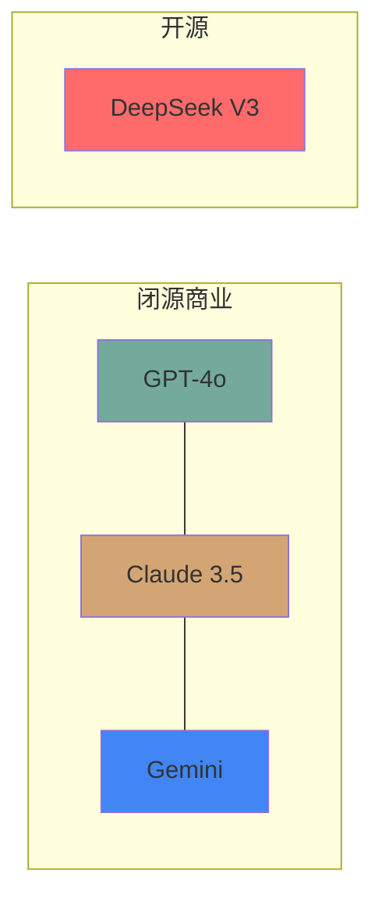

## 先说结论

| 需求 | 推荐 | 理由 |
|------|------|------|
| 写代码/工程任务 | Claude 3.5 Sonnet | SWE-bench 64%，编程能力最强 |
| 数学/推理 | DeepSeek V3 | 数学benchmark接近Claude，价格便宜30倍 |
| 搜索/调研 | Gemini | 100万token上下文+实时搜索 |
| 通用/日常 | GPT-4o | 综合体验最稳 |

---

## 四大模型一览



---

## GPT-4o：综合最稳

**发布**：2024年5月（OpenAI）

**强项**：
- 综合能力均衡，没有明显短板
- 多模态（看图、听声音）
- 响应速度快

**Benchmark数据**：
- MMLU：85%+
- 众包对比胜率：65%

**价格**：$2.5/百万输入token，$10/百万输出token

**适合**：日常对话、通用任务、不知道选什么就选它

---

## Claude 3.5 Sonnet：程序员首选

**发布**：2024年6月（Anthropic）

**强项**：
- 编程能力最强，SWE-bench 64%
- 视觉推理强（MathVista 67.7%，超过GPT-4o的63.8%）
- 理解复杂指令能力强

**Benchmark数据**：
- 研究生推理(GPQA)：92%
- 编程任务(SWE-bench)：64%

**价格**：$3/百万输入token，$15/百万输出token

**适合**：写代码、代码审查、技术文档

---

## DeepSeek V3：开源性价比王

**发布**：2024年12月（DeepSeek）

**强项**：
- 开源！可以本地部署
- 价格便宜30倍（$0.27 vs $2.5/百万token）
- 数学推理能力接近闭源模型

**模型架构**：
- 671B参数（MoE架构）
- 每次推理激活37B参数

**Benchmark数据**：
- HumanEval编程：接近GPT-4o
- 数学推理：接近Claude 3.5

**价格**：$0.27/百万输入token，$1.1/百万输出token

**适合**：预算有限、需要私有化部署、批量处理任务

---

## Gemini：搜索调研专家

**发布**：2024年12月（Google）

**强项**：
- 100万token上下文（能"读"整本书）
- 原生多模态（视频理解强）
- 集成Google搜索

**Benchmark数据**：
- GPQA Diamond：91.9%
- 多模态理解(MMMU-Pro)：81%

**适合**：学术调研、长文档分析、视频分析

---

## 真实场景怎么选

### 场景1：日常写作/对话
→ **GPT-4o**：响应快，成本适中，不会出错

### 场景2：写代码/Debug
→ **Claude 3.5 Sonnet**：编程benchmark最高，理解代码库能力强

### 场景3：数学/科学计算
→ **DeepSeek V3**：推理能力强，价格便宜

### 场景4：读论文/写报告
→ **Gemini**：上下文长，能处理整篇论文

### 场景5：预算紧张
→ **DeepSeek V3**：同等能力便宜30倍

---

## 价格对比

```
GPT-4o:        ████████████████████████████ $2.5
Claude 3.5:    ██████████████████████████████████ $3.0  
Gemini:        ████████████████████ $1.25 (估)
DeepSeek V3:   ███ $0.27
```

*每百万输入token价格*

---

## 我的使用习惯

- **主力编程**：Claude 3.5（Cursor里用）
- **日常问答**：GPT-4o
- **批量任务**：DeepSeek（API便宜）
- **长文档**：Gemini

不用纠结"哪个最好"，按场景选就行。

有问题留言。
