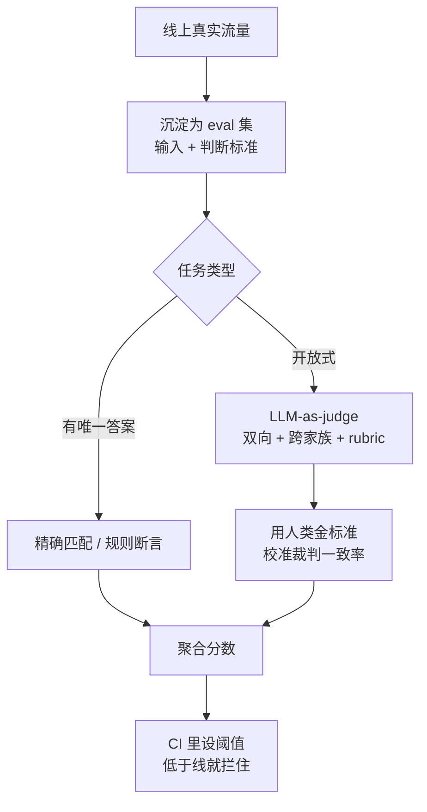
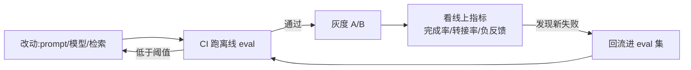

你把 prompt 改了一版,在三个例子上试了试,看着比之前顺眼,于是上线。

第二天客服群里有人说 AI 答得不对劲。你回头去看,发现那三个例子确实变好了,但另外二十种你没试的情况里,有五种悄悄变差了。

这是做 LLM 应用最常见的窘境:**你没法靠"看几个例子"判断一次改动是涨还是跌**。模型是个高维的黑盒,你改 prompt、换模型、调温度,影响面是发散的——在你盯着的地方变好,在你没盯着的地方变坏。评估(eval)要解决的就是这件事:把"我觉得变好了"换成"我有证据说变好了"。

这篇讲怎么把这套证据系统搭起来,以及一路上的坑。

## 公开 benchmark:能看排名,不能信分数

打开任何一个模型发布页,都有一排 benchmark 分数:MMLU 多少、GPQA 多少、SWE-bench 多少。这些数字有用,但对你的应用,它的参考价值比你以为的小得多。

第一个问题是**饱和**。2026 年的前沿模型在 MMLU 上普遍是 92–94%,彼此之间的差距已经掉进噪声里了。一个 93%、一个 94%,你没法据此说后者更强——重跑一次,排名可能就反过来。MMLU 这种榜单现在只能告诉你"这是不是个能用的模型",没法在头部模型之间分高下。后来的 MMLU-Pro 想救场,到 2026 年初头部模型也挤到了 90% 附近,同样在走向饱和。

第二个问题更麻烦:**污染**。Benchmark 的题目是公开的,公开就意味着它们大概率被爬进了下一代模型的训练数据。模型可能不是"做对了"题,而是"背过"答案。已经被记录的案例不少:MMLU 的题目在 Common Crawl 里能找到原文;HumanEval 的题和 LeetCode 题高度重合;SWE-bench 的 issue 在公开 git 历史里能翻到现成的修复 commit。

污染有多严重?Scale AI 做过一个对照实验:他们照着小学数学题 GSM8K 的风格,重新出了 1250 道全新的题。结果模型在新题上系统性掉分,最差的那个掉了 13 个百分点。同一个模型,题目换成没见过的,能力就缩水一成多——这说明原来那个高分里,有相当一部分是"背"出来的。

所以 2026 年大家转向**抗污染的 benchmark**:LiveCodeBench、LiveBench 这类按时间切片,只用某个日期之后才出现的新题;FrontierMath 把题目压在手里不公开。这些比静态榜单可信。但即便如此,它们衡量的还是"通用能力",不是"你的任务"。

**结论很直接:公开 benchmark 用来粗筛候选模型——把明显不行的排除掉。但"这个模型在我的客服场景里好不好用",它一个字都没回答。这个问题只能你自己回答。**

## 自己的 eval 集:这才是真正的资产

你的应用有一个公开 benchmark 永远覆盖不到的东西:**你的真实输入分布**。你的用户怎么提问、问什么、用什么语气、夹杂什么错别字和行业黑话,这是你独有的。eval 集就是把这个分布固定下来。

怎么建,有三个我认为不能省的原则。

**第一,例子来自真实流量,不要凭空编。** 你坐在工位上想象的用户提问,和用户真实打出来的,分布不一样。最好的来源是线上日志:把真实请求捞出来,尤其是那些用户追问、重述、明显不满意的——失败案例的信息密度最高。每修一个线上 bug,就把那个 case 沉淀进 eval 集,它就再也不会悄悄复发。

**第二,先覆盖,再追数量。** 一个有 50 条、覆盖 15 种场景的 eval 集,比一个有 500 条、全是"查订单状态"的 eval 集有用得多。你要的是把**输入空间的不同角落**都摸到:正常请求、边界请求(超长输入、空输入、多意图混在一句)、对抗请求(prompt 注入、诱导越权)、还有那些你修过的历史 bug。每加一条都先问:它覆盖了一个新角落,还是只是重复?

**第三,每条例子都要能判对错。** 一条 eval 数据 = 输入 + 判断标准。判断标准可以是标准答案,可以是一组必须满足的规则("回复里必须包含订单号"、"不能承诺退款"),也可以是一段评分 rubric。没有判断标准的例子不是 eval,是 demo。

eval 集建起来之后,它会变成你团队最值钱的资产之一——比某一版 prompt 值钱。Prompt 会被改无数次,模型会换代,但 eval 集是持续累积的、关于"什么叫做对"的集体知识。

## 三种判分方式,以及各自的脾气

有了例子,接下来是怎么自动判分。三种方式,从硬到软排:

| 判分方式 | 适用场景 | 优点 | 坑 |
|---|---|---|---|
| 精确匹配 / 结构校验 | 分类、抽取、JSON 输出、函数调用 | 客观、零成本、可复现 | 只能判有唯一答案的任务 |
| 规则 / 断言 | 「必须含 X」「不得出现 Y」、格式、长度 | 快、便宜、覆盖硬约束 | 写不出复杂语义判断 |
| LLM-as-judge | 开放式回答、摘要、对话质量 | 能评主观质量 | 自带偏差,本身需要被评估 |

优先用硬的。能用精确匹配解决的,绝不上 LLM 判分——它客观、免费、每次结果一样。能拆成规则断言的也尽量拆:"回复里有没有订单号"用一个正则就够了,没必要请一个大模型来读。

真正绕不开的是开放式任务——"这个摘要写得好不好"、"这个客服回复够不够得体"。这种没有唯一答案,只能上 LLM-as-judge:让另一个模型按 rubric 给被测输出打分。这是 2026 年的主流做法,但你得知道它的脾气。

## LLM-as-judge 会骗你,而且骗得很有规律

LLM 当裁判的最大问题是:**它的偏差不是随机噪声,是系统性的**。随机噪声多跑几次能平掉,系统性偏差不会——它会朝一个固定方向把你的判断带偏。

有几个偏差已经被反复测出来,几乎跑不掉:

- **位置偏差。** 做两个回答的对比评分时,排在前面的那个赢面更大,跟它质量无关。一篇系统研究跨 15 个裁判模型、约 15 万次评测,确认这个偏差稳定存在,而且两个回答质量越接近,偏差越明显。
- **长度偏差。** 更长、更啰嗦的回答倾向于拿更高分,哪怕信息量没多。
- **自我偏好。** 裁判模型会偏爱"长得像自己输出"的回答。用 GPT 当裁判,它会高看 GPT 系的生成。

这些偏差有多严重?2026 年 RAND 的一项研究发现,没有任何一个裁判模型在所有 benchmark 上都可靠,前沿模型在高难度的偏差测试上错误率超过 50%。换句话说,**你直接拿一个模型当裁判,它的判断有可能跟抛硬币差不多**。

但 LLM-as-judge 不是不能用,是要带着纪律用:

1. **位置偏差用双向取平均。** 每对回答评两次,A 在前评一次、B 在前评一次,结果平均。一次都不能省。
2. **自我偏好用跨家族裁判。** 别用同一家的模型既当选手又当裁判。被测是 GPT,就用 Claude 或 Gemini 当裁判。
3. **长度偏差写进 rubric。** 在评分标准里明说"长度不是加分项,只看信息是否准确、完整、相关"。
4. **裁判本身也要被评估。** 这步最常被跳过,但最关键:你得人工标一批"金标准"数据——比如 100 条人类专家打过分的样本——然后看你的 LLM 裁判跟人类标注的一致率有多高。一致率太低,这个裁判就不能用。**裁判是被测系统的一部分,它没经过验证,它给的所有分数都是空的。**
5. **让它做选择题,别做作文题。** LLM 判断"A 和 B 哪个好"比直接打"7.5 分"靠谱得多。能转成两两对比或分类的,就别让它打绝对分。

整套流程串起来大概是这样:

## eval 也会被过拟合

这是个反直觉但很真实的陷阱:**你太频繁地拿同一个 eval 集调东西,迟早会过拟合它**。

机制和模型训练里的过拟合一模一样。你改 prompt → 看 eval 分 → 没涨 → 再改 → 再看分……重复几十次之后,你其实是在用 eval 集当训练信号,手动地把 prompt"拟合"到这 50 条例子上。最后 eval 分很漂亮,线上没动静——你优化的是分数,不是真实质量。判分用 LLM 的时候更隐蔽:你可能在不知不觉中专门迎合那个裁判的偏好。

防过拟合有几个具体做法:

**留一个 holdout 集,平时锁起来。** 把 eval 集切成两份:开发集天天用、随便看;holdout 集藏好,只在准备上线前、或重大版本节点跑一次。如果开发集涨了、holdout 没涨,说明你过拟合了开发集,这次改动是假涨。

**让 eval 集持续流动。** eval 集不是建一次就定死的。每周从最新线上流量补新例子进去,旧的、已经被反复优化过的逐步轮换出主力集。一个会更新的 eval 集,你很难持续过拟合它——因为标准在动。

**盯波动幅度,别盯小数点。** eval 分从 86% 变成 87%,在大多数 eval 集规模下都落在统计噪声里,不代表任何东西。先估算一下你这个 eval 集的噪声范围(同一个配置跑几次,看分数抖多大),只有改动幅度明显超过噪声,才算数。

## eval 过了,不等于线上变好

最后这点是态度问题:**离线 eval 永远是真实世界的近似,不是真实世界本身**。

eval 集再好,也只是你**当下能想到**的输入。用户永远会问出你没预料的问题,真实分布永远在漂移。所以离线 eval 全绿,不等于上线就好。真正的裁判是线上。

成熟的做法是把离线和线上接成一条链:

- **离线 eval 当守门员。** 接进 CI:每次改 prompt、换模型、动检索,自动跑一遍 eval,分数低于阈值的 PR 直接拦住,不让合。这一步拦的是**明确的退步**——已知该做对的事别做错了。
- **A/B 测线上真实效果。** 离线绿灯只是"准你上",不是"它一定好"。新版本上线要灰度,拿一小部分真实流量跑 A/B,比的是真实业务指标:任务完成率、人工转接率、用户重述率、负反馈率。
- **线上当 eval 集的源头。** A/B 里跑出来的新失败 case,回流进 eval 集。这样下次同样的问题就被离线 eval 挡住了。

这是个闭环:线上发现问题 → 进 eval 集 → CI 里防复发 → 新版本 A/B → 再发现新问题。eval 集就在这个循环里越长越厚,你的"证据系统"越来越能覆盖真实世界。

## 写在最后

把 LLM 评估这件事压成几句:

公开 benchmark 只能粗筛模型,饱和加污染让它的分数当不得真。真正靠谱的是**你自己的 eval 集**,例子要来自真实流量、先求覆盖、每条都能判对错——这是你团队最该攒的资产。判分能用硬规则就别用 LLM,绕不开 LLM-as-judge 时,位置、长度、自我偏好三个偏差必须主动治,裁判本身要拿人类标注校准过才算数。别在同一个 eval 集上反复磨,留 holdout、让 eval 集持续更新。最后记住离线 eval 只是近似,线上 A/B 和真实指标才是终审。

很多团队做 LLM 应用,功能上得飞快,却始终说不清每次改动是涨是跌——因为他们一直在"看几个例子拍脑袋"。先把这套证据系统搭起来,你才算真的在迭代,而不是在赌博。

---

参考资料:

- [A pragmatic guide to LLM evals for devs — The Pragmatic Engineer](https://newsletter.pragmaticengineer.com/p/evals)
- [Evaluation best practices — OpenAI API](https://developers.openai.com/api/docs/guides/evaluation-best-practices)
- [Judging the Judges: A Systematic Study of Position Bias in LLM-as-a-Judge — arXiv](https://arxiv.org/abs/2406.07791)
- [LLM-as-a-Judge: Why Frontier Models Fail 50%+ Bias Tests — Adaline](https://www.adaline.ai/blog/llm-as-a-judge-reliability-bias)
- [What Is a Contaminated LLM? Detection, Famous Cases, 2026 Guide — llm-stats.com](https://llm-stats.com/blog/research/what-is-a-contaminated-llm)
- [What LLM Benchmarks Don't Measure — benchmarkingagents.com](https://benchmarkingagents.com/what-these-benchmarks-miss/)
- [What is LLM evaluation? A practical guide — Braintrust](https://www.braintrust.dev/articles/llm-evaluation-guide)
