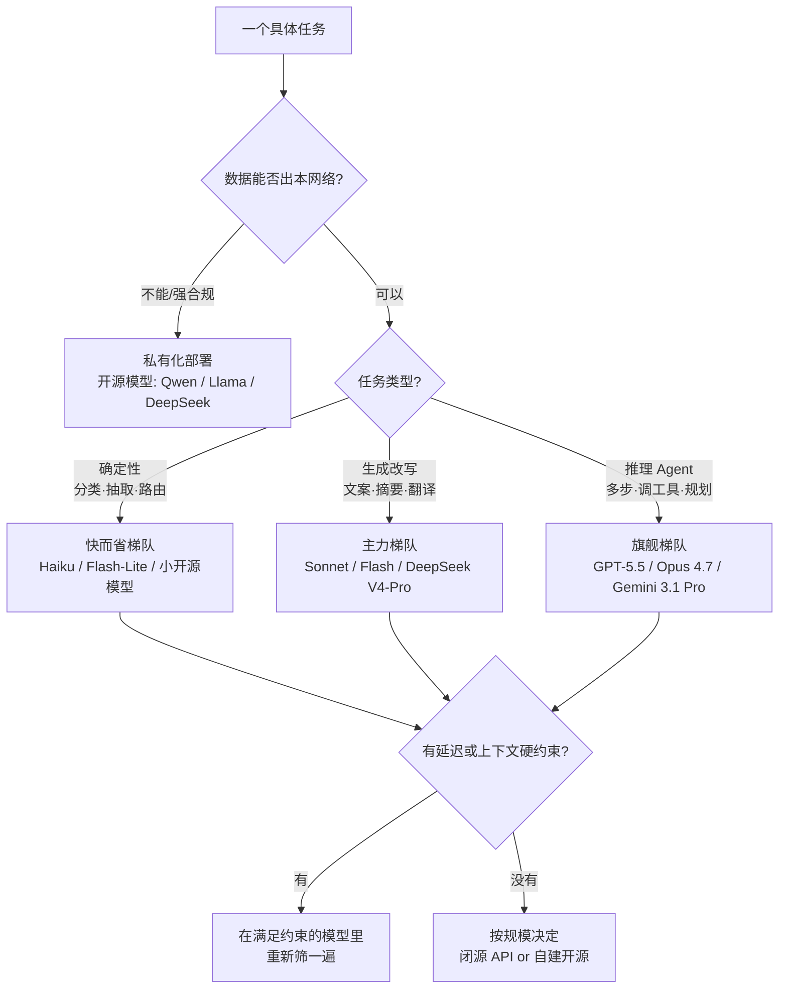

去年我们一个内部项目,用 Claude Opus 跑一个意图分类:输入一句用户的话,输出三个标签之一。上线两周,有人去看账单,愣住了——这个分类任务,一个 14B 的开源模型在自己的卡上跑,效果差不了几个点,成本是它的几十分之一。

这就是 2026 年选型最常见的错误:**把"哪个模型最强"当成了"我该用哪个模型"。**

这两个问题根本不是一回事。GPQA、SWE-bench、ARC-AGI-2 这些榜单告诉你的是天花板,而你大部分的线上请求,离天花板远着呢。一个分类、一段摘要、一次格式化抽取——这些活儿,旗舰模型是高射炮打蚊子。选型不是选最强,是给**每一类任务**配一个"刚好够用、且最便宜"的模型。

这篇不排名。给你一套按场景拆的决策框架。

## 先认清:2026 年的模型是分梯队的

2026 年 5 月,前沿模型大概是这么个格局——记住具体版本号意义不大,它们每两三个月就跳一次,记住**梯队**就行:

| 梯队 | 代表模型(2026.05) | 典型 API 价格(输入/输出,每百万 token) | 该干什么 |
|---|---|---|---|
| 旗舰 | GPT-5.5、Claude Opus 4.7、Gemini 3.1 Pro | $5 / $25 量级 | 复杂推理、Agent 编排、难代码 |
| 主力 | Claude Sonnet 4.6、Gemini 3 Flash、DeepSeek V4-Pro | $1–3 / $3–15 量级 | 绝大多数生产任务 |
| 快而省 | Claude Haiku 4.5、Gemini 3 Flash-Lite、DeepSeek V4-Flash | $0.1–1 / $0.3–5 量级 | 分类、抽取、路由、简单问答 |

这张表里藏着一个关键事实:**旗舰和"快而省"之间,输出价格差了几十倍。** DeepSeek V4-Flash 的输出大约 $0.28,GPT-5.5 是 $30——一百多倍。这个差距不是边角料,它会直接决定你的产品能不能规模化。

而梯队之间的**能力**差距,这两年反而在缩小。2024 年你能明显感觉到旗舰和主力不是一个物种;2026 年,在很多具体任务上,主力模型只比旗舰差几个百分点,有时候你压根测不出来。能力在收敛,价格还拉得很开——这就是"按梯队选型"能省钱的根本原因。

所以第一条原则:**默认从主力梯队起步,只在它确实顶不住时才往上抬。** 不要反过来,从旗舰往下砍——那样你永远不知道下面那一档是不是早就够了。

## 维度一:能力够不够,要按"任务类型"问

"够用"不是一个模糊的感觉,它可以拆。把你的任务大致归到三类:

**确定性任务**——分类、实体抽取、格式转换、敏感词过滤。这类任务有标准答案,对错可量化。结论很直接:**用快而省梯队,甚至小开源模型。** 旗舰在这里没有任何优势,它多出来的"智商"在一个三选一的分类题上无处发挥。我前面说的那个翻车案例,就是这一类。

**生成与改写任务**——写文案、做摘要、客服话术、翻译。这类没有唯一答案,但对"质量"敏感。主力梯队是甜区。值得一提:Claude 系列在中长文写作上的语感明显更自然,一次能稳定输出十几万 token 不塌;如果你的产品核心就是"写得像人",这个差异值得你多花那点钱。

**推理与 Agent 任务**——多步代码、需要调工具、长链路规划、"自己想办法完成"。这是 2026 年唯一**真的需要旗舰**的地方。一个 Agent 要连续做二三十步,每一步的小错误会累积,中间某一步判断失误,后面全废。这种场景下,旗舰多出来的几个点,放大到整条链路就是"能跑通"和"跑不通"的区别。GPT-5.5、Claude Opus 4.7 这一档,贵有贵的道理——但前提是,你的任务真的是 Agent,而不是被包装成 Agent 的一次性问答。

一个实操建议:**别用一个模型扛所有任务。** 成熟的做法是按任务路由——一个便宜模型做分流和简单活儿,难的才转交旗舰。这比"全程旗舰"省一大笔,也比"全程便宜"靠谱。

## 维度二:成本不是单价,是「单价 × 调用量 × 输出长度」

很多人看 API 价格,只瞄一眼那个"每百万 token 多少钱"。这是不够的。真正的账是三个数相乘:

- **单价**——尤其是**输出**单价,通常是输入的 3 到 5 倍,而且 Agent 类任务输出占比高。
- **调用量**——一天一千次还是一千万次,差四个数量级。
- **平均输出长度**——让模型"先想再答"(reasoning)能提质量,但思考链本身也是要付费的 token。

把这三个乘起来,你常会得到一个反直觉的结论。举个例子:一个日活几万的客服机器人,绝大多数对话是"查物流""改地址"这种,真正复杂的咨询可能只占 5%。如果你全程用旗舰,等于为了那 5% 的复杂场景,给 95% 的简单场景也付了旗舰价。把 95% 切到主力或快省梯队,月成本可能直接砍掉七八成,用户一点感知都没有。

两个几乎免费、却经常被忘掉的省钱手段,务必用上:

- **Prompt Caching(提示缓存)**——固定不变的前缀(system prompt、长文档、few-shot 例子)缓存住,命中后这部分输入便宜约 90%。多轮对话、RAG、批量同模板任务,收益巨大。
- **Batch(批处理)**——不要求实时返回的任务,走批处理接口,普遍五折。离线打标、夜间报表、内容审核这类活儿,没理由不用。

记住:**选型省下的钱,常常比换一个"更便宜的模型"省得还多。** 因为它省的是结构性的浪费。

## 维度三:延迟、上下文——被场景一票否决的硬约束

有些维度不参与"性价比"的权衡,它们是**门槛**:不过线,这个模型直接出局,多强多便宜都没用。

**延迟。** 如果你做的是实时语音对话,用户说完到 AI 出声的预算只有几百毫秒(这个我在[上一篇](../voice-technology/voice-latency-budget/)里专门拆过)。这种场景,你要盯的是**首 token 延迟(TTFT)**,不是模型聪不聪明。一个慢半拍的旗舰,体验上输给一个快的主力模型。反过来,如果是离线批处理,延迟根本不在你的考虑范围里——这时候为"快"付的溢价就是纯浪费。

**上下文长度。** 2026 年长上下文已经不稀缺:Gemini 3.1 Pro 和 DeepSeek V4 都是 1M token 窗口,Llama 4 甚至把 10M 带进了开源世界。但**有窗口不等于会用**。把 50 万 token 一股脑塞进去,模型对中间段落的注意力会明显下降——业内说的 "lost in the middle" 没有消失。所以长上下文是个二元的资格题:你的单次任务真需要塞进一整本书、一个大代码库,那 1M 窗口是硬指标;如果你的输入本来就几千 token,纠结谁的窗口更大毫无意义,**该花力气的是 RAG 的检索质量,而不是模型的窗口数字。**

判断方法很简单:**先问"这个场景能不能容忍 X",不能就直接划掉一批模型,再在活下来的里面比性价比。** 别把硬约束和软偏好混在一起算。

## 维度四:闭源还是开源,2026 年这道题变简单了

两年前这是个艰难抉择,因为开源模型确实差一截。2026 年不一样了。

DeepSeek V4-Pro 在 SWE-bench Verified 上能摸到 80% 出头,和顶级闭源模型只差零点几个点,而且是 MIT 许可证。Qwen 3.5 / 3.6、Llama 4 也都在各自的领域逼近前沿。**开源和闭源的能力差距,现在是用单个 benchmark 上的几个点来衡量,不再是"差一代"。** 同时,主流开源模型现在发布即附带官方量化版本(Q4/Q5/Q8),部署门槛大幅下降。

所以这道题的判据,从"谁更强"变成了别的:

- 选**闭源 API**:你要的是省心。不碰 GPU、不管扩缩容、要最新最强、出了事有人兜底。绝大多数从 0 到 1 的产品,该走这条路——你的精力应该花在产品上,不是运维推理集群。
- 选**开源**:你有三个理由之一——量足够大(自己跑的边际成本能把闭源 API 打下去)、需要深度微调(让模型长出领域知识)、或者数据不能出门(下一节细说)。

还有个容易被忽视的点:**开源是一份保险。** 用闭源 API,你绑定了对方的定价、限流和模型下线节奏——它说某个版本退役,你就得连夜迁移。把一部分负载放在能自己掌控的开源模型上,是对供应商风险的对冲。

## 维度五:要不要私有化部署——这题先于选模型

如果你的数据是病历、银行流水、未公开的财报、核心代码——**这一条会推翻上面所有结论。** 它不是一个性价比维度,它是法律和信任的红线。

判断私有化部署需求,问三个问题:

1. **数据能不能离开你的网络?** 受监管的医疗、金融、政务,答案常常是"不能"。
2. **合规要求审计闭环吗?** 欧盟 AI 法案 2026 年 8 月全面生效,高风险系统要求可追溯、可解释、有人类监督。这些在一个黑盒 API 后面很难自证。
3. **数据主权有没有硬约束?** 某些行业、某些地区,要求推理全程在境内、在自有设施内完成。

只要有一个答案指向"必须自己掌控",那就**只能选能私有化的开源模型**——Qwen、Llama、DeepSeek 这一类,把权重下载下来,跑在自己的 VPC 或机房里。这时候"GPT-5.5 更强"是一句正确的废话,因为它根本不在你的候选集里。

要提醒的是,私有化不是"省钱"的同义词。算上 GPU 采购或租赁、运维、扩缩容、安全加固,**很多时候它比 API 更贵。** 选它的理由是控制权和合规,不是成本。如果你既没有合规硬约束、量也撑不起一个推理集群,却因为"感觉更安全"去自建,那大概率是给自己挖坑。

## 把这套框架连起来

选型不是从一张排行榜里挑第一名,而是带着你的场景,依次过几道闸门:

注意几个细节。**第一道闸是数据合规,不是能力**——合规一票否决,放在最前面,免得你比了半天性价比最后发现这个模型根本不能用。任务类型决定的是**梯队**,不是具体型号——型号每季度都变,梯队的逻辑稳定得多。延迟和上下文是**筛选器**,不是打分项——它们只负责把不合格的划掉。最后才轮到闭源还是开源,而这一步**主要由调用量决定**:量小走 API,量大到自建更划算时,再考虑迁。

## 最后

2026 年大模型这块,缺的从来不是好模型,缺的是"清楚自己要什么"。

榜单天天有人更新,排名天天有人吵,但你的客服机器人需要的可能只是一个稳定、便宜、够快的主力模型;你的代码 Agent 才真的吃旗舰那几个点的智商;你的合规系统压根不在公开榜单的讨论范围里。

把"哪个最强"这个问题放下。换成一串具体的问题:这个任务是什么类型?能容忍多少延迟?一天调用多少次?数据能不能出门?——这几个问题答完,该选哪个,基本也就清楚了。

选型的功夫,九成在想清楚需求,一成在看模型。顺序别搞反。
