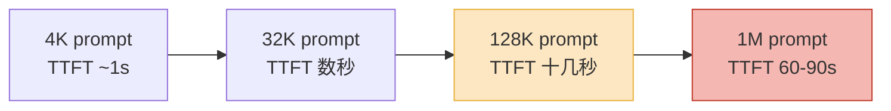
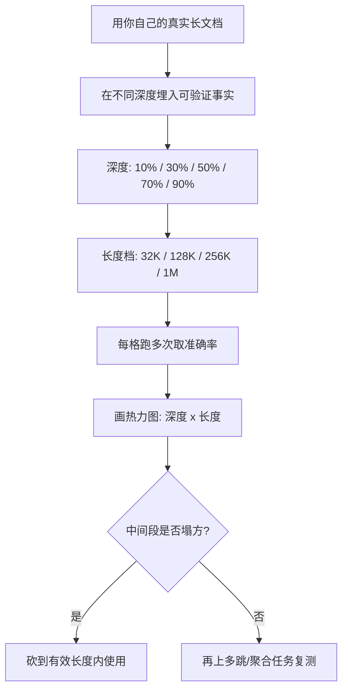

把一份 80 万字的项目文档整个粘进对话框,模型没报错,也回答了你的问题。你松了口气:看,1M 上下文真香。

但你有没有验证过——它引用的那段需求,是真的从文档第 40 万字的位置取出来的,还是它顺着上下文的语气编了一段听起来很对的话?

这是 2026 年长上下文最尴尬的地方:**"放得进"是确定的,"用得好"是不确定的,而大多数人只测了前者。** 模型厂商标 1M、2M,你看到的是窗口大小;你真正需要的是这个窗口里有多少 token 是"模型会认真看"的。这两个数字,差得比你想的大。

## 标称上下文 vs 有效上下文

先把两个概念分清楚。

**标称上下文**(advertised context)是模型 API 允许你塞进去的最大 token 数,超了就报错。**有效上下文**(effective context)是模型在性能开始明显掉档之前,真正能可靠利用的 token 数。

RULER 这个 benchmark 当年就是为了量化这件事造出来的。它的结论很扎心:很多号称 32K+ 的模型,在 32K 长度下能维持及格表现的,只有一半。到了 2026 年,百万级窗口普及之后,这个差距并没有消失——多份独立测试给出的经验值是,**有效上下文通常只有标称值的 60%~70%**,而且性能下滑的方式,简单的 token 计数根本看不出来:漏检的内容、编造的细节、断掉的推理链。

把 2026 年几个主流模型的标称窗口和实测召回放在一起看:

| 模型 | 标称窗口 | 1M 长度实测召回 | 备注 |
|---|---|---|---|
| Claude Opus 4.6 | 1M | ~76% | 256K 下约 93%,长度档位领先 |
| Gemini 3.1 Pro | 1M | ~70% | 次于 Opus |
| Gemini 1.5 Pro | 2M | ~55%~65% | 窗口最大,召回反而靠后 |
| Llama 4 Scout | 10M | 1M 后明显衰减 | 标称最大,有效区间远小于标称 |

注意 Gemini 1.5 Pro 这一行:它标 2M,是表里窗口最大的,但 1M 长度下的召回反而排在后面。**窗口大小和有效质量,不是同一个排行榜。** 标称 10M 的 Llama 4 Scout 也一样,过了 1M 之后衰减得很明显,适合做的是"检索式"任务,不是"全局理解"任务。

所以下次看到发布会上"业界最长 2M 上下文"的字样,你心里应该自动换算:能放 2M,能用好的可能就 1.2M 上下。剩下那 80 万 token,是放进去给你心理安慰的。

## Lost in the middle:模型其实在"跳读"

为什么有效上下文会缩水?最经典的一个原因叫 lost in the middle。

2023 年那篇同名论文做了个很干净的实验:把同一条关键信息(needle)放在长文档的不同位置,看模型能不能答对。结果画出来是一条 **U 形曲线**——信息放在开头或结尾,模型答得很好;放在中间,准确率断崖式下跌。

说人话就是:模型读长文档的方式,和一个赶时间的人翻书很像——认真看了前言和结论,中间几百页基本是扫过去的。

这背后是注意力的问题。有研究把它归因为"注意力稀释":context 越长,softmax 要把有限的注意力权重摊到越多的 token 上,每个 token 分到的"关注"就越薄。再叠加位置编码带来的偏置,中间段就成了被冷落的区域。有些极端的测量甚至说,某些前沿模型的有效注意力区间,比标称窗口短了高达 99%。

要补充一句公平话:**这事在 2026 年比 2023 年好了不少。** 像 Gemini 2.5 Flash 这种,做简单的事实型问答(needle-in-a-haystack)时,不管 needle 放在哪个位置,基本都能答对——简单检索上的 lost in the middle 已经被很大程度上修掉了。

但别高兴太早。needle 测试本身有个大问题:它太简单了。最近的研究(《Lost in the Haystack》)发现,**needle 越小、越像"一行字",越好找;一旦你要找的"目标内容"本身是一大段、需要跨段落拼起来的,定位难度立刻上去。** 真实业务里,你要模型做的从来不是"找一句话",而是"把分散在第 3、19、56 章的三处约束综合起来判断"。这种多跳、聚合类的任务,才是中间段塌方的重灾区。needle 测试绿灯,不代表你的任务绿灯。

## 成本和延迟:长上下文是按复利收费的

就算质量没问题,还有一笔账要算:钱和时间。

标准 self-attention 是 **O(n²)** 的。这个 n 是 token 数,平方意味着——prompt 翻一倍,attention 的计算量翻四倍。把 1M token 喂进一个标准 Transformer,光 attention 就是 1M × 1M 量级的矩阵运算,接近一万亿次操作。这笔账不是线性涨的,是带复利的。

最直接的体感是 **TTFT(首 token 延迟)**。模型要先把你的整个 prompt "读"一遍(prefill 阶段),才能吐第一个字。prefill 的耗时随上下文长度**加速增长**:从 4K 涨到 32K 你可能没什么感觉,从 32K 涨到 128K 就开始难受,而按观测到的幂律曲线(指数约 1.24)外推到 1M,**第一个字出来可能要等 60~90 秒**。

对任何交互式产品,这都是致命的。我之前写语音 Agent 的延迟预算时讲过,用户回应超过 800ms 就觉得别扭——你拿一个 prefill 要等一分钟的长上下文方案去做对话,等于直接出局。长上下文是离线批处理的工具,不是实时对话的工具。

钱也一样。虽然到 2026 年部分厂商(比如 Anthropic 的 Opus 4.6 / Sonnet 4.6)取消了长上下文的 2 倍溢价,1M 窗口按标准价 GA,但**每次调用你都为整个 prompt 的所有 token 付费**。一个 80 万 token 的上下文,你每问一句,这 80 万 token 就重新计一次费。一天问一百次,就是八千万 input token。多轮对话场景下,这个数字会失控。

更隐蔽的是 GPU 内存。多百万 token 的输入,KV cache 能吃掉 80%~90% 的显存。这意味着同样的硬件,长上下文请求能并发的数量大幅下降,单位成本进一步被推高——这部分不一定体现在 API 标价里,但会体现在你自建推理时的账单上。

## 什么任务真的需要超长上下文

讲了这么多问题,不是说长上下文没用。是说它**被滥用了**。

很多人把长上下文当成 RAG 的"平替"——"既然能塞进去,我干嘛还搭检索系统"。这个判断在大多数场景是错的。把无关内容大量塞进 context,不只是浪费钱,还会主动加重注意力稀释,把真正相关的那几千 token 淹掉。**给模型的信息越精准,它表现越好;喂得越多越杂,反而越差。**

那什么任务是长上下文真正不可替代的?我的判断是,符合下面特征的:

- **需要全局视野,且无法预先切片检索。** 比如让模型审一份 60 万字的合同,找出所有相互矛盾的条款。你没法提前知道哪两条会冲突,RAG 切片检索这时候帮不上忙——它本质上是个 N×N 的全局比对。
- **跨度大、上下文强耦合的代码理解。** 让模型理解一个几十万行的代码库的某个改动会牵连到哪里。调用关系是网状的,切片会切断它。
- **长链多跳推理。** 一份侦探小说式的材料,线索分散在几十处,需要全部在场才能推出结论。检索 top-k 很容易漏掉那个"看起来不相关但其实是关键"的片段。
- **多模态长素材。** 一段两小时的视频、一本带大量图表的书,本身就是一个不可切分的整体。

发现规律没有?这些都是"**信息之间有强关联、无法干净切分**"的任务。反过来,如果你的任务是"从一堆文档里找出和问题相关的那部分再回答"——那是检索任务,老老实实用 RAG,又快又便宜又准。长上下文和 RAG 不是谁取代谁,是分工:**能切就检索,不能切才全塞。**

## 怎么实测一个模型的长上下文质量

最后给点能落地的。别信发布会,自己测。一个最小可行的验证流程:

几个关键点:

**第一,用你自己的文档,别用公开 benchmark 的语料。** 主流模型很可能在训练时见过 RULER、LongBench 这些数据,刷分会虚高。拿你业务里真实的合同、文档、代码去埋点,测出来的才作数。

**第二,测两类任务,别只测 needle。** needle 检索(找一句话)和多跳聚合(综合好几处信息推结论)要分开测。前者现在大多数模型都能过,后者才是真正区分模型的地方。只测 needle 你会得到一个过于乐观的结论。

**第三,把"深度 × 长度"做成热力图。** 横轴是上下文总长度,纵轴是关键信息埋入的相对位置(10%、30%、50%、70%、90%)。每个格子跑十几次取准确率。这张图一画出来,模型在哪个长度档开始掉、中间段塌不塌,一目了然。你的"有效上下文"就是这张图上还保持绿色的那个区间。

**第四,把延迟和成本一起记进表。** 不只记准不准,把每个长度档的 TTFT 和单次调用费用也记下来。很多时候你会发现,128K 档的质量和 1M 档差不了几个百分点,但延迟和成本差了一个数量级——那 1M 就没有用的必要。

我的总结很简单:**百万级上下文是个真实的能力,但它的有效区间,要靠你自己量出来,而不是读厂商的标称值。** 把整本书塞进去之前,先问自己两件事——这个任务真的不能切片吗?我验证过模型在这个长度下中间段不塌方吗?这两个问题答不上来,那个 1M 窗口,大概率只是个让你安心的数字。

---

参考资料:
- [RULER: What's the Real Context Size of Your Long-Context Language Models?](https://arxiv.org/pdf/2404.06654)
- [Lost in the Middle: How Language Models Use Long Contexts](https://direct.mit.edu/tacl/article/doi/10.1162/tacl_a_00638/119630/Lost-in-the-Middle-How-Language-Models-Use-Long)
- [Lost in the Haystack: Smaller Needles are More Difficult for LLMs to Find](https://pmc.ncbi.nlm.nih.gov/articles/PMC12478432/)
- [1M Token Context Reality Check 2026: Gemini vs Claude Latency](https://tokenmix.ai/blog/1m-token-context-reality-check-2026)
- [Long-Context Inference at Scale: The Hidden Infrastructure Cost](https://www.digitalocean.com/community/tutorials/long-context-inference-production-cost)
- [The Prefill Bottleneck Problem](https://dasroot.net/posts/2026/05/prefill-bottleneck-token-generation-latency-prompt-processing/)
</content>
</invoke>
