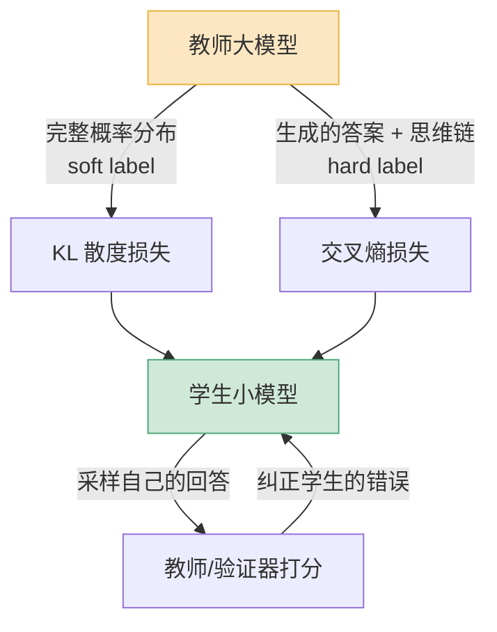

2025 年初,DeepSeek 放出一组叫 R1-Distill 的模型,其中那个 7B 版本在 AIME 2024 数学竞赛题上拿到了 55.5% 的 pass@1。

这个数字有意思的地方在于:它比 QwQ-32B-Preview 还高。一个 7B 的小模型,在硬核推理题上,打过了一个参数量是它四倍多的模型。

更反常识的是后面这句——DeepSeek 自己说的:**直接拿强化学习去训练那个 7B 小模型,效果还不如蒸馏**。小模型自己练,练不出这种推理能力;但你拿一个 671B 的大模型当老师,把它的思考过程喂给小模型学,小模型就学会了。

这就是蒸馏。它不是模型压缩里的某种玄学技巧,而是 2026 年几乎每家做小模型的团队都在用的标准动作。这篇把它讲清楚:蒸馏到底搬走了什么,和微调是什么关系,能搬多少,做不到什么,以及一套能落地的流程。

## 为什么要蒸馏:质量和成本之间那道墙

先说动机。

大模型好用,但贵。一个 400B 参数的旗舰模型,推理延迟高、单次调用成本高、显存吃得狠,你不可能把它塞进每一台手机、每一个边缘设备、每一条高并发的客服管道。可小模型呢?便宜、快、能本地跑,但你直接拿一个 7B 模型出来用,它在复杂任务上的回答质量,和旗舰模型差着一大截。

这就是那道墙:**质量在大模型这边,成本和延迟在小模型那边**,你想两个都要。

传统的过墙办法有两种。一种是直接训练一个小模型——但小模型受参数量限制,见的数据再多,某些能力(尤其是多步推理)就是练不出来,这是容量天花板。另一种是把大模型剪枝、量化——这能省一点,但省不了数量级,而且剪过头质量就崩。

蒸馏是第三条路,也是目前性价比最高的一条:**不让小模型自己悟,而是让大模型手把手教它**。Meta 拿 Llama 4 Behemoth 去训 Llama 4 的 Scout 和 Maverick,Google 用 Gemini 去带 Gemma 2 和 Gemma 3,DeepSeek 用 R1 蒸出 1.5B 到 70B 一整个系列——2026 年你能叫得出名字的小模型,背后基本都站着一个大模型老师。

道理很朴素:让一个聪明人把题做一遍、把思路讲给你听,比你自己对着标准答案死磕,学得快得多。

## 蒸馏到底在传递什么

很多人对蒸馏的第一印象是"用大模型造点数据,拿去训小模型"。这个理解对了一半,但漏掉了最关键的东西。

蒸馏的精髓在于**软标签(soft label)**。

举个例子。你问模型"这句话情感是正面还是负面",一个普通的训练样本只会告诉小模型一个**硬标签**:正面。但大模型老师给出的不是一个字,而是一整个概率分布——比如"正面 0.82、负面 0.11、中性 0.07"。

这个分布里藏着硬标签给不了的信息:老师不光告诉你答案是什么,还告诉你**它有多确定、它觉得别的选项有多接近**。这种"模型对各种可能性的相对判断",业内叫**暗知识(dark knowledge)**。小模型学的不只是结论,是老师那套打分的体感。

技术上,这通常通过让学生去拟合老师的 logits(输出层的原始分数)来实现,用 KL 散度当损失函数,衡量学生分布和老师分布差了多远。这条路线效果最好,但有个前提:你得能拿到老师的 logits——也就是老师得是个"白盒"。

如果老师是个只给你返回文字的 API(黑盒),你拿不到 logits,那就退而求其次:让老师**大量生成完整的答案和推理过程**,再拿这些文本当训练数据去教小模型。DeepSeek 蒸馏 R1 用的就是这条路——他们用 R1 生成了 80 万条样本,然后纯靠监督微调(SFT)把这些样本喂给 Qwen 和 Llama,连强化学习都没加。这条路拿不到暗知识,但胜在简单、不挑老师、谁的 API 都能蒸。

## 蒸馏和微调,到底什么关系

这是最容易绕晕的一个点,我直接给结论:**蒸馏和微调不是对立的,蒸馏的落地往往就是一次微调,只是数据来源不同**。

把它们放一起看:

| 维度 | 普通微调 | 蒸馏 |
|---|---|---|
| 数据从哪来 | 人工标注 / 真实业务数据 | 大模型老师生成 |
| 学的是什么 | 硬标签:正确答案 | 软标签 + 答案 + 推理过程 |
| 想解决的问题 | 让模型适配某个特定任务 | 把大模型的通用能力搬进小模型 |
| 训练动作 | SFT / LoRA | 通常也是 SFT / LoRA,或加 KL 损失 |

看出来了:**微调是"怎么训"的问题,蒸馏是"用什么数据训、为了什么目的"的问题**。当你拿 R1 生成的 80 万条数据去 SFT 一个 Qwen,你既在做蒸馏,也在做微调——这两件事在那一刻是同一件事。

实践里常见的组合拳是这样的:先蒸馏,把大模型的通用推理能力搬进小模型,得到一个"底子好"的基座;再拿你自己的业务数据做一次轻量微调,让它贴合具体场景。先蒸再调,各管一段,这是 2026 年成熟团队的标准配方。

## 它能搬走多少,又搬不走什么

蒸馏不是魔法。说清楚它的边界,比吹它的效果更重要。

**搬得动的:** 有明确"过程"和"答案"的能力,蒸馏搬运效率最高。数学推理、代码生成、逻辑规划、结构化抽取、指令遵循——这些任务有清晰的思维链可以模仿,有可验证的对错。DeepSeek-R1-Distill 系列在 AIME、MATH-500、代码这些榜单上的大幅领先,就是证据。一个被好好蒸过的小模型,在它擅长的窄领域里,能逼近甚至偶尔超过原始大模型在该领域的表现。

**搬不动的,有三类要心里有数:**

第一,**老师不会的,学生也学不会**。蒸馏是能力的转移,不是能力的创造。老师的水平就是学生的天花板,你不可能蒸出一个比老师还强的模型(在老师覆盖的能力上)。

第二,**广度会被压缩**。小模型参数量摆在那,容量有限。你蒸数学,它数学强;但如果你想让它数学、代码、多语言、长文本、创意写作样样精通,它装不下。蒸馏逼着你做取舍:**想清楚这个小模型到底要干什么,然后只蒸那部分**。什么都想要,结果是什么都平庸。

第三,**泛化能力可能变弱,这是个隐蔽的代价**。2026 年有研究指出一个值得警惕的现象:蒸馏(尤其是自蒸馏)会让小模型推理变快、在分布内的题上表现好,但在没见过的、需要灵活变通的题上,泛化反而退步了。原因是学生学的是老师在特定题型上的"套路",套路学得越熟,越容易在新题型上水土不服。这个权衡叫"更快的推理,更弱的泛化"——蒸的时候要盯着分布外的测试集,别只看训练集附近的漂亮数字。

## 推理蒸馏:2026 年最值得关注的一支

推理模型的兴起,给蒸馏带来一个新麻烦,也催生了一个新方法。

麻烦在于:推理模型动不动就是几千 token 的长思维链。链条越长,**误差越会一步步累积**——老师在第三步走错一小步,学生照单全收,后面全错。你按传统办法,把老师生成的思维链整段喂给学生去模仿,学生学的是"老师在老师自己的思路上怎么走",可一旦学生自己推到一个老师从没经过的中间状态,它就懵了,因为训练时没人教过它这种情况怎么办。

2026 年的解法叫**在线蒸馏(on-policy distillation)**,现在已经是 DeepSeek-V4、Qwen3、Gemma、Nemotron 这些前沿模型做推理后训练的标配。

它的思路反过来:**不让学生模仿老师的轨迹,而是让学生先自己走**。学生针对一道题,用自己当前的水平生成一条推理路径;然后老师(或者一个奖励模型、一个验证器)来给这条路径打分、指出哪里错了;学生再根据这个反馈修正。

关键区别在于:学生学的是"**在我自己会犯的错误状态下,该怎么爬出来**",而不是"老师在它的完美状态下怎么走"。这就解决了前面那个状态不匹配的问题——学生纠错纠的是自己真实会遇到的坑。代价是工程更复杂:你需要一个能在线打分的老师或验证器,训练时还得不断采样,比离线蒸馏重不少。

## 一套能落地的流程,和几个坑

如果你要真的蒸一个模型出来,我建议按这个顺序走:

1. **先把任务边界划死**。这个小模型只干一件事还是几件事?接受多大的质量损失换多少成本?这一步想不清楚,后面全是返工。
2. **选老师和基座**。老师选你能力范围内最强、且最好是白盒(能拿 logits)的;基座小模型选参数量匹配你部署预算的。Qwen、Llama 这些开源系列是常见选择。
3. **造数据**。让老师在你的目标任务分布上大量生成,带上完整推理过程。数据的覆盖面决定了学生的上限——老师没生成过的题型,学生就是盲区。
4. **训练**。黑盒老师就纯 SFT;白盒老师就加上 logits 的 KL 损失,效果更好。资源紧就 LoRA。
5. **评估,而且要评分布外**。别只看训练集附近的指标,一定要拿没蒸过的题型测泛化,盯住前面说的"泛化退化"。

几个反复见到的坑:

- **老师数据不验证**。大模型也会生成错答案,你不筛一遍就喂给学生,学生连错误一起学。蒸推理任务时,务必用验证器或答案对照过滤掉老师做错的样本。
- **盯着平均分,忽略短板**。蒸完看总分涨了就交差,结果某个子能力悄悄崩了。要按子任务分别看。
- **以为蒸馏能省掉数据工程**。蒸馏省的是人工标注,不是数据设计。老师生成什么、覆盖哪些分布,仍然得你来设计,这活儿一点不轻。
- **法律和合规边界**。用某个商业 API 的输出去蒸自己的模型,可能违反对方的服务条款。蒸之前先看清楚老师那边的许可,这是工程之外、但绕不开的一道坎。

最后回到开头那个 7B 模型。它能打过 32B,不是因为它聪明,是因为它有个好老师,而且有人想清楚了"只让它学推理这一件事"。蒸馏的价值从来不是"免费得到一个强模型",而是**让你能在质量和成本之间,精确地选一个你要的点**——前提是你真的想清楚了要选哪个点。

---

**参考资料**

- [On-Policy Distillation — Thinking Machines Lab](https://thinkingmachines.ai/blog/on-policy-distillation/)
- [A Survey of On-Policy Distillation for Large Language Models — arXiv](https://arxiv.org/abs/2604.00626)
- [The paradox of LLM self-distillation: Faster reasoning, weaker generalization — TechTalks](https://bdtechtalks.com/2026/04/13/llm-self-distillation-tradeoffs/)
- [DeepSeek-R1 — GitHub](https://github.com/deepseek-ai/DeepSeek-R1)
- [Understanding LLM Distillation Techniques — MarkTechPost](https://www.marktechpost.com/2026/05/11/understanding-llm-distillation-techniques/)
- [The Best Open-Source Small Language Models in 2026 — BentoML](https://www.bentoml.com/blog/the-best-open-source-small-language-models)
- [Knowledge Distillation: Teacher-Student Loss Explained — Label Your Data](https://labelyourdata.com/articles/machine-learning/knowledge-distillation)
