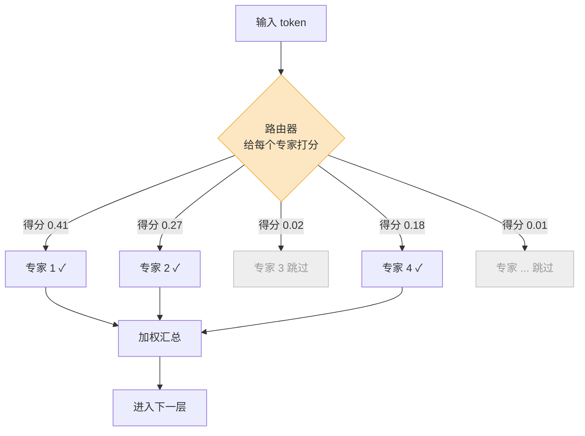

DeepSeek V3 一共有 6710 亿参数。但你每问它一句话,真正参与计算的只有 370 亿——剩下的 95% 在显存里待命,一个 token 都不碰。

这听起来像偷工减料,其实是过去三年大模型架构最重要的一次转向。到 2026 年,你叫得出名字的开源旗舰里,几乎没有一个还是"老老实实每个参数都算"的稠密模型:DeepSeek V4-Pro(1.6 万亿总参 / 490 亿激活)、Qwen 3.5(3970 亿 / 170 亿)、Llama 4 Maverick(4000 亿 / 170 亿)、Kimi K2(1 万亿 / 约 320 亿)、Mistral Large 3(6750 亿 / 410 亿)。这个架构叫 Mixture-of-Experts,混合专家。

它解决的是一个很具体的矛盾:模型想变聪明,最直接的办法是堆参数;但参数一多,推理就慢、就贵。MoE 的本质,是**把"模型有多少知识"和"算一次要花多少钱"这两件事拆开**。这篇讲清楚它怎么做到的,以及它换来了什么样的工程代价。

## 先讲清楚:稠密模型贵在哪

传统的大模型——也就是 GPT-3、早期 Llama 那种"稠密"(dense)模型——有一个朴素的规则:**每个 token 经过每一层时,所有参数都要参与计算**。

一个 700 亿参数的稠密模型,处理一个 token 就要做大约 700 亿次乘加。处理一句 100 字的话,乘以 100。参数翻倍到 1400 亿,这个账单也跟着翻倍。算力、显存带宽、电费,全是线性涨上去的。

问题是,模型里真的每个参数对每个 token 都有用吗?

直觉上不是。你问它"今天北京天气",和你让它"写一段 Rust 的并发代码",用到的知识完全不同。稠密模型的浪费就在这:不管你问什么,它都把"写代码的脑区"和"聊天气的脑区"全部点亮算一遍。

MoE 想做的事很朴素——**该用哪块脑子,就只用哪块**。

## 用一个类比把它讲透

把稠密模型想象成一家公司,每来一个问题,全公司 200 个人都得开会、都得发言,然后把意见汇总。问题再小也这么干。开会效率极低,但好处是没人会漏掉。

MoE 是另一种公司。同样养着 200 个员工(这叫**专家**,expert),但每来一个问题,门口坐着一个**调度员**(这叫**路由器**,router 或 gating network),它扫一眼问题,只挑最对口的 8 个人进会议室,其余 192 人继续待岗。

关键点来了:

- **这家公司"知识总量"还是 200 人份的**——养着这么多专业各异的人,什么问题都有人能接。
- **但"开一次会的成本"只有 8 人份**——大部分人这次根本没参与。

这就是 MoE 那句听起来矛盾的话——"参数量大,但推理便宜"——的全部秘密。**总参数**(200 人)决定模型的知识容量;**激活参数**(8 人)决定你每跑一次推理的算力账单。MoE 把这两个数字解耦了。

DeepSeek V3 就是个标准样本:总参 6710 亿,但每个 token 只激活 370 亿。它每个 token 的计算量,大约相当于一个 370 亿的稠密模型,但它肚子里装的知识,是 6710 亿那个量级的。官方的说法是,它每 token 的有效计算成本,大致是同等总参稠密模型的二十分之一。

## 路由器:整个架构的开关

MoE 里最精巧、也最容易出问题的零件,是路由器。

它的工作具体发生在模型的每一个 MoE 层里。一个 token 进来,路由器算一个打分,给当前层的每个专家打个分,然后选出得分最高的几个(术语叫 top-K,DeepSeek V3 是 top-8),只把这个 token 送进这几个专家。专家各自算完,按打分加权汇总,再往下一层走。下一层又是一次全新的挑选。

这里有几个反常识的点,值得单独说:

**专家不是"按学科分工"的。** 你不会找到一个"数学专家"或者一个"法语专家"。训练完之后去看,专家学到的分工往往很碎、很说不清——可能某个专家专门处理标点和换行,某个专门管代码缩进。分工是训练里自己涌现出来的,人没法预先指派。

**路由是逐层、逐 token 的。** 不是一句话进来挑一次专家就定了。一个 token 在 60 层里,可能经过 60 组完全不同的专家组合。所以"激活了哪些专家"是个非常动态的东西。

**2026 年的主流是"细粒度专家 + 共享专家"。** DeepSeek 带火的这套设计有两个改动。一是**把专家切小切多**——与其养 8 个大专家,不如养 256 个小专家,每次激活 8 个。专家越细,组合越多,分工越能专精。二是留一两个**共享专家**(shared expert)常驻,不参与路由,每个 token 都过——专门负责"标点、语法、常识"这类谁都要用的通用能力,这样路由的那些专家就能腾出来专攻各自的细分领域。

## 激活参数 vs 总参数:一张表说清楚

这两个数字,是 2026 年看模型参数表时唯一真正要分清的事。它们决定了完全不同的东西:

| 维度 | 总参数 | 激活参数 |
|---|---|---|
| 它代表 | 模型的知识容量 | 单 token 的计算量 |
| 决定 | **显存**够不够装得下 | **推理速度** / 单次成本 |
| DeepSeek V3 | 6710 亿 | 370 亿 |
| Qwen 3.5 | 3970 亿 | 170 亿 |
| Llama 4 Maverick | 4000 亿 | 170 亿 |
| Kimi K2 | 1 万亿 | 约 320 亿 |

看这张表,你能立刻得到一条很实用的判断:一个标成 "397B-A17B" 的模型,**前面那个数(397B)是你买显存时要看的,后面那个数(17B)是你估推理速度时要看的**。两者别搞混——这是 MoE 部署里最常见的认知错误。

它带来的实际效果是反直觉的:Qwen3.5 那个 35B-A3B 的 MoE 版本,占的显存远比 9B 的稠密版大(光权重就 21GB 对 5.8GB),但在同一张卡上,它的吞吐和首 token 延迟反而更好。**显存占得多,但跑得快**——因为速度只跟那 3B 激活参数有关。

## 天下没有白吃的午餐:MoE 的工程代价

讲到这你可能觉得 MoE 是纯赚的——同样的算力,能装下大得多的模型。但它把成本从"算力"转移到了别的地方,而且这些地方往往更难搞。

**第一笔账:显存。** 推理时虽然只算 8 个专家,但你不知道下一个 token 会路由到哪 8 个,所以**全部 256 个专家的权重都得待在显存里**。MoE 省的是算力,不是显存。Kimi K2 这种 1 万亿参数的模型,FP16 精度下光权重就要 2TB 量级的显存,只能靠多卡集群伺候。"激活参数小"绝不意味着"能在小显卡上跑"。

**第二笔账:负载均衡。** 路由器是学出来的,它会"偏心"。如果不管,训练到后面会出现"马太效应"——几个专家因为早期表现好,被路由器越选越多,练得越来越强;另一批专家几乎没 token 光顾,等于白养。极端情况下,你那个 256 专家的模型,实际只有几十个在干活,知识容量大打折扣。

早期的解法是加一个**辅助损失**(auxiliary loss),硬性惩罚"分配不均",逼路由器雨露均沾。但这个惩罚项会和"把 token 送给最对的专家"这个主目标打架,损害模型质量。DeepSeek V3 改用了一个**无辅助损失**的方案:给每个专家的路由打分加一个可调的偏置项,某个专家最近太忙就把它的偏置调低、太闲就调高——只动路由、不进损失函数。这个细节,正是 DeepSeek 那一代模型训练能又稳又便宜的关键之一。

**第三笔账:部署复杂度。** 专家太多,一张 GPU 装不下,得**专家并行**(expert parallelism)——把 256 个专家摊到几十张卡上。这下问题来了:一个 token 路由到的 8 个专家,可能散在 8 张不同的卡上,token 得先被发过去、算完再收回来。这种跨卡通信(all-to-all)是 MoE 推理的头号瓶颈,而且负载是**动态**的——这一批 token 可能全挤向某几张卡,那几张卡就成了堵点。稠密模型完全没有这套烦恼。

所以 MoE 不是"免费午餐",而是一笔**用工程复杂度换计算效率的交易**。它假设你有能力搞定多卡集群、搞定专家并行、搞定负载均衡。对个人开发者和小团队,在本地跑一个大 MoE,门槛其实比同等"能力档位"的稠密模型更高——因为卡在显存上。

## 为什么 2026 年几乎全是 MoE

把上面的账合起来算,结论就很清楚了。

到 2026 年,纯靠堆稠密参数这条路已经走到头:再大的稠密模型,推理成本高到没法规模化服务。而模型厂商面对的需求又是确定的——既要在榜单上有竞争力(要知识容量、要总参数),又要能用可接受的成本服务上亿用户(要推理便宜、要激活参数小)。

MoE 是目前唯一能同时满足这两头的架构。它让厂商可以理直气壮地把总参数推到万亿级,同时把激活参数压在二三十亿到五十亿这个"服务得起"的区间。DeepSeek、Qwen、Llama、Kimi、Mistral——这些团队各自独立地收敛到同一个设计,不是跟风,是因为约束条件相同,最优解也就相同。

但要泼一点冷水:MoE 不是没有代价的银弹。它把模型能力做大了,却把工程门槛也抬高了——显存、通信、负载均衡,每一样都需要专门的基础设施。**它真正改变的,不是"模型能多强",而是"多强的模型能被服务得起"。** 对 2026 年要做规模化部署的团队来说,这恰恰是最重要的那个问题。

---

参考来源:

- [DeepSeek-V3 Technical Report (arXiv)](https://arxiv.org/html/2412.19437v1)
- [DeepSeekMoE: Towards Ultimate Expert Specialization (arXiv)](https://arxiv.org/pdf/2401.06066)
- [MoE Model Inference on GPU Cloud: Expert Parallelism, Memory, and Cost (2026) — Spheron](https://www.spheron.network/blog/moe-inference-optimization-gpu-cloud/)
- [LLM Landscape May 2026: DeepSeek V4 vs Qwen 3.5 vs Llama 4 — QubitTool](https://qubittool.com/blog/llm-landscape-may-2026-deepseek-qwen-llama-comparison)
- [A Review on Load Balancing Strategy in MoE LLMs — Hugging Face](https://huggingface.co/blog/NormalUhr/moe-balance)
