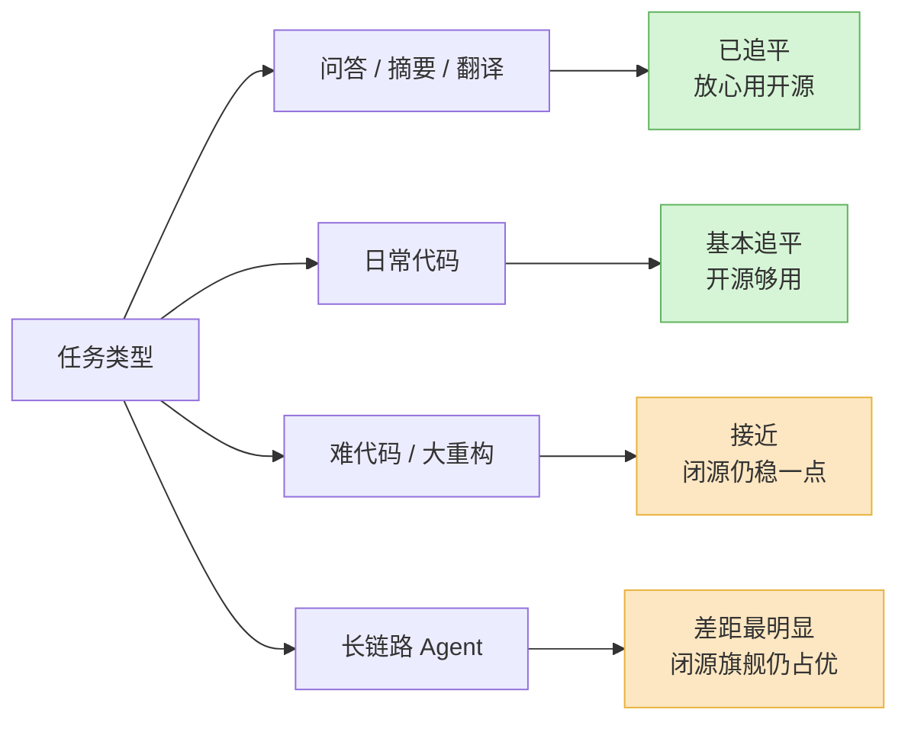
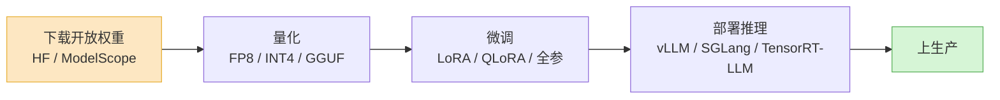

去年这个时候,如果你跟人说"我们生产环境跑开源模型",对方多半会礼貌地点点头,心里默认你是预算不够。开源模型当时的人设就是"省钱的次选"。

2026 年 4 月 24 日,DeepSeek 把 V4-Pro 的权重直接挂上了 Hugging Face,1.6 万亿参数,MIT 许可证,1M 上下文。它在编程基准上的得分,跟当月最强的几个闭源旗舰之间,差的不是一个段位,是几个百分点。

这件事的信号比"又一个新模型"大得多。它意味着:**当你今天选开源,你放弃的不再是能力,而是别的东西。** 这篇就来复盘开放权重这一年的格局——谁在领跑、中国开源为什么这么猛、剩下的那点差距到底在哪、许可证这个没人爱看的细节怎么反而成了关键,以及开源那套微调量化部署的生态,现在到底成不成熟。

需要先说清一个词。这篇说的"开源",严格讲是**开放权重(open weights)**:权重能下载、能自己跑、能商用。它和教科书意义上的开源软件不是一回事——绝大多数模型不公开训练数据、不公开训练代码,你拿到的是一个能跑的成品,不是一份能复现的菜谱。后面我还是用"开源"这个习惯叫法,但你心里得清楚,这是个有水分的词。

## 领跑的三家,其实是三种活法

把 2026 年 5 月的开放权重阵营摊开看,DeepSeek、Qwen、Llama 这三个名字最响,但他们根本不在同一条赛道上。

| 模型家族 | 代表版本(2026.05) | 架构 / 规模 | 许可证 | 它在赌什么 |
|---|---|---|---|---|
| DeepSeek | V4-Pro / V4-Flash | MoE,1.6T 总参 / 49B 激活;Flash 284B/13B | MIT | 用前沿能力 + 极宽松许可证,直接当闭源旗舰的平替 |
| Qwen | Qwen 3.6 系列,六档尺寸 + 3.6-VL | Dense 与 MoE 混编,从手机到集群 | Apache 2.0(开放档) | 用"全尺寸覆盖 + 最强多语言"做开发者默认底座 |
| Llama | Llama 4 Scout / Maverick | MoE,17B 激活(16 / 128 experts) | Llama 4 社区许可(有条件) | 守住最大的部署装机量和生态惯性 |
| Mistral | Large 3、Small 4 | Large 3:675B/41B;Small 4:119B/6B | Apache 2.0 | 欧洲牌照 + 干净许可证,做合规友好的那一个 |

这张表里我最想让你看的是最后一列。三家头部各自押的东西完全不同:DeepSeek 押"能力对标 + 许可证无摩擦",Qwen 押"尺寸谱系最全",Llama 押"我已经在几十亿设备和无数教程里了"。

DeepSeek 这一年是最猛的。V4 那套混合注意力——把小块 token 压成摘要、新 token 只挑最相关的摘要去看——让 1M 上下文从"标在参数表里的可选项"变成了默认就开的标配。更狠的是它的定位:V4-Pro 不装"小而美",它就是冲着替代闭源旗舰来的,而且配一张 MIT 许可证。MoE 架构让它"总参 1.6T 听着吓人、实际每个 token 只激活 49B",于是这么大的模型,真有团队能在自己的卡上把它跑起来。

Qwen 走的是另一条路:不赌单个旗舰多猛,赌**谱系**。3.6 系列铺了六档尺寸,从能塞进手机的小模型,到要集群伺候的大模型,外加 3.6-VL 管视觉、Omni 档把音视频也收进同一套架构。它的杀手锏是多语言——连着两代,Qwen 都是中文和小语种覆盖最好的开放模型,没有之一。对一个要做出海、要做多语言产品的团队,这个"全家桶"的吸引力,比榜单上多两个点实在得多。

Llama 现在的位置有点微妙。它仍然是全世界装机量最大的开放权重生态——绝大多数教程、工具链、社区问答默认拿 Llama 举例,这个惯性是真实的资产。但 2026 年 4 月,Meta 发了个叫 Muse Spark 的闭源模型,出自它的超级智能实验室。这个动作基本宣告了"Llama 当旗舰"的时代结束:Meta 把最强的牌收回了闭源的口袋,Llama 4 更像是守着存量生态的那张牌,而不是冲锋的那张。

## 领跑名单上,为什么大半是中文名字

把今天的开放权重第一梯队列出来——DeepSeek V4、Qwen 3.6、Kimi K2.6、GLM-5——你会发现一个不太能忽略的事实:领跑的大部分是中国实验室。在第三方基准上,DeepSeek V4-Pro 已经能摸到顶级闭源模型的边,跟 GPT-5 系列的差距是一两个点的量级。

这不是巧合,是一条清晰的策略分叉。

**美国的前沿实验室,主力打法是闭源 API。** OpenAI、Anthropic、Google 把最强的模型锁在 API 后面卖订阅、卖调用量,这是他们的商业模式核心。开源对他们是副业,甚至是会侵蚀主营收入的事——所以他们要么不开,要么开个上一代的、缩水的版本意思一下。Meta 曾经是个例外,用 Llama 撑开源大旗,但 Muse Spark 一出,这个例外也在收口。

**中国实验室的处境正好相反,于是开源成了最优解。** 一来,在闭源订阅这条路上,品牌、渠道、先发优势都被美国大厂占住了,正面硬刚很难;开放权重是一条能绕开这堵墙、快速建立全球开发者心智的路。二来,把权重开出去,等于把全世界的开发者变成免费的测试者、布道者和生态贡献者——你在 Hugging Face 上每多一次下载,就多一分行业默认值的分量。三来,这里面有很现实的国际环境因素:开放权重让海外用户可以自己下载、自己部署,不依赖某一家公司的在线服务,这种"可自主掌控"本身就是卖点。

所以中国开源的强势,根子不在"中国工程师更聪明",而在**商业模式的逼迫**——闭源那条路被堵了一截,开源反而成了能赢的那条路。理解这点很重要,因为它说明这个格局是结构性的、会持续的,不是某一个季度的榜单波动。

一个推论:别把"开源"和"中国"画等号,但你也得承认,2026 年你做开源选型,候选名单上大概率一半以上是中国实验室的模型。这是现实,接受它,然后回到工程问题本身。

## 差距还剩多少:几个点,但不是均匀分布的几个点

"开源追上闭源了吗"——这个问题问得太粗。正确的问法是:**在哪类任务上追上了,在哪类还没。**

笼统地说,2026 年开放权重的天花板,跟闭源旗舰的差距是**单个 benchmark 上几个百分点**的量级。两年前那种"差一代"的体感没有了。但这几个点不是均匀摊开的,它在不同任务上厚薄差很多。

- **知识问答、摘要、改写、翻译**——基本追平,很多场景里你盲测分不出来。这些任务对"最后那点智商"不敏感,开源模型在这里就是够用。
- **代码**——很近但还没平。DeepSeek V4-Pro 在 SWE-bench 这类编程基准上能进顶级行列,日常写函数、改 bug,体验和闭源旗舰差不多。差距在最难的那一档:大型重构、跨文件的复杂改动,闭源旗舰还稳一点。
- **长链路 Agent**——这是缺口最明显的地方。一个 Agent 要连着做二三十步,每步的小误差会累积,中间判断一次失误后面全废。在这种"误差不能累积"的场景里,闭源旗舰多出来的那几个点会被链路放大成"能跑通"和"跑不通"的差别。如果你的产品核心是复杂 Agent,这个差距值得你认真对待。

我的判断是:**对今天 80% 以上的生产任务,开源的能力差距已经不该是你拒绝它的理由。** 真正还需要为闭源那几个点掏钱的,是长链路 Agent 和最难的代码——而这恰好和我[上一篇选型文章](../llm-selection-2026/)里说的"只有推理 Agent 任务真的需要旗舰"对上了。能力够不够,先按任务类型问,别按"开源还是闭源"这个标签笼统判。

## 许可证:没人爱看,但能直接判你出局

聊开源模型,大家都盯着 benchmark,几乎没人认真读许可证。这是个错误——**许可证决定的不是它强不强,而是你到底能不能用。** 一个跑分爆表但许可证不让你这么用的模型,对你来说等于零分。

2026 年开放权重的许可证,大致分两类。

一类是**真·宽松许可证**:MIT、Apache 2.0。DeepSeek V4 是 MIT,Qwen 的开放档是 Apache 2.0,Mistral 的 Large 3、Small 4 也是 Apache 2.0。这类许可证的意思朴素到几乎没有惊喜:随便商用、随便改、随便闭源分发,不看你用户量多少,不附加奇怪条件。对企业法务来说,这是最省心的一类——基本不用开会。

另一类是**带条件的"社区许可证"**,典型是 Llama 4 社区许可。它对绝大多数人是免费可商用的,但藏着两颗你必须知道的雷:

1. **用户量超过 7 亿月活,要单独找 Meta 谈授权。** 对大厂和超级 App 来说这是真实的约束。
2. **欧盟。** 截至 2026 年初,Llama 4 的许可证不向欧盟注册的公司开放。如果你的公司在欧洲,这一条直接把 Llama 4 从你的候选名单里划掉——不是"麻烦一点",是"不能用"。

还有更小众的坑:Mistral 的 Leanstral 用的是 CC BY-NC,**NC 就是 non-commercial,不能商用**。这种你拿来做个 demo、写篇博客没问题,一旦进生产就是合规事故。

所以选开源模型,许可证这一步要前置。我的习惯是:**先问许可证,再看 benchmark。** 顺序反了,你可能比了三天性价比,最后发现这个模型你公司根本不能用。一句话总结这一节——**想省心,优先 MIT / Apache 2.0;碰到"社区许可证",法务必须读一遍正文,尤其你在欧盟、或者你是个大厂。**

## 什么时候开源真的更划算

能力追平了、许可证也看清了,接下来是那个真问题:**到底什么场景该上开源?** 我给三个判据,满足任意一个,开源就值得认真考虑;一个都不满足,老实用闭源 API。

**第一,数据不能出门。** 病历、银行流水、没公开的财报、核心代码——这类数据有法律和信任的红线,不能发给外部 API。这种情况下你没得选,只能把权重下载下来,跑在自己的 VPC 或机房里。这时候"某个闭源模型更强"是句正确的废话,因为它压根不在你的候选集里。这是开源最硬的理由,和省钱无关。

**第二,调用量大到自建的边际成本能打过 API。** 闭源 API 是按 token 付费,用得越多账单越线性地涨。自建推理是一笔固定的前期投入(GPU、运维、扩缩容),之后边际成本很低。存在一个交叉点:量小的时候 API 划算,量大到某个程度,自建的总成本反超。一个每天几千万次调用、且任务相对固定的场景,自建开源模型常常能比闭源 API 便宜一大截。但要诚实——**自建不等于省钱**。算上 GPU 采购或租赁、运维人力、安全加固,量不够大的时候它比 API 更贵。别因为"感觉自己掌控更踏实"就去自建,那是给自己挖坑。

**第三,你要做深度微调。** 你想让模型长出你这个领域的知识、你这家公司的话术、你的私有数据训出来的判断——这件事在闭源 API 上要么做不了,要么很受限。开放权重你能做全参微调、LoRA、继续预训练,想怎么改怎么改。如果"领域定制"是你产品的核心壁垒,开源几乎是唯一选项。

反过来说，如果你是个从 0 到 1 的产品,量还没起来,数据也没有合规红线,又不需要深度定制——**别折腾,用闭源 API。** 你的精力该花在产品上,不是花在伺候一个推理集群上。开源在这种阶段提供的"掌控感"是一种心理安慰,代价是真金白银的运维成本。

但有一点,即使你主力用闭源,也值得在开源上留一手:**开源是一份保险。** 用闭源 API,你绑定了对方的定价、限流、模型下线节奏——它说某个版本退役,你就得连夜迁。手里捏着一个能自己跑的开源模型作为备份,是对供应商风险最便宜的对冲。

## 生态:模型只是开头,能不能跑起来看工具链

开源大模型真正成熟的标志,不是又出了个跑分更高的模型,而是**围着它的那套工具链已经好用到让自建不再是苦差事。** 2026 年,这套生态确实补齐了。

**部署推理。** vLLM 仍然是事实标准,生态最厚——观测工具、各种集成、社区问答,出了问题大概率能搜到答案。SGLang 这两年追得很猛,在不少高并发、多轮对话的负载上吞吐已经反超 vLLM。成熟团队现在的常见做法是:默认用 vLLM,对那些高流量的多轮端点单独拿 SGLang 压一遍测试,流量特别大的关键模型才上 TensorRT-LLM。换句话说,"开源模型怎么高效跑起来"这个问题,2026 年已经有成熟的标准答案,不再需要你自己趟。

**量化。** 这是降低部署门槛最关键的一环。主流开源模型现在发布即附带官方量化版本——FP8、INT4、INT8、GPTQ、AWQ、GGUF,基本你想要的格式都有。在 H100、B200 这类带原生 FP8 张量核的卡上,FP8 量化几乎是"免费的"好处:显存砍一半,吞吐还能涨,精度损失小到可忽略。量化的意义在于,它把"这个 1.6T 的大模型我的卡装不下"这个硬门槛,变成了"装得下,而且跑得不慢"。

**微调。** LoRA、QLoRA 这套已经是成熟基建,在消费级或单张数据中心卡上微调一个中等模型,门槛低到个人开发者都能上手。生态里现成的微调框架、数据处理工具一大堆,不用从零搭。

把这三块连起来看:

这条链路上的每一环,2026 年都有打磨得很顺手的开源工具。这才是开放权重阵营这一年最被低估的进展——**不是模型本身变强了多少,而是"把一个开源模型真正跑进生产"这件事,从一个需要专门团队啃的硬骨头,变成了一条有标准答案的成熟流程。** 模型再强,跑不起来也是零;生态补齐了,开源才算真的能用。

## 最后

复盘开放权重这一年,我会这么总结:

**能力上**,开源和闭源的差距收敛到了几个点,而且这几个点集中在长链路 Agent 和最难的代码这两块——对大多数生产任务,能力已经不该是你拒绝开源的理由。

**格局上**,领跑的大半是中国实验室,DeepSeek 用"前沿能力 + MIT"做闭源平替,Qwen 用全尺寸谱系做开发者底座,Llama 守着最大的存量生态但旗舰光环已经让给了 Meta 的闭源新模型。这个格局是商业模式逼出来的,结构性的,短期不会变。

**决策上**,选开源的理由就三个——数据不能出门、量大到自建更便宜、要深度微调。三个都不沾,就用闭源 API,别给自己找运维的麻烦。而真要选开源,**先读许可证再看跑分**:MIT / Apache 2.0 省心,"社区许可证"必须让法务过一遍,你在欧盟尤其要当心 Llama 那条款。

两年前选开源,你是在能力上做妥协。2026 年不一样了——开源不再是"省钱的次选",它是一个**关于控制权的主动选择**。你放弃的不是聪明,是省心;你换来的是数据的掌控、成本的结构、定制的自由。这笔账划不划算,取决于你的场景,不取决于榜单第一名是谁。
