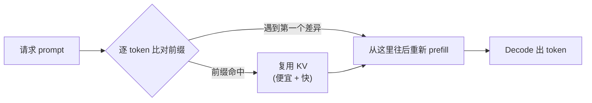
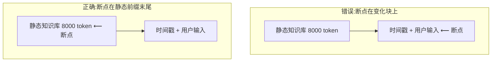

先说一个很多团队没算过的账。

假设你的 Agent 有一段 4000 token 的 system prompt:角色设定、工具说明、几个 few-shot 例子,雷打不动。用户每轮真正输入的,可能就 30 个字。一天 10 万次请求,这 4000 token × 10 万,就是 4 亿个 token 反复进入模型做同一件事——把固定前缀重新算一遍。

这部分计算,90% 是白烧的。因为前缀一模一样,模型每次算出来的中间结果(KV cache)也一模一样。**Prompt caching 就是把这份中间结果存下来,下次直接复用。** 它不改你的代码逻辑,不动模型质量,却能把输入侧成本砍掉一大半,顺带把首 token 延迟压下去。

2026 年,它依然是被严重低估的省钱手段。不是因为难,恰恰是因为太简单——简单到大家以为"开了就行",结果断点放错位置,缓存全程没命中,白付一笔写入费还不自知。

## 它到底缓存了什么

要用对,先得知道模型推理分两个阶段。

**Prefill(预填充)**:把你的整段 prompt 一次性喂进模型,逐 token 算出每一层的 KV(key/value)向量。这一步是并行的、算力密集的,prompt 越长越慢。

**Decode(解码)**:基于 prefill 的结果,一个一个吐出回答 token。

Prompt caching 缓存的,就是 prefill 阶段算出来的那份 KV。注意:它缓存的是**前缀**,不是"整个 prompt"。模型从第一个 token 开始,一段一段比对——只要某个位置往前的内容和缓存里的完全一致,这段就能复用;一旦遇到第一个不一样的 token,从那里往后全部得重算。

这张图就是 prompt caching 的全部精髓。所有的"怎么用对",归结成一句话:**让不变的东西待在前面,让变化的东西待在后面。**

## 为什么前缀的顺序决定一切

各家请求体的拼接顺序是固定的:**tools(工具定义)→ system(系统提示)→ messages(对话历史)**。模型按这个顺序拼成一条长 prefix,再从头比对。

这意味着排在越前面的内容,越"值钱"——它一旦变化,后面所有东西的缓存全部作废。所以一个合格的可缓存 prompt,结构应该长这样,从稳定到易变排列:

| 位置 | 放什么 | 变化频率 |
|---|---|---|
| 最前 | 工具定义、函数 schema | 几乎不变 |
| 靠前 | system prompt、角色设定、few-shot 例子 | 发版才变 |
| 中间 | 知识库片段、长文档、检索结果 | 按会话变 |
| 最后 | 当前用户输入、本轮变量 | 每次都变 |

最常见的翻车,是把"变化的东西塞进了前面"。比如有人喜欢在 system prompt 顶部写一句 `当前时间:2026-05-05 11:23:07`。看着无害,实际是灾难——这个时间戳每秒都不一样,等于把整条 prefix 的第一个字就改了,**后面 4000 token 的缓存全程一次都命中不了**。同类的坑还有:user ID、请求 UUID、A/B 实验分组标记、随机打乱的 few-shot 顺序。

如果你确实需要给模型当前时间,把它放到对话消息的**最后**,跟用户输入待在一起。前面那一大坨稳定前缀,该缓存照样缓存。

## 缓存断点放哪:自动 vs 手动

这里是各家最大的分歧,也是最容易用错的地方。

**自动派(OpenAI、Google 隐式缓存、DeepSeek)**:你什么都不用做。系统自动识别请求之间的公共前缀,命中了就给你折扣。OpenAI 对超过 1024 token 的 prompt 自动启用;DeepSeek 是后端自动复用磁盘上的前缀缓存;Gemini 2.5 及以后的模型默认开启隐式缓存。

自动派的好处是零成本接入,坏处是**没有保证**。命中是"尽力而为"的——Google 自己也写明,隐式缓存只在系统判定命中时才给折扣,你无法强制。

**手动派(Anthropic,以及 Gemini 的显式缓存)**:你得自己在 prompt 里打一个 `cache_control` 标记,告诉模型"缓存到这里为止"。这个标记叫**缓存断点(cache breakpoint)**。Anthropic 一个请求最多打 4 个断点。

手动派麻烦一点,但换来确定性:你明确知道哪一段被缓存了。

手动派最经典的错误,是**把断点打在了会变的块上**。比如这样的结构——一大段静态知识库,后面跟一个"包含时间戳 + 用户输入"的块,然后断点打在最后这个块上。结果时间戳每次都变,这个块的 hash 每次都不同,缓存永远写入、永远读不到。

正确做法:**断点打在「最后一个跨请求不变」的块的末尾**,而不是打在变化的块上。把静态前缀和动态后缀切开,断点卡在它们的交界处。

还有一个多轮对话特有的坑:对话越滚越长,你的断点可能被挤到"上一次写入位置"20 多个块之外,超出回溯窗口,于是又一次踩空。多轮场景里,务必随着对话增长**滚动更新断点位置**,让它始终贴着最新的稳定边界。

## 四家的计费和 TTL,差得不小

省多少、贵多少、能存多久——各家规则不一样,接之前一定要看清。

| 厂商 | 缓存写入 | 缓存读取 | TTL | 模式 |
|---|---|---|---|---|
| Anthropic | 1.25×(5 分钟)/ 2.0×(1 小时)输入价 | 0.1× 输入价 | 5 分钟默认,可选 1 小时 | 手动断点 |
| OpenAI | 不额外收费 | 视模型 0.1×~0.5× 输入价 | 几分钟,空闲淘汰 | 自动 |
| Google Gemini | 隐式无写入费;显式按标准输入价计 | 约 0.1× 输入价(2.5+ 省 90%) | 隐式自动;显式按 TTL 计存储费 | 隐式自动 / 显式手动 |
| DeepSeek | 不额外收费 | 约 0.1× 输入价(cache hit 价) | 后端管理,存储免费 | 自动(磁盘) |

几个要点单独拎出来说。

**Anthropic 是唯一对"写入"收钱的。** 写一次缓存比正常输入贵 25%(5 分钟档)。这意味着如果你的 prompt 写进去之后根本没被复用就过期了,你是**净亏**的——多付了 25%,一分钱折扣没拿到。所以 Anthropic 的缓存只对"高频复用同一前缀"的场景划算。读取确实便宜,只要 1/10 输入价。

**TTL 是个隐形雷区。** Anthropic 默认 TTL 在 2026 年初从 1 小时悄悄变回了 5 分钟,不少团队因此缓存创建成本涨了 20%~30% 还没察觉。5 分钟意味着:如果你的请求间隔超过 5 分钟,缓存早凉了,每次都是冷启动重新写入。好消息是 TTL 的时钟会在每次命中时**重置**——只要请求够密,缓存能一直续命。需要长间隔复用的,Anthropic 可以花 2 倍写入价买 1 小时 TTL。

**OpenAI 和 DeepSeek 对开发者最省心**:不收写入费,自动命中,几乎是"白送的折扣"。DeepSeek 2026 年 4 月把 cache hit 价格再砍到发布价的 1/10,V4-Flash 上缓存命中把输入成本从 $0.14 压到 $0.0028 每百万 token——98% 的降幅。

**省钱幅度的体感**:输入侧能省 50%~90%。具体看你的 prompt 里"固定前缀占比"有多高——前缀越长、变量越短,省得越狠。一个 8000 token 知识库 + 50 token 提问的 RAG 应用,几乎是为 prompt caching 量身定做的。

## 别忘了它还能压延迟

省钱是它最出名的好处,但对实时类应用,**降延迟才是关键收益**。

命中缓存时,prefill 这一步被整段跳过。前面说过,prefill 是算力密集的,prompt 越长越慢。跳过它,首 token 延迟(TTFT)的下降立竿见影——DeepSeek 给过一个数据:128K 的长 prompt 高度命中缓存时,首 token 延迟从 13 秒压到 500 毫秒。

这对语音 Agent、实时对话这种"首 token 延迟就是及格线"的场景,意义比省钱大得多。一个挂着长 system prompt 和工具定义的语音助手,把这部分缓存住,等于每一轮对话都省掉了几千 token 的 prefill 时间。如果你正在为 TTFT 抠毫秒,prompt caching 应该排在优化清单的前列。

不过有个前提:**省下来的延迟,得真的有缓存可命中**。冷启动那一次(第一次写入)不但不快,Anthropic 那边还更慢更贵。所以 prompt caching 优化的是"稳态延迟",不是"首次延迟"。

## 一份排查清单:为什么我没命中

如果你接了 prompt caching,但账单没怎么降,大概率是踩了下面某一条。按顺序自查:

1. **前缀里有变量。** 时间戳、UUID、user ID、随机数——但凡有一个混进了 system prompt 或工具定义,整条缓存作废。把它们全部赶到 messages 末尾。

2. **断点打错位置(手动派)。** 断点要打在"最后一个不变块"的末尾,不是打在变化块上。切开静态与动态的交界。

3. **请求间隔超了 TTL。** Anthropic 默认才 5 分钟。低频请求(比如定时任务、长间隔轮询)很可能每次都冷启动。要么提高请求密度,要么买长 TTL。

4. **prompt 太短没够门槛。** OpenAI 要超过 1024 token 才会自动缓存。短 prompt 本来也省不了多少,不用纠结。

5. **工具定义或 system prompt 偷偷变了。** 多人协作时,有人调了一下工具描述、改了个标点,排在最前面的 tools 段一变,后面全塌。把可缓存前缀**当成发布制品来管理**,别让它随手改。

6. **few-shot 例子顺序不固定。** 有些代码每次随机打乱 few-shot 顺序"增加多样性"——这会让前缀每次都不同。要缓存,就固定顺序。

## 落地建议

不用一上来就上复杂方案。三步走:

**第一步,把 prompt 重新排版。** 不管你用哪家,先按"工具 → system → 知识库 → 用户输入"从稳到变重排一遍,把所有变量揪到最后。光这一步,自动派(OpenAI / DeepSeek / Gemini)就能开始命中了,一行代码没动。

**第二步,手动派打好断点。** 用 Anthropic,就在静态前缀末尾打 `cache_control`;多轮对话记得滚动更新断点。

**第三步,盯住命中率。** 各家 API 响应里都会返回 cache 相关字段(命中 token 数、写入 token 数)。把"缓存读取 token / 总输入 token"做成一个监控指标。它要是长期偏低,回到上面那份清单逐条查。

最后提醒一句取舍:prompt caching 不是"开了就一定赚"。对 Anthropic 这种收写入费的厂商,低频、前缀短、变量多的场景,反而可能亏。先搞清楚自己的流量形态——**高频复用同一份长前缀,才是它的主场**。判断对了,这是你能拿到的、性价比最高的一次优化:不掉质量,不改逻辑,省一半成本,还顺手降了延迟。

---

参考资料:

- [Prompt caching - Claude API Docs](https://platform.claude.com/docs/en/build-with-claude/prompt-caching)
- [Cache TTL silently regressed from 1h to 5m · Issue #46829](https://github.com/anthropics/claude-code/issues/46829)
- [Prompt Caching in the API | OpenAI](https://openai.com/index/api-prompt-caching/)
- [Prompt caching | OpenAI API](https://developers.openai.com/api/docs/guides/prompt-caching)
- [Context caching overview | Google Cloud](https://docs.cloud.google.com/gemini-enterprise-agent-platform/models/context-cache/context-cache-overview)
- [Gemini 2.5 Models now support implicit caching - Google Developers Blog](https://developers.googleblog.com/gemini-2-5-models-now-support-implicit-caching/)
- [DeepSeek API introduces Context Caching on Disk](https://api-docs.deepseek.com/news/news0802)
