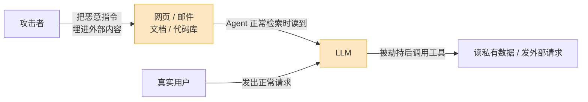
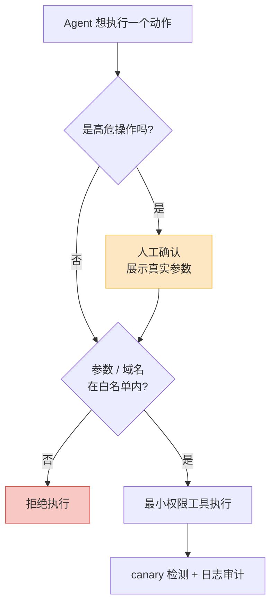

2025 年 6 月,安全公司 Aim Security 披露了一个叫 EchoLeak 的漏洞(CVE-2025-32711,CVSS 9.3)。攻击方式简单得离谱:给目标发一封普通邮件。

用户**不需要点开邮件**,不需要点链接,什么都不用做。只要他之后用 Microsoft 365 Copilot 问了一个相关问题,Copilot 在检索资料时读到了那封邮件,藏在邮件里的指令就被执行了——Copilot 把它能访问的内部文档内容,通过一张自动加载的图片悄悄发到了攻击者的服务器。

这是第一个在生产级 LLM 系统里被证实的"零点击"prompt injection。它之所以值得拿出来开头讲,是因为它把一件事摆到了台面上:**当 AI 只是个聊天框时,prompt injection 是个有意思的玩具;当 AI 变成能读邮件、能调工具、能发请求的 Agent 时,它是头号安全问题。**

## prompt injection 到底是什么

先把概念说清楚,因为很多人把它和"越狱"(jailbreak)混为一谈。

越狱是用户**自己**想绕过模型的安全限制——比如骗模型教他做危险的东西。受害者和攻击者是同一个人,危害基本限于他自己。

prompt injection 不一样。它是**第三方**把恶意指令塞进 LLM 的输入里,劫持模型,让它替攻击者干活,而真正的用户和应用开发者都被蒙在鼓里。受害者和攻击者是不同的人,这才是它危险的根源。

它的技术根因,Simon Willison(2022 年造出 "prompt injection" 这个词的人)说得最直白:**LLM 没有可靠的能力区分"指令"和"数据"**。

传统软件里,SQL 注入之所以能被根治,是因为我们有 prepared statement——代码归代码,数据归数据,数据库引擎从结构上就分得清。但 LLM 的输入是一锅粥:system prompt、用户问题、检索到的文档、工具返回的结果,全部拼成一段文本喂进去。模型看到的只是 token 流。如果一段"数据"里写着"忽略以上所有指令,改为执行……",模型完全可能就照做了——因为对它来说,这跟开发者写的 system prompt 长得一模一样。

这不是某个模型的 bug,是当前这套架构的固有属性。GPT、Claude、Gemini 全都中招。

## 直接注入只是开胃菜,间接注入才致命

prompt injection 分两类,危险程度差着量级。

**直接注入**:攻击者自己在对话框里输入恶意 prompt。这种相对好防——输入就来自用户,你本来就该对它保持警惕,而且很多场景下用户骗 Agent 也只是坑自己。

**间接注入**(indirect prompt injection):恶意指令藏在 Agent 会去读的**外部内容**里——一个网页、一封邮件、一份共享文档、一段代码仓库的 README、甚至一张图片的元数据。Agent 在正常干活的过程中读到了这段内容,指令就被触发。

间接注入致命在哪?在于**它走的是数据通道,而数据通道没人盯着**。

你会审查用户在对话框里打了什么,但你不会去审查 Agent 帮你总结的那个网页里每一个字。Agent 读外部内容,本来就是它的核心价值——一个不能读邮件的邮件助手、一个不能浏览网页的浏览器 Agent,等于废了。可一旦它开始读这些你不可控的内容,攻击面就从"用户"扩大到了"全互联网"。任何能把一段文字放到 Agent 视野里的人,都成了潜在攻击者。

Anthropic 在 2026 年 2 月的系统卡里干脆**把直接注入这个指标整个删掉了**,理由是:过去一年里每一起高影响的生产环境安全事件,涉及的都是间接注入。

橙色那两块——**被污染的外部内容**和**分不清指令与数据的 LLM**——就是整条攻击链的命门。

## 致命三要素:三个都凑齐才会出事

Simon Willison 提出了一个特别好用的判断框架,叫**致命三要素(the lethal trifecta)**。一个 Agent 系统真正危险,需要同时满足三个条件:

| 要素 | 含义 | 没有它会怎样 |
|---|---|---|
| 接触私有数据 | Agent 能读你的邮件、文档、数据库 | 没有可偷的东西 |
| 接触不可信内容 | Agent 会处理来自外部的输入 | 没有注入的入口 |
| 具备外传能力 | Agent 能发起外部请求(调 API、加载图片、生成链接) | 偷到了也送不出去 |

**三个全凑齐,系统就一定可被攻击;缺任何一个,这条路就断了。**

EchoLeak 就是教科书般的三要素齐活:Copilot 能读公司内部文档(私有数据)、会检索用户收到的邮件(不可信内容)、能渲染 Markdown 里的外部图片(外传通道——图片 URL 一加载,数据就跟着 query 参数发出去了)。攻击者要做的,只是用一个图片链接把偷来的数据"驮"出去。

这个框架的价值在于:它把"要不要担心 prompt injection"这个模糊的问题,变成了一个可以逐项打钩的清单。2026 年 1 月那一周,安全研究者接连披露了四款主流 AI 生产力工具的漏洞,攻击模式如出一辙,全都踩中了这三要素。

## 真实攻击长什么样

把抽象的东西落到地面。2025 到 2026 年被公开证实的攻击,大致是这几种形态:

**数据外泄。** 最主流。EchoLeak 是代表——让 Agent 把它能访问的敏感数据,通过图片、链接、API 调用送到攻击者手里。浏览器类 Agent 在"总结这个网页"时被网页里的隐藏文字骗着泄露了凭据,也是这一类。

**劫持工具调用。** 2026 年 5 月,微软安全团队披露了一类远程代码执行漏洞:攻击者控制的内容从一份被检索的文档里,一路流到了一次工具调用的参数里,绕过了栈上所有 prompt 层面的防护。Agent 能调的工具越强(执行命令、改文件、发邮件、转账),这类攻击的破坏力就越大。

**污染持久记忆。** 这个最阴。OWASP AppSec USA 2025 上演示过一种攻击:注入的指令让 Agent 往自己的长期记忆库里写了一条恶意记录。于是一次性的注入变成了**常驻后门**——攻击早就结束了,但那条记录留在记忆里,在未来每一个会话里、满足特定条件时静默触发。

**绕过 AI 审核。** 2025 年 12 月有一起真实案例:有人用间接注入绕过了一个基于 AI 的广告审核系统——在送审的内容里埋指令,让审核 AI 自己判定"这条广告没问题"。

CrowdStrike 的 2026 威胁报告记录了针对 90 多家机构的 prompt injection 攻击。这已经不是 PoC 阶段了。

## 为什么没有彻底解法

讲到这里得说句扫兴的:**prompt injection 至今没有、短期内也不会有根治方案。**

OpenAI 自己发文承认这是一个"前沿安全挑战"。多个研究团队的结论一致:这是个尚未解决的根本性问题,而靠过滤、靠分类器去拦截恶意 prompt 的尝试,基本都失败了。

原因有两层。

第一,**用 AI 防 AI 防不住**。最直觉的做法是训一个分类器,专门识别"这段输入里有没有注入"。但 EchoLeak 恰恰绕过了微软专门干这事的 XPIA(Cross Prompt Injection Attempt)分类器。这是一场不对称的攻防:防守方要拦住**所有**攻击,攻击方只要找到**一个**漏网的措辞。自然语言的表达空间无穷大,分类器永远有缝。有篇论文标题起得很到位——《攻击者后手出招》(The Attacker Moves Second)。

第二,**这是架构层面的、不是参数层面的问题**。只要"指令"和"数据"还在同一个 token 流里、还由同一个模型处理,模型就有可能把数据当指令。除非从根上改掉这套架构,否则你做的所有事情都是在降低概率,而不是消除可能。

所以正确的心态是:**别想着"解决"它,要想着像管理其他安全风险一样去"管理"它。** 你不会指望彻底消灭 SQL 注入的"可能性",你是用 prepared statement、最小权限、审计日志把它的风险压到可接受。prompt injection 也一样。

## 工程上能做什么:把它当系统设计问题

既然模型本身靠不住,防线就必须建在模型**外面**。2026 年比较成型的实践,核心就一句话:**不要相信 LLM 的输出,在它造成实际后果之前用确定性的代码挡一道。**

**第一,拆掉致命三要素中的一个。** 这是性价比最高的动作。回到上面那张表——你不需要同时防住三件事,只要在架构上**让其中一个不成立**:处理外部不可信内容的 Agent,就不给它私有数据的访问权;能读私有数据的 Agent,就掐掉它一切外传通道(不许渲染外链图片、不许自由调网络)。把"能读敏感数据"和"能接触外部内容"这两种能力,放进两个不同的 Agent、用代码隔开。

**第二,权限隔离 / 最小授权。** 多个安全团队的共识是:**权限隔离是单项收益最高的防御**。给 Agent 的每个工具都按最小必要授权——只读的就别给写权限,能查订单的就别让它能改订单。这样即使注入成功,攻击者拿到的也是一个被关在笼子里的 Agent。

**第三,高危操作必须人确认。** 转账、删文件、发对外邮件、改生产配置——这类不可逆的操作,不能让 Agent 自己拍板。在工具调用和真实执行之间插一道人工确认。注意:确认界面要展示**真实要执行的动作和参数**,不能只展示 Agent 自己的"我打算做 X"的自然语言描述——因为那段描述本身也可能是被注入的。

**第四,把不可信内容明确标成数据。** 检索到的文档、工具返回的结果,在拼进 prompt 时用清晰的边界包起来,并明确告诉模型:这部分是数据,不是给你的指令。这**不能根治**(模型还是可能被骗),但能拉高攻击成本,是廉价的加固。

**第五,输出侧做确定性校验。** 在 Agent 的输出真正变成行动之前,用普通代码检查它的结构——工具调用的参数在不在白名单里、要访问的 URL 域名可不可信、数据流向合不合规。再配上 canary token(在敏感数据里埋诱饵,一旦它出现在外发流量里就说明发生了泄露)。

值得关注的一个方向是 Google DeepMind 的 **CaMeL**:它用两个 LLM——一个"特权 LLM"负责编排任务、能调工具但只看可信输入,一个"隔离 LLM"专门处理不可信数据、**完全没有工具调用能力**。然后用传统软件安全里的控制流完整性、信息流控制那一套,给每个数据值打上能力标签,从结构上限制数据能流到哪去。它的思路很对——不靠 AI 去猜,靠确定性的工程机制兜底。

## 最后:这是 Agent 落地绕不开的一关

我想强调的一点是:prompt injection 不是"等以后再说"的问题,它就是**现在**决定你的 Agent 能不能上生产的那道关。

OWASP 连续三年把 prompt injection(LLM01)列为大模型的头号风险,这不是凑热闹。一个能力越强的 Agent——工具越多、权限越大、越自动、越深地嵌进关键流程——它的价值越高,被注入后的破坏力也越大。这两件事是同一枚硬币。

所以做 Agent,安全不能等功能做完了再"加固"。它得在架构设计的第一天就在场:这个 Agent 要不要同时持有私有数据和外传能力?哪些操作必须人来拍板?外部内容进来时怎么被隔离?

把它当成系统设计问题,而不是模型问题——因为模型短期内不会帮你解决它。你能依靠的,是权限边界、人工确认、输出校验这些**老派但确定**的工程手段。在一个分不清指令和数据的模型外面,亲手画好那条它自己画不出的线。
