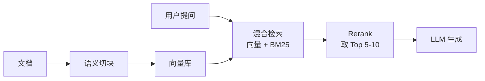
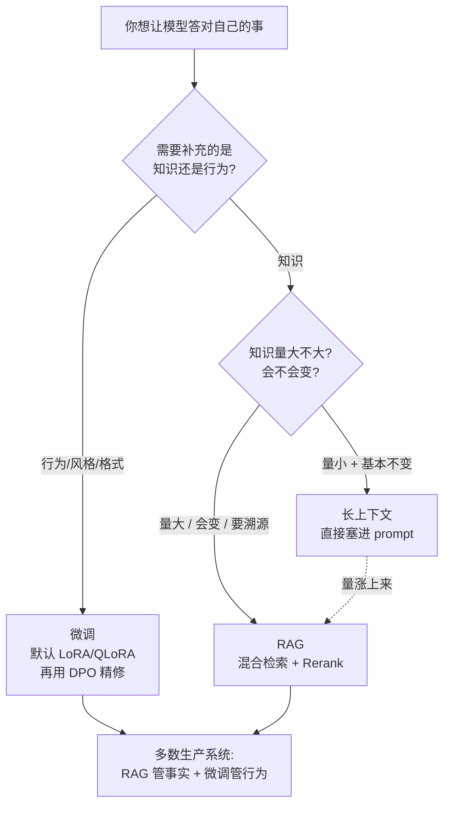

先说一个反直觉的数字:**80% 喊着「我们要微调」的需求,换个更好的检索就解决了。**

这是 2026 年做过几轮项目后,业内基本形成的共识。但凡你想让一个通用大模型「答对你自己的事」——公司的产品文档、内部规章、某个客户的历史订单——你大概率会在三条路里纠结:**RAG**(检索增强)、**微调**、**长上下文**(直接把材料塞进 prompt)。

这三条路经常被拿来对比,但很多对比都在装中立,列个表说「各有优劣,看场景」。这篇不装。它们不是平级的选项,**它们解决的根本不是同一个问题**。选错那条,代价不是「效果差一点」,而是要么每个月烧掉本不该烧的钱,要么半年后你的数据全过期、整个系统没人敢碰。

## 它们到底各自在解决什么

把这件事想清楚,后面就不纠结了。

- **RAG**:模型不知道答案,你**临时把答案找出来递给它**。模型本身不变,变的是每次喂给它的上下文。
- **微调**:你**改的是模型本身的权重**。让它换一种说话方式、固定输出某种格式、养成某种行为习惯。
- **长上下文**:你**不做检索、不做训练**,直接把所有相关材料一次性塞进 prompt,让模型自己在里面找。

注意区别:RAG 和长上下文都是在「给模型补知识」,区别只是补的方式——一个精挑细选地补,一个一股脑全塞。而**微调压根不是在补知识,它在补能力和行为**。这是最常见的认知错位:有人想让模型「记住公司有 300 条规章」,跑去微调,结果训完发现模型还是答不准,因为微调不是用来塞事实的。

一句话记牢:**知识用 RAG,行为用微调,长上下文是知识量小到不值得搭管道时的偷懒办法。**

## RAG:知识会变、要溯源,就选它

RAG 是 2026 年绝大多数团队的默认起点,理由很硬:它便宜、上线快,而且能干那件最常见的事——让模型回答关于你自家数据的问题。

它的真正杀手锏是另外两个:

**知识能随时更新。** 产品改了价、规章出了新版,你只要更新向量库里那几条,模型下一秒就用新的了。不用重训、不用重新部署。对任何一个数据会变的业务,这一条几乎是决定性的。

**答案能溯源。** 模型说「退款政策是 7 天」,你能指着它后面挂的那条文档说「依据在这」。金融、医疗、法律这类场景,「答得对」还不够,你得能证明它**为什么**这么答。微调和长上下文都给不了这种可追溯性——微调把知识熬进了权重里,你根本说不清它从哪学的。

但 RAG 不是免费午餐,2026 年的现实是:**当 RAG 出错,73% 的锅在检索,不在生成。** 模型没胡说,是你压根没把对的文档捞给它。所以现代 RAG 早就不是「embedding + 余弦相似度」那么简单了,一条能上生产的管道长这样:

几个关键点,踩过坑的都懂:

- **切块是默默崩掉 RAG 的地方。** 切得太碎,一个 chunk 答不全一个问题;切得太大,塞进去全是噪音。语义切块(按 embedding 相似度找话题边界)比固定字数切块靠谱得多。
- **混合检索基本是标配了。** 纯语义检索会漏掉「精确匹配」——比如某个型号编号、某个专有名词。把向量检索和 BM25(关键词)拼起来,准确率明显更稳。
- **Rerank 是那勺秘制酱。** 先用混合检索捞 100 条候选,再用一个 cross-encoder 重排序模型(Cohere Rerank、BGE-Reranker 这类)精筛出 5-10 条真正喂给大模型。这一步加上,系统会从「有时有用」变成「能上生产」。

代价是:你得维护一整套数据管道——切块、embedding、向量库、rerank,每一环都能出问题。RAG 上线快,但**养着它不轻松**。

## 微调:改的是行为,不是知识

如果你的痛点是这些,那才轮到微调:

- 模型语气不对——你要它像个严谨的客服,它偏要活泼。
- 输出格式不稳——你要它每次都吐严格的 JSON,它三次里有一次加段废话。
- 某种固定行为——特定领域的术语习惯、固定的处理流程、某类问题的标准应对。

**这些 RAG 救不了。** 你没法靠「检索」让模型改性格。微调改的是模型权重本身,它学的是「怎么说」「按什么格式说」「遇到这类输入该怎么反应」,不是「记住哪些事实」。

2026 年微调内部其实分三种,选哪种取决于你要改多深:

| 方式 | 改什么 | 成本 | 什么时候用 |
|---|---|---|---|
| LoRA / QLoRA | 加一层薄薄的「适配器」,基座权重不动 | 极低 | 绝大多数场景的默认选择 |
| 全量微调 | 动整个模型的所有权重 | 高,要大显存、长时间 | 改动极深、且有海量高质量数据 |
| 偏好对齐(DPO) | 用「好答案 vs 坏答案」的成对数据校行为 | 中等 | 微调完之后再「精修」价值取向 |

**LoRA / QLoRA 是 2026 年的事实默认。** LoRA 只训练总参数量的 0.1%–1%,却能拿回全量微调 90%–95% 的效果。QLoRA 再加上 4-bit 量化,显存需求砍掉约 75%——一张 A100 80GB,大概 6 小时、十几美元,就能在 5 万条样本上微调完一个 8B 模型。这个成本低到,微调不再是大厂专属了。

**全量微调** 2026 年反而成了少数派选择。除非你的改动深到 LoRA 那层适配器装不下,而且你手里有海量高质量数据,否则没必要——花十倍的钱,换那 5%–10% 的边际效果,多数时候不划算。

**DPO 已经基本取代了传统 RLHF** 来做对齐。它更便宜、更稳定,效果相当。典型用法是「微调之后的精修」:先用 LoRA 把基本能力训出来,再用 DPO 拿成对偏好数据校一遍「这种答法好、那种不好」。

微调最反直觉的一条:**数据质量碾压数据数量。1000 条手工精挑的样本,经常打得过 10 万条带噪声的。** 学习率给个参考——普通 LoRA/QLoRA 从 2e-4 起步,DPO 这类强化学习类的要小得多,5e-6 左右。

微调真正的代价不在训练那几个小时,在**之后**:基座模型升级了,你的适配器要不要跟着重训?业务行为变了,数据要重新标、模型要重新跑。微调是一笔**持续的维护承诺**,不是训完就完事。

## 长上下文:知识量不大时,最省事的那条

2026 年的上下文窗口已经大得有点离谱了:

- **Gemini 3 Pro** 标准 1M–2M token,实验档摸到了 10M。
- **GPT-5.2** 支持到 400K。
- **Claude Sonnet 4** 给到 tier 4 的组织开了 1M beta(标准档 200K)。
- **Llama 4 Scout** 标称 10M。

窗口大到这份上,一个很自然的想法冒出来:**还要 RAG 干嘛?把所有文档一股脑塞进去不就完了?**

知识量真的小,这招确实成立。你只有一份 50 页的产品手册,与其搭一整套切块、向量库、rerank 的管道,不如直接把整份手册塞进 prompt。零维护、零基建,模型还能看到全局上下文,不会因为「检索只捞了相关那几段」而丢掉跨章节的关联。原型阶段,长上下文几乎永远是最快的验证方式。

但它有两个绕不过去的硬伤:

**第一,标称窗口 ≠ 可用窗口。** 这是最大的误区。一个模型标 200K,不代表它在 200K 上还好用。RULER 这类基准反复验证:**模型的有效容量通常只有标称值的 60%–70%**。还有那个老问题「迷失在中间」(lost in the middle)——材料放在 prompt 开头和结尾时模型找得最准,夹在中间 10%–50% 深度的内容,准确率明显塌方。2026 年各家表现也不一样:Claude Sonnet 4 在 200K 全程的衰减能压在 5% 以内,GPT-5.2 在 256K 内保持接近满分的检索,而 Gemini 3 Pro 一过 128K 在多目标检索上就掉得挺快。你塞进 1M token,别真指望它每个角落都看得清。

**第二,贵。而且是规模化之后致命地贵。** 你每问一个问题,那一大坨上下文就要重新算一遍 token 钱。在规模上,长上下文比 RAG 或微调贵 20–24 倍。更糟的是计费门槛:OpenAI 超过 272K token 之后单价翻倍,Gemini 超过 200K 翻倍。原型阶段长上下文很香,**生产高并发场景它会把你账单点着**。

所以长上下文的定位很清楚:**知识量小、又不想搭基建,就用它;一旦知识量大起来、或者要扛量,老老实实回去做 RAG。**

## 别再二选一了:2026 年是分层

把这三条路当成单选题,是最常见的错。

2026 年那些真正做出好产品的团队,没有谁在「选一个」。他们在**分层叠加**:**RAG 负责事实,微调负责风格、策略和决策行为。** 一个典型的成熟架构是——一个不算大的基座模型,挂一层薄薄的 LoRA 适配器把语气和格式调到位,再配一套 RAG 管道实时喂事实。微调和检索不是互相替代,是各管一段。

落地的推进顺序也有共识,别跳步:

**Prompt → RAG → 微调 → 蒸馏**

先把 prompt 写好,不行再上 RAG,RAG 解决了知识、但行为还不对再上微调,最后量大到一定程度、想把成本压到底,才考虑蒸馏成小模型。绝大多数团队走到第二步就够了,根本不需要碰微调。

成本上还有一条值得记:**低并发场景 RAG 赢,因为没有前期训练投入;高并发场景(每天 10 万+ 次查询)微调过的小模型赢,因为单次推理便宜。** 量,是决定天平往哪边倒的关键变量。

## 一张图替你决策

不想读上面那一大堆,看这张图就够了:

最后留一句话,这是这篇唯一想让你记住的:**先问自己「我缺的是知识还是行为」。** 想清楚这一个问题,三条路自己就排好队了。剩下的纠结,多半是因为这个问题没问清。

---

参考资料:

- [LLM Context Window 2026 — TokenMix](https://tokenmix.ai/blog/llm-context-window-explained)
- [Context Length Comparison: Leading AI Models in 2026 — elvex](https://www.elvex.com/blog/context-length-comparison-ai-models-2026)
- [Fine Tuning AI Models in 2026 — Kumar Gauraw](https://www.gauraw.com/fine-tuning-llm-lora-dpo-guide-2026/)
- [LLM Fine-Tuning Best Practices 2026 — hjLabs](https://hjlabs.in/AIML/blog/post/llm-fine-tuning-best-practices.html)
- [RAG vs Fine-Tuning for LLMs (2026): What Actually Works in Production — DEV](https://dev.to/umesh_malik/rag-vs-fine-tuning-for-llms-2026-what-actually-works-in-production-10if)
- [RAG vs Fine-tuning vs Long Context — Preksha Dewoolkar, Medium](https://medium.com/@officialpreksha2166/rag-vs-fine-tuning-vs-long-context-when-to-use-what-and-why-most-teams-get-it-wrong-388cc446ff3c)
- [Building Production RAG: Architecture, Chunking, Evaluation & Monitoring (2026) — PremAI](https://blog.premai.io/building-production-rag-architecture-chunking-evaluation-monitoring-2026-guide/)
- [RULER: Benchmark for Long-Context Modeling](https://medium.com/@techsachin/ruler-benchmark-to-evaluate-long-context-modeling-capabilities-of-language-models-7eb13a269e36)
