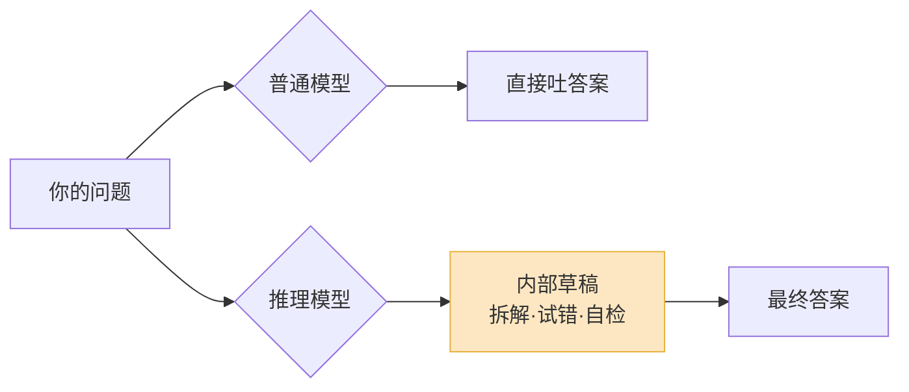
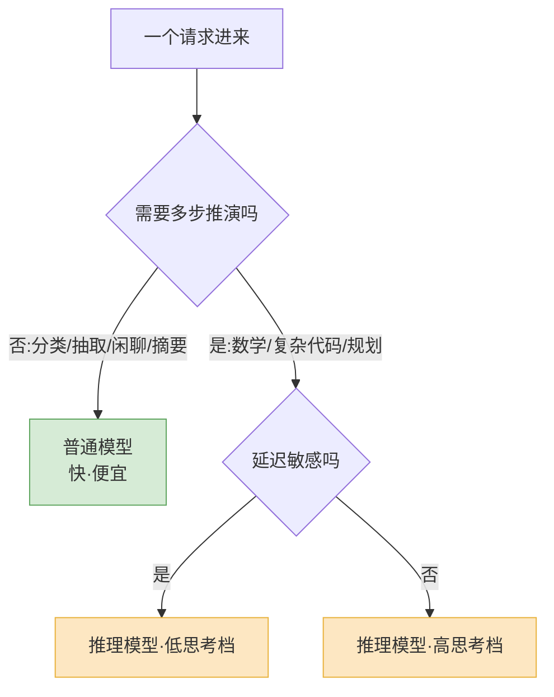

让模型回答之前先"想一会儿",这件事确实有用。

2026 年 4 月有一篇论文,标题直接叫《When More Thinking Hurts》(想多了反而坏事)。里面有个例子我印象很深:让一个大推理模型算"9900 加 1",它居然烧掉了几千个思考 token,中途还一度把正确答案推翻又改回来。一道小学一年级的题,被它想成了奥数。

这就是推理模型这一年的缩影。o1 出来的时候,大家的第一反应是"哇,会思考了";到了 2026 年,大家学到的是另一句话——**思考是要花钱的,而且大部分时候,你根本不需要它想那么多**。

## 推理模型到底改了什么

先把概念说清楚。

传统 LLM 的算力几乎全花在训练上。模型训完,推理(inference)时就是一次前向计算,吐 token,快进快出。你给它一道难题,它"脱口而出"——答得对不对,基本取决于训练时见过没见过类似的东西。

推理模型动的是另一处:**test-time compute**,推理时算力。它在真正回答你之前,先在内部生成一长串"草稿"——拆解问题、试不同思路、自我检查、推翻重来。这串草稿就是所谓的思考过程(chain-of-thought)。你看到的最终回答可能只有三句话,但背后它可能写了一万五千个 token 的内心戏。

这个改动的意义在于:模型的能力第一次变成了**可以用算力买的**。同一个模型,让它多想,它在数学、代码、逻辑题上的准确率就实打实地往上走。OpenAI 当初说 o3 在真实世界的难题上比 o1 少犯约 20% 的重大错误,靠的不是换了更大的底座,很大程度上就是想得更久、更会想。

从 o1 到 o3、o4-mini,再到 Gemini 2.5 的 thinking、Claude 的 extended thinking、DeepSeek R1、Qwen 3 的思考模式——2026 年你能叫得出名字的主力模型,基本都带"会思考"这一档。test-time compute 从一个研究概念,变成了产品标配。

## 这一年学到的:思考不是免费的

如果故事到这里就结束,那这篇文章没什么好写。问题恰恰在于——**让模型多想,代价大得超出很多人的预期**。

代价有三笔,都很实在。

**第一笔是 token,直接对应钱。** 思考过程里的每一个 token,几乎都按输出价计费。一次普通的 extended thinking 请求,思考部分烧掉五千到两万 token 很常见,加上最终回答,单次成本可能从几分钱跳到三四毛人民币。你界面上看不到这些草稿,但账单上看得到。2026 年有个被反复引用的说法:前沿模型那个"推理强度"旋钮,从低档拉到高档,准确率大概能涨 8 到 22 分,但费用会膨胀 4 到 17 倍。

**第二笔是延迟。** 同一个旋钮,延迟能拉长 5 到 60 倍。好消息是绝对值在变好——2025 年初,思考模型动不动想 30 秒到 2 分钟;到 2026 年初,o4-mini、Gemini Flash Thinking 处理大多数推理任务能压到 3 到 15 秒。但 3 到 15 秒,对一个要"对话感"的产品来说,依然是灾难。你没法让用户盯着转圈等模型憋一道并不难的题。

**第三笔最阴险:想多了真的会把答案想错。** 这不是玄学。前面那篇论文给的结论很硬:延长推理常常和"放弃了原本正确的答案"绑在一起。模型想着想着,把对的推翻了。在简单任务上尤其明显——标准模型一步到位答对,推理模型绕一大圈,既慢又贵,还更容易错。

| | 普通模型 | 推理模型(高思考档) |
|---|---|---|
| 首 token 延迟 | 数百毫秒 | 数秒到数十秒 |
| 单次 token 成本 | 基准 | 基准的 4–17 倍 |
| 简单任务准确率 | 高 | 可能更低(过度思考) |
| 难题准确率 | 一般 | 明显更高 |
| 适合场景 | 高频、对话、抽取 | 低频、难、可离线 |

把这张表盯久一点你会发现:推理模型不是"更强的普通模型",它是一个**取舍完全不同的工具**。强在难题,弱在日常。

## 什么任务该用,什么任务别用

这是这篇文章最想讲的部分,因为踩坑的人太多了。

我的判断很简单:**默认用普通模型,只在被证明需要时才升级到推理模型。** 顺序别反过来。很多团队上来就把所有请求挂到推理模型上,觉得"反正更聪明",结果账单爆炸、延迟爆炸,用户体验还更差。

具体怎么分?我按"这道题需不需要多步推演"来切。

**该用推理模型的:**

- 数学、竞赛题、需要严格推导的逻辑题——这是它的主场,22 分的提升花 17 倍的钱也值。
- 复杂代码任务:跨多个文件的重构、根据一段模糊描述推断完整实现、调一个需要顺着调用链想的 bug。
- 多步规划:把一个大目标拆成一串带依赖的子任务,Agent 的"想清楚再动手"那一步。
- 别人会拿你的输出去仔细核对的场景——反正要花人力 review,模型多花几秒想清楚是划算的。

**别用推理模型的(普通模型完全够):**

- 分类、打标签、情感判断、意图识别——一步到位的判别任务,让它"思考"纯属浪费。
- 信息抽取、格式转换、把一段文本改写成 JSON。
- 闲聊、客服话术、陪伴类对话——这些要的是快和自然,不是深。
- 摘要、翻译这类"理解 + 复述"的活儿。
- 任何高频、对延迟敏感、用户在等你回话的链路。

有个反例特别值得记:实时语音对话。我之前写过语音 Agent 的延迟预算,从用户说完到 AI 出声,及格线是 500 到 900 毫秒。一个动不动想 5 秒的推理模型,直接出局——它不是慢一点,是把整个产品形态打碎了。语音链路上要么用普通模型,要么把推理模型藏到后台异步去跑,绝不能放在用户等待的关键路径上。

注意这张图最后还分了一档。"该用推理模型"不等于"该拉满"——这就引出下一节。

## "思考预算可调"成了标配,然后呢

2026 年最重要的工程变化,不是某个模型又强了多少,而是**思考的量,从开发者手里交了一部分回给模型自己**。

早期的 extended thinking,你得手动设 `budget_tokens`,告诉模型"最多想这么多"。这玩意儿很难调:设小了难题想不透,设大了简单题被过度思考反噬。你得对着每一类任务反复试。

新一代的做法变了。Claude 在 4.6 这一代把固定预算的 extended thinking 标成了 deprecated,换成 Adaptive Thinking——模型自己判断这题要不要想、想多深,简单问题秒回,复杂问题才深挖。OpenAI 的 o 系列、Gemini 的 thinking 模式给的是 `reasoning_effort` 这种"高/中/低"的强度档。Qwen 3 更直接,一个开关切"思考模式"和"非思考模式"。形式不同,内核是一个意思:**思考量变成了一个旋钮,而且默认应该让模型自适应**。

这件事对工程的影响,我觉得有三点值得说。

**第一,选型粒度变细了。** 过去选模型是"用 A 还是用 B",现在是"用 A 的哪一档"。一个模型族内部就能覆盖从"便宜快"到"贵而强"的一大段。这意味着你的系统里不该只有一个固定配置,而该有一个**按任务路由思考强度**的策略层——简单任务走低档甚至关掉思考,难任务才放开。

**第二,成本和延迟从"基本固定"变成"高度可变",可观测性必须跟上。** 同一个接口,这次请求 800 毫秒、下次 12 秒,这次两分钱、下次三毛,都正常。你必须把思考 token 数单独打点监控,否则某天账单翻五倍你都不知道是哪类请求干的。我的建议是:思考 token 当成一类独立指标,和普通输出 token 分开看。

**第三,别太迷信"自适应"。** 模型自己决定想多深,方向是对的,但它对"这题难不难"的判断并不总是准——开头那个把加法想成奥数的例子就是证据。所以稳妥的做法是给自适应**加一道硬上限**:用 `max_tokens` 卡死最坏情况,既防失控成本,也防它越想越歪。让它自适应,但别让它无限自适应。

## 写在最后:把"想多久"当成一个设计决策

推理模型这一年,最大的收获其实是一句很朴素的话:**思考不是越多越好,是要恰好够用。**

o1 刚出来时,行业的潜台词是"模型终于会思考了,以后让它多想就对了"。一年下来,这个叙事被修正得很彻底。多想会变贵、会变慢、在简单任务上甚至会变笨。真正成熟的用法不是"全都拉满",也不是"全都关掉",而是把"这个请求该想多久"当成一个**和选模型同等重要的设计决策**。

如果你 2026 年在搭一套 LLM 系统,我会建议你这样排优先级:先默认用普通模型,把延迟和成本压在地板上;再把那些真正需要推演的任务挑出来,升级到推理模型;最后给推理那部分配上强度路由和硬上限,让它在"够聪明"和"别失控"之间待着。

会思考是能力,知道什么时候不该思考,才是工程。
