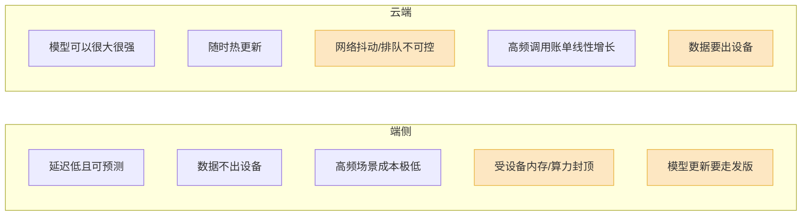

打开你的 iPhone,如果它是 16 或更新的型号,系统里已经常驻着一个约 30 亿参数的语言模型——它在帮你总结通知、改写短信、给照片打标签,全程不联网。你没装它,你也没感觉到它,但它一直在那。

这件事一年前还做不到。

过去这一年,所有头条都给了旗舰大模型:更长的上下文、更强的推理、更贵的订阅。但真正改变"AI 装在哪儿"这个问题的,是另一条没什么人盯着的线——**几 B 参数的小模型,和把它们塞进手机、笔电、边缘盒子的工程**。这条线今年悄悄拉满了。

我想把这件事讲清楚:小模型现在到底能做好哪些事,为什么端侧值得,量化和蒸馏在中间干了什么,以及——同样重要——它**干不了**什么。

## 先说清楚:小模型不是"大模型的劣化版"

很多人对小模型的印象停留在"便宜但是笨"。这个印象在 2024 年大致成立,现在不成立了。

关键的转变是:小模型不再靠"也学一点世界知识"来对标大模型,而是**放弃了一部分知识广度,换取在窄任务上的密度**。微软的 Phi 系列把这条路走得最直白——靠精心筛选的高质量训练数据,Phi-4 在 MATH 和 GPQA(研究生级科学题)这类基准上能压过体量大得多的模型。它不是"小一号的 GPT",它是另一种东西。

阿里的 Qwen3 把尺寸切得很细:0.6B、1.7B、4B、8B 一路排下来。官方技术报告里有个反直觉的数据——Qwen3 的 4B / 1.7B,在过半数基准上能打过上一代的 Qwen2.5-7B / 3B,尤其在 STEM 和代码题上。**新一代的 4B,约等于老一代的 7B。** 这就是过去一年小模型走过的距离。

谷歌的 Gemma 也在做同样的事。4 月发布的 Gemma 4,最小的 E2B / E4B 变体用了 Per-Layer Embeddings 这类结构技巧,4-bit 量化后 5GB 内存就能在现代手机上跑起来。

所以判断一个小模型,别再问"它知道的有没有大模型多"——它注定不多。要问的是:**在我这个具体任务上,它够不够。**

## 它现在能做好哪些任务

把场景摊开看,小模型今天在这几类任务上已经够用,而且是真的够用,不是"凑合":

**文本的搬运和改造。** 总结、改写、润色、抽取实体、分类、按格式重排——这类任务不需要模型"懂很多",只需要它"听话且稳"。苹果那个 3B 端侧模型的官方定位就写得很白:它擅长总结、抽取、文本理解、润色、短对话,**它明确不是一个用来问世界知识的聊天机器人**。这个定位是诚实的,也是对的。

**结构化输出和函数调用。** 这是过去一年小模型最大的一块进步。Gemma 4 是第一个把"agentic 能力"当成一等设计目标的开源模型族——它不靠语法约束,就能稳定吐出合法的、可解析的 JSON 工具调用。这意味着一个本地小模型可以真的当"调度员"用:理解你的意图,挑对工具,填对参数,剩下的交给确定性代码去做。对很多 Agent 场景,模型本来就不该负责"算出答案",它只负责"派活"。

**作为流水线里的快环节。** 在我做的实时语音方向,小模型有个特别实在的用法:用一个本地快模型先兜住首句——"嗯""好的,我看一下"——同时大模型在后台接管真正的内容。用户感知到的延迟一下就下来了。小模型在这里不是主角,是"垫话的人",但这个角色很值钱。

**垂直微调后的专用任务。** 有评测把 12 个小模型放在 8 类任务上比,结论是 Qwen3-4B 微调后整体最强,在不少具体任务上能逼近一个 120B 级别的"老师"模型,而它只要一块消费级显卡就能部署。**针对单一任务微调过的 4B,常常比通用的大模型更好用**——它没有"什么都想说一点"的毛病。

一句话:**凡是任务边界清晰、对世界知识依赖不深的活,小模型现在基本能接。**

## 为什么端侧值得——算三笔账

能在端侧跑,和值得在端侧跑,是两件事。值得不值得,得算账。

**第一笔,延迟。** 端侧推理省掉的是网络往返和服务端排队。一次云端调用,光网络和排队的尾巴就可能几十到几百毫秒,还不稳定——你控制不了用户的网络。端侧模型首 token 不走网络,延迟低且**可预测**。对实时交互(语音、输入法、补全)来说,可预测比平均值低更重要。

**第二笔,隐私。** 数据不出设备,这不是宣传话术,是合规上实打实的区别。用户的短信、相册、健康数据、剪贴板——这些东西一旦"为了 AI 功能"传到云端,你就要为它的存储、传输、留存负责。端侧推理把这个责任直接消掉了。这也是苹果整条 Apple Intelligence 叙事的地基。

**第三笔,成本。** 这笔账最容易被低估。高频调用的场景下,把推理从云端 API 挪到端侧或边缘自托管,成本能降九成以上,高频负载的回本周期常常不到 18 个月。注意前提是**高频**——一个一天被调用三次的功能,没必要折腾端侧;一个每次输入都触发的补全功能,云端账单会吓到你。

但端侧不是免费午餐,它也有反方向的代价:

端侧的两个真痛点:**算力封顶**(用户的旧手机就是跑不动 7B),和**更新慢**(模型修了 bug 要等 App 发版,不能像云端那样当天热推)。所以现实里成熟团队的做法是混合:简单高频的活落端侧,复杂低频的活路由到云端。

## 量化和蒸馏:把模型塞进设备的两把钳子

小模型能上端侧,光靠"参数少"还不够。一个 4B 模型用 FP16 存,也要 8GB,塞进手机内存还是紧。真正把它压进去的,是量化和蒸馏。

**量化是压"表示精度"。** 模型权重原本是 16 位浮点,量化把它降到 8 位、4 位甚至更低。直觉上这会掉精度,但实际上掉得没你想的多——4-bit 的 Q4_K_M 这类方案,跟原始 BF16 比通常只掉 1~3 个百分点的基准分。代价换来的是:一个 Llama 3.2 3B 做 4-bit 后训练量化,体积砍掉约 69%,就能在普通安卓机上顺跑。

这里要分清两种量化:

| 类型 | 怎么做 | 特点 |
|---|---|---|
| 后训练量化(PTQ) | 模型训完之后再压 | 快、不用重训,大多数场景够用,GGUF 走的就是这条路 |
| 量化感知训练(QAT) | 训练时就假设要被压,提前适应 | 更费事,但低比特下精度明显更好 |

苹果那个 3B 端侧模型用的就是更狠的一招:**2-bit 量化感知训练**。在 2-bit 这种极端低比特下,纯后训练量化会崩,只有训练时就让模型"知道自己会被压成 2 位",精度才扛得住。这是用训练成本换部署体积的典型取舍。

**蒸馏是压"知识"。** 它不动表示精度,而是让一个小模型(学生)去模仿一个大模型(老师)的输出分布。学生学到的不只是"正确答案",还有老师对每个选项的"软概率"——这里面藏着大模型的判断方式。蒸馏过的小模型,在被蒸馏的那个任务域上,表现会明显超过同尺寸从头训的模型。

要点是:**量化和蒸馏不冲突,是叠着用的。** 典型流水线是先蒸馏出一个能干活的小模型,再量化把它压进设备内存。一把钳子压知识,一把钳子压精度,两把一起上,4B 才进得了手机。

硬件这边也在同步补位。今年笔电上的 NPU 终于不只是"参数表上的一行字"了——谷歌的 LiteRT-LM 在 Linux、macOS、Windows 上都能把推理路由到 NPU;AMD 的 Ryzen AI Max+ 这类芯片配上百 GB 级的统一内存,本地跑 7B~13B 已经不费劲。模型在变小,设备在变强,两条线在中间撞上了。

## 它干不了什么——别被"逆袭"冲昏头

写到这儿得踩一脚刹车。小模型这一年确实猛,但有几件事它现在做不到,而且短期也做不到。

**它的世界知识就是浅。** 这是参数量的物理限制,不是调教问题。研究里反复出现的一个结论:小模型的幻觉率**显著高于**大模型。尤其当你拿大模型的输出去微调小模型时,会出现"知识错配"——喂给它的知识超出了它本身装得下的量,反而更容易胡说。所以任何依赖"模型自己知道很多事实"的场景——开放域问答、冷门领域咨询——别指望端侧小模型。要做,就得给它接检索(RAG),让事实从外部来,模型只负责组织语言。

**长链条、多步推理它会断。** 需要七八步严密推演才能得到的答案,小模型中途容易掉链子。它适合"一两步就能想清"的任务,不适合当复杂推理的主脑。

**再小一点就崩了。** 别被"参数越小越好"带跑偏。1B 以下的模型(比如 270M、0.5B 这个量级)是真能跑,但质量在除了最简单的分类之外的任务上断崖式下跌。不是所有任务都越小越好,**有个下限,过了就是不能用**。

我的判断很直接:小模型不是来取代大模型的,这场"逆袭"不是零和的。它做的事是**把 AI 能力的下限抬高了**——以前必须上云、必须付费、必须联网才能做的一批活,现在一台设备本地就能办。大模型继续往上探能力的天花板,小模型在下面把地基铺宽。这两件事都在发生,而且互不矛盾。

## 如果你现在要做端侧

给一个落地顺序,和我做语音 Agent 时的优先级思路一致——先想清楚,再动手:

1. **先问任务边界,别先挑模型。** 任务边界清晰、不靠深度世界知识,才适合端侧小模型。边界模糊的,先别碰。
2. **按调用频率决定端侧还是云端。** 高频(每次输入都触发)优先端侧;低频复杂任务留给云端。混合是常态,不是妥协。
3. **要事实,就上 RAG,别让小模型硬背。** 把"知道什么"外置成检索,模型只管"怎么说"。这一步能把幻觉问题压下去一大半。
4. **模型选型从 4B 这一档试起。** 今天 4B 是端侧的甜区——Qwen3-4B、Gemma 4 E4B 这一档,能力够、塞得进、微调后很能打。往下到 1B 以下要非常谨慎。
5. **量化按设备定。** 手机这种内存紧的,认 4-bit、认 GGUF;有 NPU 的笔电,把推理路由过去,能凉一截也快一截。

端侧 LLM 今年最大的变化,不是某个模型刷新了某个榜单,而是**"在设备上本地跑一个够用的语言模型"这件事,从研究 demo 变成了产品默认选项**。你的手机已经在这么做了。接下来一年,轮到你的产品。
