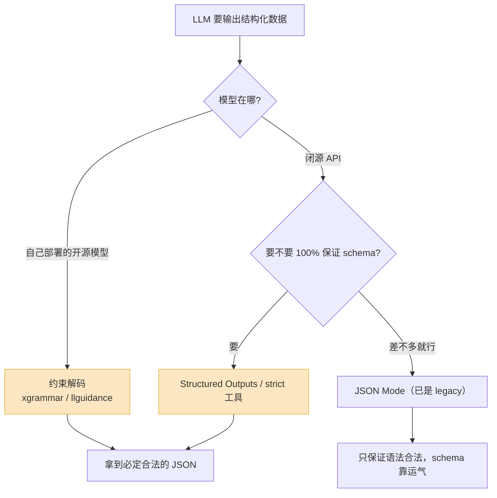

你写了个 prompt,让 LLM 把一段用户评论解析成 JSON:情感、评分、关键词。本地跑了二十次,完美。上线。

三天后告警响了。某条响应里,LLM 在 JSON 后面多写了一句"希望这个分析对你有帮助!"。你的 `json.loads()` 当场抛异常,整条链路挂掉。

这不是小概率事件,是**结构性问题**。只要你还在用"自由文本里夹一段 JSON"的方式跟 LLM 要数据,这种崩溃就是迟早的——区别只是它发生在测试环境还是生产环境。

这篇讲清楚:为什么自由文本提 JSON 天生不可靠,2026 年有哪几种正经方案、各自的代价是什么,schema 怎么设计才不坑自己,以及最难的那块——流式场景下怎么拿到结构化数据。

## 为什么"让它输出 JSON"本身就是错的

先理解 LLM 在干什么。它做的是一件事:根据前面所有 token,预测下一个 token 的概率分布,然后采样。它**没有**"我现在要写一个合法 JSON"这种全局意识。

所以当你在 prompt 里写"请只返回 JSON,不要有多余文字",你是在用一句话,对抗模型训练数据里成千上万条"先解释再给结果"的对话样本。大多数时候它听话,因为你的指令把概率压过去了。但只要某次采样,在该写 `}` 的位置,"希望"这个 token 的概率偶然爬到了第一,它就会写下去——而且一旦写下去,后面就会顺着"希望这个分析对你有帮助"这条最自然的路径滑下去。

常见的失败长这样:

- JSON 外面套了 ` ```json ` 代码块,或者前后有一段自然语言
- 字符串里有没转义的换行、引号
- 该是数字的字段写成了 `"4.5"`(带引号),或者写成 `4.5分`
- 嵌套对象少了一个括号,尤其是输出很长的时候
- 枚举字段返回了你没定义的值——你要 `positive/negative/neutral`,它给你个 `mixed`

这些都不是模型"笨",是概率采样的必然结果。**你不可能靠把 prompt 写得更恳切来根治它**,你只能降低概率,没法归零。要归零,得换思路:不是请求它输出合法结构,而是从机制上让它**没法输出**不合法的结构。

## 五种方案,以及它们各自的代价

2026 年,从最弱到最强,实际可用的方案是这五种。关键不是"哪个最好",是搞清楚每个的边界。



**1. 纯 prompt 约束。** 就是开头那种"请只返回 JSON"。它的唯一价值是当作其他方案的补充——把字段含义、示例写清楚能提升内容质量。但**别拿它当结构保证**。如果你现在生产环境还在裸用这个,这篇文章后面的部分就是为你写的。

**2. JSON Mode。** OpenAI 最早的尝试,`response_format: {"type": "json_object"}`。它保证一件事:输出是**语法合法**的 JSON——不会有代码块包裹,不会有多余文字,括号配对。但它**不管 schema**:字段名、字段类型、枚举值、必填项,一概不保证。所以你还是得做完整校验。2026 年它基本算 legacy 了,OpenAI 自己的文档也把它标成旧特性,纯 JSON Mode 在生产里早就没人用了。

**3. 约束解码 / Grammar(constrained decoding)。** 这是真正解决问题的机制,也是后面几种方案底层共用的东西。原理:在每一步采样时,根据"目前已经生成的部分 + 目标 schema",算出**下一个 token 哪些是合法的**,把所有非法 token 的概率直接屏蔽(mask 成负无穷),只在合法集合里采样。

举例:已经生成到 `{"rating":`,那么下一个 token 只能是数字、`-`、空格——模型这一步**根本采样不到** `"` 或者字母。它不是"被劝住了",是那条路被物理封死了。

开源世界里这块 2026 年很成熟。`xgrammar` 是目前 vLLM、SGLang、TensorRT-LLM 的默认结构化生成后端,支持完整的上下文无关文法(JSON、正则、自定义 CFG),每 token 开销做到了 40 微秒以下,几乎不影响吞吐;`llguidance` 是另一个主力,OpenAI 2025 年公开说过自家实现的底层借鉴了它。早期的 `outlines` 用有限状态机思路,开了这个方向,但碰到递归 schema(比如树形结构、嵌套评论)会很吃力,编译能慢到几十秒甚至几分钟,递归类结构现在更推荐用 xgrammar、llguidance 这种 CFG 引擎。

**4. Structured Outputs API。** 这是闭源厂商把约束解码包装成的产品功能。OpenAI 的 `response_format: {"type": "json_schema", strict: true}` 就是它——你传一个 JSON Schema,模型底层用约束解码,**输出必定符合 schema**:每个必填字段都在、类型都对、枚举值都合法。可用模型是 gpt-4o-2024-08-06 之后的版本、GPT-4.1 全系、GPT-5 和 o 系列。2026 年它是数据抽取、Agent 场景的生产默认。

**5. Function Calling / Tool Use。** 你定义工具,带 input schema,模型返回一个符合 schema 的工具调用。本质上跟 Structured Outputs 是同一套约束解码机制,只是包装成了"调用工具"的语义。它适合两类场景:一是模型真的要去调外部 API;二是你给了多个工具让模型自己选(多 Agent、路由)。Anthropic 的 Claude 走的就是 tool use 这条路,且复杂嵌套 schema 下也很稳;Gemini 这边把 JSON 模式和结构化输出合并成了一个特性。

一句话总结取舍:

| 方案 | 保证语法合法 | 保证 schema | 适用 |
|---|---|---|---|
| 纯 prompt 约束 | 否 | 否 | 只用来补充内容质量,别单用 |
| JSON Mode | 是 | 否 | 已 legacy,不推荐新项目 |
| 约束解码(xgrammar 等) | 是 | 是 | 自己部署开源模型 |
| Structured Outputs API | 是 | 是 | 闭源 API,要纯数据返回 |
| Function Calling | 是 | 是 | 要调外部工具,或多工具选择 |

**选型其实很简单**:自己部署模型,上 xgrammar;用闭源 API 且只想要一段数据,用 Structured Outputs;用闭源 API 且模型要决策调哪个工具,用 Function Calling。剩下两个,知道它们存在就行。

## schema 设计:决定成败的地方往往不是代码

很多人以为开了 Structured Outputs 就万事大吉了。不是。约束解码保证模型输出**符合**你的 schema,但如果你的 schema 设计得烂,模型会在"合法"的范围内给你垃圾。

几条我踩过坑后总结的硬规则:

**用枚举,别用开放字符串。** 情感字段写成 `"sentiment": string` 模型可能给你 `非常正面`、`positive`、`POSITIVE` 三种花样。写成 `enum: ["positive", "negative", "neutral"]`,约束解码会保证它只能落在这三个里。能枚举的一律枚举。

**给每个字段写 description。** schema 里的 `description` 不是注释,模型会读。`"score"` 含糊,`"score: 1-5 整数,5 表示强烈推荐,严格保守打分"` 就清楚得多。约束解码管类型,不管"打分准不准",后者靠 description。

**注意 strict 模式的限制。** OpenAI 的 strict 模式有几条硬约束容易绊人:所有字段都必须列进 `required`(想要可选字段,得把类型写成联合类型带 `null`);不支持任意的 `dict[str, Any]`,key 不确定的字典它接不了;日期时间得用 ISO 字符串表示。设计前先翻一遍文档的限制清单,别等运行时报错。

**给模型一条"我不知道"的出路。** 这条最容易被忽略。如果信息缺失,你又强迫模型必须填某个字段,约束解码会逼它**编一个**——它在合法 token 里硬凑,于是你拿到一个格式完美的幻觉。正确做法是显式留口子:加 `confidence` 字段,或者让关键字段可空,或者加一个 `"status": ["ok", "insufficient_info"]`。**结构合法不等于内容可信**,这是约束解码救不了你的部分。

**别一次榨太多。** 一个 schema 里塞二十个字段,还层层嵌套,模型质量会肉眼可见地掉。能拆成两次调用就拆。

## 出错了怎么兜底

上了 Structured Outputs,JSON 解析层面的错确实没了。但还有别的会出问题,得有兜底。

第一类,**API 层面的失败**:超时、限流、网络抖动。这跟结构化无关,但既然你依赖一个必定返回结构的接口,它一旦不返回,你的下游就断了。退避重试,该做做。

第二类,**约束解码碰上 token 上限**。约束解码保证"如果生成完成,结构一定合法",但它**不保证一定能生成完成**。如果 `max_tokens` 设小了,模型在一个深层嵌套里被强行截断,你拿到的是一段合法但**不完整**的 JSON。对策:嵌套深、字段多的 schema,把 `max_tokens` 给足;并且检查 finish reason 是不是 `length`,是的话当失败处理。

第三类,**内容兜底**——前面说的幻觉。schema 里留了 `confidence` 或 `status`,这里就要用上:低于阈值的结果不直接进库,转人工或走降级逻辑。

一个实战习惯:**就算用了 Structured Outputs,落库前也做一次业务校验。** 不是不信约束解码,是 schema 只能表达"类型和结构",表达不了"评分必须在 1 到 5 之间且这条订单的金额不能是负数"这种业务约束。两层防线:schema 管结构,代码管语义。

```python
# 闭源 API:Structured Outputs 保证结构,代码补业务校验
resp = client.chat.completions.create(
    model="gpt-4.1",
    messages=[...],
    response_format={
        "type": "json_schema",
        "json_schema": {"name": "review", "strict": True, "schema": SCHEMA},
    },
    max_tokens=800,
)
if resp.choices[0].finish_reason == "length":
    raise TruncatedError("被 token 上限截断,当失败重试")

data = json.loads(resp.choices[0].message.content)  # 这里几乎不会再抛
validate_business_rules(data)  # 评分范围、字段间一致性等,schema 管不到
```

## 流式场景:最难啃的一块

到这里都还好。真正难的是这个:你要**流式**输出,**同时**要结构化数据。

比如一个 UI,要边生成边把解析结果填进表单——名字一出来就显示名字,地址一出来就显示地址。但 LLM 是一个 token 一个 token 吐的,而 JSON 的**任何中间状态都是语法非法的**:

```mermaid
flowchart LR
  T1["{"] --> T2["{\"name\""] --> T3["{\"name\":\"张"] --> T4["{\"name\":\"张三\"}"]
  T1 -.->|"json.loads"| X1["报错"]
  T2 -.->|"json.loads"| X2["报错"]
  T3 -.->|"json.loads"| X3["报错"]
  T4 -.->|"json.loads"| OK["成功"]
  style X1 fill:#f8d7da,stroke:#c33
  style X2 fill:#f8d7da,stroke:#c33
  style X3 fill:#f8d7da,stroke:#c33
  style OK fill:#d4edda,stroke:#3a3
```

你不能等整段 JSON 攒齐——那就退化成非流式,流式的意义没了。也不能拿 `json.loads()` 去解每个中间态——它每次都抛异常。

可行的有两条路:

**一是分隔符切块。** 别要一个大 JSON,让模型按 `JSON Lines` 输出——每行一个独立的小对象,中间用换行分隔。每收到一个完整换行,就解析这一行。这等于把"一个大结构"拆成"很多个小结构",每个小结构一旦完整就立刻可用。简单、稳,适合"一批结果"型的输出。

**二是容错增量解析。** 用一个能处理**残缺 JSON** 的解析器,把每个中间态尽力补全成一个带类型的部分对象——`{"name":"张` 直接解析成 `{name: "张"}`,字段还没出现的就当缺失。这条路上 2026 年比较成熟的是 `BAML` 这类工具,它内置了一个容错 parser,专门把破碎的部分 JSON 实时转成带类型的对象,既保住流式的体验,又拿到渐进的结构化数据。

选哪条:输出是"一组同类项",用 JSON Lines;输出是"一个有很多字段的大对象",且 UI 要逐字段渐进填充,用容错增量解析。

还有个常被忽略的点:**流式 + 约束解码可以同时用**。约束解码是逐 token 工作的,本来就和流式天然兼容——vLLM 这类引擎流式吐 token 的同时,xgrammar 在每一步做 mask。所以"用了约束解码就不能流式"是个误解,两者是正交的。难的从来不是生成端,是**消费端**怎么解析这些中间态。

## 最后:把它当工程问题,别当 prompt 问题

如果只留一句话:**结构化输出的可靠性,不该靠 prompt 写得好,该靠机制保证。**

很多团队卡在"再调调 prompt 让它别输出多余文字"。这是把一个工程问题误当成了文案问题。prompt 能把失败率从 5% 压到 0.5%,但压不到 0;而约束解码这类机制能压到 0。你的优先级应该是:

1. **先换机制**——自部署上 xgrammar,用 API 上 Structured Outputs 或 Function Calling。这一步把"JSON 语法错"和"schema 不符"两类问题直接归零,收益最大。
2. **再认真设计 schema**——枚举、description、给"不知道"留出路。约束解码管不到的内容质量,靠这一步。
3. **最后补业务校验和流式兜底**——schema 管结构,代码管语义;流式场景按数据形态选 JSON Lines 或容错解析。

机制定了下限,prompt 和 schema 决定上限。顺序别搞反。

---

参考:
[OpenAI Structured Outputs 文档](https://platform.openai.com/docs/guides/structured-outputs)、
[Introducing Structured Outputs in the API](https://openai.com/index/introducing-structured-outputs-in-the-api/)、
[xgrammar](https://github.com/mlc-ai/xgrammar)、
[llguidance](https://github.com/guidance-ai/llguidance)、
[Structured Outputs in vLLM](https://developers.redhat.com/articles/2025/06/03/structured-outputs-vllm-guiding-ai-responses)、
[Streaming structured data from LLMs is harder than you think](https://nitishagar.medium.com/streaming-structured-data-from-llms-is-harder-than-you-think-6f2ee976fe5f)、
[When should I use function calling, structured outputs or JSON mode](https://www.vellum.ai/blog/when-should-i-use-function-calling-structured-outputs-or-json-mode)
