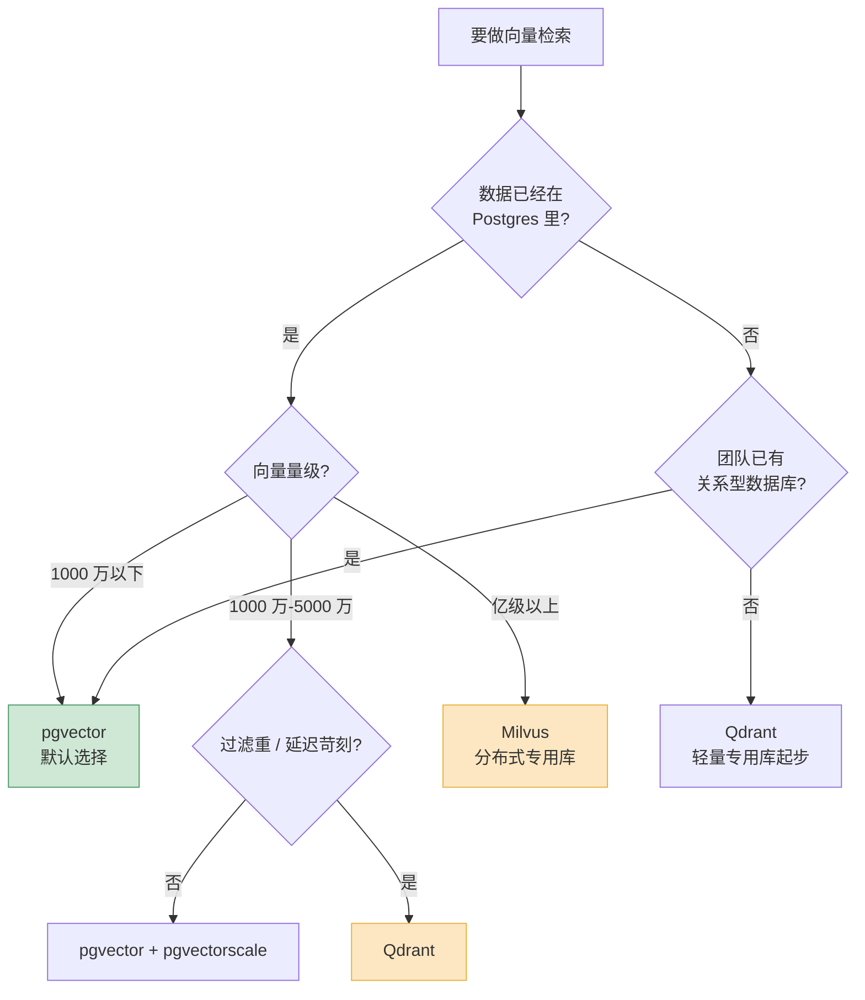

三年前做一个带检索的 AI 功能,默认动作是去注册一个 Pinecone,或者在 k8s 上拉起一套 Milvus。"做向量检索就得有向量数据库",这是当时的常识。

2026 年我不会这么干了。我现在的默认动作是反问一句:**你的业务数据是不是已经在 Postgres 里了?** 如果是,那大概率你不需要再多一个数据库——装个 `pgvector` 扩展就够了。

这不是图省事。这两年向量检索这个领域发生了一件挺反常识的事:**专用向量数据库的护城河,被"在已有数据库里加一个向量列"这件事填掉了一大半。** 这篇就讲清楚这件事是怎么发生的,以及——什么场景下你还是真的需要一个专用的。

## 向量检索这两年变了什么

先说结论:向量检索从"一项需要专门系统的黑科技",退化成了"一种索引类型"。

2022、2023 年的时候,向量检索确实特殊。HNSW 索引怎么建、近似最近邻(ANN)怎么调参、召回率和延迟怎么权衡,这些都是新东西,通用数据库根本不支持。你想做语义检索,除了上专用向量库没有别的选择。专用向量库的价值,很大程度上来自于"别人还做不了"。

到 2026 年,情况倒过来了。HNSW 这种图索引已经是成熟、公开、被反复实现的算法,不再是谁家的秘密。`pgvector` 作为 Postgres 扩展,把 HNSW 和 IVFFlat 索引、多种距离度量、半精度存储这些都做齐了;0.8 版本之后还补上了"迭代索引扫描"(iterative index scan),专门解决带过滤的向量查询里那个老大难问题——后面会细讲。

换句话说,**"做向量检索"这件事本身,已经不构成开一个新数据库的理由了。** 它现在更像是"我需要一个 JSON 字段"或者"我需要全文检索"——你的现有数据库基本都能干,只是早几年还不行。

专用向量库不是没价值了,而是价值的位置变了:它不再赢在"能不能做",而是赢在"做到什么规模、做得多快、过滤多复杂"。这是一个量变到质变的边界问题,而不是一个有无问题。

## pgvector 为什么吃掉了大半场景

把向量检索塞进 Postgres,带来的好处不是"少装一个软件"这么肤浅。真正值钱的是下面三件事。

**第一,数据不用搬,事务是一致的。** 绝大多数 AI 功能不是孤立的——一段文档的 embedding,总是挂在某个用户、某个项目、某个权限边界下面。如果向量在专用库、业务数据在 Postgres,你就得自己维护两套数据的同步:文档删了,向量要跟着删;权限变了,检索结果要跟着变。这套同步逻辑写起来不难,但它是一类**永远会出 bug 的胶水代码**——双写失败、顺序错乱、补偿任务追不上。向量和业务数据待在同一个 Postgres 事务里,这一整类问题直接不存在。

**第二,过滤就是普通的 SQL `WHERE`。** "找语义相近的文档,但限定这个用户、这个时间段、状态是已发布"——这种带元数据过滤的检索是 RAG 里的常态,几乎没有哪个真实业务是纯粹的全库 ANN。在 pgvector 里,这就是一条 SQL,`WHERE` 子句和向量排序写在一起,还能直接 JOIN 业务表。在专用向量库里,过滤得靠它自己那套 payload/metadata 过滤机制,表达能力通常比 SQL 弱,跨"表"的关联更是做不了。

**第三,运维你已经会了。** 你的团队大概率已经在跑 Postgres——有人会调参,有备份,有监控,有高可用方案。pgvector 只是这台已有机器上的一个扩展,不增加任何新的运维面。而 Milvus 是一套认真的分布式系统,etcd、对象存储、查询节点、数据节点分开,通常得跑在 k8s 上,得有人专门盯着。这个运维成本,小团队最容易低估。

再加上一个关键事实:**大多数 RAG 业务的数据量,比你以为的小得多。** 一个 B2B SaaS 产品,把所有客户的所有文档切块做 embedding,常常也就几十万到几百万条向量。公开的评测和生产经验里有个反复出现的数字——**1000 万条向量以下,pgvector 在端到端延迟、成本、运维复杂度上,综合体验是最好的。** 单节点 Postgres 配置得当能撑到接近 5000 万条向量,这个区间覆盖了绝大部分企业级 RAG 产品。

所以"默认 pgvector"不是保守,是 2026 年对大多数场景最合理的工程判断。

## 那专用向量库什么时候才真的需要

把 pgvector 夸完了,得诚实地说它的天花板在哪。三个信号,出现任何一个,你就该认真考虑专用向量库了。

**信号一:规模真的大。** 这里说的"大"是几千万到十亿级的向量,而且还在涨。pgvector 的硬上限是单节点 Postgres 的上限——内存装不下索引、HNSW 索引构建时间长到离谱、单机扛不住并发。`pgvectorscale` 这个扩展能用 StreamingDiskANN 把索引下放到磁盘,把这个上限往后推一截,值得先试。但如果你的向量是亿级、要分布式分片、要水平扩容,那就是 Milvus 的主场——它在生产里被部署到几亿乃至十亿级向量是常规操作,搜索公司、电商、基因研究都在这个量级用它。

**信号二:过滤又重又刁钻。** 注意,这跟前面说 pgvector 过滤强不矛盾。pgvector 的强项是**过滤的表达能力**(SQL 想怎么写怎么写);它的弱项是**高过滤率下的检索性能**。近似索引的本质矛盾是:先扫索引拿候选,再套过滤条件——如果过滤条件只命中全库 1% 的行,HNSW 默认 `ef_search` 才 40,扫出来平均可能一条都不剩。pgvector 0.8 的迭代索引扫描缓解了这个问题(不够就继续扫,直到够数),但它是"打补丁",不是"原生为过滤设计"。Qdrant 走的是另一条路:payload 感知的索引,让带过滤的检索性能接近不带过滤。如果你的核心场景就是**在一个大库的某个过滤子集上做高 QPS 检索**,Qdrant 是 2026 年的默认答案。

**信号三:延迟和吞吐被压到极限。** 公开评测里,Qdrant 在 100 万向量、召回率 95% 以上时能做到约 1840 QPS,p99 延迟约 12ms,是开源里最快的一档;Milvus 约 18ms,Weaviate 约 16ms。pgvector 在 1000 万以下做得也不错,但当你的检索 QPS 很高、又卡着严格的 p99,专用库用 Rust/C++ 写的查询引擎、更精细的索引控制,确实能再榨出一截。这是个"边际收益"问题:大多数业务感知不到这一截,少数高频检索的业务很在意。

把这三个信号反过来说:**如果你的向量在千万以下、过滤用 SQL 能舒服表达、对延迟没有极端要求——你三个信号一个都没踩中,那就别折腾,pgvector。**

## 混合检索:专用库重新拿回的一分

前面说专用库护城河被填了一大半,**混合检索是它们守住的那一小半。**

纯向量检索有个真实的弱点:它擅长"意思相近",但对"必须精确出现的词"反而不灵。用户搜一个产品型号 `SKU-7741X`、一个错误码 `ERR_0x80`、一个人名,语义相似度模型很可能给你一堆"意思差不多但型号不对"的结果。这种场景下,老派的关键词检索(BM25)反而准。

**混合检索**就是把两者揉在一起:稠密向量负责"语义",稀疏的 BM25 负责"精确词命中",再用一个排序融合(比如 RRF)把两路结果合并。2026 年这基本是 RAG 检索质量的标配,而不是加分项。

这件事上,各家差距很明显:

| 数据库 | 混合检索现状 |
|---|---|
| Weaviate | 原生 BM25 + 稠密向量 + 元数据过滤,一条查询搞定,体验最完整 |
| Qdrant | 原生支持稀疏向量与稠密向量,内置融合,做混合检索很顺手 |
| Milvus | 支持,但更偏纯向量检索的大规模场景 |
| pgvector | 能做——pgvector 管向量,Postgres 的全文检索管 BM25,但**要自己写融合逻辑**,把两路分数缝起来 |

pgvector 在这一项上是"能做但不优雅":两套排序、两套分数,RRF 融合得自己写在 SQL 或应用层。能跑,但不如 Weaviate 那种"一条查询返回融合结果"省心。

所以如果检索质量是你的产品核心、混合检索要做得讲究——这是天平往专用库(尤其 Weaviate)倾斜的一个实打实的理由。如果混合检索对你只是"锦上添花",pgvector 自己拼一套也能用。

## 托管还是自建

选完"哪个数据库",还有一道正交的题:托管云服务,还是自己部署。

参考一下 2026 年的大致价位,1000 万向量量级:Pinecone Serverless 约每月 70 美元,Qdrant Cloud 约 65 美元,Weaviate Cloud 约 135 美元,而 pgvector 跑在 RDS 上大约 45 美元。这个区间里,差价是噪音,不值得为省几十美元纠结。

真正拉开差距的是**两个极端**:

- **量级很小、又不想多维护一个系统**:数据已经在托管 Postgres(RDS、Aurora、Supabase)里的话,pgvector 几乎零边际成本——你连"选型"都不用做。
- **量级很大(上亿向量)**:托管和自建的成本差会放大到很夸张的程度。同样的亿级负载,Pinecone 这类全托管的账单能到自建 Qdrant 或 Milvus 的 3 到 5 倍。这个量级,自建省下的钱足够养一个专门运维的人。

中间地带的判断很简单,就一句话:**算清楚你那个专门维护数据库的工程师,一年值多少钱。** Pinecone 这种全托管的卖点从来不是便宜,是"你完全不用管它"——没有节点、没有索引调参、没有半夜被叫起来。对一个还没有专职 DBA、工程师时间比服务器贵得多的小团队,多付的托管费通常划算。反过来,已经有成熟基础设施团队、规模又上来了,自建 Qdrant/Milvus 的性价比会明显反超。

我的经验法则:**早期一律托管**(包括直接用托管 Postgres 的 pgvector),把精力留给产品;**等规模和团队都长起来了,再谈自建。** 别在第一天就为一个还不存在的扩容问题,提前背上运维负担。

## 一张表收尾:按规模和场景怎么选

把上面所有判断压成一张可以贴在工位上的表:

| 场景 | 向量量级 | 推荐 | 理由 |
|---|---|---|---|
| 数据已在 Postgres,常规 RAG | < 1000 万 | **pgvector** | 零新增系统,事务一致,SQL 过滤 |
| 没有关系型数据库,轻量起步 | < 1000 万 | **Qdrant**(托管) | 上手快,过滤性能好,后续好扩 |
| 检索质量是核心,混合检索要讲究 | 任意 | **Weaviate** | 原生 BM25 + 向量,融合开箱即用 |
| 大库 + 高过滤率 + 高 QPS | 1000 万 ~ 数亿 | **Qdrant** | payload 感知索引,过滤几乎不掉速 |
| 亿级以上,要分布式水平扩容 | > 1 亿 | **Milvus** | 为超大规模分布式设计 |
| 想留在 Postgres 但超了单机上限 | 1000 万 ~ 5000 万 | **pgvector + pgvectorscale** | DiskANN 把索引下放磁盘 |

最后留一句话。三年前"做 AI 检索就得上专用向量库"是对的,因为别人确实做不了。2026 年这句话已经过期了——**专用向量库依然优秀,但它现在要靠规模、过滤、混合检索这些具体的硬指标来赢得你,而不是靠"向量检索"这四个字本身。** 选型的第一步不再是"挑哪个向量库",而是先诚实地问自己:我真的到了需要它的那条线了吗?

大多数人,还没到。
