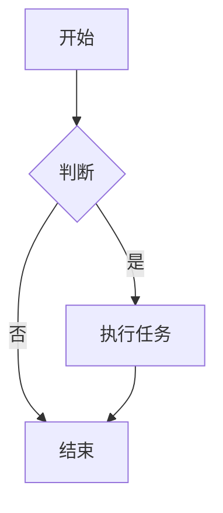
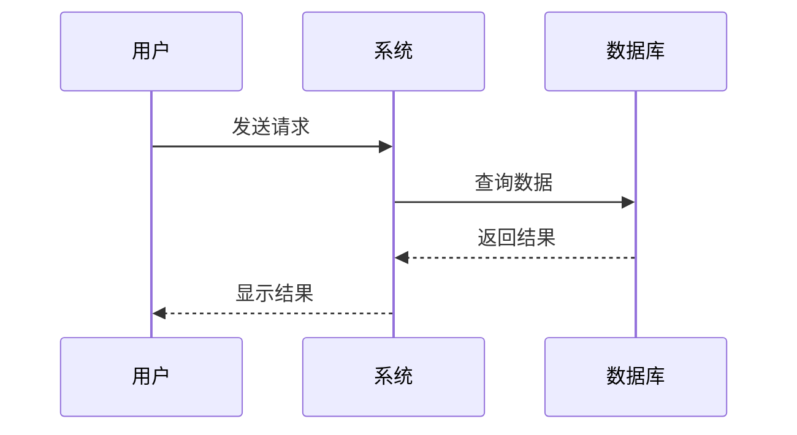
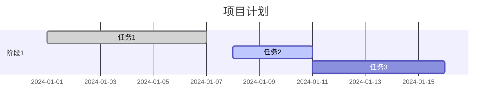
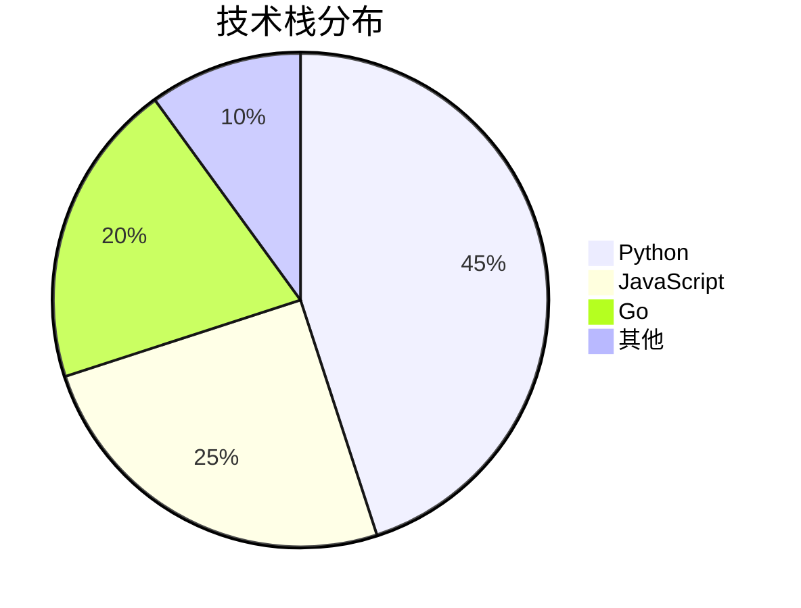

## 测试Mermaid图表

### 流程图测试

```mermaid
graph TD
    A[开始] --> B{判断}
    B -->|是| C[执行任务]
    B -->|否| D[结束]
    C --> D
```

### 序列图测试

```mermaid
sequenceDiagram
    participant 用户
    participant 系统
    participant 数据库
    
    用户->>系统: 发送请求
    系统->>数据库: 查询数据
    数据库-->>系统: 返回结果
    系统-->>用户: 显示结果
```

### 甘特图测试

```mermaid
gantt
    title 项目计划
    dateFormat  YYYY-MM-DD
    section 阶段1
    任务1           :done,    des1, 2024-01-01,2024-01-07
    任务2           :active,  des2, 2024-01-08, 3d
    任务3           :         des3, after des2, 5d
```

### 饼图测试

```mermaid
pie title 技术栈分布
    "Python" : 45
    "JavaScript" : 25
    "Go" : 20
    "其他" : 10
```

如果你能看到上面的图表，说明Mermaid已经正常工作了！