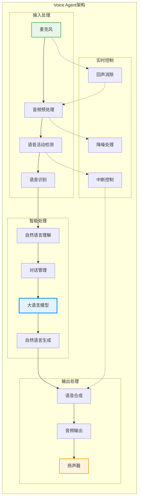
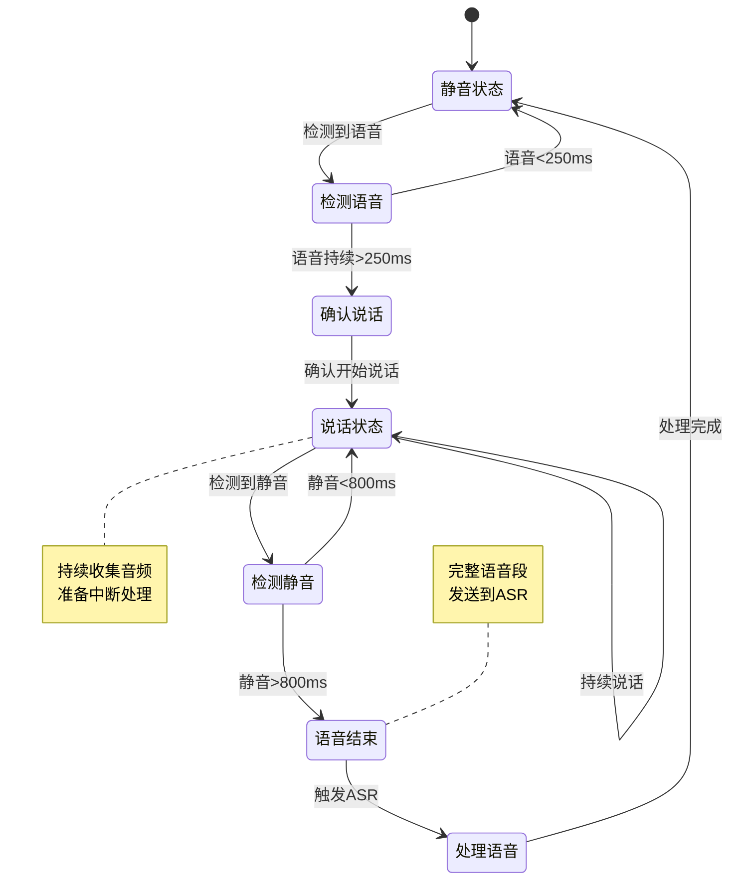

## 引言

Voice Agent代表了人机交互的未来方向，能够实现自然、流畅的语音对话。本文深入探讨如何构建生产级的Voice Agent系统，包括实时语音处理、低延迟架构和多模态交互。

## 1. Voice Agent系统架构



### 1.1 核心架构设计

```python
import asyncio
from dataclasses import dataclass
from typing import Optional, Callable, Any
import numpy as np

@dataclass
class VoiceAgentConfig:
    # 音频配置
    sample_rate: int = 16000
    chunk_duration_ms: int = 20
    channels: int = 1
    
    # VAD配置
    vad_threshold: float = 0.5
    vad_min_speech_ms: int = 250
    vad_max_silence_ms: int = 800
    
    # ASR配置
    asr_model: str = "whisper-large-v3"
    asr_language: str = "en"
    
    # LLM配置
    llm_model: str = "gpt-4-turbo"
    llm_temperature: float = 0.7
    llm_streaming: bool = True
    
    # TTS配置
    tts_model: str = "elevenlabs-turbo"
    tts_voice: str = "rachel"
    
    # 中断配置
    allow_interruption: bool = True
    interruption_threshold: float = 0.8

class VoiceAgent:
    def __init__(self, config: VoiceAgentConfig):
        self.config = config
        self.audio_processor = AudioProcessor(config)
        self.vad = VoiceActivityDetector(config)
        self.asr = SpeechRecognizer(config)
        self.llm = LanguageModel(config)
        self.tts = TextToSpeech(config)
        self.dialog_manager = DialogManager()
        
        # 状态管理
        self.state = AgentState.IDLE
        self.conversation_context = []
        
        # 音频缓冲区
        self.input_buffer = AudioBuffer()
        self.output_buffer = AudioBuffer()
        
    async def start(self):
        """启动Voice Agent"""
        # 启动各个组件
        await asyncio.gather(
            self.audio_input_loop(),
            self.processing_loop(),
            self.audio_output_loop()
        )
    
    async def audio_input_loop(self):
        """音频输入循环"""
        while True:
            # 获取音频块
            audio_chunk = await self.get_audio_input()
            
            # 预处理
            processed = self.audio_processor.process(audio_chunk)
            
            # VAD检测
            is_speech = self.vad.detect(processed)
            
            if is_speech:
                self.input_buffer.append(processed)
                self.state = AgentState.LISTENING
            elif self.state == AgentState.LISTENING:
                # 静音检测到，处理累积的语音
                await self.process_speech()
    
    async def process_speech(self):
        """处理语音输入"""
        # 获取累积的音频
        audio_data = self.input_buffer.get_all()
        self.input_buffer.clear()
        
        # 语音识别
        transcript = await self.asr.transcribe(audio_data)
        
        if transcript:
            # 更新状态
            self.state = AgentState.THINKING
            
            # 生成响应
            response = await self.generate_response(transcript)
            
            # 合成语音
            await self.synthesize_and_play(response)
    
    async def generate_response(self, user_input: str):
        """生成响应"""
        # 更新对话上下文
        self.conversation_context.append({"role": "user", "content": user_input})
        
        # 流式生成响应
        response_chunks = []
        async for chunk in self.llm.stream_generate(self.conversation_context):
            response_chunks.append(chunk)
            
            # 提前开始TTS（降低延迟）
            if len(response_chunks) > 5:  # 累积足够的文本
                sentence = self.extract_complete_sentence(response_chunks)
                if sentence:
                    await self.start_tts(sentence)
                    response_chunks = self.remove_sentence(response_chunks)
        
        # 处理剩余文本
        remaining = ''.join(response_chunks)
        if remaining:
            await self.start_tts(remaining)
        
        # 更新上下文
        full_response = ''.join(response_chunks)
        self.conversation_context.append({"role": "assistant", "content": full_response})
        
        return full_response
```

### 1.2 实时音频处理

```python
import sounddevice as sd
import webrtcvad
from scipy import signal

class AudioProcessor:
    def __init__(self, config: VoiceAgentConfig):
        self.config = config
        self.sample_rate = config.sample_rate
        
        # 音频增强
        self.noise_reducer = NoiseReducer()
        self.echo_canceller = EchoCanceller()
        self.agc = AutomaticGainControl()
        
    def process(self, audio_chunk: np.ndarray) -> np.ndarray:
        """处理音频块"""
        # 降噪
        audio = self.noise_reducer.reduce(audio_chunk)
        
        # 回声消除
        audio = self.echo_canceller.cancel(audio)
        
        # 自动增益控制
        audio = self.agc.apply(audio)
        
        # 重采样（如果需要）
        if self.sample_rate != 16000:
            audio = self.resample(audio, self.sample_rate, 16000)
        
        return audio
    
    def resample(self, audio: np.ndarray, orig_sr: int, target_sr: int):
        """重采样音频"""
        if orig_sr == target_sr:
            return audio
        
        # 计算重采样因子
        resample_ratio = target_sr / orig_sr
        
        # 使用scipy进行重采样
        num_samples = int(len(audio) * resample_ratio)
        resampled = signal.resample(audio, num_samples)
        
        return resampled

class NoiseReducer:
    def __init__(self, noise_gate_threshold: float = 0.01):
        self.threshold = noise_gate_threshold
        self.noise_profile = None
        
    def reduce(self, audio: np.ndarray) -> np.ndarray:
        """降噪处理"""
        # 频谱减法降噪
        stft = np.fft.rfft(audio)
        magnitude = np.abs(stft)
        phase = np.angle(stft)
        
        # 估计噪声谱
        if self.noise_profile is None:
            self.noise_profile = np.mean(magnitude[:100])  # 使用前100个样本估计
        
        # 频谱减法
        cleaned_magnitude = magnitude - self.noise_profile
        cleaned_magnitude = np.maximum(cleaned_magnitude, 0)
        
        # 重建信号
        cleaned_stft = cleaned_magnitude * np.exp(1j * phase)
        cleaned_audio = np.fft.irfft(cleaned_stft)
        
        return cleaned_audio[:len(audio)]

class EchoCanceller:
    def __init__(self, filter_length: int = 256):
        self.filter_length = filter_length
        self.adaptive_filter = np.zeros(filter_length)
        self.mu = 0.01  # 步长参数
        
    def cancel(self, audio: np.ndarray, reference: Optional[np.ndarray] = None):
        """自适应回声消除"""
        if reference is None:
            return audio
        
        # NLMS算法
        output = np.zeros_like(audio)
        
        for i in range(len(audio)):
            if i >= self.filter_length:
                # 获取参考信号段
                ref_segment = reference[i-self.filter_length:i]
                
                # 预测回声
                echo_estimate = np.dot(self.adaptive_filter, ref_segment)
                
                # 消除回声
                output[i] = audio[i] - echo_estimate
                
                # 更新滤波器系数
                error = output[i]
                norm_factor = np.dot(ref_segment, ref_segment) + 1e-6
                self.adaptive_filter += self.mu * error * ref_segment / norm_factor
            else:
                output[i] = audio[i]
        
        return output
```

## 2. 语音活动检测（VAD）

### 2.1 深度学习VAD

```python
import torch
import torch.nn as nn

class NeuralVAD(nn.Module):
    def __init__(self, input_dim: int = 40):
        super().__init__()
        
        # 特征提取
        self.feature_extractor = nn.Sequential(
            nn.Conv1d(1, 32, kernel_size=3, padding=1),
            nn.ReLU(),
            nn.Conv1d(32, 64, kernel_size=3, padding=1),
            nn.ReLU(),
            nn.MaxPool1d(2)
        )
        
        # RNN层
        self.lstm = nn.LSTM(
            input_size=64,
            hidden_size=128,
            num_layers=2,
            batch_first=True,
            bidirectional=True
        )
        
        # 分类头
        self.classifier = nn.Sequential(
            nn.Linear(256, 128),
            nn.ReLU(),
            nn.Dropout(0.5),
            nn.Linear(128, 2)  # 语音/非语音
        )
        
    def forward(self, x):
        # x shape: (batch, time, features)
        x = x.transpose(1, 2)  # (batch, features, time)
        
        # 特征提取
        features = self.feature_extractor(x.unsqueeze(1))
        features = features.transpose(1, 2)  # (batch, time, features)
        
        # RNN处理
        lstm_out, _ = self.lstm(features)
        
        # 分类
        logits = self.classifier(lstm_out)
        
        return logits

```



```python
class VoiceActivityDetector:
    def __init__(self, config: VoiceAgentConfig):
        self.config = config
        self.model = NeuralVAD()
        self.model.load_state_dict(torch.load("vad_model.pt"))
        self.model.eval()
        
        # 状态机
        self.speech_buffer = []
        self.silence_buffer = []
        self.is_speaking = False
        
    def detect(self, audio_frame: np.ndarray) -> bool:
        """检测语音活动"""
        # 提取特征
        features = self.extract_features(audio_frame)
        
        # 模型推理
        with torch.no_grad():
            features_tensor = torch.FloatTensor(features).unsqueeze(0)
            logits = self.model(features_tensor)
            probs = torch.softmax(logits, dim=-1)
            is_speech = probs[0, 1] > self.config.vad_threshold
        
        # 状态机处理
        return self.process_state(is_speech, audio_frame)
    
    def process_state(self, is_speech: bool, audio_frame: np.ndarray):
        """状态机处理"""
        if is_speech:
            self.speech_buffer.append(audio_frame)
            self.silence_buffer = []
            
            if not self.is_speaking:
                # 检查是否达到最小语音长度
                speech_duration = len(self.speech_buffer) * self.config.chunk_duration_ms
                if speech_duration >= self.config.vad_min_speech_ms:
                    self.is_speaking = True
                    return True
            return self.is_speaking
        else:
            self.silence_buffer.append(audio_frame)
            
            if self.is_speaking:
                # 检查是否达到最大静音长度
                silence_duration = len(self.silence_buffer) * self.config.chunk_duration_ms
                if silence_duration >= self.config.vad_max_silence_ms:
                    self.is_speaking = False
                    self.speech_buffer = []
                    return False
            return self.is_speaking
    
    def extract_features(self, audio: np.ndarray) -> np.ndarray:
        """提取音频特征"""
        import librosa
        
        # 提取MFCC特征
        mfcc = librosa.feature.mfcc(
            y=audio,
            sr=self.config.sample_rate,
            n_mfcc=13
        )
        
        # 添加一阶和二阶差分
        delta = librosa.feature.delta(mfcc)
        delta2 = librosa.feature.delta(mfcc, order=2)
        
        # 拼接特征
        features = np.vstack([mfcc, delta, delta2])
        
        return features.T
```

## 3. 实时语音识别

### 3.1 流式ASR

```python
import whisper
from transformers import WhisperProcessor, WhisperForConditionalGeneration

class StreamingASR:
    def __init__(self, model_name: str = "openai/whisper-large-v3"):
        self.processor = WhisperProcessor.from_pretrained(model_name)
        self.model = WhisperForConditionalGeneration.from_pretrained(model_name)
        
        # 流式处理缓冲区
        self.audio_buffer = []
        self.context_buffer = []
        self.chunk_size = 16000 * 3  # 3秒音频
        
    async def transcribe_stream(self, audio_stream):
        """流式转录"""
        partial_transcript = ""
        
        async for audio_chunk in audio_stream:
            self.audio_buffer.extend(audio_chunk)
            
            # 当缓冲区足够大时处理
            if len(self.audio_buffer) >= self.chunk_size:
                # 提取要处理的音频
                audio_to_process = np.array(self.audio_buffer[:self.chunk_size])
                
                # 转录
                transcript = await self.transcribe_chunk(audio_to_process)
                
                # 更新部分转录
                partial_transcript = self.merge_transcripts(
                    partial_transcript, transcript
                )
                
                # 移动缓冲区（保留一些重叠）
                overlap = self.chunk_size // 4
                self.audio_buffer = self.audio_buffer[self.chunk_size - overlap:]
                
                yield partial_transcript
    
    async def transcribe_chunk(self, audio: np.ndarray) -> str:
        """转录音频块"""
        # 预处理
        inputs = self.processor(
            audio,
            sampling_rate=16000,
            return_tensors="pt"
        )
        
        # 生成转录
        with torch.no_grad():
            predicted_ids = self.model.generate(inputs.input_features)
            transcription = self.processor.batch_decode(
                predicted_ids,
                skip_special_tokens=True
            )[0]
        
        return transcription
    
    def merge_transcripts(self, existing: str, new: str) -> str:
        """合并转录结果"""
        # 简单的重叠检测和合并
        if not existing:
            return new
        
        # 查找重叠部分
        overlap_length = min(len(existing), len(new))
        for i in range(overlap_length, 0, -1):
            if existing[-i:] == new[:i]:
                return existing + new[i:]
        
        return existing + " " + new

class ContextualASR:
    def __init__(self, base_asr: StreamingASR):
        self.base_asr = base_asr
        self.context_keywords = []
        self.domain_vocabulary = {}
        
    def add_context(self, keywords: List[str], boost: float = 2.0):
        """添加上下文关键词"""
        for keyword in keywords:
            self.context_keywords.append({
                "word": keyword,
                "boost": boost
            })
    
    async def transcribe_with_context(self, audio: np.ndarray) -> str:
        """带上下文的转录"""
        # 基础转录
        base_transcript = await self.base_asr.transcribe_chunk(audio)
        
        # 应用上下文偏置
        corrected_transcript = self.apply_context_bias(base_transcript)
        
        return corrected_transcript
    
    def apply_context_bias(self, transcript: str) -> str:
        """应用上下文偏置"""
        words = transcript.split()
        corrected_words = []
        
        for word in words:
            # 检查是否需要替换
            best_match = self.find_best_match(word)
            if best_match:
                corrected_words.append(best_match)
            else:
                corrected_words.append(word)
        
        return " ".join(corrected_words)
    
    def find_best_match(self, word: str) -> Optional[str]:
        """查找最佳匹配的上下文词"""
        from difflib import SequenceMatcher
        
        best_score = 0
        best_match = None
        
        for context_item in self.context_keywords:
            context_word = context_item["word"]
            boost = context_item["boost"]
            
            # 计算相似度
            similarity = SequenceMatcher(None, word.lower(), context_word.lower()).ratio()
            score = similarity * boost
            
            if score > best_score and score > 0.8:  # 阈值
                best_score = score
                best_match = context_word
        
        return best_match
```

## 4. 低延迟响应生成

### 4.1 流式LLM集成

```python
import openai
from typing import AsyncGenerator

class StreamingLLM:
    def __init__(self, model: str = "gpt-4-turbo"):
        self.model = model
        self.client = openai.AsyncOpenAI()
        
    async def stream_generate(self, 
                             messages: List[Dict],
                             temperature: float = 0.7) -> AsyncGenerator[str, None]:
        """流式生成响应"""
        stream = await self.client.chat.completions.create(
            model=self.model,
            messages=messages,
            temperature=temperature,
            stream=True
        )
        
        async for chunk in stream:
            if chunk.choices[0].delta.content:
                yield chunk.choices[0].delta.content
    
    async def generate_with_interruption(self,
                                        messages: List[Dict],
                                        interrupt_signal: asyncio.Event):
        """可中断的生成"""
        response_buffer = []
        
        try:
            async for chunk in self.stream_generate(messages):
                if interrupt_signal.is_set():
                    # 被中断
                    break
                
                response_buffer.append(chunk)
                yield chunk
        finally:
            # 清理
            pass
        
        return ''.join(response_buffer)

class ResponseOptimizer:
    def __init__(self):
        self.response_cache = {}
        self.common_patterns = self.load_common_patterns()
        
    def optimize_response(self, user_input: str, context: List[Dict]) -> Optional[str]:
        """优化响应（快速路径）"""
        # 检查缓存
        cache_key = self.get_cache_key(user_input, context)
        if cache_key in self.response_cache:
            return self.response_cache[cache_key]
        
        # 检查常见模式
        for pattern in self.common_patterns:
            if pattern["matcher"](user_input):
                return pattern["response"]
        
        return None
    
    def get_cache_key(self, user_input: str, context: List[Dict]) -> str:
        """生成缓存键"""
        import hashlib
        
        context_str = str(context[-3:]) if len(context) > 3 else str(context)
        combined = f"{user_input}:{context_str}"
        
        return hashlib.md5(combined.encode()).hexdigest()
    
    def load_common_patterns(self) -> List[Dict]:
        """加载常见对话模式"""
        patterns = [
            {
                "matcher": lambda x: x.lower() in ["hello", "hi", "hey"],
                "response": "Hello! How can I help you today?"
            },
            {
                "matcher": lambda x: "thank" in x.lower(),
                "response": "You're welcome! Is there anything else I can help with?"
            },
            {
                "matcher": lambda x: x.lower() in ["bye", "goodbye", "see you"],
                "response": "Goodbye! Have a great day!"
            }
        ]
        
        return patterns
```

## 5. 实时语音合成

### 5.1 流式TTS

```python
class StreamingTTS:
    def __init__(self, model_name: str = "elevenlabs"):
        self.model_name = model_name
        self.synthesizer = self.load_synthesizer()
        
        # 音频缓冲
        self.audio_queue = asyncio.Queue()
        self.synthesis_buffer = []
        
    async def synthesize_stream(self, text_stream) -> AsyncGenerator[bytes, None]:
        """流式合成语音"""
        sentence_buffer = ""
        
        async for text_chunk in text_stream:
            sentence_buffer += text_chunk
            
            # 检测完整的句子
            sentences = self.extract_sentences(sentence_buffer)
            
            for sentence in sentences[:-1]:  # 保留最后一个可能不完整的句子
                # 合成句子
                audio_data = await self.synthesize_sentence(sentence)
                yield audio_data
            
            # 更新缓冲区
            if sentences:
                sentence_buffer = sentences[-1]
        
        # 合成剩余文本
        if sentence_buffer:
            audio_data = await self.synthesize_sentence(sentence_buffer)
            yield audio_data
    
    async def synthesize_sentence(self, text: str) -> bytes:
        """合成单个句子"""
        # 这里应该调用实际的TTS API
        audio = self.synthesizer.synthesize(text)
        
        # 应用后处理
        audio = self.post_process_audio(audio)
        
        return audio
    
    def extract_sentences(self, text: str) -> List[str]:
        """提取完整句子"""
        import re
        
        # 句子分割正则
        sentence_endings = re.compile(r'[.!?。！？]')
        
        sentences = sentence_endings.split(text)
        
        # 恢复标点
        result = []
        matches = sentence_endings.finditer(text)
        
        for i, match in enumerate(matches):
            if i < len(sentences):
                result.append(sentences[i] + match.group())
        
        # 添加最后一个可能不完整的句子
        if len(sentences) > len(result):
            result.append(sentences[-1])
        
        return [s.strip() for s in result if s.strip()]
    
    def post_process_audio(self, audio: np.ndarray) -> np.ndarray:
        """音频后处理"""
        # 淡入淡出
        fade_samples = int(0.01 * 16000)  # 10ms
        
        audio[:fade_samples] *= np.linspace(0, 1, fade_samples)
        audio[-fade_samples:] *= np.linspace(1, 0, fade_samples)
        
        # 归一化
        max_val = np.max(np.abs(audio))
        if max_val > 0:
            audio = audio / max_val * 0.95
        
        return audio
```

## 6. 中断处理

### 6.1 打断检测与处理

```python
class InterruptionHandler:
    def __init__(self, config: VoiceAgentConfig):
        self.config = config
        self.is_agent_speaking = False
        self.interruption_detected = asyncio.Event()
        
    async def monitor_interruption(self, audio_stream):
        """监控用户打断"""
        vad = VoiceActivityDetector(self.config)
        
        async for audio_chunk in audio_stream:
            if self.is_agent_speaking:
                # 检测用户是否开始说话
                is_speech = vad.detect(audio_chunk)
                
                if is_speech:
                    # 计算能量水平
                    energy = np.sqrt(np.mean(audio_chunk ** 2))
                    
                    if energy > self.config.interruption_threshold:
                        # 触发中断
                        self.interruption_detected.set()
                        await self.handle_interruption()
    
    async def handle_interruption(self):
        """处理中断"""
        # 停止当前播放
        await self.stop_audio_playback()
        
        # 清空输出缓冲区
        await self.clear_output_buffer()
        
        # 重置状态
        self.is_agent_speaking = False
        
        # 通知其他组件
        await self.notify_interruption()
    
    async def stop_audio_playback(self):
        """停止音频播放"""
        # 实现音频播放停止逻辑
        pass
    
    async def clear_output_buffer(self):
        """清空输出缓冲区"""
        # 清空待播放的音频
        pass
    
    async def notify_interruption(self):
        """通知中断事件"""
        # 通知LLM停止生成
        # 通知TTS停止合成
        pass

class TurnTakingManager:
    def __init__(self):
        self.current_speaker = "none"
        self.turn_history = []
        self.overlap_detector = OverlapDetector()
        
    async def manage_turn(self, user_vad: bool, agent_vad: bool):
        """管理对话轮次"""
        if user_vad and agent_vad:
            # 重叠说话
            overlap_type = self.overlap_detector.classify_overlap(
                user_vad, agent_vad
            )
            
            if overlap_type == "interruption":
                # 用户打断
                self.current_speaker = "user"
                await self.yield_turn_to_user()
            elif overlap_type == "backchannel":
                # 反馈信号（如"嗯"、"好的"）
                self.current_speaker = "agent"  # 继续说话
        elif user_vad:
            self.current_speaker = "user"
        elif agent_vad:
            self.current_speaker = "agent"
        else:
            self.current_speaker = "none"
        
        # 记录轮次历史
        self.turn_history.append({
            "timestamp": time.time(),
            "speaker": self.current_speaker
        })
    
    async def yield_turn_to_user(self):
        """让出话轮给用户"""
        # 停止agent说话
        # 开始监听用户
        pass
```

## 7. WebRTC集成

### 7.1 WebRTC信令服务器

```python
from fastapi import FastAPI, WebSocket
import json

class WebRTCSignalingServer:
    def __init__(self):
        self.app = FastAPI()
        self.connections = {}
        self.setup_routes()
        
    def setup_routes(self):
        @self.app.websocket("/ws/{client_id}")
        async def websocket_endpoint(websocket: WebSocket, client_id: str):
            await websocket.accept()
            self.connections[client_id] = websocket
            
            try:
                while True:
                    data = await websocket.receive_text()
                    message = json.loads(data)
                    
                    await self.handle_signaling(client_id, message)
            except:
                del self.connections[client_id]
    
    async def handle_signaling(self, client_id: str, message: Dict):
        """处理信令消息"""
        message_type = message.get("type")
        
        if message_type == "offer":
            # 处理SDP offer
            await self.handle_offer(client_id, message["sdp"])
        elif message_type == "answer":
            # 处理SDP answer
            await self.handle_answer(client_id, message["sdp"])
        elif message_type == "ice-candidate":
            # 处理ICE候选
            await self.handle_ice_candidate(client_id, message["candidate"])
    
    async def handle_offer(self, client_id: str, sdp: str):
        """处理WebRTC offer"""
        # 创建对等连接
        peer_connection = await self.create_peer_connection(client_id)
        
        # 设置远程描述
        await peer_connection.set_remote_description(sdp)
        
        # 创建answer
        answer = await peer_connection.create_answer()
        await peer_connection.set_local_description(answer)
        
        # 发送answer
        await self.send_to_client(client_id, {
            "type": "answer",
            "sdp": answer
        })
    
    async def send_to_client(self, client_id: str, message: Dict):
        """发送消息给客户端"""
        if client_id in self.connections:
            await self.connections[client_id].send_text(json.dumps(message))
```

### 7.2 音频流处理

```python
import aiortc
from aiortc import RTCPeerConnection, RTCSessionDescription

class WebRTCAudioProcessor:
    def __init__(self, voice_agent: VoiceAgent):
        self.voice_agent = voice_agent
        self.peer_connection = None
        self.audio_track = None
        
    async def setup_peer_connection(self):
        """设置WebRTC连接"""
        self.peer_connection = RTCPeerConnection()
        
        # 添加音频轨道
        @self.peer_connection.on("track")
        async def on_track(track):
            if track.kind == "audio":
                self.audio_track = track
                await self.process_audio_track(track)
        
        # 处理ICE连接状态
        @self.peer_connection.on("connectionstatechange")
        async def on_connectionstatechange():
            print(f"Connection state: {self.peer_connection.connectionState}")
    
    async def process_audio_track(self, track):
        """处理音频轨道"""
        while True:
            try:
                frame = await track.recv()
                
                # 转换为numpy数组
                audio_data = self.frame_to_numpy(frame)
                
                # 发送给Voice Agent处理
                await self.voice_agent.process_audio(audio_data)
                
            except Exception as e:
                print(f"Error processing audio: {e}")
                break
    
    def frame_to_numpy(self, frame) -> np.ndarray:
        """将WebRTC帧转换为numpy数组"""
        # 获取音频数据
        data = frame.to_ndarray()
        
        # 转换为单声道
        if len(data.shape) > 1:
            data = np.mean(data, axis=0)
        
        # 归一化到[-1, 1]
        data = data.astype(np.float32)
        data = data / 32768.0
        
        return data
    
    async def send_audio(self, audio_data: np.ndarray):
        """发送音频到客户端"""
        if self.peer_connection:
            # 创建音频帧
            frame = self.numpy_to_frame(audio_data)
            
            # 通过WebRTC发送
            # 这需要创建一个MediaStreamTrack
            pass
```

## 8. 对话管理

### 8.1 上下文管理

```python
class DialogManager:
    def __init__(self, max_context_length: int = 10):
        self.max_context_length = max_context_length
        self.conversation_history = []
        self.user_profile = UserProfile()
        self.topic_tracker = TopicTracker()
        
    def update_context(self, role: str, content: str):
        """更新对话上下文"""
        # 添加到历史
        self.conversation_history.append({
            "role": role,
            "content": content,
            "timestamp": time.time()
        })
        
        # 限制上下文长度
        if len(self.conversation_history) > self.max_context_length:
            # 智能压缩
            self.conversation_history = self.compress_context()
        
        # 更新话题
        self.topic_tracker.update(content)
        
        # 更新用户画像
        if role == "user":
            self.user_profile.update(content)
    
    def compress_context(self) -> List[Dict]:
        """压缩对话上下文"""
        # 保留重要的对话
        important_turns = []
        
        # 保留最近的对话
        recent = self.conversation_history[-5:]
        
        # 保留关键信息
        for turn in self.conversation_history[:-5]:
            if self.is_important(turn):
                important_turns.append(self.summarize_turn(turn))
        
        return important_turns + recent
    
    def is_important(self, turn: Dict) -> bool:
        """判断对话是否重要"""
        # 包含关键信息
        keywords = ["remember", "important", "don't forget", "key point"]
        
        return any(keyword in turn["content"].lower() for keyword in keywords)
    
    def summarize_turn(self, turn: Dict) -> Dict:
        """总结对话轮次"""
        # 这里应该使用LLM进行总结
        summary = f"[Summary] {turn['content'][:50]}..."
        
        return {
            "role": turn["role"],
            "content": summary,
            "timestamp": turn["timestamp"],
            "is_summary": True
        }

class TopicTracker:
    def __init__(self):
        self.current_topic = None
        self.topic_history = []
        self.topic_keywords = {}
        
    def update(self, text: str):
        """更新话题"""
        # 提取关键词
        keywords = self.extract_keywords(text)
        
        # 检测话题变化
        new_topic = self.detect_topic(keywords)
        
        if new_topic != self.current_topic:
            # 话题转换
            if self.current_topic:
                self.topic_history.append({
                    "topic": self.current_topic,
                    "end_time": time.time()
                })
            
            self.current_topic = new_topic
    
    def extract_keywords(self, text: str) -> List[str]:
        """提取关键词"""
        # 简单的关键词提取
        import nltk
        from nltk.corpus import stopwords
        
        tokens = nltk.word_tokenize(text.lower())
        stop_words = set(stopwords.words('english'))
        
        keywords = [w for w in tokens if w not in stop_words and w.isalnum()]
        
        return keywords
    
    def detect_topic(self, keywords: List[str]) -> str:
        """检测话题"""
        # 基于关键词的简单话题检测
        # 实际应用中应该使用更复杂的主题模型
        
        topic_scores = {}
        
        for topic, topic_keywords in self.topic_keywords.items():
            score = len(set(keywords) & set(topic_keywords))
            topic_scores[topic] = score
        
        if topic_scores:
            return max(topic_scores, key=topic_scores.get)
        
        return "general"
```

## 9. 性能优化

### 9.1 延迟优化

```python
class LatencyOptimizer:
    def __init__(self):
        self.metrics = {
            "vad_latency": [],
            "asr_latency": [],
            "llm_latency": [],
            "tts_latency": [],
            "e2e_latency": []
        }
        
    def measure_latency(self, component: str):
        """测量延迟装饰器"""
        def decorator(func):
            async def wrapper(*args, **kwargs):
                start_time = time.time()
                result = await func(*args, **kwargs)
                latency = (time.time() - start_time) * 1000  # ms
                
                self.metrics[f"{component}_latency"].append(latency)
                
                # 如果延迟过高，触发优化
                if latency > self.get_threshold(component):
                    await self.optimize_component(component)
                
                return result
            return wrapper
        return decorator
    
    def get_threshold(self, component: str) -> float:
        """获取延迟阈值"""
        thresholds = {
            "vad": 50,      # 50ms
            "asr": 500,     # 500ms
            "llm": 1000,    # 1s
            "tts": 200,     # 200ms
            "e2e": 2000     # 2s
        }
        
        return thresholds.get(component, 1000)
    
    async def optimize_component(self, component: str):
        """优化组件"""
        if component == "llm":
            # 使用更小的模型或缓存
            pass
        elif component == "tts":
            # 降低音质或使用更快的模型
            pass

class CacheManager:
    def __init__(self, max_size: int = 1000):
        self.cache = {}
        self.max_size = max_size
        self.access_count = {}
        
    def get(self, key: str) -> Optional[Any]:
        """获取缓存"""
        if key in self.cache:
            self.access_count[key] = self.access_count.get(key, 0) + 1
            return self.cache[key]
        return None
    
    def set(self, key: str, value: Any):
        """设置缓存"""
        if len(self.cache) >= self.max_size:
            # LRU淘汰
            self.evict_lru()
        
        self.cache[key] = value
        self.access_count[key] = 0
    
    def evict_lru(self):
        """LRU淘汰"""
        lru_key = min(self.access_count, key=self.access_count.get)
        del self.cache[lru_key]
        del self.access_count[lru_key]
```

## 10. 最佳实践

1. **低延迟设计**：每个组件都要优化延迟
2. **流式处理**：尽可能使用流式API
3. **并行处理**：ASR和TTS可以并行
4. **智能缓存**：缓存常见响应
5. **优雅降级**：网络问题时的处理
6. **用户体验**：自然的打断和轮次管理

## 结论

Voice Agent代表了人机交互的未来。通过结合实时语音处理、低延迟架构和智能对话管理，我们可以构建出自然、流畅的语音交互系统。

## 参考资源

- [WebRTC API Documentation](https://developer.mozilla.org/en-US/docs/Web/API/WebRTC_API)
- [Whisper: Robust Speech Recognition](https://arxiv.org/abs/2212.04356)
- [Real-time Speech Recognition](https://arxiv.org/abs/2203.16502)
- [Turn-taking in Conversational Systems](https://arxiv.org/abs/2109.14682)