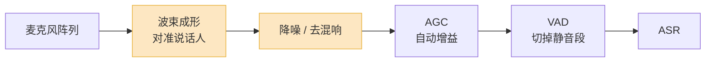

你试用一个 ASR 模型,拿手机对着它念一段稿子,转写结果几乎一字不差,你心里想:这事成了。

然后你把它接进真实业务。客户在马路边打来电话,背景是车流声;他说到你公司的产品名,转写出来是三个完全不相干的字;他报了一串订单号"一三幺零",屏幕上是"一三妖灵"。Demo 里的惊艳,到这里一点都不剩。

问题不在模型菜。开源的 Whisper、各家的流式 ASR,**安静环境下的中文字错率早就压到了 3% 以下**,这已经接近人工转写的水平。坑全在"安静环境、念稿子"这八个字之外——真实的语音是脏的,而工程的活,就是处理这些脏东西。这篇把落地之后才会碰到的坑,一个一个拆开。

## 第一个岔路口:流式还是非流式

这是接 ASR 之前必须想清楚的第一件事,选错了后面全是返工。

**非流式(批量)**:把一整段音频丢进去,等它整段识别完,返回结果。**流式**:音频一边录一边送,模型一边听一边吐字,你能拿到不断更新的"中间结果"。

差别不只是"快一点慢一点"。它们是两类不同的产品形态:

| 维度 | 流式 ASR | 非流式 ASR |
|---|---|---|
| 典型延迟 | 首字 200–300ms,说完即出 | 等说完后再算,3 秒话约多等 0.5–2 秒 |
| 准确率 | 略低(只能看到左边的上下文) | 略高(能看到整句,甚至整段) |
| 成本 | 贵(常见 $0.016/分钟级别) | 便宜(常见 $0.008/分钟级别) |
| 适用 | 语音 Agent、实时字幕、点单 | 会议录音转写、客服质检、播客字幕 |

记住一个核心事实:**流式之所以准确率低,是因为它在"说完之前"就得交答案**。它做"我想订一张去——"的转写时,根本不知道后面是"北京"还是"报告"。非流式没这个包袱,它能等整句听完再回头修正,所以同样的模型,非流式版本的字错率往往低一两个百分点。

这里有个 2026 年很常见、但容易踩反的折中:**用 VAD 把长音频切成"准句子",每段当成一个 mini-batch 走非流式模型**。这套做法在"实时字幕"这种场景里很香——它不需要逐字滚动,用户能接受"一句一句往外蹦",于是你既拿到了非流式的准确率,延迟又只是一句话的长度。但如果你做的是语音 Agent,用户在等 AI 回话,那这套就不行——你必须真流式,让 ASR 和用户说话并行跑,说完文字基本也就好了。

**别被"我两个都要"骗了。** 一个产品里通常只有一条主链路。先确定用户是不是在"等",再选。

## 专有名词、中英混读、数字:错得最离谱的三类

通用 ASR 在通用语料上训练,所以它对"通用的话"很强,对"你的话"很弱。落地后用户投诉最集中的,永远是这三类。

**专有名词。** 你公司叫"声析",模型从没见过这两个字的组合,它会按发音找一个最像的常见词——"声息""生气""省吃"。这不是模型蠢,是它在做概率上最合理的猜测。人名、产品名、内部黑话、行业术语,全是重灾区。

**中英混读。** 中文工程师说话天然混英文:"这个 bug 我提了个 PR""把 latency 压下来"。问题是很多 ASR 在"语种判定"上是僵的——它先猜你这句是中文还是英文,再用对应的解码路径。猜错了,"PR"变成"批 R","latency"变成一串看不懂的拼音。2026 年好一些的方案(比如 Gladia、Deepgram Nova-3)做了**句内 code-switching**,语种切换不需要整句重判;但便宜的、老的模型,中英混读仍然是硬伤。

**数字。** 这是最隐蔽的坑。"一千二百三十四"应该写成 `1234` 还是"一千二百三十四"?电话号码、订单号、金额、日期,各有各的格式。这件事叫**逆文本规整(ITN,Inverse Text Normalization)**——把"口语形式"转成"书面形式"。ITN 做得糙,用户就会看到"我要订 2026 年 4 月 25 号"被写成"二零二六年四月二十五号",或者反过来把门牌号"幺零幺"写成"101"——而它其实是房间名。

这三类问题的通用解药是**热词 / 定制词表**,下一节单讲。但要先有个心理预期:**通用 ASR 在你的垂直场景里,开箱就是会错,而且错得很集中。** 上线前必须拿你自己的真实音频跑一遍,把高频错词捞出来。

## 噪声和远场:训练集里没有的世界

录音棚的音频干净到不真实。真实音频里有空调声、键盘声、车流、回声、别人说话。

这里要分清两个不同的问题:

- **噪声(near-field + noise)**:用户离麦克风很近,但环境吵。手机贴着脸打电话属于这类。现代 ASR 对平稳噪声(空调、风扇)已经相当稳,因为训练数据里加了大量噪声增强。难的是**非平稳噪声**——突然的关门声、背景音乐、旁边一句人声。
- **远场(far-field)**:用户离麦克风一两米,信号本身就弱,还叠加了房间混响。智能音箱、会议室麦克风阵列属于这类。远场的难点不是"吵",是"糊"——混响把语音的时间结构抹掉了。

工程上,**别指望单靠 ASR 模型扛下这些**。真正有效的是前面那一段链路:

橙色的两块——波束成形和降噪去混响——是远场场景里 ASR 准确率的真正杠杆。一个被忽略的细节是 **VAD 的位置**:它把长段静音和纯噪声段切掉,不送进 ASR。这既省钱,又能防止 ASR 在没人说话时"幻听"出几个字来。Whisper 这类模型在长静音上幻听是出了名的,VAD 是最便宜的止损。

还有一个反直觉的点:**降噪不是越狠越好**。激进的降噪会把语音本身的高频细节也削掉,ASR 反而更难听清。降噪是为人耳服务还是为 ASR 服务,目标不一样,参数也不该一样。

## 标点、顺滑、热词:让转写"能用"的后处理

原始的 ASR 输出是一长串没有标点、保留了所有口水词的文字流。它"对",但不"能用"。中间隔着三层后处理。

**标点恢复。** 给文字流加上逗号句号问号。没有标点的转写,人读着累,喂给下游 LLM 也容易断句错误。

**顺滑(disfluency removal)。** 真实口语里全是"嗯""那个""就是说",还有"我要去北——啊不是,去南京"这种自我修正。顺滑就是把这些口水词和修正痕迹删掉,留下干净的意思。这件事在"会议纪要""客服质检"里是刚需——没人想看逐字的"嗯嗯啊啊"。但在另一些场景里**你恰恰不能顺滑**:比如做语言学研究、或者要分析用户的犹豫和情绪,口水词本身就是信号。所以顺滑要做成**可开关的**,别在管道里写死。

2026 年的趋势是把标点、ITN、大小写、顺滑这四件事**用一个统一的标注模型一次做完**,而不是串四个独立模块——后者每一层的误差会往下传。

**热词 / 定制词表**,这是对付上一节那三类错误最直接的手段。原理是在解码时,对词表里的词做**上下文偏置(contextual biasing)**——让模型在"声息"和"声析"之间犹豫时,因为"声析"在你的热词表里,而把概率掰向它。

热词不是免费的,有几个坑:

1. **热词表不能无限长。** 表越大,偏置越稀,而且容易"过纠"——把本来对的常见词改成热词。几百到几千个词是合理区间,上万个就要换成"按场景动态注入"的检索式方案。
2. **热词要给对发音。** "GPU"这个词,用户可能念"G-P-U",也可能念"鸡皮优"。热词只配字面,模型对不上音,偏置就不生效。
3. **热词救不了"完全没听清"。** 它只在模型已经有几个候选、正在犹豫时起作用。如果信号烂到模型根本没把你的词列进候选,热词无能为力——那是降噪和远场该解决的问题。

## 多人说话:转写之外的另一道题

一对一的语音 Agent 不用操心这个。但只要场景里有两个以上的人——会议、多人客服、访谈——你就多了一道题:**说话人分离(speaker diarization)**,也就是"谁在什么时候说了什么"。

这是和 ASR 正交的另一个能力。ASR 回答"说了什么",diarization 回答"是谁说的"。两件事各自都不简单,叠在一起更难,难点集中在:

- **重叠语音**:两个人同时开口。这是 diarization 错得最多的地方,人耳都未必分得清。
- **说话人数未知**:你事先不知道这场会有几个人,模型得自己估。
- **音色相近**:两个声线接近的人,容易被归成同一个。

2026 年一个值得关注的变化是**联合建模**:微软 1 月开源的 VibeVoice-ASR 把转写、说话人分离、时间戳放在一次前向里一起做,一遍处理 60 分钟音频。这条路线的好处是各个子任务能互相借力——知道"说话人换了",有助于判断句子边界;反过来也成立。如果你的场景重度依赖 diarization,这类联合模型比"ASR + 一个独立的 diarization 模块"串起来要省心。

但提醒一句:**diarization 的错误会污染下游**。如果你拿带说话人标签的转写去做"客服话术分析",标签错了,整份分析的归因就错了。先评估你的场景对说话人准确率的真实要求,再决定要不要上。

## WER 会骗你:关于评测的真话

聊到这里必须说说那个所有人都在用、但被严重高估的指标——**WER(词错误率)**。

WER 的算法是:把识别结果和标准答案对齐,数出替换、删除、插入三类错误,除以总词数。听起来很客观。但它有几个会让你做错决策的毛病:

**第一,WER 把所有错误当成一样重。** "我要订机票"识别成"我要定机票",和识别成"我不要订机票",WER 给的惩罚可能差不多。但对你的业务,一个无所谓,一个是事故。**关键信息(数字、人名、否定词、专有名词)错一个,比十个虚词错都严重。**

**第二,中文用 WER 本身就不对。** 中文没有天然的词边界,"语音识别"算一个词还是两个词,取决于分词器。分词器一换,WER 就变。所以中文场景应该看 **CER(字错误率)**——按字算,跨分词器稳定。中英混读场景再进一步,业界用 **MER(混合错误率)**:中文按字、英文按词。你要是还在拿 WER 横向比中文 ASR,比出来的排名是不可信的。

**第三,WER 对"语义等价"零容忍。** "2026 年"和"二零二六年"、"OK"和"okay",意思完全一样,WER 照样判错。一个 ITN 风格不同的模型,WER 会无端偏高。

那该怎么评测自己场景的 ASR?给一份可以照着做的清单:

1. **用你自己的真实音频建测试集**,别用模型方给的 benchmark。至少几百条,覆盖你真实的口音、噪声、设备、语速分布。这一步最花时间,也最值钱。
2. **中文看 CER,中英混读看 MER**,不要用 WER。
3. **单独算"关键实体错误率"**:把数字、人名、产品名、否定词单拎出来统计准确率。这个数字比总体 CER 更能预测线上投诉量。
4. **分桶看,别只看一个平均数**。按噪声等级、按远近场、按是否中英混读分别算 CER。平均数会把"安静场景拉高、嘈杂场景拖垮"这种结构性问题藏起来。
5. **测延迟,而且测的是首字延迟和稳定时间**,不是整段耗时。流式 ASR 的中间结果会反复跳变,你要测的是"结果多久不再变"。
6. **做人工抽检**。CER 降了 0.5%,但如果新错的全是关键词,体验是变差的。指标之外,定期让人看一眼真实转写。

## 最后:把顺序理对

如果你正要把 ASR 落地,优化的优先级应该是这样:

**先选对流式 / 非流式。** 这是产品形态决策,选错了后面全白干。判断标准只有一个——用户是不是在等。

**再用真实音频建评测集。** 没有这个,你后面所有的"优化"都是在拍脑袋。它还会直接告诉你高频错词是哪些。

**然后配热词、调 ITN、补降噪。** 针对评测集暴露的具体问题对症下药——错词集中就上热词,数字老错就调 ITN,嘈杂场景拖后腿就补前端降噪。

**最后才考虑换模型或微调。** 这是最贵、最慢的一步,而且很多时候,前面三步做扎实了,根本轮不到这一步。

ASR 落地真正难的,从来不是模型本身——模型早就够好了。难的是真实世界的语音很脏,而你的业务对"哪种错误不可接受"有自己的定义。把脏数据处理干净,把评测对齐到你的业务,模型才能真正帮上忙。

---

参考与延伸阅读:

- [How to Evaluate ASR in 2026: Accuracy, Latency and Cost — Smallest.ai](https://smallest.ai/blog/how-to-evaluate-asr-in-2026)
- [Best Speech-to-Text APIs in 2026 — Gladia](https://www.gladia.io/blog/best-speech-to-text-apis)
- [AssemblyAI vs Deepgram: Best Voice Agent API](https://www.assemblyai.com/blog/assemblyai-vs-deepgram-best-voice-agent-api)
- [microsoft/VibeVoice-ASR — Hugging Face](https://huggingface.co/microsoft/VibeVoice-ASR)
- [Contextual Biasing for LLM-Based ASR with Hotword Retrieval and Reinforcement Learning](https://arxiv.org/pdf/2512.21828)
- [Advocating Character Error Rate for Multilingual ASR Evaluation](https://www.researchgate.net/publication/384811643_Advocating_Character_Error_Rate_for_Multilingual_ASR_Evaluation)
- [Four-in-One: A Joint Approach to ITN, Punctuation, Capitalization, and Disfluency](https://arxiv.org/pdf/2210.15063)
