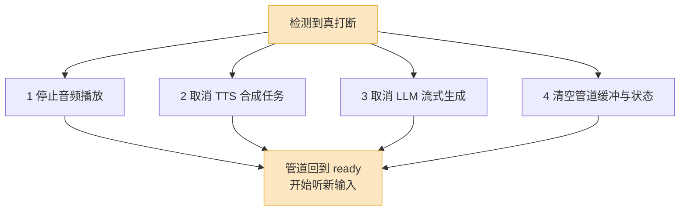

约五分之一的语音通话里,用户会在 AI 还没说完时开口插话。

这个数字来自 PolyAI 对生产环境通话的统计,我自己看线上日志,感受也差不多。更值得注意的是后半句:**会打断的用户,往往是意图最强的那批人。** 他们听够了想直接说事,或者发现 AI 理解错了要赶紧纠正。换句话说,打断处理得烂的那一小撮通话,直接决定了你整个产品体验的天花板——因为最在乎、最着急的用户,恰好都撞在这里。

所以"能被打断"不是锦上添花的功能。它和延迟一样,是语音 Agent 的及格线。但和延迟不同,打断的难点不在毫秒,在于它是一个**并发控制问题**:一个事件要同时掐断好几条正在跑的流,还不能掐错。

## 为什么打断比想象中难

很多人第一次做打断,以为就是"检测到用户说话,调一下 `audioPlayer.stop()`"。上线一周就会发现到处是坑。

难在三个地方。

第一,**打断是个分布式的取消操作**。用户开口的那一刻,你的系统里可能同时有:扬声器在播第 3 句的音频、TTS 服务还在合成第 5 句、LLM 还在流式生成第 8 句的 token。这三样东西跑在不同进程甚至不同机器上。你要在几十毫秒内把它们**一起**叫停,任何一个漏网,AI 就会出现"我已经打断它了,它怎么还在自说自话"的灵异现象。

第二,**判断"这算不算打断"本身就难**。背景里有人说话、电视开着、用户自己"嗯""对啊"地随口附和——这些都会让一个朴素的 VAD 兴奋地触发打断。误打断比"打断慢了"更伤体验:AI 说到一半被一声咳嗽打断,僵在那里,用户一脸问号。

第三,**打断之后,对话状态是脏的**。AI 那句话只说了一半就被掐了,LLM 的上下文里到底该记成"我说了整句"还是"我只说了半句"?记错了,下一轮 AI 要么重复已经说过的内容,要么基于"它以为自己说了但其实没说出口"的信息往下接。

这三件事,后面一件件拆。

## 怎么知道用户在打断

打断检测的第一关,是 VAD(语音活动检测)。它干一件很窄的事:判断这一小段音频里**有没有人声**。现代 VAD(比如 Silero)能在几十毫秒内给出"有声/无声"的概率,这一层基本算解决了。

但 VAD 只够回答"有没有声音",回答不了"这声音算不算一次真正的打断"。2026 年成熟的做法,是在 VAD 上面叠一层判断,通常叫**语义化的轮次检测**。

这里要分清两个相关但不同的问题:

- **端点检测(turn detection)**:用户这一轮说完了没?——决定 AI 什么时候开口。
- **打断检测(barge-in)**:AI 正在说话时,用户这声插话,要不要让 AI 闭嘴?——决定 AI 什么时候停下。

它们共用 VAD 这个底座,但上层逻辑不一样。打断检测要额外回答的问题是:这声音是"我要说话了你停下",还是"嗯哼,我在听"。

主流框架的处理方式,可以摆在一起看:

| 方案 | 核心信号 | 特点 |
|---|---|---|
| 朴素 VAD | 音频能量 / 人声概率 | 最快,但把附和、噪音全当打断 |
| 转写流启发式 | VAD + ASR 部分转写文本 | 看用户说出的字是不是"有内容" |
| 模型化打断判定 | 专门小模型读音频+文本 | 区分真打断 / 附和 / 噪音,准但有计算开销 |

LiveKit 在 2026 年走的是模型路线:它的**自适应打断**(adaptive interruption)用真实对话音频训练了一个小模型,AI 说话期间检测到人声,不会无脑停,而是让模型先判断"这次该不该让出话权"。Pipecat 的 Smart Turn、Deepgram 的 Flux、VideoSDK 开源的 Namo,思路都类似——**从"听到声音就停"升级到"听懂这是不是打断再停"。**

这里有个工程上的取舍:模型判定更准,但它要攒一点点音频和文本才能下判断,这等于给打断响应**加了几十到一两百毫秒延迟**。我的建议是分场景:电话客服这种噪音大、附和多的场景,这点延迟换来的误打断下降很值;而安静环境下的高质量耳麦场景,朴素 VAD 配一个合理阈值往往就够,没必要上重型模型。

说话人识别(speaker diarization)是另一条值得加的信号,尤其当 AI 走的是外放、而不是用户戴耳机的时候。带说话人意识的 VAD 只对"主说话人"的声音触发打断,旁边同事路过聊两句,AI 不会被带跑。代价是要先有一小段主说话人的注册音频,冷启动那几秒会暂时退化成普通 VAD。

## 打断要原子地做四件事

检测到了真打断,接下来是这篇文章最该记住的一句话:**打断不是"停 TTS",是四件事必须一起做。**

逐件说。

**第一件,停止音频播放。** 最直觉的一步,但有个细节:别只停"还没送到扬声器的",还要清掉**已经在播放缓冲区里排队**的音频。很多框架的播放器有几百毫秒的 jitter buffer,你不主动 flush 它,用户已经开口了,AI 还会从缓冲里"漏"出半秒声音。

**第二件,取消还在合成的 TTS 任务。** AI 嘴上播到第 3 句,TTS 服务很可能已经把第 4、第 5 句合成好或正在合成。这些任务必须立刻 cancel,否则它们合成完的音频会涌进刚清空的播放缓冲,等于打断没生效。流式 TTS 一定要支持中途 abort,选型时这是硬指标。

**第三件,取消还在生成的 LLM 请求。** 这一件最容易漏,因为 LLM 在后台跑,你"看不见"它。但 AI 说到第 3 句时,LLM 大概率已经流式吐到第 8 句了。不取消,它会一直把 token 生成完——既烧钱,又让这个"已经作废"的回答占着你的会话状态。在 OpenAI、Anthropic 这些流式 API 上,正确做法是 abort 掉那个 HTTP 流;自己部署的推理服务,要确保 cancel 信号能真正中止那一次 forward,而不是只在客户端假装断开。

**第四件,清空整条管道的缓冲和状态。** ASR 的部分转写、各级队列、状态机的 flag——全部归零,管道干净地回到"准备听新输入"的状态。

为什么强调"原子"?因为这四件事任何一件慢了或漏了,用户都会立刻察觉。漏了第二件,AI 停顿一下又冒出一句。漏了第三件,你这轮白烧 token,而且下一轮上下文是乱的。理想情况下,这四个取消应该由**同一个打断事件**并发触发、并发完成,而不是串行地"停完播放再去停 TTS 再去停 LLM"——串行会把延迟一段段叠起来。

实操里我会让打断走一个独立的高优先级事件通道,绕开正常的数据流水线,确保它能"插队"执行。否则打断信号自己排在拥堵的管道后面,就荒诞了。

## 误打断:别让噪音掐了 AI 的话

把打断做得太灵敏,会走到另一个极端:AI 老是被无关声音掐断。这就是误打断,前面说过,它比"打断慢"更毁体验。

误打断的来源,基本就这几类,得分开治:

**第一类,AI 自己的声音绕回来了。** 这是最隐蔽、也最致命的一类。AI 外放的声音被用户的麦克风重新收进去,VAD 一看"有人声",触发打断——AI 等于被自己说的话打断了,然后陷入"说一句停一句"的死循环。

治它的唯一正解是**回声消除(AEC)**。AEC 知道 AI 正在播什么音频(参考信号),就能从麦克风收到的信号里把这部分减掉,让 VAD 只看到"真正的用户语音"。所以 AEC 不是打断的可选配件,是**前提**。我见过的经验法则是:在调 VAD 阈值、最小语音时长这些参数之前,先确认 AEC 真的把回声压下去了——有团队报告上了带 AEC 的全双工处理后,误打断直接降了三成。次序不能反:回声没压住就调阈值,你只是在和一个会变化的噪声源拉锯。

值得提醒的是:浏览器里 WebRTC 自带 AEC,效果通常够用;但走电话线路(SIP/PSTN)、或者用了某些音频中转,AEC 可能不在你以为的地方,得自己确认链路上到底哪一环在做。

**第二类,背景里有别人说话或电视声。** 这一类靠前面说的说话人识别来挡——只认主说话人。挡不住的部分(比如背景人声和主说话人音色接近),就交给模型化的打断判定去兜。

**第三类,附和音(backchannel)。** 用户的"嗯""对""哦"——这些不是要抢话,是在表示"我在听,你继续"。朴素 VAD 完全分不出附和和打断,模型化判定才能。把附和单独识别出来、不触发打断,是这两年体验提升很明显的一块:AI 不会因为你一声"嗯哼"就慌张地停下来反问"您说?"。

调参上有个心智模型:打断检测内部其实有个"置信度"。置信度高(用户说了一串有内容的话)就立即让出话权;置信度低(短促的、像附和的声音)就先压一压、继续观察。把这个判断交给阈值或小模型,而不是"一刀切地一听到声就停",是朴素方案和生产级方案的分水岭。

## 打断之后,上下文怎么接

打断动作做干净了,还剩最后一个、也最容易被忽略的问题:**被打断的那句话,在 LLM 的对话历史里该怎么记。**

设想:AI 准备说的完整回答是"您的订单已经发货了,预计明天下午送达,快递单号是 SF1234567890"。它嘴上播到"您的订单已经发货了,预计明天——"被用户打断了。

现在 LLM 上下文里这条 assistant 消息,该写什么?

- **写完整回答**:LLM 以为"送达时间和单号我都说过了"。下一轮用户问"单号多少",AI 可能答"我刚才说过了呀"——可它**根本没说出口**。
- **写空 / 整条丢掉**:LLM 以为这轮自己什么都没说。下一轮可能从头再说一遍"您的订单已经发货了……",用户已经听过一遍前半句,体验割裂。

正确答案是第三个:**把上下文截断到用户实际听到的位置。** 这条 assistant 消息应该记成"您的订单已经发货了,预计明天——",后面没说出口的部分不进上下文。这样 LLM 的"记忆"和用户的"耳朵"才对得齐,它才知道单号还没讲、送达时间也没讲完。

这件事说起来简单,做起来有个硬骨头:**你得知道用户到底听到了哪个字。** TTS 是流式播放的,被打断时,真正可靠的位置不是"LLM 生成到哪",也不是"TTS 合成到哪",而是**音频实际播放到了哪一刻**。理想情况下,TTS 要能给出词级或音素级的时间戳,你拿打断发生的时间戳去对齐,才能精确切到"用户听到的最后一个字"。退一步,按句子边界粗切也比"全记/全不记"强得多。

这不是纸上谈兵。Pipecat 社区里有个被讨论很多的 issue(#2791)就是这个:打断后,已经说出口的半句话没有被写回 LLM 上下文,导致下一轮 LLM 把整个回答重新生成一遍。这说明截断对齐这件事,框架默认不一定帮你做对,得自己确认。

接住之后还有个加分项:把用户的打断**当成信号去理解**,而不只是"换我说了"。用户在 AI 报送达时间时插话,大概率是对前面的信息不满意或要追加条件。一个聪明的 Agent 会把"用户在我说到 X 时打断"这件事本身喂给 LLM,让它意识到 X 可能正是用户要纠正的点。这一步做不做,区别就是"能被打断的机器"和"听得懂你为什么打断的对话者"。

## 一个落地的优先级

如果你正在给语音 Agent 加打断,我会建议这个顺序:

1. **先保证四件事原子地做对**——停播放、取消 TTS、取消 LLM、清状态,一个都不能漏。这是正确性,漏了就是 bug,不是体验问题。
2. **再把 AEC 压实**——回声不消干净,后面所有的误打断调参都是徒劳。
3. **然后上语义/模型化的打断判定**——把附和、噪音、真打断分开,这一步直接决定"它像不像个会聊天的人"。
4. **最后做上下文截断对齐**——让 LLM 的记忆和用户的耳朵对齐,打断后的对话才接得顺。

很多团队卡在第三步,觉得"打断不够智能",于是拼命换模型、调阈值。但常见的真相是第一步就漏了——LLM 请求压根没被取消,或者第二步 AEC 根本没生效。打断这事,**先把正确性焊死,再谈智能。** 顺序反了,你会在一个有裂缝的地基上反复刷漆。
