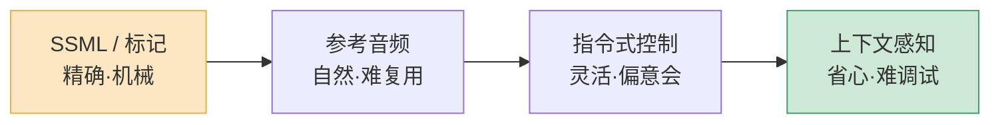
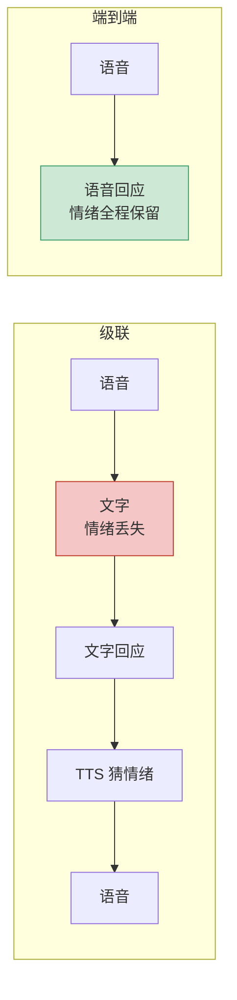

把同一句话放给两套 TTS 念:"你说得对,这个我之前还真没想到。"

两套都咬字清楚、没有杂音、采样率拉满。但其中一套你一听就知道是机器——不是因为它念错了,恰恰是因为它念得太"齐"了。每个字的时长几乎一样,每个停顿都卡在标点上,整句话像被一把尺子量过。

人不是这么说话的。人说"还真没想到"的时候,"真"会拖长一点,"没"会轻一点,"想到"前面会有个几乎听不见的迟疑。这些东西加起来,就是**韵律(prosody)**。发音准是 2020 年就解决的问题;韵律和情绪,才是 2026 年还在啃的硬骨头。

这篇讲清楚:念稿感到底差在哪儿,以及现在有哪几条路去补。

## 念稿感不是发音问题,是韵律问题

先把概念拆开。一段语音里,"说了什么"是文本内容,"怎么说的"是韵律。韵律不是一个东西,是四样东西叠在一起:

- **节奏(timing)**——每个音、每个词占多长时间,语速是匀的还是有快有慢。
- **停顿(pause)**——停在哪里,停多久。停顿不只在逗号句号,也在一个意群说完、或者你要强调下一个词之前。
- **重音(stress)**——哪个词被加重了。"**我**没说过"和"我没**说**过",意思完全不同。
- **语调(intonation)**——句子的音高曲线。陈述句往下走,疑问句往上挑,反问句又是另一条线。

念稿感的根源,是早期 TTS 把这四样都做成了"默认值":语速恒定、停顿只认标点、不分轻重、语调按句型套模板。结果就是每句话都念得四平八稳,像新闻联播里的提示音。

更麻烦的是,韵律和情绪是**强耦合**的。同样一句"你来啦",高兴时音高整体偏高、句尾上扬;敷衍时又平又短;惊讶时第一个字猛地拔高再回落。情绪不是在准确的发音上再"刷一层颜色",情绪本身就是通过韵律表达出来的。所以"TTS 加情感"这件事,本质上是"让 TTS 学会控制韵律"。

学术界很早就指出了拦路的三个问题:**标签依赖**(模型只会照训练时见过的"高兴/悲伤"几个标签走)、**风格纠缠**(想让它变开心,音色也跟着变了)、**控制粒度太粗**(只能整句一个情绪,改不了某个词)。这三条到现在也没完全解决,只是被绕过的方式越来越多。

## 控制韵律的四条路

2026 年要给语音"调情绪",大致有四种手段,从"最可控"到"最自然"排开,正好是个谱系。

**第一条:SSML 和标记。** 这是最老、也最确定的办法。你用标记语言显式地告诉引擎:这里停 300 毫秒、这个词音高升 10%、这段语速放慢。SSML 至今仍是工业界控制语音合成的事实标准,因为它**可复现**——同样的标记,出来的语音每次都一样。它的代价也明显:你得手动标,标多了维护成本极高,而且本质上是在用规则逼近一个连续的东西,生硬的接缝藏不住。新一代模型在 SSML 之外加了实验性的情绪标签,比如在句首写 `[surprised]`,让整句带上惊讶的底色——比纯 SSML 省事,但仍然是离散的、一句一个。

**第二条:参考音频。** 不告诉模型"要开心",而是直接丢给它一段开心的录音,让它"照着这个感觉说"。Qwen3-TTS 这类模型 3 秒参考音频就能克隆音色和说话风格,Fish Audio S2 用 10 秒参考做跨语种迁移。这条路的好处是自然——韵律是从真人录音里"抄"来的,不是算出来的。坏处是难复用:你想要一个"略带歉意但又不卑微"的语气,得真去找到或录一段这样的音频,而且参考音频里的情绪和音色经常分不干净。

**第三条:指令式控制。** 用自然语言描述你要的效果:"用安慰的语气,慢一点,句尾别上扬。"这是 LLM 时代才成立的玩法。它灵活到几乎没有边界,你能描述出任何细微的语气。但它也最"意会"——同一句指令,不同模型、甚至同一模型不同时候,理解都可能有偏差。它适合创作和探索,不适合需要每次结果一致的生产链路。

**第四条:上下文感知。** 前三条都是"你来告诉模型怎么说",这条是"模型自己看着办"。模型读完整段对话历史,自己判断这句该用什么韵律——上一句用户在抱怨,这句回应就自然带上安抚;聊到一半用户开了个玩笑,这句就轻快一点。它把每句话当成对话的一部分,而不是一段孤立的朗读。这是长对话语音最舒服的形态,代价是你几乎放弃了控制权:它念错了情绪,你很难定位是哪一步出的问题。

四条路不是互斥的。现实里常常是混着用:**主体走上下文感知或参考音频拿到自然度,关键节点用 SSML 或情绪标签做精确兜底。** 纯靠某一条都会有明显的短板。

| 手段 | 可控性 | 自然度 | 可复现 | 适合场景 |
|---|---|---|---|---|
| SSML / 标记 | 高 | 低 | 高 | 播报、导航、固定话术 |
| 参考音频 | 中 | 高 | 中 | 有声书、特定角色配音 |
| 指令式控制 | 中 | 中高 | 低 | 创作工具、原型探索 |
| 上下文感知 | 低 | 高 | 低 | 对话 Agent、长篇陪伴 |

## 端到端模型为什么天生更会"演"

级联式 TTS——文本进、语音出——有个绕不过的结构问题:**情绪信息在文本里就丢了。**

用户说了一句带着委屈的话,ASR 把它转成文字,委屈没了;LLM 生成一句回应文本,这段文字本身不携带"该用什么语气念"的信息;TTS 再从这段干巴巴的文字里凭空"猜"情绪。整条链路上,情绪经过了一次"压成文字、再还原成声音"的有损转换。你可以用前面那四条手段把情绪再"贴"回去,但贴回去的,终究是你猜的,不是原本就在那儿的。

端到端语音模型(speech-to-speech)走的是另一条路:语音直接进、语音直接出,中间不落文字。用户语气里的委屈,模型直接"听"到了,生成回应时也直接带着合适的语气出来。情绪从来没被压成文字,自然也就没丢。

这就是端到端在情绪和韵律上的天然优势——不是它的模型更聪明,是它的**信息通路上没有那道有损的瓶颈**。一句话里"说了什么"和"怎么说的"始终捆在一起走。

代价也得说清楚:端到端难调试、难审计、难合规。它没有中间的文字可以打日志、做敏感词过滤、给客服质检看。所以电话客服这种强管控场景,2026 年的默认仍然是级联;但陪伴、互动、娱乐类的产品,端到端那种"接得住情绪"的体感,是级联怎么调都很难追上的。

## 对话里的韵律:笑声、犹豫和那些"嗯"

前面讲的还是"把一句话念好"。但真实对话里,韵律的战场不只在句子内部,更在句子之间和词语之外。

人在对话里会发出大量**非词汇的声音**:笑、轻笑、叹气、清嗓子、吸气,还有"嗯""啊""这个""那个"这类填充词。学术上把它们分成几类——生理性的(呼吸、咳嗽)、情绪爆发性的(笑声、叹息),还有**对话管理性的**(填充停顿、应答词)。最后这类最关键:它们不传递字面信息,但传递"我在听""我在想""我有点犹豫"。

为什么这些对"不像念稿"特别重要?因为念稿的人不会有这些。念稿是单向输出,对话是双向协调。一段语音里如果完全没有犹豫、没有应答词、没有一丝换气的痕迹,它再准也是在"播报",不是在"对话"。

现在面向对话的模型已经开始原生支持这些。Chatterbox-Turbo 内置了 `[laugh]`、`[cough]`、`[chuckle]` 这类标签;Nari Labs 的 Dia 能直接从剧本生成带笑声、叹息的多人对话。研究侧也出现了专门的非词汇发声基准(NVBench、NV-Bench),开始系统地评测模型这方面的能力。

但工程上有个真问题:**这些声音不能硬塞。** 一段回应里"哈哈"加在哪、犹豫的"嗯"放哪,本身就需要韵律和语义的判断。"嗯"放在思考一个难问题之前是自然的,放在回答"今天星期几"之前就很怪。笑声接在一个并不好笑的句子后面,比没有笑声更出戏。理想情况下,这些应该是上下文感知模型自己学出来的分布,而不是靠规则往里撒。

我的判断:对话语音的"像不像人",非词汇的部分占的权重,被严重低估了。很多团队把全部精力花在"把字念得更准更自然",但用户感觉别扭,常常是因为整段话**太流畅、太干净了**——干净得不像一个真人在即兴说话。

## 别演过头:过度表演的反效果

最后一条,也是最容易踩的:情绪不是越多越好。

当一套 TTS 终于能"演"了,很多人的第一反应是把它用满——每句话都加情绪标签,高兴就拉满高兴,惊讶就拉满惊讶。结果是另一种不像人:**像一个用力过猛的配音演员,或者一个营业感很重的客服。**

真人对话里,大部分句子的情绪其实是**接近中性**的,只是带着一点不易察觉的底色。情绪的高峰是稀疏的、有铺垫的——你不会每句话都惊讶,惊讶之所以是惊讶,是因为前面十句都平。如果每句都拔高,惊讶就不再是惊讶,只是噪音。

业界已经形成共识:情绪标记的正确用法是**克制、刻意,只在对话真正需要的那个点上用**。多轮里满屏标记,听感是戏剧化的、假的。这跟写文章一个道理——感叹号用一个有力量,每句都用就废了。

还有个更隐蔽的坑:**情绪要和内容对得上。** 模型用欢快的语气念一句报错信息,用户感受到的不是"这个 AI 很有活力",是"这个 AI 没听懂我在说什么"。情绪一旦和语义错位,比完全平淡的念稿更糟——平淡只是无聊,错位是诡异。

所以"让 AI 不像念稿"这件事,真正的目标不是"让它充满感情",而是**让它的情绪和韵律,恰好匹配它在说的内容和它所处的对话**。多数时候,这意味着克制;少数关键时刻,才需要那一下到位的起伏。

## 怎么落地:一个务实的顺序

如果你在做语音产品,想摆脱念稿感,建议的优先级是:

1. **先解决韵律的基本盘**——节奏有变化、停顿不只卡标点、意群之间能换气。这一步不需要"情绪",做好了念稿感就去掉一大半。
2. **再决定走级联还是端到端**——对话类、容忍度高的产品,认真考虑端到端,它在情绪上的优势是结构性的,不是调参能补的。
3. **情绪控制混着用,别迷信单一手段**——主体拿自然度,关键节点拿可控性。
4. **对话场景补上非词汇的声音**——但让它自然分布,别用规则硬撒。
5. **始终把"克制"放在心里**——情绪的默认值应该接近中性,高峰留给真正需要的时刻。

发音准早就不是门槛了。2026 年区分一套语音"像人"还是"像机器"的,是它会不会在该停的地方停、该轻的地方轻、该犹豫的时候犹豫——以及更难的:它知不知道**什么时候该不动声色**。

---

**参考资料**

- [The Best Open-Source Text-to-Speech Models in 2026 — BentoML](https://www.bentoml.com/blog/exploring-the-world-of-open-source-text-to-speech-models)
- [Qwen3-TTS:2026 开源语音克隆与生成完整指南](https://dev.to/czmilo/qwen3-tts-the-complete-2026-guide-to-open-source-voice-cloning-and-ai-speech-generation-1in6)
- [Best Voice Cloning API for Developers (2026) — Inworld](https://inworld.ai/resources/best-voice-cloning-api)
- [Best TTS for Long-Form Conversations (2026) — Inworld](https://inworld.ai/resources/best-tts-long-form-conversations)
- [PROEMO: Prompt-Driven Text-to-Speech Synthesis Based on Emotion and Intensity Control](https://arxiv.org/html/2501.06276v1)
- [NVBench: A Benchmark for Speech Synthesis with Non-Verbal Vocalizations](https://arxiv.org/html/2604.16211v2)
- [SSML: The Practical Standard for Controlling Speech Synthesis](https://medium.com/@brijeshrn/ssml-the-practical-standard-for-controlling-speech-synthesis-c52940314ffa)
