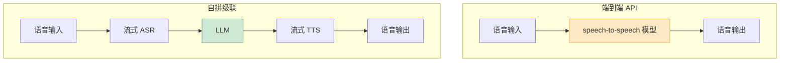

先说一个反直觉的事实:2026 年了,真正跑在生产环境、扛着电话客服流量的语音 Agent,大多数**还不是**端到端语音 API 做的。

端到端听起来无可挑剔——语音直接进、语音直接出,中间不落文字,延迟低、情感保留好。OpenAI 的 gpt-realtime、Google 的 Gemini Live、豆包的端到端实时语音大模型,demo 都惊艳。但真把它塞进一个要上线的产品里,你会在第二周撞上几堵墙:它说错话你没法在中间拦一道、合规团队要审通话记录而你只有一段音频、客户要换个特定音色而 API 只给你 8 个预设。

所以选型这件事,不能只看 demo 的"哇"。这篇把实时语音 API 的关键维度摊开,再把 OpenAI、Gemini 和国内几家的真实定位讲清楚,最后按场景给建议。

## 先把"关键维度"对齐

挑实时语音 API,大家张口就是"延迟低不低"。延迟当然重要,但它只是八个维度里的一个。我把这八个维度列出来,你拿任何一个 API 去套都不会漏:

| 维度 | 它在问什么 | 容易被忽略的点 |
|---|---|---|
| 延迟 | 用户说完到 AI 出声多久 | 看的是首包,不是整句生成完 |
| 打断 | 能不能被插话、插得干不干净 | 误打断(噪音触发)比慢更恼人 |
| 音色 | 有多少声音、能不能定制/克隆 | 预设音色撑不起品牌化产品 |
| 语言 | 支持哪些语种、能否中途混说 | 方言、中英混说是国内刚需 |
| 价格 | 每分钟多少钱、缓存能省多少 | 端到端按音频 token 计费,贵 |
| 是否端到端 | 一个模型还是 ASR+LLM+TTS | 决定了下面两项 |
| 可控性 | 能不能拦、能不能调试、能不能换 | 端到端是黑盒,这点最痛 |
| 合规 | 有没有文字记录可审计、数据落哪 | 金融/政务直接卡死非合规方案 |

后面三项——是否端到端、可控性、合规——是连在一起的一条逻辑链,也是真正决定选型的地方。延迟和音色反而是"达标就行"的项。

## OpenAI Realtime:能力最强,也最贵

OpenAI 的 Realtime API 用的是 gpt-realtime 这个 speech-to-speech 模型,语音直接进出,一个模型一个接口搞定。它的强项是**指令遵循和工具调用**——你给它一段复杂的 system prompt、挂十个函数,它能稳稳地按规矩走、该调哪个调哪个。这一点上,目前没有对手。

但价格要算清楚。gpt-realtime 按音频 token 计费,输入大约 $32 / 百万 token、输出 $64 / 百万 token。换算成每分钟:用户说话约 600 token/分钟,AI 说话约 1200 token/分钟。一个典型的客服对话(AI 说得比用户多),不开缓存的真实成本落在每分钟 $0.18 到 $0.46 之间——折合人民币一两块到三块多一分钟。

这个数字什么概念?一个日均 1000 通、每通 5 分钟的客服线,光语音 API 一个月就是几万到十几万人民币。所以 OpenAI 自己也反复强调 **prompt caching**:把固定的 system prompt 和工具定义缓存住,成本能压到每分钟 $0.05–$0.10。能不能用好缓存,直接决定这套方案在你这儿是不是"用得起"。

一句话定位:**能力天花板最高,适合复杂任务、预算不敏感、面向海外用户的产品**。中文场景它能用,但音色和语气的"中文味"不如国内方案地道,而且数据出境对国内合规是硬伤。

## Gemini Live:语言覆盖广,生态绑得紧

Google 的 Gemini Live API 走的也是 native audio(端到端原生音频)路线,旗舰模型是 Gemini 3.1 Flash Live,主打低延迟双向语音、亚秒级音频流式输出。

它最突出的两点:**语言覆盖**和**情感对话**。Live API 支持 70 种语言的输入,原生音频模型提供 24 种语言、30 个 HD 音色,还带一个叫 affective dialog 的能力——会根据你说话的语气调整自己的回应风格。另外它有 proactive audio,能控制"什么时候该 AI 开口、什么时候该闭嘴",对付嘈杂环境下的误触发有用。

代价是**生态绑定**。Gemini Live 跑得最顺的姿势是接进 Google 自家的体系——Vertex AI、Firebase AI Logic、Android。你要是已经在 Google Cloud 上,它顺理成章;你要是个独立的中国团队,接入和合规的摩擦都不小。

一句话定位:**多语言、出海、且本来就在 Google 生态里的团队首选**;否则生态税不便宜。

## 国内方案:端到端追上来了,合规是主场

如果你的产品主要面向国内用户,大概率绕不开国内 API,原因很简单:**数据不出境**这一条,海外方案直接出局。好在国内这两年追得很快。

- **豆包端到端实时语音大模型**(火山引擎):真正的端到端 speech-to-speech,中文语境下的语气、情感、方言识别是它的主场——能听懂二十多种方言混着说,能保留口语里的吞音、口音。计费按音频 token 折算(用户输入约 6.25 token/秒,输出音频约 25 token/秒),开了 cache 之后中文场景的性价比明显比 OpenAI 好。要注意它有 QPM/TPM 限流,上量前得先谈配额。它还支持付费定制音色——这点对要做品牌化产品的团队很关键。
- **MiniMax Speech 2.6**:端到端延迟做到 250ms 以下,40 多种语言、支持 zero-shot 声音克隆,语音质量在国内第一梯队。
- **阶跃 Step Realtime API**:基于百亿参数的端到端语音模型 Step-1o-Audio,主打超低延迟和双向打断。
- **阿里通义**:走的更偏"组件"路线——比如 Qwen3-ASR-Flash-Realtime 是流式 ASR,适合你自己拼级联的时候拿来当其中一块。

国内方案的整体判断:**端到端能力已经够用,中文表现甚至更地道,真正的护城河是合规和本地化支持**(出问题能找到人、能签数据处理协议)。短板是出海语种和海外节点不如 OpenAI/Google。

## 自己拼级联 vs 用端到端 API

这是选型里最纠结的一道题。把两条路线摊开看:

**端到端 API** 的好处是省心:一个接口,延迟天然更低(少了模块间的转接),情感和韵律保留得好(信息没在"转文字再转回来"的过程里丢)。坏处是它是个黑盒——

- AI 说错话,你**没有一个文字中间层**可以拦截、改写、过滤敏感词;
- 出了 bug,你不知道是"听错了"还是"想错了",难定位;
- 想换模型?整个交互逻辑都绑在这家 API 上,迁移成本高;
- 合规要审计通话内容,你手上只有音频,得再补一道转写。

**自拼级联**(流式 ASR → LLM → 流式 TTS)正好相反:三个模块各自独立、可观测、可替换。LLM 那一环你能插审核、能换模型、能做 RAG;ASR 出来的文字天然就是审计记录。代价是延迟预算更紧(模块间多了转接),工程上要把每一环都做成流式、串好,任何一环"攒齐再传"整条链路就塌了——这部分我在[上一篇延迟预算](/posts/voice-technology/voice-latency-budget/)里拆得很细。

我的判断:**别把它当非此即彼**。

- 强管控、强合规的场景(电话客服、金融、政务)——**用级联**。你需要那个文字中间层,不是为了延迟,是为了"能拦、能审、能换"。
- Web 端的陪伴、教育、互动娱乐——**上端到端**。这些场景吃的是情感和自然度,黑盒一点可以接受,延迟低反而是卖点。
- 有规模的团队,最后大概率**两套都跑,按场景路由**:简单闲聊走端到端,涉及交易、要落库审计的环节切回级联。

## 按场景给一份选型建议

把上面的东西收敛成一张可以直接用的表:

| 你的场景 | 推荐路线 | 首选 API |
|---|---|---|
| 国内电话客服 / 金融政务 | 自拼级联 | 国内流式 ASR(如通义 Qwen3-ASR)+ 国产 LLM + 国内 TTS |
| 国内 C 端陪伴 / 教育互动 | 端到端 | 豆包端到端实时语音、MiniMax、阶跃 |
| 出海产品 / 多语言 | 端到端 | Gemini Live(语种最广)或 OpenAI Realtime |
| 复杂任务 Agent(多工具、强指令) | 端到端 | OpenAI Realtime(指令遵循最强) |
| 预算敏感 / 走量 | 级联或端到端+缓存 | 算清每分钟成本,务必上 prompt caching |

几条收尾的提醒:

第一,**先问合规,再聊技术**。如果你的数据不能出境,海外两家在第一轮就该被划掉,不用再纠结它们 demo 多惊艳。

第二,**价格一定要按"开缓存后"算**。不开缓存的 headline price 没有参考意义,真实生产环境一定是带缓存跑的,两者能差三到五倍。

第三,**别为了 demo 的惊艳付黑盒的代价**。端到端那种"丝滑感"很诱人,但你的产品如果需要拦一句话、审一段记录、换一个模型,这些能力级联方案现成就有,端到端要你自己补,而且补不齐。

实时语音 API 这个赛道 2026 年还在快速变,价格、模型几个月一变。但选型的底层逻辑是稳的:**先用合规和可控性把候选名单砍短,再在剩下的里面比延迟和价格**。顺序反了,你会在一个最终用不了的方案上,白白调优三个月。
