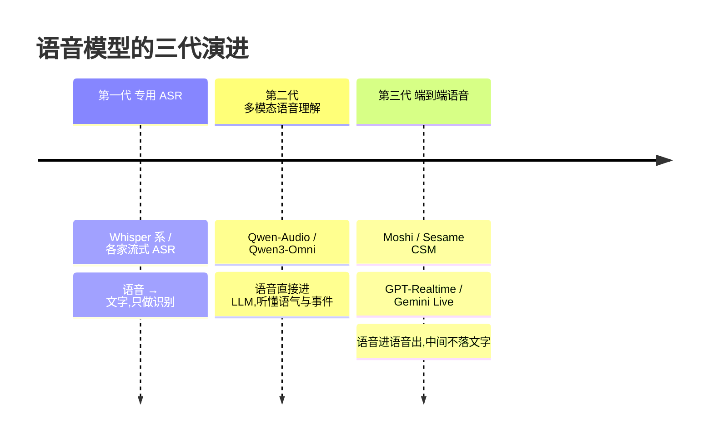
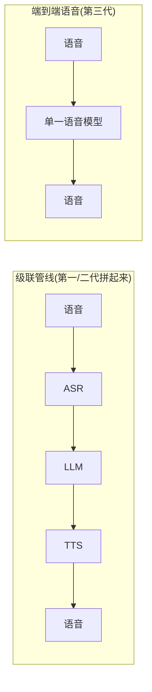

两年前你做语音功能,绕不开 Whisper。把音频丢进去,拿一段文字出来,干净利落。

今天你再去看,会发现一个有点反常识的事实:在不少新产品里,**那一段文字根本不存在了**。语音进去,语音出来,中间没有任何一步是"文本"。Whisper 这种纯 ASR 模型,正在从"语音 AI 的地基"退化成"一个还在用、但不再激动人心的工具"。

这不是 ASR 变差了——它一直在变好。是语音模型这条线,这一两年走完了一次三级跳。我想把这三级讲清楚:每一步解决了什么、赔进去了什么,以及 2026 年的此刻,你手里的场景到底该站在哪一级。

## 三级跳:一张时间线

这三代不是互相取代的关系——更像三层楼,新楼盖起来了,旧楼还有人住,而且住得挺好。下面一层一层说。

## 第一代:专用 ASR,把语音"压扁"成文字

ASR 模型只干一件事:把声波转成最可能的那串字。Whisper large-v3 仍然是这条线上的标杆,多语言、抗噪、开源、便宜,2026 年依然是无数转写流水线的默认选项。

它解决的问题很实在:语音是连续的、模拟的、信息量巨大的信号,文字是离散的、规整的、好处理的符号。ASR 在两者之间架了一座桥。有了这座桥,语音才第一次能接进所有为文字设计的系统——搜索、数据库、传统 NLP、LLM。

代价也恰恰在这座桥上。**ASR 是一次有损压缩**,而且丢掉的东西,常常正是你最想要的。

同一句"你这是什么意思",可以是真诚发问,可以是压着火,可以是开玩笑。转成文字之后,这九个字一模一样,语气全没了。一段录音里有人在笑、有人在哭、背景有玻璃碎掉的声音——ASR 给你的还是那行字,这些"非文字信息"在转写的瞬间被抹平。

对"我要把会议录音变成文字稿"这种任务,这种丢失无所谓,甚至是好事。但对"我要做一个能察言观色的语音助手",这就是地基上的裂缝:你的下游模型再聪明,也只能在 ASR 留下的那点信息里打转。

## 第二代:多模态语音理解,让 LLM 自己去听

第二代的想法很直接——既然转文字会丢信息,那就别转了,**让语音直接进 LLM**。

阿里的 Qwen-Audio 是这条路上的代表,到 Qwen3-Omni 已经做成了一个统一的多模态模型:文本、图像、音频、视频一起进,音频部分支持几十种语言的语音理解,单条最长能处理 40 分钟的录音。今年 3 月发的 Qwen3.5-Omni 把语音识别的语言数推到了上百种。它们在几十个音频基准上拿了开源 SOTA,有些项目上压过了闭源的 Gemini 和 GPT-4o 系列。

关键不在跑分,在**模型"听到"的东西变多了**。你可以直接问它:"这段录音里说话的人情绪怎么样?""背景里那个声音是什么?""这两个人谁更着急?"——这些问题,纯 ASR 永远答不了,因为答案在它转写时丢掉的那一层里。语音不再被压扁成文字,而是作为一种"模态"被模型整体地理解。

这一代解决的是**理解的深度**。代价是两条:

一是**贵且重**。一个 Omni 模型比一个专用 ASR 大得多,推理成本、显存占用都不在一个量级。你要的只是把客服录音转成文字做质检,上一个 Omni 模型就是高射炮打蚊子。

二是**它还是"听-想"模型,不是"说"模型**。Qwen3-Omni 这类有 Talker 模块能合成语音,但整体设计重心是"理解"。真正把"说"也做到极致、做到能跟人自然对话的,是第三代。

## 第三代:端到端语音,中间那行字彻底消失

第三代最激进:语音进,语音出,**中间一个文字都不落**。

为什么要这么激进?因为级联管线有两个治不好的病。

一是**延迟**。语音转文字、文字进 LLM、文字再转语音,三段串起来,每一段都有自己的首包延迟,加上轮次判定,用户说完到 AI 出声常常要 500ms 往上。Kyutai 的 Moshi 主打全双工对话,理论延迟做到 160ms、实测约 200ms——已经摸到人类对话轮次间隔(中位数约 200ms)的水平。这是级联架构怎么调都很难够到的。

二还是那个**信息丢失**问题,而且这次是双向的。级联管线里,你的语气在 ASR 那步丢一次,AI 想表达的语气又得靠 TTS 那步硬"演"出来。端到端模型把这两步合一了,语气、韵律、节奏、什么时候停顿、要不要轻笑一声——这些东西在模型内部是连续表示,不经过文字这个瓶颈。Sesame 的 CSM 主打的就是这种"对话级"的自然度。

到 2026 年中,这一代已经分成两个明显的阵营:

| | 开源/可自托管阵营 | 闭源 API 阵营 |
|---|---|---|
| 代表 | Moshi、Sesame CSM、Hertz-dev | OpenAI GPT-Realtime-2、Google Gemini 3.1 Flash Live |
| 强项 | 延迟极低、可私有部署、可控 | 推理强、语言覆盖广、开箱即用 |
| 短板 | 推理深度弱、需要自己运维 GPU | 黑盒、不能换 LLM、按量付费贵 |
| 适合 | 陪伴、互动、对延迟和数据敏感的产品 | 要复杂多步推理、agentic 的语音应用 |

OpenAI 5 月发的 GPT-Realtime-2 把 GPT-5 级的推理塞进了实时语音对话,128k 上下文,还能调推理强度;Google 3 月的 Gemini 3.1 Flash Live 是纯 audio-to-audio,支持 90 多种语言,简单问题的响应速度更快。两家是目前生产环境里最主流的两个闭源选项。

但端到端不是免费的午餐,它赔进去的东西很具体:

- **难调试、难审计**。中间没有文字,出了问题你没有那行可以打断点、可以给合规看的文本。客服、金融这类场景,"这通电话 AI 到底说了什么"必须留痕,纯端到端反而是负担。
- **不能换脑子**。级联管线里 LLM 是可插拔的,你想换更强的、更便宜的、自己微调的,随时换。GPT-Realtime、Gemini Live、Moshi 都用自带的推理内核,绑死了,你没得选。
- **业务逻辑没地方插**。语音直接到语音,中间那行文字本来是你塞 RAG 检索结果、塞函数调用、塞业务规则的地方。它没了,这些就得用别的机制绕。

所以一个容易被忽视的事实:即便 Sesame CSM 的合成首包能做到 150ms,那也只是"合成"这一步。真接进产品,你还是得在前面加 ASR 或语音理解、加你自己的检索和业务逻辑——算下来总延迟未必比一条调好的级联管线低多少。**端到端解决的是架构的优雅和上限,不是按个开关就提速。**

## 2026 年,你的场景该站第几代

把上面三代收一收,我给一个明确的、带取舍的判断,不和稀泥:

**只要把语音变成文字——还是第一代,而且别犹豫。** 会议纪要、字幕、录音转写、关键词检索,这些任务的本质就是"我要那行字"。Whisper large-v3 这类专用 ASR 又快又便宜又好部署,上 Omni 或端到端纯属浪费钱。这一代不会消失,它只是退回到了它本该待的位置:一个成熟、无聊、好用的工具。

**要"听懂"而不只是"听见"——上第二代。** 你要分析情绪、识别声音事件、理解一段音频里到底发生了什么,Qwen3-Omni 这类多模态语音理解模型是对的选择。它贵,但你买的是 ASR 给不了的那层信息。典型场景:智能质检、音视频内容理解、需要"察言观色"的分析类应用。

**要和人实时对话——第三代,但分两种情况站队。**

- 陪伴、互动、教育、Web 端的语音玩法,延迟和自然度是命门,数据还可能敏感——Moshi、Sesame CSM 这类开源端到端值得自己跑起来。
- 语音应用要做复杂的多步推理、要调一堆工具、要 agentic 的能力——GPT-Realtime-2、Gemini Live 这类闭源 API 更现实,你买的是它背后那个强推理内核。
- 而强管控、强合规的电话客服,我的判断仍然没变:**老老实实用级联管线**。可控、可审计、LLM 可替换,这些在合规场景里比那两百毫秒值钱得多。

最后说句容易被宣传带偏的话:**新一代出来,不等于旧一代该被扔掉。** 这一两年真正发生的,不是"端到端取代了 ASR",而是语音模型从"只会一件事"长成了"一个谱系"——专用 ASR 在一头,端到端语音在另一头,中间是多模态理解。会选型,比追新更重要。先想清楚你的场景到底要什么:是要那行字,要那层情绪,还是要那两百毫秒。想清楚了,该站第几代,自己就有答案了。
