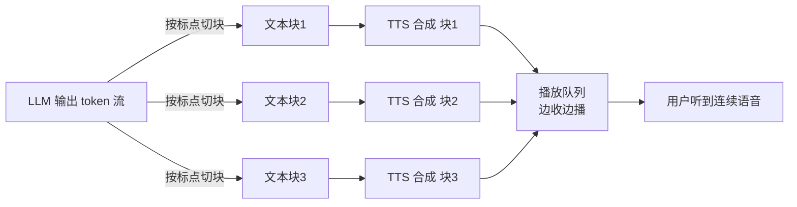

合成一句 12 个字的话,模型跑完要 1.2 秒。但如果做对了,用户感受到的延迟是 150ms。

这不是魔法,是流式 TTS 的基本盘。差别在于:你是等整句音频生成完再播,还是第一个音频块一出来就往用户耳朵里塞。前者用户等 1.2 秒,后者等 150ms——同一个模型,同样的算力,体验差一个数量级。

我在《[实时语音对话的延迟预算](../voice-latency-budget/)》里把整条语音 Agent 链路拆过一遍,TTS 那一段只给了一句话:"要流式,首包出来就播。"这篇把那一句话展开,只讲 TTS。

## 为什么是"首包",不是"整句"

先说清楚一个被混淆得很厉害的指标。

很多 TTS 厂商的官网首页挂着"实时率 0.3"或者"合成速度比真人快 3 倍"——这说的是**整句合成耗时**:一句 5 秒的话,1.5 秒合成完。这个数字对离线场景(把一本书转成有声书)有意义,对实时对话**几乎没意义**。

实时对话里真正决定体验的是 **TTFA(time-to-first-audio,首包音频延迟)**:从你把文字喂给 TTS,到第一段能播放的音频抵达用户、开始出声,中间隔了多久。

道理和流式 LLM 一样。LLM 看的是首 token 延迟(TTFT),不是整段生成完的时间;TTS 看的是首包,不是整句。因为一旦第一个音节开始播,后面的音频是边合成边播的——只要合成速度比播放速度快(实时率小于 1),用户就永远听不到"卡壳"。整句要 1.5 秒还是 3 秒,用户根本感知不到,他在听前半句的时候,后半句已经悄悄合成好排在缓冲区里了。

所以这篇标题里的"150ms",指的是 TTFA。这是 2026 年一个**够格但不极致**的数字:对话不会让人觉得"AI 在想",但还没到 Cartesia Sonic-3 那种 40ms 模型延迟的极限。

有个数字陷阱要先点破。厂商宣传的"75ms"或"100ms"通常是**纯模型推理时间**——在一块独占 GPU 上,喂一段短文本,模型吐出第一块音频要多久。它不含网络往返、不含 API 网关排队、不含音频编码、不含你播放器的缓冲。一个 benchmark 跑 100ms 的模型,部署在共享云上、赶上流量高峰,端到端能轻松飙到 800ms。所以看 TTFA 数字,永远要问一句:这是模型延迟,还是用户真实感知到出声的延迟?这篇说的 150ms,是后者。

## 首包延迟花在哪

把 TTFA 拆开,大致是这么几块:

| 环节 | 它在做什么 | 典型耗时 |
|---|---|---|
| 网络上行 + 排队 | 文字请求到达 TTS 服务、进队列 | 20–80 ms |
| 模型 prefill | 处理输入文本、首块音频前的计算 | 40–120 ms |
| 首块音频生成 | 吐出第一个音频 chunk | 30–90 ms |
| 音频编码 | PCM / Opus / MP3 封装 | 5–30 ms |
| 网络下行 | 首块音频回到客户端 | 20–80 ms |
| 播放器缓冲 | 凑够最小缓冲再起播 | 50–200 ms |
| **合计(可感知 TTFA)** | | **约 150–500 ms** |

看这张表,有两件事值得拎出来说。

第一,**播放器缓冲常常是最肥的一块,也最容易被忽略**。工程师盯着模型延迟抠了半天,把模型从 120ms 压到 80ms,结果播放器为了抗抖动设了 200ms 缓冲——白忙活。这块后面单独讲。

第二,**网络往返是固定成本,且省不掉,只能靠部署位置压**。一次上下行加起来 40–160ms,如果你的 TTS 服务在弗吉尼亚,用户在上海,光物理距离就吃掉 200ms 以上。这部分不优化,模型再快也是纸面数字。

## 怎么把它压下去

按收益从大到小排,六个手段。

### 1. 流式合成:这是地基,不是优化项

如果你的 TTS 是"等整句文本到齐 → 整段合成 → 整段返回",那前面所有讨论都不成立。流式 TTS 的协议(通常是 WebSocket)允许**文字一边到一边合成**:LLM 还在生成后半句,前半句的音频已经在合成了。

2026 年主流的实时 TTS 都走这条路。ElevenLabs Flash 官方标的端到端 135ms TTFB;Cartesia Sonic-3 靠 SSM(状态空间模型)架构做到 40ms 首包、90ms 模型延迟;Deepgram 的 Voice Agent TTS 标 sub-200ms。这些数字的前提全是流式——没有流式,谈不上首包。

### 2. 按句/标点分块,而不是按字数

LLM 吐出来的是 token 流,你不能每来一个 token 就喂给 TTS——那样韵律会碎成渣。你需要在中间攒一个**最小可合成单元**再发。

分块策略大致三种:

- **固定字符数**(比如 150–300 字符):延迟可预测,但会从句子中间切开,韵律遭殃。
- **句子/标点边界**:在句号、问号、逗号处切。韵律自然,但延迟不固定——遇上一个长句,首块迟迟攒不齐。
- **动态自适应**:首块用最激进的策略(凑够一个短语就发),后续块按标点切。

我的建议很明确:**首块和后续块用不同策略**。首块只追求"快"——攒到第一个逗号、或者凑够一个能独立成韵的短语(7–10 个字)就立刻发出去,让用户尽快听到声。从第二块开始切回句子边界,保住整体韵律。用户对首块的韵律宽容度其实很高,他在乎的是"AI 开口了没";但要是整段都按短语切,听感就会一顿一顿的。

### 3. 模型预热:别让第一个用户当小白鼠

冷启动是隐形杀手。一个刚拉起的 TTS 实例,第一次请求往往要额外几百毫秒——CUDA context 初始化、模型权重换入显存、KV cache 分配。

解法是**预热**:实例就绪后、接真实流量前,先用一段哑文本跑几次完整合成,把所有 lazy 初始化的路径走通。配合发布策略——新实例预热完成才进负载均衡的轮转。否则每次扩容、每次滚动发布,都会有一批倒霉用户撞上冷启动的尾巴。

### 4. 合成与播放重叠

这是流式 TTS 的核心收益,也是最容易在实现上漏掉的地方。原则一句话:**链路上任何一环都不能"攒齐再传"**。

块 1 在播的时候,块 2 在合成,块 3 的文本还在 LLM 里生成。三件事并行。只要合成速度跟得上播放速度,用户听到的就是一条不断的声音。一旦某一环改成"等齐",感知延迟立刻塌回真实延迟。

### 5. 就近部署

网络往返省不掉,但能缩短。把 TTS 推理节点放在离用户近的区域,40–160ms 的往返能压到几十毫秒。对全球业务,这意味着多区域部署 + 按用户地理位置路由。这条不涉及任何模型技巧,纯靠基建,但收益实打实。

### 6. 选对音频格式

回传格式直接影响首包能多快"可播"。这里有个反直觉的点:很多 TTS 流式返回的**头几个字节根本不是音频**,而是容器元数据——WAV 头、Ogg 识别页、MP3 的 ID3 标签。播放器要等这些 + 第一个真实音频帧才能起播。

实时场景优先用**裸 PCM**(比如 pcm_22050):没有容器头,第一个字节就是可播音频,省掉解析开销。代价是带宽——PCM 不压缩,流量大。带宽敏感就退一步用 Opus,它的帧结构对低延迟友好,别用 MP3。

## 首包延迟、音质、成本:三角取舍

没有免费的午餐。把首包压到极限,一定在别处付了代价。

| 你想要 | 代价 |
|---|---|
| 首块切得极碎(快) | 韵律断裂,听感一顿一顿 |
| 顶级音质模型 | 推理慢,首包难压 |
| 独占 GPU、低 P99 | 成本高,利用率低 |
| 多区域就近部署 | 运维复杂、机器成本翻倍 |
| 裸 PCM 低延迟 | 带宽成本上升 |

我的取舍偏好,按场景分:

**实时对话(客服、语音助手)**:首包延迟优先,音质够用就行。用户在打电话,他不会拿着话筒细品音色,他要的是不卡、不等。这种场景我会接受首块韵律略糙,换 150ms 的 TTFA。

**有声内容(播客、有声书、视频配音)**:音质优先,首包延迟根本不是问题——这是离线批处理,慢就慢。该上最好的模型、最细的韵律控制。

**成本敏感的规模化场景**:别盲目追 P50。真正影响体验的是 **P99**——你不能让 1% 的用户等 2 秒。Cartesia 用 SSM 架构主打的卖点就是 P99 比 transformer 稳,因为 SSM 是线性扩展、不像 transformer 那样随序列长度二次膨胀。规模一大,P99 的稳定性比 P50 的漂亮数字值钱得多。

一句话:**先明确你在哪个场景,再谈压到多少毫秒**。脱离场景比拼 TTFA 数字,是营销,不是工程。

## 实践中真正会咬人的坑

前面讲的是怎么做对。这一节讲怎么做错——这些坑我和身边的人基本都踩过。

**坑一:分块切太碎,韵律断裂。** 为了压首包,有人把分块阈值设得很激进,每凑 3–5 个字就发一块。结果 TTS 拿到的全是没头没尾的碎片,它无法预测句子级的语调走向——该升调的地方平了,该停顿的地方连上了,整句听起来像机器人念词卡。根因是流式 TTS 在**局部上下文**下做韵律预测,缺了句子的全局结构。务实的做法:首块可以碎(用户宽容),但从第二块起一定切回标点/句子边界,把韵律的锅甩给完整的句子。

**坑二:首块太短,反而更慢。** 听起来矛盾——首块越短不是越快发出去吗?但太短的首块(比如 2 个字)会触发两个问题:一是 TTS 对超短文本的相对开销更高(prefill 的固定成本摊不开);二是它播完只要零点几秒,而第二块还没合成好,中间出现**空隙**,用户听到"你好……(停顿)……我是客服"。首块不是越短越好,要够短到快、又够长到能撑住后续块的合成时间。经验值是凑够一个完整短语,7–10 个字。

**坑三:缓冲欠载(buffer underrun)导致卡顿。** 播放器从网络收音频块,凑够一点就开播。如果某一块因为网络抖动或合成慢迟到了,播放队列被掏空——这就是缓冲欠载,用户听到爆音或者卡顿。

缓冲设置是个跷跷板:缓冲小,起播快(TTFA 低),但抗抖动差;缓冲大,起播慢,但播得稳。没有放之四海的数值。数据中心内部、网络稳定,50–100ms 缓冲够了;移动端、网络飘忽,得放到 150–250ms 来吸收抖动。

更关键的是**把欠载率当独立指标监控**,别只看 TTFA。一个务实的阈值:如果缓冲欠载超过请求总数的 2%,就该调大缓冲——哪怕这意味着 TTFA 涨几十毫秒。卡顿对体验的伤害,远大于首包慢那一点点。慢半拍用户能忍,中间卡一下用户立刻出戏。

**坑四:只测了模型,没测端到端。** 回到开头那个数字陷阱。你在本地用独占 GPU 测出 80ms 首包,上线后用户反馈"AI 反应慢"。因为真实链路上还叠着网络、网关排队、编码、播放器缓冲。**测 TTFA 一定要从用户视角测**——从发出请求到扬声器真正出声,端到端打点,而且要测 P99,不是 P50。

## 落地优先级

如果你正在做 TTS 这一段,顺序是这样:

1. **先确认是流式的**,而且整条链路没有任何一环"攒齐再传"。这步收益最大、几乎不花钱。
2. **调分块策略**——首块激进、后续块按标点。这步直接决定 TTFA 和韵律的平衡。
3. **加预热**,别让扩容和发布把冷启动甩给用户。
4. **测端到端 P99**,把播放器缓冲和欠载率纳入监控。
5. **最后才谈就近部署、换更快的模型**——这些是基建和钱的问题,放在管道理顺之后。

很多团队一上来就到处比价"哪家 TTS 首包最低"。但如果你的播放器缓冲设了 250ms、链路里还藏着一个"攒齐再传"的环节,换哪家模型都救不回那种慢半拍。先把自己这边的链路理顺,再去谈毫秒。

---

参考来源:[ElevenLabs Latency 文档](https://elevenlabs.io/docs/eleven-api/concepts/latency) · [Cartesia Sonic-3](https://cartesia.ai/sonic) · [Gradium: Best Low-Latency TTS APIs 2026](https://gradium.ai/content/best-low-latency-tts-apis-2026) · [Deepgram: Streaming TTS Latency Tradeoff](https://deepgram.com/learn/streaming-tts-latency-accuracy-tradeoff-2026) · [Picovoice: TTS Latency](https://picovoice.ai/blog/text-to-speech-latency/)
