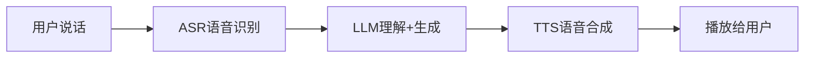
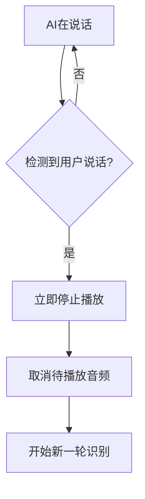

## Voice Agent 是什么

一句话：**能听会说的AI助手**。



看起来简单，但要做好有三个核心挑战：
1. **延迟** - 用户说完到AI回复，要控制在1-2秒内
2. **打断** - 用户随时可以打断AI说话
3. **自然度** - 不能像机器人一样僵硬

---

## 核心架构

### 方案一：串行流水线

```
用户说话 → [等说完] → ASR → LLM → TTS → 播放
```

**优点**：实现简单
**缺点**：延迟高（3-5秒）

**适合**：对延迟不敏感的场景（如语音留言）

### 方案二：流式处理

```
用户说话 → [边说边识别] → [边生成边合成] → [边合成边播放]
```

**优点**：延迟低（1-2秒）
**缺点**：实现复杂，需要处理中间状态

**适合**：实时对话场景

---

## 关键组件

### 1. ASR（语音识别）

| 方案 | 延迟 | 准确率 | 成本 |
|------|------|--------|------|
| Whisper API | 1-2s | 95%+ | 按时长计费 |
| Deepgram | 200ms | 90%+ | 按时长计费 |
| 本地Whisper | 500ms-2s | 95%+ | 需要GPU |

**实时识别关键**：
- 使用流式API，边说边识别
- VAD（语音活动检测）判断用户是否说完

```python
# Deepgram 流式识别示例
from deepgram import Deepgram

dg = Deepgram(api_key)
connection = dg.transcription.live({
    "punctuate": True,
    "interim_results": True  # 获取中间结果
})
```

### 2. LLM（理解+生成）

**流式输出是关键**：

```python
# OpenAI 流式生成
response = openai.chat.completions.create(
    model="gpt-4o",
    messages=[...],
    stream=True  # 流式输出
)

for chunk in response:
    text = chunk.choices[0].delta.content
    # 立即发给TTS，不用等完整回复
    tts_queue.put(text)
```

### 3. TTS（语音合成）

| 方案 | 延迟 | 音质 | 成本 |
|------|------|------|------|
| ElevenLabs | 100ms | 最好 | $5起/月 |
| OpenAI TTS | 200ms | 好 | 按字符计费 |
| Edge TTS | 50ms | 一般 | 免费 |

**流式合成**：
```python
# ElevenLabs 流式合成
audio_stream = elevenlabs.generate(
    text=text,
    voice="Bella",
    stream=True
)

# 边生成边播放
for chunk in audio_stream:
    audio_player.play(chunk)
```

---

## 延迟优化

### 总延迟 = ASR延迟 + LLM延迟 + TTS延迟

| 环节 | 优化前 | 优化后 | 优化方法 |
|------|--------|--------|----------|
| ASR | 2000ms | 200ms | 流式识别 + VAD |
| LLM | 1500ms | 300ms | 流式输出 + 首token优化 |
| TTS | 500ms | 100ms | 流式合成 + 预热 |
| **总计** | **4000ms** | **600ms** | - |

### 关键技术

**1. 句子级流水线**
```
LLM生成第1句 → TTS合成第1句 → 播放第1句
    ↓ 同时进行
LLM生成第2句 → TTS合成第2句 → 等待播放
```

**2. 首字节优化**
- LLM：选择首token延迟低的模型
- TTS：预建立WebSocket连接

**3. 预测性合成**
- 对常见回复（"好的"、"没问题"）预先合成

---

## 打断处理

用户随时可能打断AI说话：



**实现要点**：
1. 持续监听麦克风，即使AI在说话
2. VAD检测到用户开口，立即停止
3. 清空TTS队列，避免残留

```python
def on_user_speech_detected():
    # 立即停止
    audio_player.stop()
    tts_queue.clear()
    # 开始新识别
    start_listening()
```

---

## 推荐技术栈

### 快速原型
```
ASR: Deepgram
LLM: GPT-4o
TTS: ElevenLabs
通信: WebSocket
```

### 生产部署
```
ASR: Whisper (本地) + VAD
LLM: Claude / GPT-4o
TTS: Fish Speech (本地)
通信: WebRTC
```

### 开源方案
- **Pipecat**: 专门的Voice Agent框架
- **LiveKit**: 实时音视频基础设施
- **Vocode**: Voice Agent开发库

---

## 常见坑

### 坑1：回声问题
AI说话时麦克风录到AI的声音 → 无限循环

**解决**：回声消除（AEC），或AI说话时静音麦克风

### 坑2：网络抖动
网络不稳定导致音频断断续续

**解决**：音频缓冲 + 自适应码率

### 坑3：并发处理
用户连续说多句，处理乱序

**解决**：请求排队 + 取消机制

---

## 总结

Voice Agent的核心是**流式处理**：

- 边听边识别
- 边想边说
- 边合成边播放

做好这三点，延迟就能控制在1秒以内。

有问题留言。
